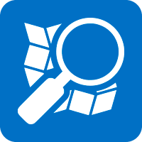
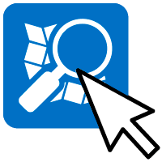
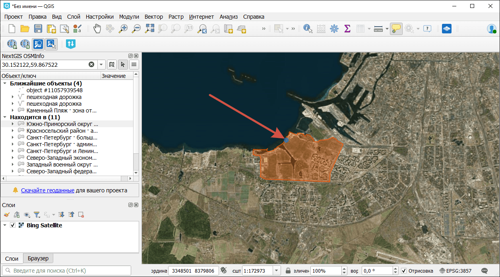
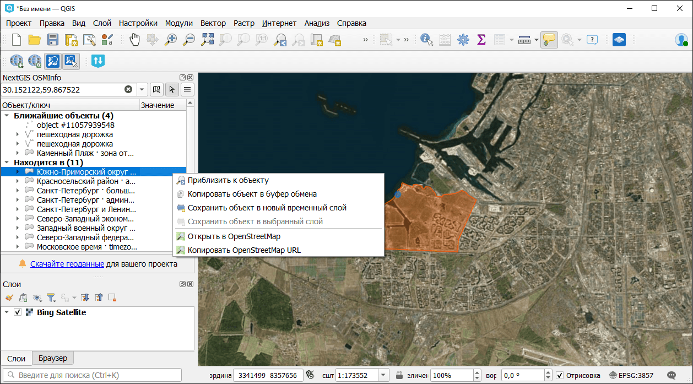
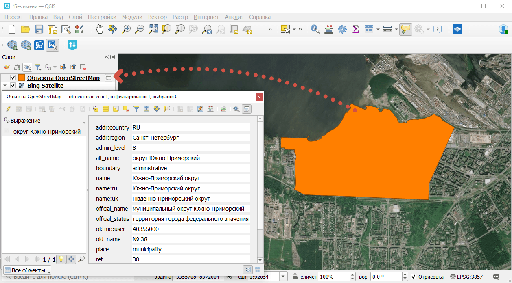
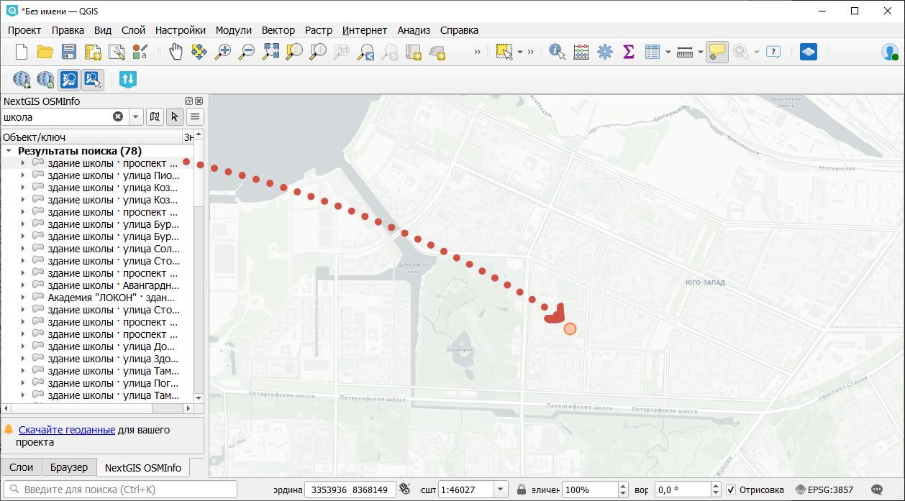
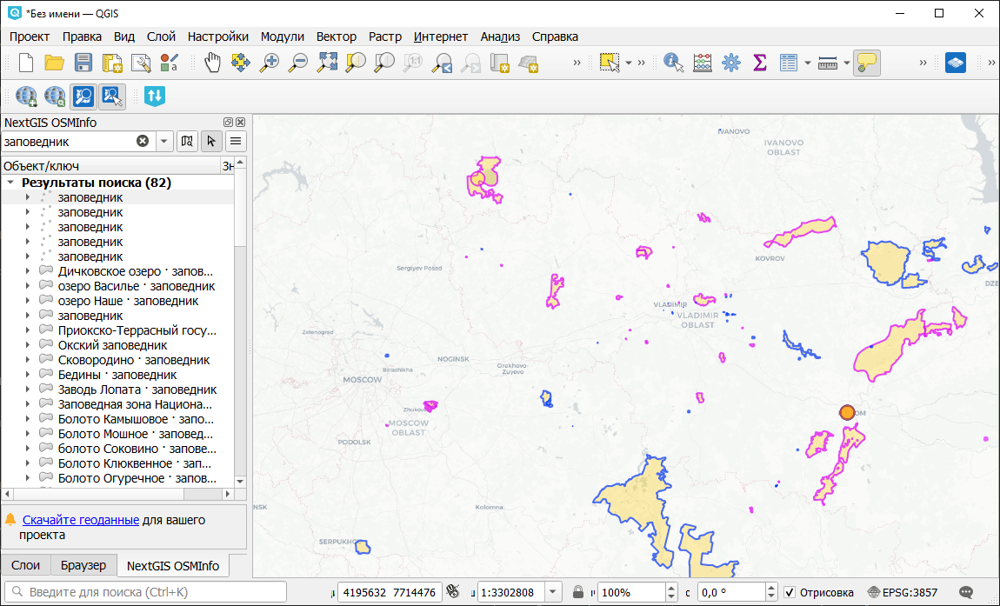
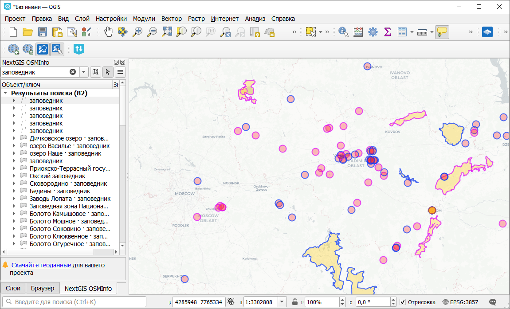
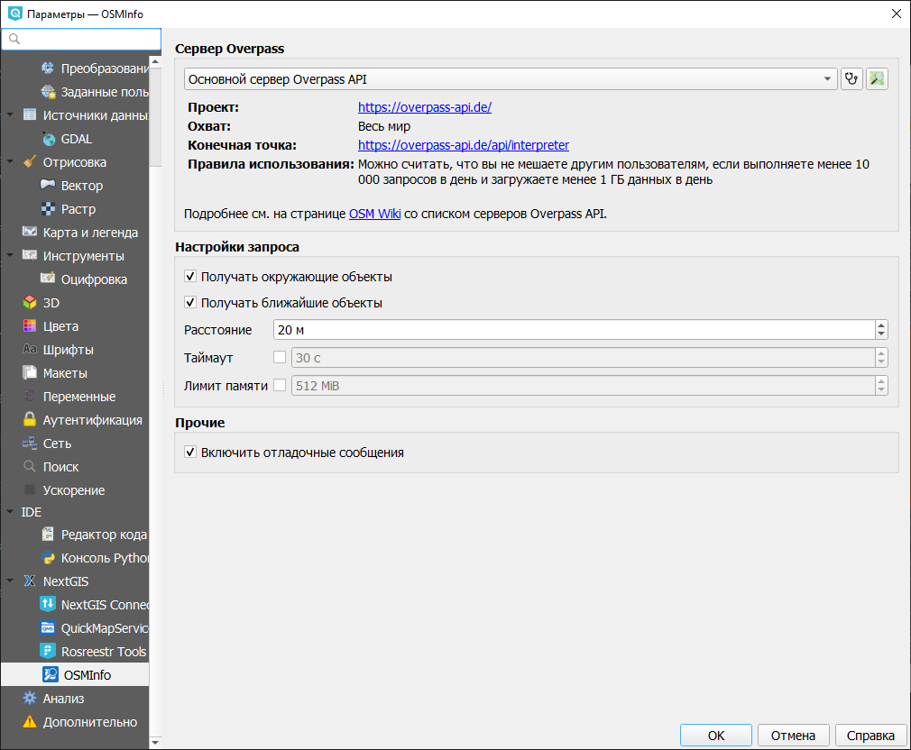

.. _osminfo:

OSMInfo
========

С помощью модуля для QGIS NextGIS OSMInfo у вас есть возможность получить всю информацию по любой точке без подгрузки каких бы то ни было дополнительных слоёв.

Это избавляет от необходимости доставать оригинальные данные, чтобы понять, какой номер у этого дома или как называется озеро на космоснимке.

Доступны все объекты из OSM, в том числе:

* АТД и границы;
* ООПТ и водоёмы;
* вся дорожная инфраструктура;
* здания, городская инфраструктура;
* точки интереса.

После установки модуля На панели инструментов появятся кнопки:

* |button_osminfo_activate| - показать/скрыть панель OSMInfo
* |button_osminfo_ident| - определить объекты OpenStreetMap

Также модуль доступен через меню "Интернет" в верхней панели.

.. _osminfo_identify:

Идентификация объектов
-----------------------

Активируйте инструмент |button_osminfo_ident| и затем кликните на точке карты, по которой хотите получить информацию.

   
   Информация о точке в окне OSMInfo

Результат запроса складывается в две группы: 

* ближайшие объекты;
* объекты, в границы которых попадает ваша точка.

Выбранный в списке объект подсвечивается оранжевым.

.. _osminfo_context:

Контекстное меню объекта
-------------------------

Любой объект можно сохранить локально.

При клике правой кнопкой мыши по объекту из списка появляется контекстное меню, в котором доступны следующие действия:

* Приблизить к объекту - устанавливает охват окна карты по выбранному объекту;
* Копировать в буфер обмена;
* Сохранить объект в новый временный слой;
* Сохранить объект в выбранный слой;
* Открыть в OpenStreetMap;
* Копировать OpenStreetMap URL.

   
   Контекстное меню объекта

При сохранении слоя сохраняется и структура данных.

   
   Значения атрибутов объекта, добавленного в новый временный слой

Процесс добавления объекта из OSM на веб-карту в нашем видео:

.. raw:: html

   <iframe width="560" height="315" src="https://rutube.ru/play/embed/5b0a57611a033d523fdd3887e9cf808b/" frameBorder="0" allow="clipboard-write; autoplay" webkitAllowFullScreen mozallowfullscreen allowFullScreen></iframe>

Посмотреть видео на `youtube <https://youtu.be/TOXhKjWKs-o>`_, `rutube <https://rutube.ru/video/5b0a57611a033d523fdd3887e9cf808b/>`_.

.. _search:

Поиск объектов OpenStreetMap
-----------------------------

Модуль позволяет не только идентифицировать, но и искать объекты в базе OpenStreetMap. Для этого в панели модуля активируйте |button_osminfo_search| режим поиска.

Введите в поле ID объекта, название или другой запрос, затем выберите из списка нужный объект.

   Результат поиска по запросу "школа"

Строка поиска принимает 3 формата:

- координаты
- запрос в свободной форме (как в Wizard, дополнительно включая тип type:closed_way)
- запрос overpassql

Типы объектов можно вводить на английском или на языке интерфейса модуля, например, русском.

Примеры запросов::

   питьевая вода
   amenity=drinking_water and type:node
   "Drinking Water" in London
   (highway=primary or highway=secondary) and type:way
   tourism=hotel
   tourism=museum in Торжок
   музей in Суздаль

Подробнее о синтаксисе запросов можно почитать `на сайте OpenStreetMap <https://wiki.openstreetmap.org/wiki/Overpass_turbo/Wizard>`_.

Чтобы вернуться в режим идентификации, нажмите на кнопку с курсором на панели модуля или в панели инструментов.

.. _osminfo_settings:

Настройки модуля
-----------------

В панели модуля нажмите |button_osminfo_menu|, чтобы вызвать меню модуля.

Здесь можно:

* Включить или выключить одновременное отображение всех найденных объектов. По умолчанию отображается только первый объект в списке, чтобы не загружать сразу все геометрии вплоть до страны.
* Включить или выключить показ маленьких объектов как точек.
* Открыть диалог настроек.

   Все объекты отображаются как полигоны, на текущем масштабе некоторые из них очень мелкие

   Объекты, слишком мелкие для текущего масштаба, отображаются точками

Настройки модуля можно открыть через меню модуля или через главное меню Настройки ‣ Параметры ‣ NextGIS ‣ OSMInfo.

   Настройки модуля

Здесь в разделе "Настройки запроса" можно настроить поведение модуля при клике по карте:

* Отключить ближайшие или охватывающие объекты из результатов поиска.
* Настроить радиус, в рамках которого осуществляется поиск ближайших объектов.
* Настроить таймаут для запросов.
* Указать лимит памяти, доступный для обработки запросов, чтобы избежать чрезмерной нагрузки на оперативную память.

Также в настройках можно выбрать нужный сервер Overpass, проверить его доступность и включить отладочные сообщения.

.. note:: Модуль совместим с QGIS 4