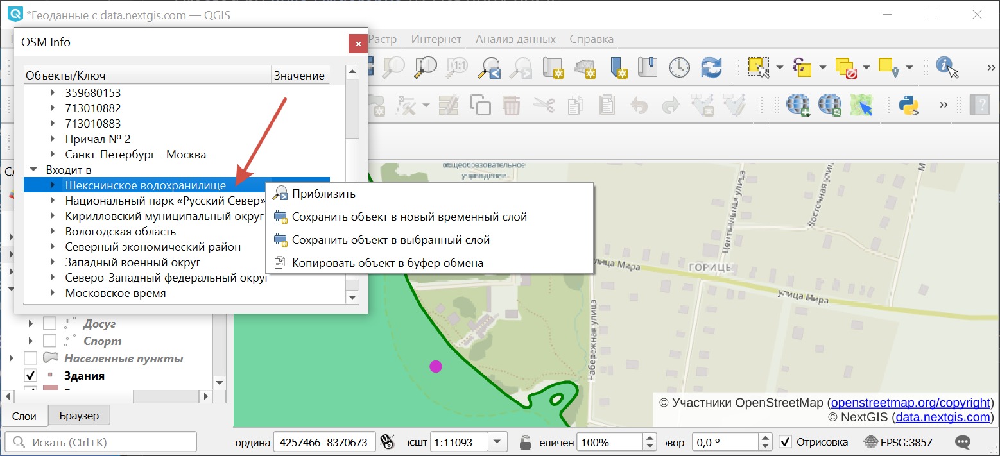

.. sectionauthor:: Юлия Григоренко <grigorenko.j@gmail.com>

.. _osminfo:

OSMInfo
=========================

С помощью модуля для QGIS OSMInfo у вас есть возможность получить всю информацию по любой точке без подгрузки каких бы то ни было дополнительных слоёв.

Это избавляет от необходимости доставать оригинальные данные, чтобы понять, какой номер у этого дома или как называется озеро на космоснимке.

.. _osminfo_install:

Установка
----------

.. figure:: _static/osminfo_plugin_install_ru.png
   :name: osminfo_plugin_install_pic
   :align: center
   :width: 18cm
   
   Установка модуля OSMInfo

На панели инструментов появится кнопка |button_osminfo|.

.. _osminfo_identify:

Идентификация объектов
-----------------------

Активируйте инструмент |button_osminfo| и затем кликните на точке карты, по которой хотите получить информацию.

Результат запроса складывается в две группы: близкие объекты и объекты, охватывающие вашу точку.

.. figure:: _static/osminfo_plugin_result_ru.png
   :name: osminfo_plugin_result_pic
   :align: center
   :width: 22cm
   
   Информация о точке в окне OSMInfo

Выбранный в списке объект подсвечивается зелёным.

Доступны все объекты из OSM, в том числе:

* АТД и границы;
* ООПТ и водоёмы;
* вся дорожная инфраструктура;
* здания, городская инфраструктура;
* точки интереса.

.. _osminfo_context:

Контекстное меню объекта
-------------------------

Любой объект можно сохранить локально.

При клике правой кнопкой мыши по объекту из списка появляется контекстное меню, в котором доступны следующие действия:

* Приблизить - устанавливает охват окна карты по выбранному объекту;
* Сохранить объект в новый временный слой;
* Сохранить объект в выбранный слой;
* Копировать в буфер обмена.

   
   Контекстное меню объекта

При сохранении слоя сохраняется и структура данных.

.. figure:: _static/osminfo_plugin_newlayer_ru.png
   :name: osminfo_plugin_newlayer_pic
   :align: center
   :width: 22cm
   
   Значения атрибутов объекта, добавленного в новый временный слой
