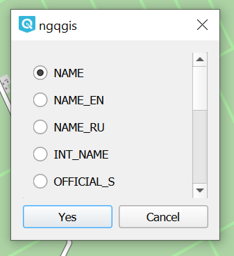

OSMPoly_export
===============

Модуль позволяет экспортировать объекты мультиполигонального слоя или слой целиком в poly-формате.

Такие файлы открываются в редакторе данных OpenStreetMap – JOSM.

После установки модуль появится в панели инструментов работы с векторными данными: |button_osmpoly|.

* Выберите нужный слой в панели слоёв QGIS.

* Выделите объекты, которые хотите сконвертировать. Активируйте модуль.

.. note:: Если не выделить объекты, будут сконвертированы все, о чём появится предупреждающее сообщение.

* Во всплывающем окне модуля выберите текстовое поле, из которого будут взяты названия для poly-файлов.

   Выбор поля названия

* Укажите путь к целевой папке.

Каждый полигон слоя сохранится отдельным poly-файлом.

Посмотрите, как работать с модулем, в нашем видео:

.. raw:: html

   <iframe width="560" height="315" src="https://rutube.ru/play/embed/7de2ef266a2b14441f35cda7642211b9/" frameBorder="0" allow="clipboard-write; autoplay" webkitAllowFullScreen mozallowfullscreen allowFullScreen></iframe>

Посмотреть видео на `youtube <https://youtu.be/q_5I5RZsOi4>`_, `rutube <https://rutube.ru/video/7de2ef266a2b14441f35cda7642211b9/>`_.

