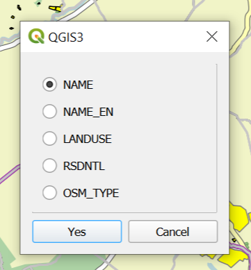

OSMPoly_export
===============

With this plugin you can export the selected features of a multi-polygon layer or the entire layer as poly-file.

This type of file can be opened in the OpenStreetMap editor JOSM.

After installation the plugin will appear in the Vector toolbar: |button_osmpoly|.

* Select the layer in the Layers panel of QGIS.

* Select the features you want to export. Activate the plugin.

.. note:: If no features are selected, the entire layer is exported. You'll get a warning message about it.

* In the pop-up dialog select a string field that contains values to be used as names of poly-files.

   Selecting field for file name

* Enter the path to the target folder.

Every polygon of the layer will be exported as a separate poly-file.

Check out how the plugin works in our video:

.. raw:: html

   <iframe width="560" height="315" src="https://www.youtube.com/embed/gGE7o2_P8gA?si=aFXohwd0e_IU1DxC" title="YouTube video player" frameborder="0" allow="accelerometer; autoplay; clipboard-write; encrypted-media; gyroscope; picture-in-picture; web-share" referrerpolicy="strict-origin-when-cross-origin" allowfullscreen></iframe>

Watch on `youtube <https://youtu.be/gGE7o2_P8gA?si=Y4cHyq34COLtkI08>`_.
