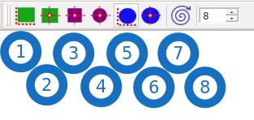

.. sectionauthor:: Артём Светлов <artem.svetlov@nextgis.ru>

.. _rectangles_ovals_digitizing:

Rectangles Ovals Digitizing
==============================

Плагин используется для рисования квадратов, прямоугольников, кругов и эллипсов.

Этот плагин не поддерживается компанией NextGIS, но его можно запускать в программе NextGIS QGIS.

 
После установки расширения появляется панель Rectangles, oval digitizing tools :

   Панель Rectangles, oval digitizing tools.

   1 - Рисование прямоугольника из угла.
   2 - Рисование прямоугольника из центра.
   3 - Рисование квадрата из центра.
   4 - Рисование круга из центра.
   5 - Рисование эллипса из угла.
   6 - Рисование эллипса из центра.
   7 - Поворот выделенной фигуры.
   8 - Количество линий, из которых создаётся круг или эллипс.

.. figure:: _static/modules_rectangles_ovals_digitizing_window.png
   :align: center
   :width: 16cm

   Квадраты и круги, нарисованные в модуле Rectangles Ovals Digitizing.
