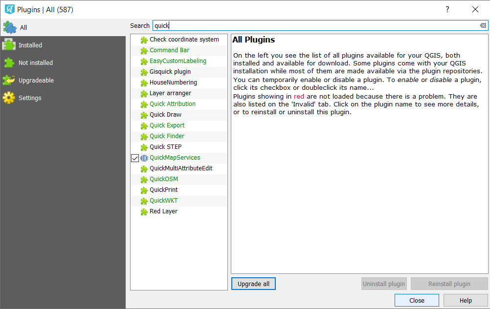

.. sectionauthor:: Екатерина Петруненко <ekaterina.petrunenko@nextgis.ru>

.. _ngqgis_plugins:
    
Plugins
=================

QGIS was developed with capacity to embed various plugins, which allow to add numerous functions into application. QGIS provides libraries available for plugin creation.
The majority of QGIS functions are implemented as basic or external plugins. 
Basic plugins are written in C++ and Python.
All external plugins are written in Python now. They are located in external repositories and supported by their authors. External plugins can be added via Install Plugins option.

Install Plugins
-------------------------

You should be connected to the Internet. 

To install or update plugin select :menuselection:`Plugins --> Manage and Install Plugins`.

If you want to install plugin, start typing its name into Search field. 

Select target plugin from the list and press Install Plugin button. 

Plugins can be installed but not active: if the box next to the plugin from the list is unchecked, this plugin wouldn’t function. To activate plugin you should check the box next to it.

If you typed the plugin’s name correctly, but can’t find it in the list, please, perform following steps:

1. Check the Settings tab: repositories should be marked as green. If the mark is red, it means problems with Internet connection or with server.
3. Try to check the box with Show also experimental plugins.
4. The plugin you are searching for can be located in some special repository, find out about it from the person who recommended that plugin.

Plugins' description
===========================

More about plugins you can find here:

.. toctree::
   :maxdepth: 1

   identifyplus
