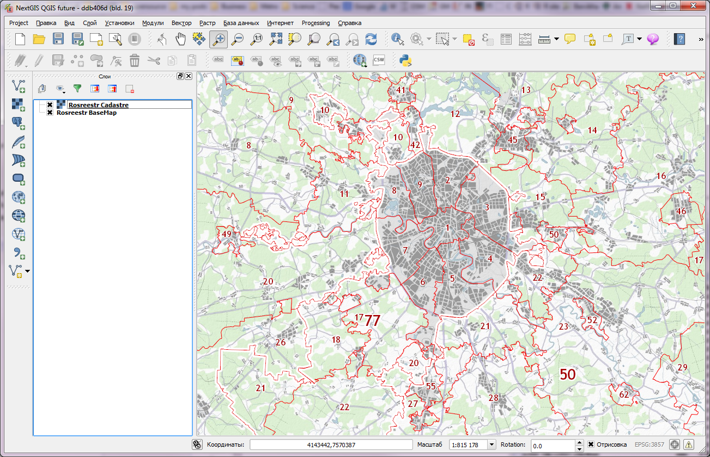

.. sectionauthor:: Дмитрий Барышников <dmitry.baryshnikov@nextgis.ru>

.. _ngqgis_plugins:
    
Модули расширения
=================

QGIS была разработана на архитектуре с поддержкой различных модулей, которые позволяют 
добавлять множество новых возможностей или функций в приложение.
Большинство функций в QGIS реализованы как основные или внешние модули. 
Основные модули написаны на языках программирования C++ и Python.
Все внешние модули в настоящее время написаны на языке Python. Они находятся во внешних
репозиториях и поддерживаются написавшими их авторами. Внешние модули могут быть
добавлены с помощью функции Установка модулей QGIS. 

Установка плагинов
-------------------------

Вам потребуется подключение к сети. 

Для установки и обновления плагинов необходимо нажать :menuselection:`Модули --> Управление модулями`.

Если вам надо установить плагин, введите часть его названия в панель Поиск. 

.. figure:: _static/modules_control.png

Выберите в списке нужный модуль, и нажмите кнопку Установить модуль. 

Модули могут быть установленными, но не включёнными: если в списке у модуля не установлен флажок, то он не будет заргужаться.

Если вы ввели название правильно, а модуля, который нужно поставить не нашли, то выполните следующие операции

* Проверьте, может быть он назван на другом языке.
* Проверьте на вкладке Параметры - у репозиториев должна быть зелёная отметка. Если красная - значит проблемы либо в подключении к интернету, либо с сервером.
* Попробуйте включить галочки Разрешить установку экспериментальных модулей
* Проверьте, вдруг нужный модуль - в каком-то специальном репозитории, спросите у того, кто вам про него сказал. 

.. _`NGW_Connect`:

.. _`QuickMapServices`:

QuickMapServices
-------------------------

Этот инструмент может применяться для быстрого добавления базовой карты (т.н. подложки) в проект QGIS. Растровая картографическая подложка часто выступает в качестве первого слоя, добавляемого для работы в проект. Вы можете подложить слой Openstreetmap, публичной кадастровой карты РФ и многие другие. 

Подложка может быть представлена в виде различных интернет-сервисов: TMS, WMS, WMTS, ESRI ArcGIS Service или просто в виде тайлов XYZ.

После установки расширения в панели инструментов "Интернет" появится кнопка расширения (кнопку можно расположить и на другой, возможно более удобной панели, см. Настройки). Так же появится группа QuickMapServices в одноименном меню.

.. figure:: _static/modules_Qms-button.png

Кнопка является контейнером для базовых карт из различных источников.

.. figure:: _static/modules_Qms-contrib-4.png

При выборе одной из них, карта автоматически подключается в проект в качестве слоя. 

Настройки сервисов хранятся отдельно от самого модуля и при удалении-обновлении модуля они не удаляются.

    Базовая картографическая основа и слой кадастрового деления с Публичной кадастровой карты

Настройки
^^^^^^^^^^^^^^^^^^^^^^^^^^^^^^^^^^^^^^^^^^^^^^^^^^^^^^^^^^^^^^

Общие настройки
:::::::::::::::::::::::::::::::::::::::::::::::::::::::::::::::::

Окно общих настроек можно вызвать из меню расширения. Что можно настроить:

* Показывать управление подложками из панели "Управление слоями" - по умолчанию управление подложками добавляется в панель "Веб" и ее часто «теряют»;
* Включать перепроецирование при добавлении тайлового слоя (если опция включена, то в проекте автоматически включается перепроецирование в систему координат EPSG: 3857 Pseudo Mercator);
* Показывать информацию в панели сообщений (по умолчанию они показываются во всплывающей панели, что не всегда удобно).

.. figure:: _static/modules_Qms-contrib-01.png

    Общие настройки

И параметры загрузки тайлов:

* Максимальное количество соединений для скачивания тайлов;
* Срок хранения кэша тайлов;
* Таймаут загрузки тайлов.

.. figure:: _static/modules_Qms-contrib-02.png

    Настройки получения тайлов

===Настройки подложки===
:::::::::::::::::::::::::::::::::::::::::::::::::::::::::::::::::

Так как подложка добавленная через QuickMapServices является особым видом слоя, её окно настроек отличается от стандартного окна настроек слоя.

Через настройки подложки можно:
* Включить-выключить сглаживание
* Перевести подложку в оттенки серого
* Настроить яркость, контраст, прозрачность
* Включить пока копирайтов

.. figure:: _static/modules_Qms-basemap.png

    Настройки подложки

== Дополнительные сервисы ==
^^^^^^^^^^^^^^^^^^^^^^^^^^^^^^^^^^^^^^^^^^^^^^^^^^^^^^^^^^^^^^

После установки модуля просто зайдите в настройках во вкладку :guilabel:`Дополнительные сервисы` и нажмите :guilabel:`Получить дополнительные источники данных`.

.. figure:: _static/modules_Qms-moreservises-1.png

    Загрузка дополнительных сервисов

Расширенный набор сервисов может выглядеть так:

.. figure:: _static/modules_Qms-moreservises-2.png

    Полный список сервисов

.. note::
    Если вы планируете делать производную работу на основе подложки из интернета - ознакомьтесь с условиями использования данной подложки, что бы не нарушить законы об авторских правах. Если вы используете подложку OSM Mapnik - то достаточно подписать «© Участники OpenStreetMap». Другие подложек и космоснимки могут иметь более строгие ограничения на использование. 
