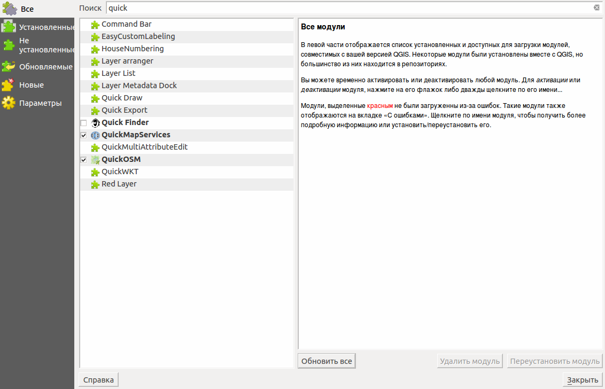

.. sectionauthor:: Дмитрий Барышников <dmitry.baryshnikov@nextgis.ru>

.. _ngqgis_plugins:
    
Модули расширения
=================

QGIS была разработана на архитектуре с поддержкой различных модулей, которые позволяют 
добавлять множество новых возможностей или функций в приложение. QGIS предоставляет 
библиотеки, которые могут использоваться для создания модулей. 
Большинство функций в QGIS реализованы как основные или внешние модули. 
Основные модули написаны на языках программирования C++ и Python.
Все внешние модули в настоящее время написаны на языке Python. Они находятся во 
внешних репозиториях и поддерживаются написавшими их авторами. Внешние модули могут 
быть добавлены с помощью функции Установка модулей QGIS. 

Установка плагинов
-------------------------

Вам потребуется подключение к сети. 

Для установки и обновления плагинов необходимо нажать :menuselection:`Модули --> Управление модулями`.

Если вам надо установить плагин, введите часть его названия в панель Поиск. 

   
   Список установленных и доступных к загрузке модулей.

Выберите в списке нужный модуль и нажмите кнопку Установить модуль. 

Модули могут быть установленными, но не включёнными: если в списке у модуля не установлен 
флажок, то он не будет загружаться. Активируются модули автоматически с помощью 
установки флажка на соответствующем модуле.

Если вы ввели название модуля правильно, а модуля, который нужно установить, не нашли, 
то выполните следующие операции:

1. Проверьте, может быть имя модуля задано на другом языке.
2. Проверьте вкладку Параметры: у репозиториев должна быть зелёная отметка. Если 
   отметка красная, значит проблемы либо в подключении к интернету, либо с сервером.
3. Попробуйте установить флажок для активации пункта Разрешить установку экспериментальных модулей.
4. Проверьте, нужный модуль может находиться в каком-то специальном репозитории, 
   спросите у того, кто вам про него сказал. 

Описание модулей расширения
===========================

Подробнее о модулях расширения можно почитать в следующих разделах:

.. toctree::
   :maxdepth: 1

   ngconnect
   qms
   plugin_rectangles_ovals_digitizing

    
