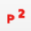

Points2One
==========

Модуль позволяет создавать на основе точечного слоя линии и полигоны и группировать их в соответствии с атрибутами исходного точечного слоя.

После установки модуль появится в панели "Инструменты работы с векторными данными": |button_points2one|.

В диалоговом окне модуля выберите параметры:

* Input layer - точечный слой, на основе которого будут создаваться объекты;
* Create polygons / Create lines - выбирает тип объектов: полигоны или линии;
* Closed - замыкает начало и конец линии;
* Group features by - указывает поле, которое будет использоваться для группировки объектов;
* Sort vertices by - указывает поле, по которому будут отсортированы вершины линий или полигонов;
* Then by - второе поле сортировки;
* Output shapefile - здесь нужно указать путь к сохранению создаваемого слоя в формате ESRI Shapefile;
* Encoding - выбор кодировки;
* Add result to canvas - добавить получившийся слой на карту.

Точки, не разделённые по атрибутам, создают полигон в очерёдности порядковых номеров.

Посмотрите, как работает этот модуль, в видео:

.. raw:: html

   <iframe width="560" height="315" src="https://rutube.ru/play/embed/6b1c71dccad46f21d07fcf2b3a665b54/" frameBorder="0" allow="clipboard-write; autoplay" webkitAllowFullScreen mozallowfullscreen allowFullScreen></iframe>

Смотреть на `youtube <https://youtu.be/AT6wt3dWIKg>`_, `rutube <https://rutube.ru/video/6b1c71dccad46f21d07fcf2b3a665b54/>`_.
