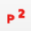

Points2One
==========

This plugin connects points in a layer to form lines and polygons, grouping them by source layer attributes.

After installation the plugin will appear in the Vector toolbar: |button_points2one|.

In the plugin dialog configure the parameters:

* Input layer - layer of points to be used as vertices;
* Create polygons / Create lines - select the type of features you want to create;
* Closed - select to have the line end in the point where it begins;
* Group features by - select the field to be used for grouping;
* Sort vertices by - select a field to be used to sort the vertices of the lines or polygons. This is used when you need to create several features, not one. ID used in the field should be unique;
* Then by - additional field to sort by after the initial one;
* Output shapefile - select folder where the out ESRI Shapefile will be created;
* Encoding - select from a list;
* Add result to canvas.

If the points are not grouped, the vertices are sorted by the point ID.

See the plugin at work in our video:

.. raw:: html

   <iframe width="560" height="315" src="https://www.youtube.com/embed/tzZnHBx3N98?si=0BqksE4_9lEAhFVM" title="YouTube video player" frameborder="0" allow="accelerometer; autoplay; clipboard-write; encrypted-media; gyroscope; picture-in-picture; web-share" referrerpolicy="strict-origin-when-cross-origin" allowfullscreen></iframe>

Watch on `youtube <https://youtu.be/tzZnHBx3N98?si=O3dBTE4d6S_HeWwb>`_.
