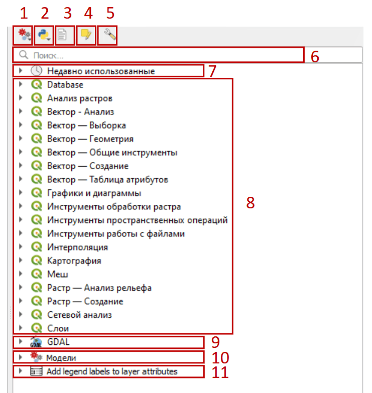
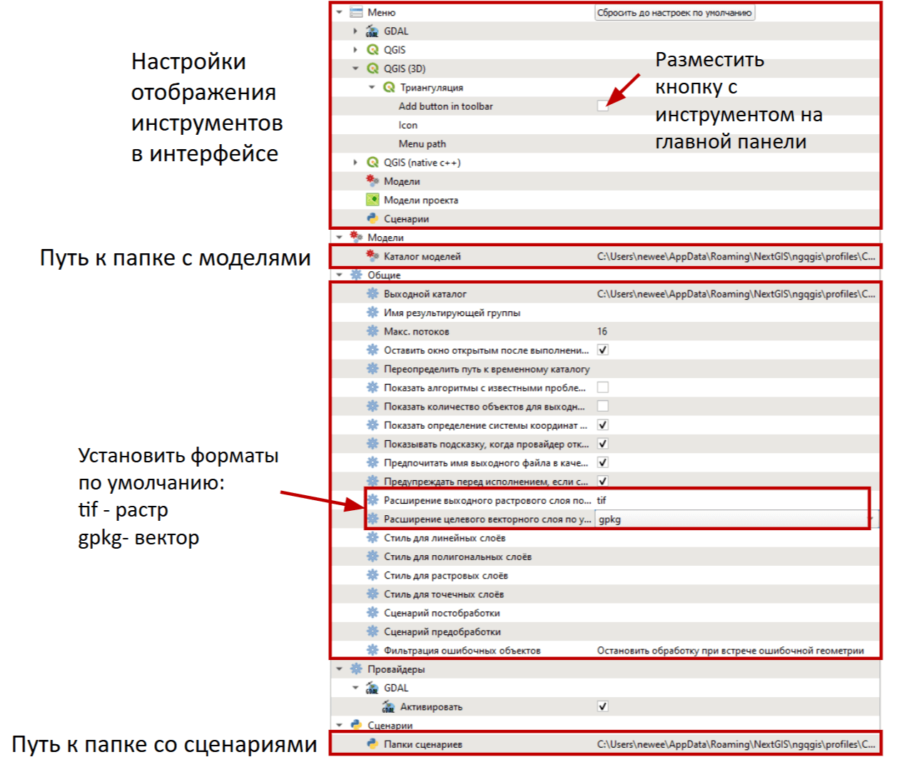
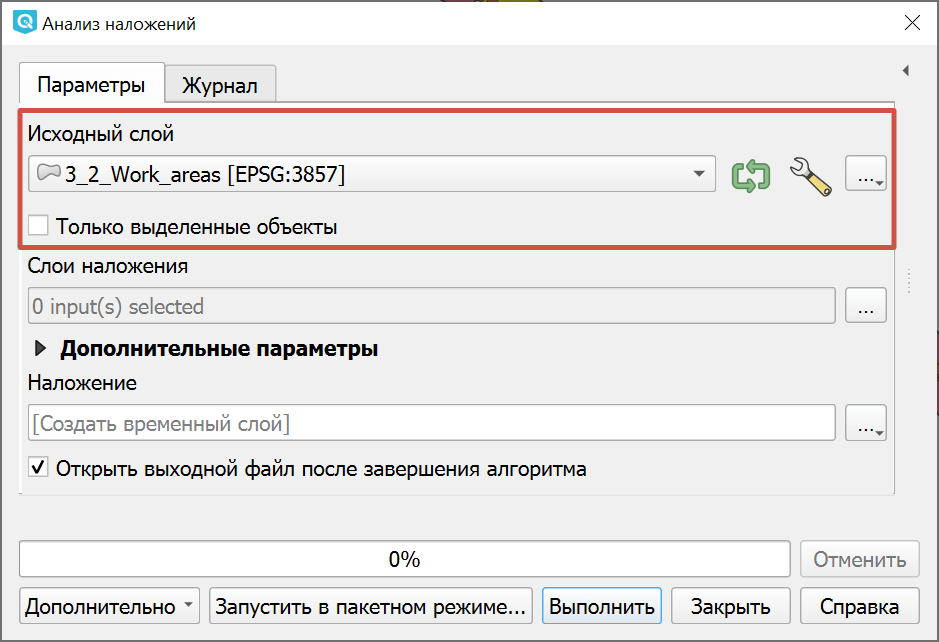
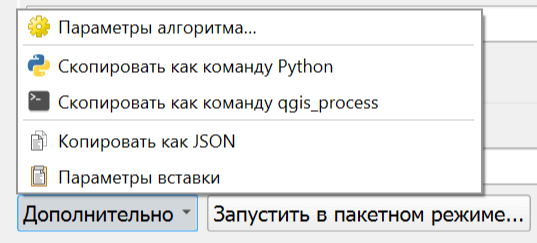
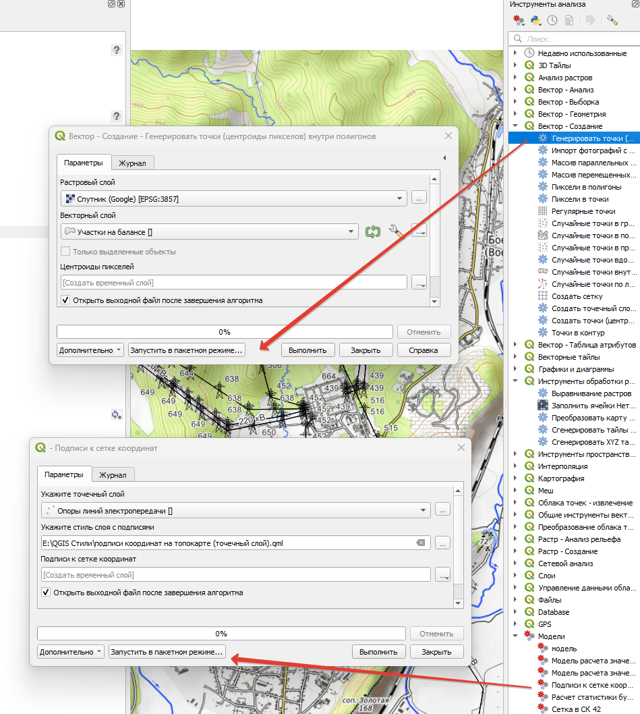
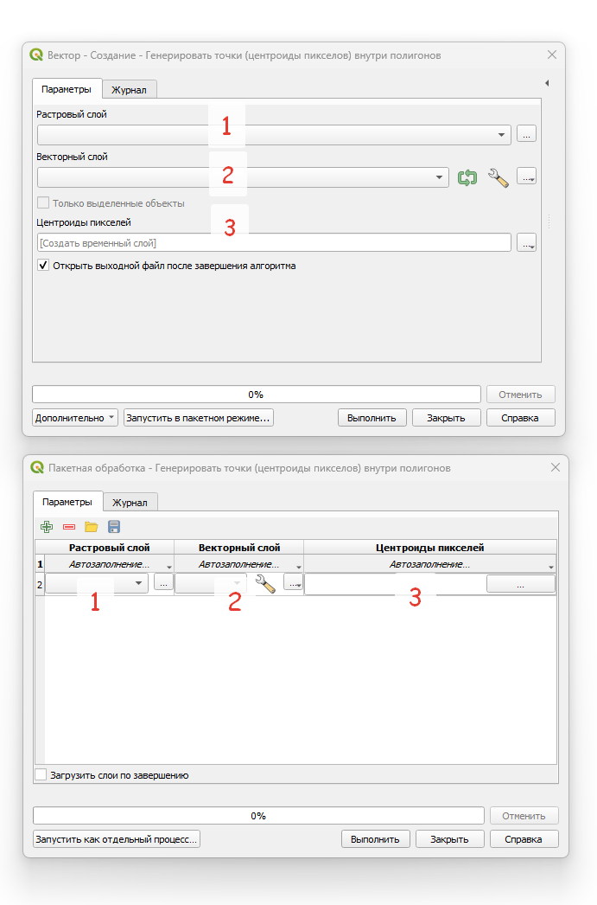
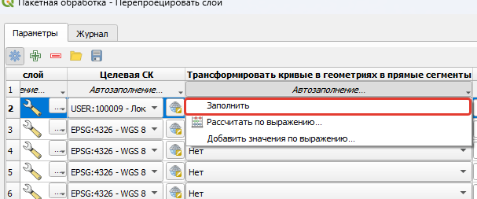
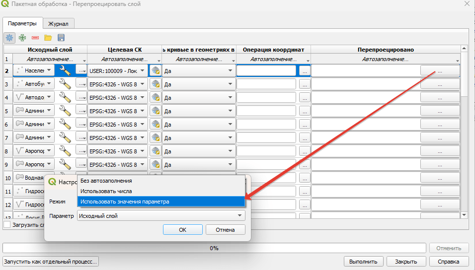
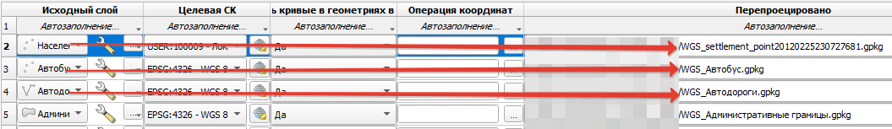

Панель инструментов анализа
===========================

В NextGIS QGIS есть множество инструментов для обработки векторных и растровых данных. Некоторые из них можно вызвать через пункты верхнего меню. Все инструменты собраны в панели, которая вызвается кнопкой |processingAlgorithm| в панели инструментов Панель атрибутов.

.. |processingAlgorithm| image:: _static/processingAlgorithm.png
   :width: 6mm
   :alt: blue gear

.. |wrench| image:: _static/mActionOptions.png
   :width: 6mm
   :alt: wrench

.. |python| image:: _static/mIconPythonFile.png
   :width: 6mm

Кнопки:

1. |gears| Меню моделей - Позволяет создавать или подгружать готовые пользовательские модели на основе цепочки базовых инструментов QGIS или любых других модулей, установленных в текущем профиле QGIS.
2. |python| Меню сценариев (python-скриптов) - Позволяет создавать или подгружать готовые пользовательские сценарии в виде python-скриптов.
3. Окно просмотра результатов - Включает окно просмотра результатов работы тех инструментов, которые не изменяют геометрию или атрибуты объектов (например инструменты статистического анализа данных).
4. Режим редактирования объектов текущего слоя.
5. |wrench| Меню настроек.

под ними:

6. Поиск инструмента/модели/сценария.
7. Список недавно использованных инструментов.
8. Базовые инструменты QGIS.
9. Инструменты GDAL.

Дополнительно можно установить:

10. Список пользовательских моделей.
11. Дополнительные модули.

.. _settings:

Настройки инструментов
----------------------

   Окно настроек

В окне настроек доступно несколько разделов:

* Меню - Настройки отображения инструментов в интерфейсе. Здесь можно добавить кнопку инструмента на главную панель;
* Модели - Здесь можно задать путь к папке с моделями;
* Общие, в частности:

    * Пути к выходному каталогу и к временному каталогу;
    * Оставить окно открытым после выполнения;
    * Установить форматы по умолчанию: tif - растр, gpkg- вектор;
    * Поведение при фильтрации ошибочных объектов.

* Путь к папке cо сценариями.

.. _standard:

Стандартные элементы интерфейса
--------------------------------

В большинстве инструментов присутствуют стандартные элементы:

.. _source:

Исходный слой
~~~~~~~~~~~~~~

   Выбор исходного слоя

* В выпадающем меню можно выбрать один из доступных слоёв текущего проекта.
* С помощью кнопки справа от поля можно выбрать файл или слой в менеджере данных.

Для выбранного слоя можно активировать опцию **только выделенные объекты**, тогда инструмент будет обрабатывать те объекты, которые в настоящий момент выбраны в слое.

|wrench| Дополнительные параметры:

* Фильтрация ошибочных объектов (по умолчанию, не фильтровать, пропускать некорректные, останавливать при ошибке);
* Ограничение обарабатываемых объектов - количество первых объектов, после которых работа инструмента завершается;
* Фильтр объекта по выражению.

.. _output:

Сохранение вывода
~~~~~~~~~~~~~~~~~~

По умолчанию стоит опция **Сохранить во временный файл**. Также можно выбрать **Сохранить в файл** и задать путь и имя файла, или пропустить вывод.

.. _advanced:

Дополнительно
~~~~~~~~~~~~~~

В левом нижнем углу открывается меню с дополнительными опциями:

* Параметры алгоритма;
* Скопировать как команду Python;
* Скопировать как команду qgis_process;
* Копировать как JSON;
* Параметры вставки.

.. _batch:

Запуск в пакетном режиме
-------------------------

Этот режим применяется в том случае, когда необходимо обработать большое количество слоев через один алгоритм или модель. При этом можно задать одинаковые или разные параметры. 

   Запуск в пакетном режиме

Для запуска режима нажмите кнопку **Запустить в пакетном режиме**, после чего интерфейс инструмента/модели переключится в режим пакетной обработки.

В этом режиме все параметры указываются в соответствующих колонках, а слои для обработки - в строках.

   Сравнение двух режимов ввода параметров - обычного и пакетного

Для добавления слоя в обработку нажмите на + в верхнем левом углу и в новой строке укажите нужный слой. 

Если подразумевается, что слои обрабатываются с одинаковыми настройками, то достаточно указать параметры для первого слоя, затем нажать кнопку **Автозаполнение** и во всплывающем окне нажать **Заполнить**.

   Автозаполнение параметров

Важно указать место сохранения и название итоговых слоев, т.к. пакетный режим не может сохранять результаты в виде временных слоёв. Их можно указать индивидуально, или задать определённое правило (например, добавить что-то в конец названия файла).

В последнем случае вам нужно указать адрес сохранения и имя первого файла, после чего QGIS автоматически предложит вариант сохранения - если вы укажете Использовать числа, то все остальные файлы сохранятся с исходным названием и порядковым номером слоя, если укажете Использовать значения параметра, то тогда в названии файла добавится то значение, которое будет стоять в выбранной колонке параметра. 

   Настройки автозаполнения

Например в указанном выше варианте автозаполнения к исходному названию файла “WGS_” добавляется название исходного слоя

   Пример работы автозаполнения

