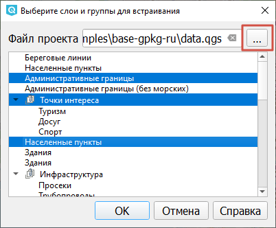
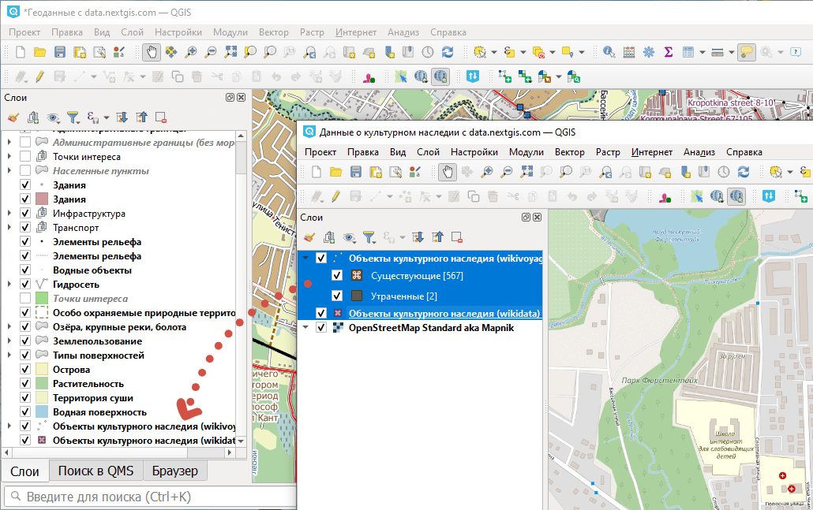

Сохранение проекта с данными
=============================

Проект в QGIS - это файл состояния рабочего окружения, в котором описываются подключенные наборы данных, текущий масштаб и охват карты, и многие другие настройки. В один момент времени в окне программы открыт только один проект.

В проекте сохраняется следующая информация:

* Добавленные слои (пути к файлам, могут быть относительными или абсолютными);
* Свойства слоёв, в том числе символика и стили;
* Виды карты в 2D и 3D;
* Проекция для каждого такого вида;
* Последний охват для каждой карты;
* Макеты для печати и атласы и настройки их элементов;
* Параметры оцифровки;
* Настроенные отношения между слоями
* Макросы проекта;
* Стили по умолчанию для проекта;
* Настройки модулей;
* Запросы, сохраняемые в менеджере баз данных

.. important:: Данные, добавленные в проект, хранятся отдельно. Если вы вносите изменения в данные, недостаточно просто сохранить проект, чтобы они сохранились. Для каждого слоя изменения нужно сохранять отдельно, это делается при каждом выходе из режима редактирования слоя.

Чтобы сохранить проект выберите в главном меню Проект → Сохранить как.

Стандартные форматы, в которых сохраняется проект:

* QGS
* QGZ - сжатая версия проекта, которая включает в себя файл QGS и базу данных SQLite (с расширением .qgd)

Также можно использовать другие форматы, для этого нажмите: Проект → Сохранить в и выберите:

* Шаблоны;
* Oracle;
* GeoPackage;
* PostgreSQL.

В этом случае проект сохранится в том же виде (как XML-текст), но вместо отдельного файла запишется в ячейку базы данных.

.. _open:

Открытие сохранённого проекта
------------------------------

Открыть проект можно несколькими способами:

1. Двойным кликом по файлу QGS/QGZ;
2. В главном меню Проект → Открыть (или Открыть из);
3. Перетащив его в рабочую область из панели Браузер или окна проводника.

.. note:: Обратите внимание, если файл проекта находится внутри ZIP-архива, например, при заказе данных на NextGIS Data, нужно сначала распаковать этот архив, а потом открывать файл проекта. Иначе данные в него не подгрузятся.

.. _combine:

Объединение проектов
---------------------

Если нужно объединить два проекта QGIS, это можно сделать следующим образом:

1. В главном меню выберите Слой → Встроить слои и группы.

2. В появившемся окне выберите файл проекта. 

   Выбор слоёв и групп для добавления в проект. Выбранные отмечены синим

3. В поле ниже появится список слоёв и групп слоёв. Выберите среди них нужные или выделите всё нажатием Ctrl+A. Нажмите **ОК**.

Выбранные слои и группы слоёв будут добавлены в проект.

Другой способ объединить проекты:

1. Откройте два окна QGIS рядом. В одном - один проект, в другом - второй.

2. Перетащите группы слоёв из одного проекта в другой. Они будут перенесены вместе со стилями и подписями.

