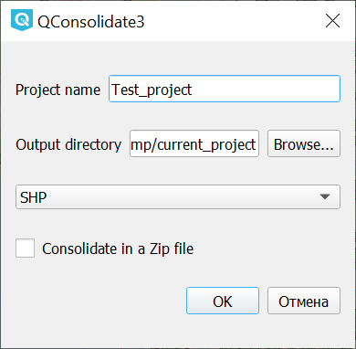

.. sectionauthor:: Артём Светлов <artem.svetlov@nextgis.ru>, Юлия Григоренко <grigorenko.j@gmail.com>

.. _qconsolidate:
    
QConsolidate
===============

С помощью данного модуля расширения пользователь QGIS получает возможность экспортировать в один каталог проект и файлы, на которые он ссылается. 

Для установки модуля нужно разрешить установку экспериментальных модулей. 

После установки модуля появится пункт меню Плагины ‣ QConsolidate.

В диалоговом окне модуля нужно задать:

* имя проекта (если проект уже создан, то по умолчанию добавляется текущее)
* папку, куда будут экспортированы файлы
* формат, в котором будут сохранены векторные слои - GeoPackage или ESRI ShapeFile

Также можно экспортировать весь проект в zip-архив, поставив соответствующий флажок.

   
   Диалоговое окно модуля QConsolidate3

.. warning::

   Модуль не работает со слоями, добавленными по http, в том числе со слоями из модуля QuickMapServices.
