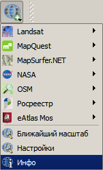
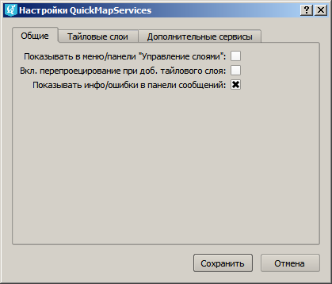
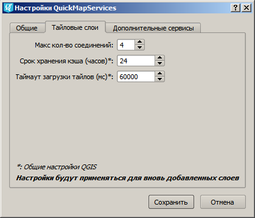
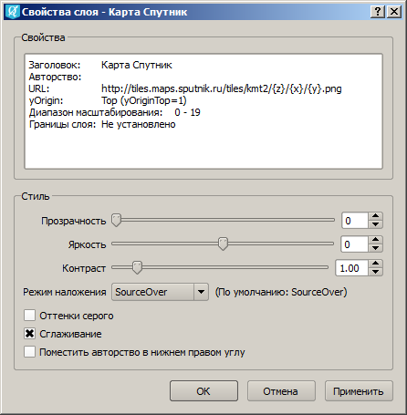
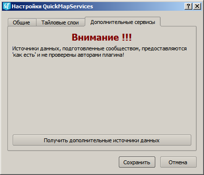
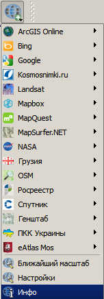

.. sectionauthor:: Дмитрий Барышников <dmitry.baryshnikov@nextgis.ru>

.. _QuickMapServices:

QuickMapServices
================

Этот инструмент может применяться для быстрого добавления базовой карты (т.н. подложки) 
в проект QGIS. Растровая картографическая подложка часто выступает в качестве первого 
слоя, добавляемого для работы в проект. Вы можете подложить слой Openstreetmap, 
публичной кадастровой карты РФ и многие другие. 

Подложка может быть представлена в виде различных интернет-сервисов: TMS, WMS, WMTS, 
ESRI ArcGIS Service или просто в виде тайлов XYZ.

После установки расширения в панели инструментов "Интернет" появится кнопка расширения 
(кнопку можно расположить и на другой, возможно более удобной панели, см. Настройки). 
Так же появится группа QuickMapServices в одноименном меню.

   
Кнопка является контейнером для базовых карт из различных источников.

   
При выборе одной из них, карта автоматически подключается в проект в качестве слоя. 

Настройки сервисов хранятся отдельно от самого модуля и при удалении/обновлении 
модуля они не удаляются.

.. figure:: _static/modules_Qms-main.jpg
   :align: center
   :width: 15cm
   
   Базовая картографическая основа и слой кадастрового деления с Публичной кадастровой карты.

Настройки
------------

Общие настройки
^^^^^^^^^^^^^^^^

Окно общих настроек можно вызвать из меню расширения. Что можно настроить:

1. Показывать управление подложками из панели "Управление слоями", по умолчанию 
   управление подложками добавляется в панель "Веб" и ее часто «теряют».
2. Включать перепроецирование при добавлении тайлового слоя (если опция включена, 
   то в проекте автоматически включается перепроецирование в систему координат 
   EPSG: 3857 Pseudo Mercator);
3. Показывать информацию в панели сообщений. По умолчанию они показываются во 
   всплывающей панели, что не всегда удобно.

   
   Общие настройки.

И параметры загрузки тайлов:

1. Максимальное количество соединений для скачивания тайлов.
2. Срок хранения кэша тайлов.
3. Таймаут загрузки тайлов.

   
   Настройки получения тайлов.

Настройки подложки
^^^^^^^^^^^^^^^^^^^^

Так как подложка, добавленная через QuickMapServices, является особым видом слоя, 
её окно настроек отличается от стандартного окна настроек слоя.

Через настройки подложки можно осуществить:

1. Включение-выключение сглаживания.
2. Перевод подложки в оттенки серого.
3. Настройку яркости, контраста, прозрачности.
4. Включение пока копирайтов.

   
   Настройки подложки.
   
Дополнительные сервисы
----------------------

После установки модуля зайдите в настройках во вкладку 
:guilabel:`Дополнительные сервисы` и нажмите 
:guilabel:`Получить дополнительные источники данных`.

   
   Загрузка дополнительных сервисов.

Расширенный набор сервисов может выглядеть так:

   
   Полный список сервисов.

.. note::
    Если вы планируете делать производную работу на основе подложки из интернета, 
ознакомьтесь с условиями использования данной подложки, чтобы не нарушить законы 
об авторских правах. Если вы используете подложку OSM Mapnik, то конечную работу 
достаточно подписать «© Участники OpenStreetMap». Для подложки Карта Спутник - 
«© Спутник © Openstreetmap». Другие подложки и космоснимки могут иметь более строгие 
ограничения на использование. 

.. note::
    Вы можете добавлять в модуль и свои подложки!
    Смотрите описание по адресу http://gis-lab.info/qa/quickmapservices.html   
