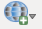
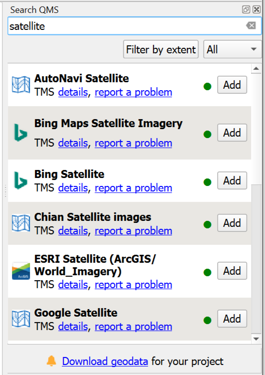
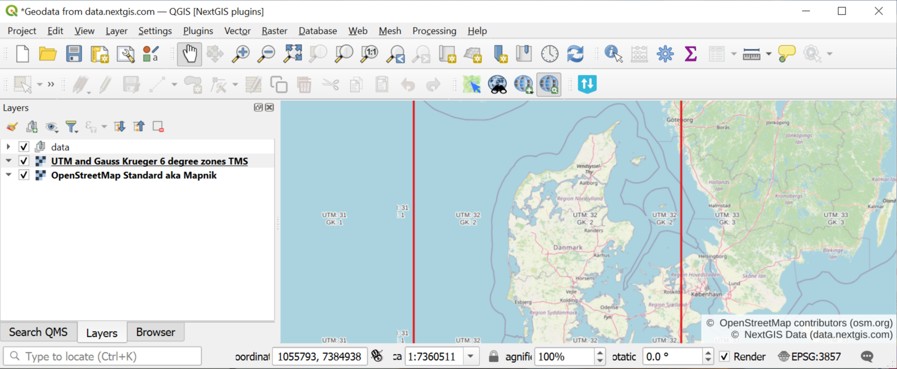
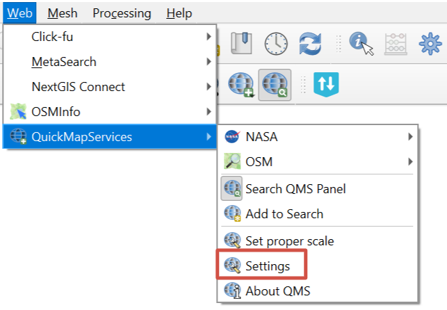
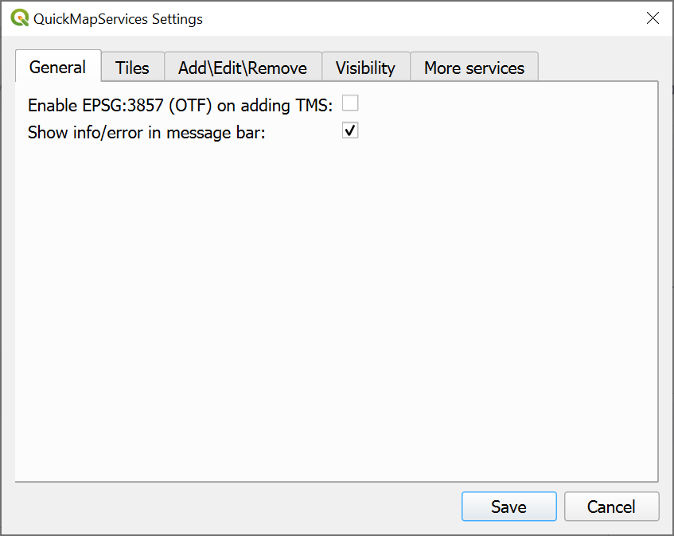
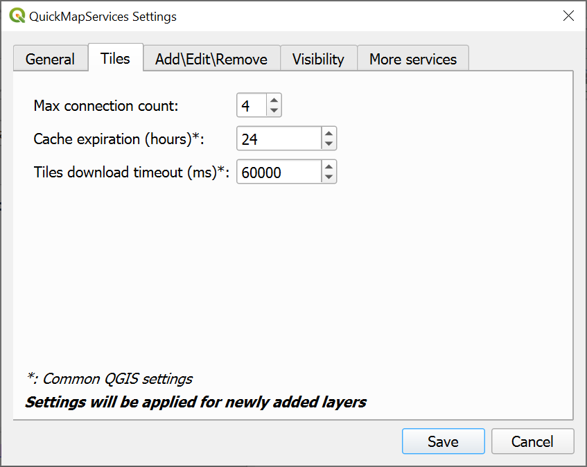

.. _QuickMapServices:

QuickMapServices
================

With this plugin you can quickly add a basemap to you QGIS project. Raster basemap is often the first layer to be added to a project. You can add OpenStreetMap layer, UTM zones borders etc. 

Basemap can be in the form of a Web service: TMS, WMS, WMTS, ESRI ArcGIS Service, or symply XYZ tiles.

You can search for any service added to QMS database by using the **search bar** :numref:`qms_search`. Also most used basemaps are gathered in he QuickMapServices dropdown menu.  

Full catalog of QuickMapServices is available on https://qms.nextgis.com/. You can `add your own basemaps to the catalog <https://qms.nextgis.com/faq#addingservices>`_.

.. _qms_menu:

Menu and search panel
----------------------

After the plugin is installed its buttons appear in the Web Toolbar (you can move the buttons to another panel in the Settings). Also QuickMapServices submenu will be added to the Web menu.

Activate the |button_QMS_search| QMS search panel. Enter the name of the service you want to find into the search bar (try "Openstreetmap", "Mapnik" or "UTM"), then double-click the service to add it to the map or press **Add**. 

Press **Filter by extent** to only display the layers that contain the area visible on the map in QGIS. Not all the layers in QMS database have specified extent, but you can add it yourself.

   
   QMS search panel
   
Basemap added to project as a raster layer (see :numref:`qms_map`)

   
   Basemap and a layer of UTM zones

The service settings are stored separately and remain intact when you delete or update the plugin.

See how the plugins work in our video:

.. raw:: html

   <iframe width="560" height="315" src="https://www.youtube.com/embed/lw_v0GlZzcE?si=K0wO5VwiDKScqdAu" title="YouTube video player" frameborder="0" allow="accelerometer; autoplay; clipboard-write; encrypted-media; gyroscope; picture-in-picture; web-share" referrerpolicy="strict-origin-when-cross-origin" allowfullscreen></iframe>

Watch on `youtube <https://youtu.be/lw_v0GlZzcE?si=CGU15UB9NHcUFzdS>`_.

.. _qmssettings:

Settings
------------

To open the plugin settings, go to Web ‣ QuickMapServices ‣ Settings.

   QMS settings
  
.. _qmssettings_main:

General settings
^^^^^^^^^^^^^^^^

Open the settings menu from the plugin menu. On this tab you can configure the following parameters:

1. Automatically reproject to EPSG: 3857 Pseudo Mercator);
2. Show info/error message in message bar. By default they are displayed in a pop-up window.

   
   General settings

.. _qmssettings_tiles:

Tiles settings
^^^^^^^^^^^^^^^

1. Maximal connection count for tile download.
2. Cache expiration - how long the downloaded tiles are stored, in hours.
3. Tiles download timeout, milliseconds.

   
   Tiles settings

.. _qmssettings_edit:

Add/Edit/Remove
^^^^^^^^^^^^^^^^^

On this tab you can manage groups and services.

.. note::
    If you plan to make a derivative work based on a basemap added from the Internet, please read the terms of use for that basemap so as not to violate copyright laws. If you use OSM Mapnik, all you need to do is add «© OpenStreetMap contributors (osm.org)». Other basemaps and satellite images may have more restrictions. 

     
