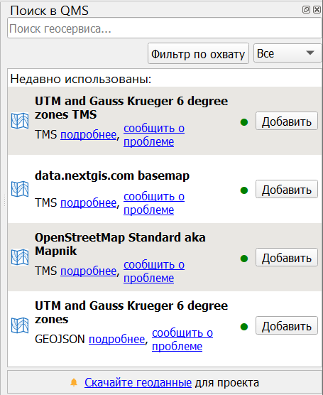
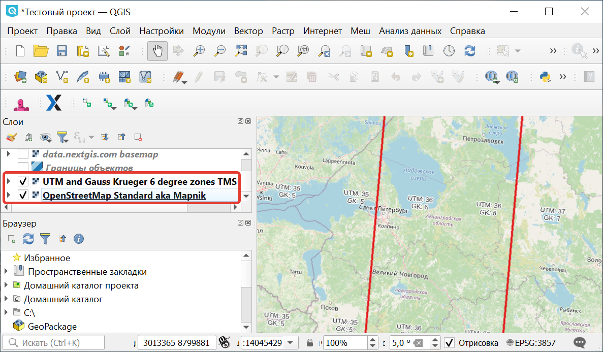
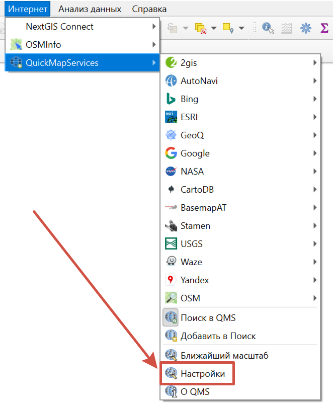
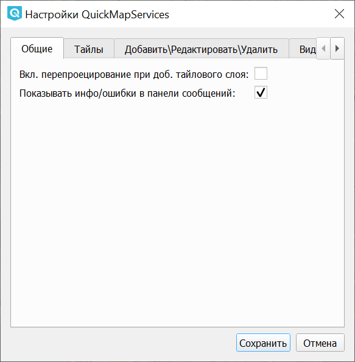
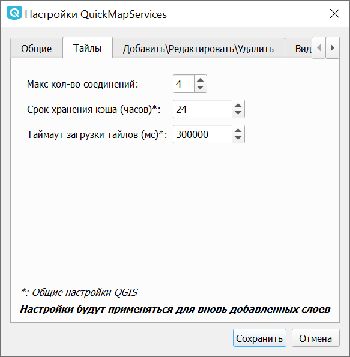

.. _QuickMapServices:

.. |modules_Qms-button| image:: _static/modules_Qms-button.png
.. |button_QMS_search| image:: _static/button_QMS_search.png

QuickMapServices
================

.. note:: Модуль поддерживает Qt6

Этот инструмент может применяться для быстрого добавления базовой карты (т.н. подложки) в проект QGIS. Растровая картографическая подложка часто выступает в качестве первого слоя, добавляемого для работы в проект. Вы можете подложить слой Openstreetmap, разграфку зон UTM и многие другие. 

Подложка может быть представлена в виде различных интернет-сервисов: TMS, WMS, WMTS, ESRI ArcGIS Service или просто в виде тайлов XYZ.

Вы может найти любой сервис, добавленный в базу QMS, при помощи **панели поиска** :numref:`qms_search`. Также наиболее часто используемые подложки вынесены в меню QuickMapServices.

Полный каталог доступен по адресу https://qms.nextgis.com/. Вы можете `добавлять в модуль и свои подложки <https://qms.nextgis.com/faq#addingservices>`_!

.. _qms_menu:

Меню модуля и панель поиска
----------------------------

После установки расширения в "Панель веб-инструментов" добавится кнопка расширения (кнопку можно расположить и на другой, возможно более удобной панели, см. Настройки). Также появится группа QuickMapServices в выпадающем меню "Интернет".

Активирйте |button_QMS_search| панель поиска, введите в поле название вашего любимого сервиса (например, попробуйте "Openstreetmap mapnik", "UTM"), нажмите кнопку **Добавить**, и он добавится на карту. 

При нажатой клавише **Фильтр по охвату** в результатах поиска будут выводится только слои, попадающие в охват карты на экране. В базе QMS не для всех слоёв указан охват, но вы можете добавить в базу его сами.

   
   Панель поиска QMS
   
Подложка добавлена в проект в качестве растрового слоя (см. :numref:`qms_map`)

   
   Базовая картографическая основа и слой зон UTM

Настройки сервисов хранятся отдельно от самого модуля и при удалении/обновлении модуля они не удаляются.

Также посмотреть на модуль в действии можно в нашем видео:

.. raw:: html

   <iframe width="560" height="315" src="https://rutube.ru/play/embed/761686506e8ef358416c320f920fc7ae/" frameBorder="0" allow="clipboard-write; autoplay" webkitAllowFullScreen mozallowfullscreen allowFullScreen></iframe>

Посмотреть видео на `youtube <https://youtu.be/maXTAbfssd0>`_, `rutube <https://rutube.ru/video/761686506e8ef358416c320f920fc7ae/>`_.

.. _qmssettings:

Настройки
------------

Чтобы открыть диалог настроек модуля, из верхнего меню выберите Интернет ‣ QuickMapServices ‣ Настройки

.. _qmssettings_main:

Общие настройки
----------------

Окно общих настроек можно вызвать из меню расширения. Что можно настроить:

1. Включать перепроецирование при добавлении тайлового слоя (если опция включена, то в проекте автоматически включается перепроецирование в систему координат EPSG: 3857 Pseudo Mercator);
2. Показывать информацию в панели сообщений. По умолчанию они показываются во всплывающей панели, что не всегда удобно.

   
   Общие настройки

.. _qmssettings_tiles:

Параметры загрузки тайлов
--------------------------

1. Максимальное количество соединений для скачивания тайлов.
2. Срок хранения кэша тайлов.
3. Таймаут загрузки тайлов.

   
   Настройки получения тайлов

.. note::
    Если вы планируете делать производную работу на основе подложки из интернета, ознакомьтесь с условиями использования данной подложки, чтобы не нарушить законы об авторских правах. Если вы используете подложку OSM Mapnik, то конечную работу достаточно подписать «© Участники OpenStreetMap». Другие подложки и космоснимки могут иметь более строгие ограничения на использование. 

    

