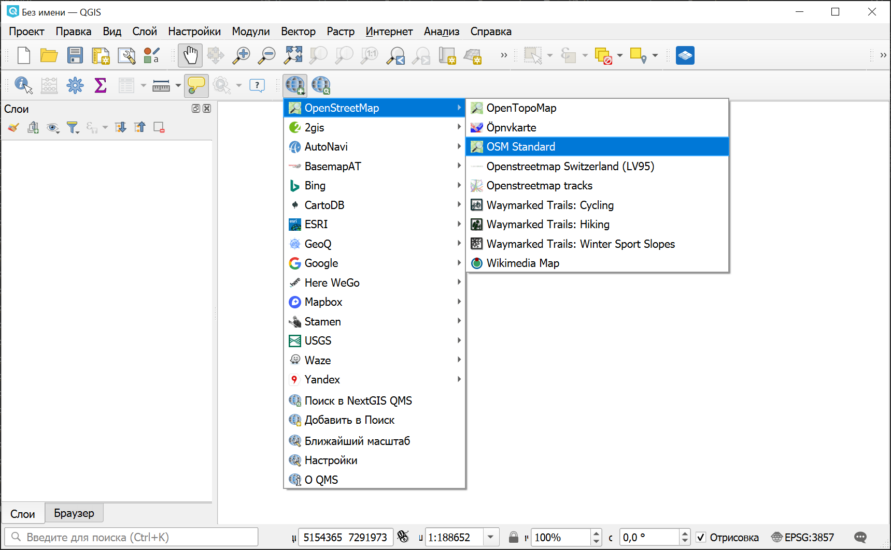
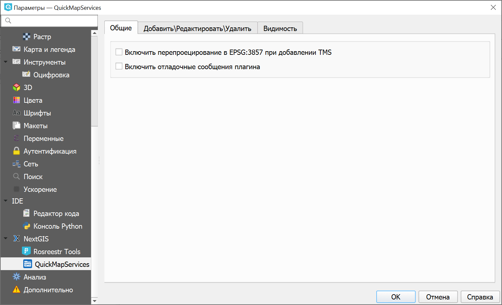
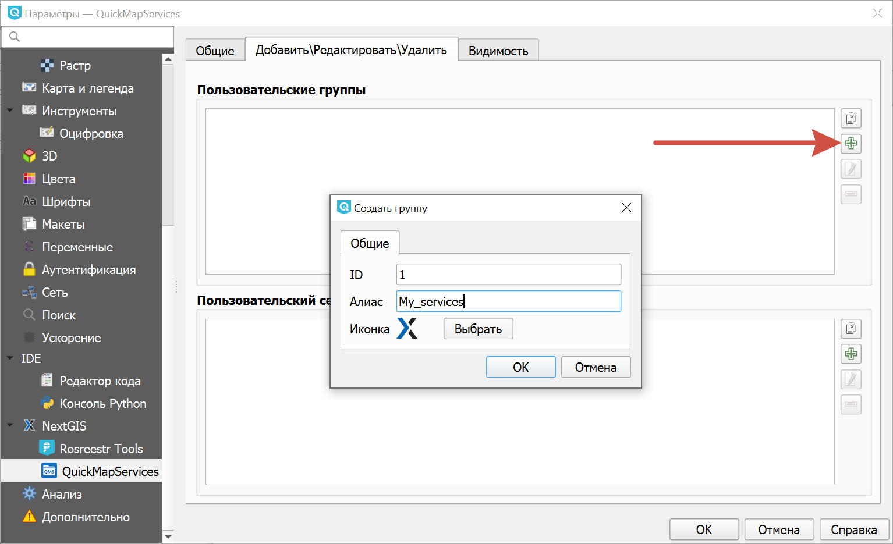
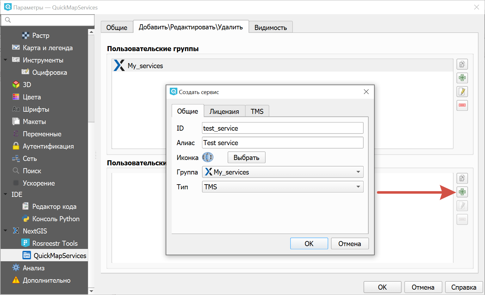
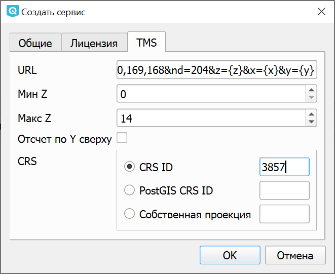
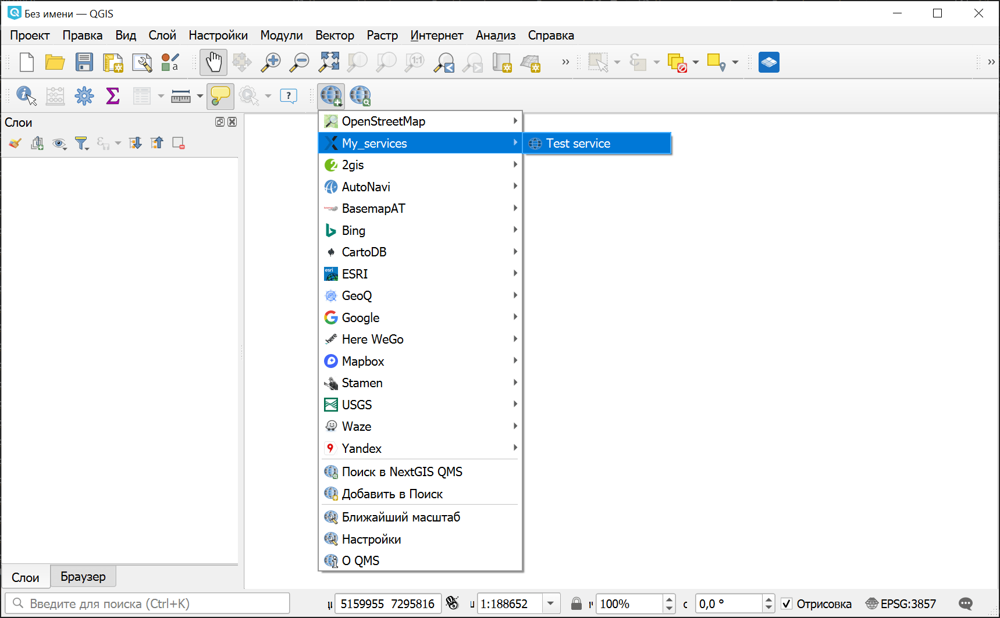
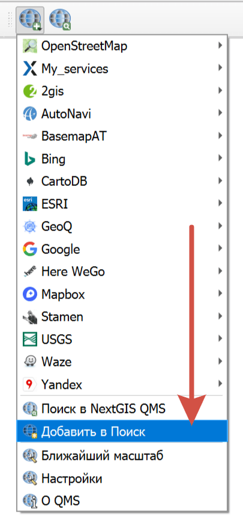
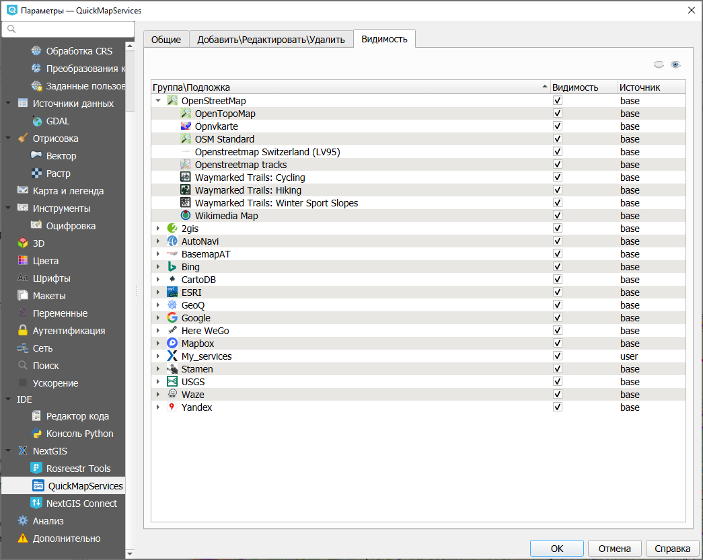

.. _QuickMapServices:

.. |modules_Qms-button| image:: _static/modules_Qms-button.png
.. |button_QMS_search| image:: _static/button_QMS_search.png

QuickMapServices
================

.. note:: Модуль поддерживает Qt6

Этот инструмент может применяться для быстрого добавления базовой карты (т.н. подложки) в проект QGIS. Растровая картографическая подложка часто выступает в качестве первого слоя, добавляемого для работы в проект. Вы можете подложить слой Openstreetmap, разграфку зон UTM и многие другие. 

Подложка может быть представлена в виде различных интернет-сервисов: TMS, WMS, WMTS, ESRI ArcGIS Service или просто в виде тайлов XYZ.

Вы может найти любой сервис, добавленный в базу QMS, при помощи **панели поиска** :numref:`qms_search`. Также наиболее часто используемые подложки вынесены в меню QuickMapServices.

Полный каталог доступен по адресу https://qms.nextgis.com/. Вы можете `добавлять в него и свои подложки <https://qms.nextgis.com/faq#addingservices>`_!

.. _qms_menu:

Как добавить подложку в QGIS
----------------------------

После установки модуля QuickMapServices в "Панель веб-инструментов" добавится кнопка расширения (кнопку можно расположить и на другой, возможно более удобной панели, см. Настройки). Также появится группа QuickMapServices в выпадающем меню "Интернет".

Активируйте |button_QMS_search| панель поиска, введите в поле название вашего любимого сервиса или ключевые слова (например, попробуйте "Openstreetmap mapnik", "UTM"), выберите из результатов поиска инажмите кнопку **Добавить**, он добавится на карту. 

.. figure:: _static/modules_Qms-search_ru.png
   :name: qms_search
   :align: center
   :width: 10cm
   
   Панель поиска QMS

Если нажать **Фильтр по охвату**, в результатах поиска будут выводится только слои, попадающие в охват карты на экране. В базе QMS не для всех слоёв указан охват, но вы можете добавить его в базу сами.

Подложка добавляется в проект в виде растрового слоя (см. :numref:`qms_map`).

.. figure:: _static/modules_Qms-main_ru.png
   :name: qms_map
   :align: center
   :width: 20cm
   
   Базовая картографическая основа и слой зон UTM

Также посмотреть на модуль в действии можно в нашем видео:

.. raw:: html

   <iframe width="560" height="315" src="https://rutube.ru/play/embed/761686506e8ef358416c320f920fc7ae/" frameBorder="0" allow="clipboard-write; autoplay" webkitAllowFullScreen mozallowfullscreen allowFullScreen></iframe>

Посмотреть видео на `youtube <https://youtu.be/maXTAbfssd0>`_, `rutube <https://rutube.ru/video/761686506e8ef358416c320f920fc7ae/>`_.

Другой способ - выбрать один из сервисов, сохранённых в модуле. Нажмите |modules_Qms-button| на панели веб-инструментов или вызовите список через меню Интернет - QuickMapServices.

Кликните по нужному сервису - он добавится в проект.

   Добавление сервиса из меню модуля

Содержимым меню можно управлять в Настройках модуля.

.. _qmssettings:

Настройки
------------

Окно настроек можно вызвать из меню модуля или из верхнего меню, выберав Интернет ‣ QuickMapServices ‣ Настройки.

.. figure:: _static/qsm_settings_open_ru.png
   :name: qsm_settings_open_pic
   :align: center
   :width: 12cm

.. _qmssettings_main:

Общие настройки
~~~~~~~~~~~~~~~~

Что можно настроить на этой вкладке:

1. Включать перепроецирование при добавлении TMS (если опция включена, то в проекте автоматически включается перепроецирование в систему координат EPSG: 3857 Pseudo Mercator);
2. Включить отладочные сообщения модуля. При выборе этой опции сообщения будут показываться в панели сообщений QGIS. По умолчанию они показываются во всплывающей панели, что не всегда удобно.

   
   Общие настройки

Добавить / редактировать / удалить
~~~~~~~~~~~~~~~~~~~~~~~~~~~~~~~~~~~

На второй вкладке можно добавлять сервисы, которые будут доступны непосредственно из меню модуля наряду с предустановленными.

Вы можете добавить сервис в одну из существующих групп или создать свою.

Чтобы добавить группу, нажмите на зелёный плюс в верхней половине вкладки. Задайте идентификатор группы и название, которое будет отображаться в меню модуля.

   Создание пользовательской группы сервисов

Чтобы добавить сервис, нажмите на зелёный плюс в нижней половине вкладки. 

   Добавление сервиса в группу

* Задайте идентификатор сервиса и название, которое будет отображаться в меню. 
* Выберите группу, в которую будет добавлен сервис.
* Выберите тип сервиса: WMS, TMS, GDAL, WFS, GeoJSON.

На следующей вкладке вы можете добавить сведения о лицензии.

.. note::
    Если вы планируете делать производную работу на основе подложки из интернета, ознакомьтесь с условиями использования данной подложки, чтобы не нарушить законы об авторских правах. Если вы используете подложку OSM Mapnik, то конечную работу достаточно подписать «© Участники OpenStreetMap». Другие подложки и космоснимки могут иметь более строгие ограничения на использование. 

На третьей вкладке:

* Добавьте ссылку на сервис;
* Укажите числовой идентификатор системы координат (например, 3857 для EPSG:3857 (WGS 84 / Pseudo-Mercator).

   Параметры сервиса TMS

Нажмите **Ок**, чтобы завершить добавление сервиса.

   Новый сервис в меню QMS

Если вы хотите, чтобы другие пользователи также могли воспользоваться этим сервисом, вы можете добавить его в `публичный каталог QuickMapServices <https://qms.nextgis.com/>`_.

Нажмите |modules_Qms-button| или вызовите меню модуля через меню Интернет - QuickMapServices и выберите **Добавить в поиск**.

   Добавление сервиса в общий каталог
    
В браузере откроется страница каталога QuickMapServices, где вы сможете добавить общедоступный сервис, который будет отображаться в поиске у всех пользователей QMS.

`Подробнее о добавлении сервисов в поиск QMS <https://qms.nextgis.com/faq>`_.

.. _visibility:

Видимость
~~~~~~~~~~

На этой вкладке можно выбрать, какие группы и сервисы отображать в выпадающем меню модуля.

   Видимость групп и слоёв