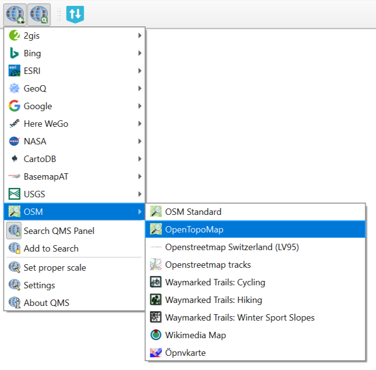
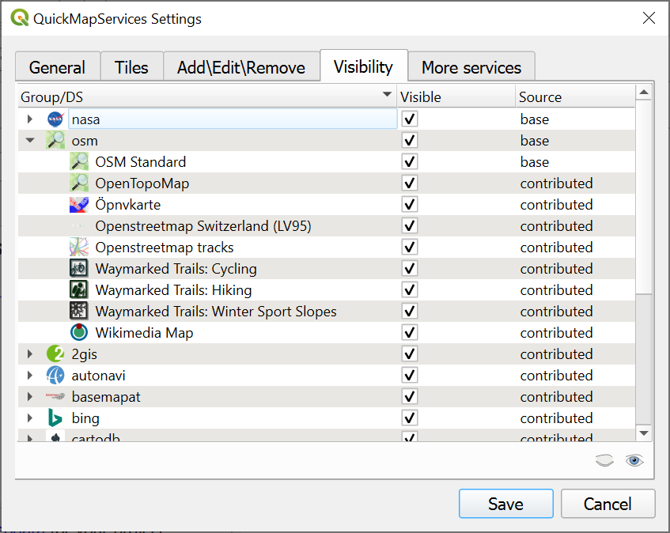
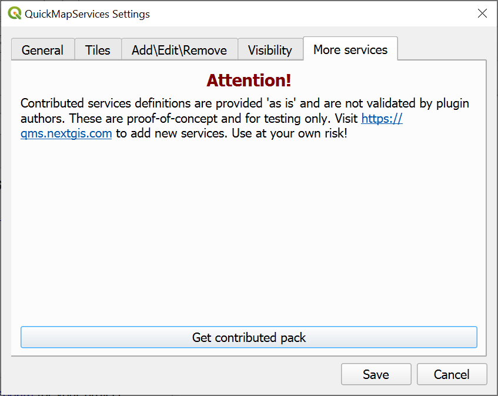

.. sectionauthor:: <dmitry.baryshnikov@nextgis.ru>

.. _QuickMapServices:

QuickMapServices
================

With this plugin you can quickly add a basemap to you QGIS project. Raster basemap is often the first layer to be added to a project. You can add OpenStreetMap layer, UTM zones borders etc. 

Basemap can be in the form of a Web service: TMS, WMS, WMTS, ESRI ArcGIS Service, or symply XYZ tiles.

Most used basemaps are gathered in he QuickMapServices **dropdown menu** :numref:`qms_icon`. Also you can search for any service added to QMS database by using the **search bar** :numref:`qms_search`.

After the plugin is installed its buttons appear in the Web Toolbar (you can move the buttons to another panel in the Settings). Also QuickMapServices submenu will be added to the Web menu.

Press |modules_Qms-button| QMS button and select a service from the list (see :numref:`qms_dropdown_pic`). Select a basemap from the list to instantly add it as a layer.

.. |modules_Qms-button| image:: _static/modules_Qms-button.png
.. |button_QMS_search| image:: _static/button_QMS_search.png

   
   QuickMapServices dropdown menu

Another way is to activate the  |button_QMS_search| QMS search panel. Enter the name of the service you want to find into the search bar (try "Openstreetmap", "Mapnik" or "UTM"), then double-click the service to add it to the map or press **Add**. 

Press **Filter by extent** to only display the layers that contain the area visible on the map in QGIS. Not all the layers in QMS database have specified extent, but you can add it yourself.

.. figure:: _static/qms_search_en.png
   :name: qms_search
   :align: center
   :width: 10cm
   
   QMS search panel
   
Basemap added to project as a raster layer (see :numref:`qms_map`)

.. figure:: _static/qms_added_example_en.png
   :align: center
   :width: 22cm
   
   Basemap and a layer of UTM zones

The service settings are stored separately and remain intact when you delete or update the plugin.

.. _qmssettings:

Settings
------------

To open the plugin settings, go to Web ‣ QuickMapServices ‣ Settings.

.. figure:: _static/qsm_settings_open_en.png
   :align: center
   :width: 12cm

   QMS settings
  
.. _qmssettings_main:

General settings
^^^^^^^^^^^^^^^^

Open the settings menu from the plugin menu. On this tab you can configure the following parameters:

1. Automatically reproject to EPSG: 3857 Pseudo Mercator);
2. Show info/error message in message bar. By default they are displayed in a pop-up window.

.. figure:: _static/qms_settings_general_en.png
   :align: center
   :width: 15cm
   
   General settings

.. _qmssettings_tiles:

Tiles settings
^^^^^^^^^^^^^^^

1. Maximal connection count for tile download.
2. Cache expiration - how long the downloaded tiles are stored, in hours.
3. Tiles download timeout, milliseconds.

.. figure:: _static/qms_settings_tiles_en.png
   :align: center
   :width: 15cm
   
   Tiles settings

.. _qmssettings_edit:

Add/Edit/Remove
^^^^^^^^^^^^^^^^^

On this tab you can manage groups and services.

.. _qmssettings_visibility:

Visibility
^^^^^^^^^^^^^^

On this tab you can choose which services will be displayed in the QMS dropdown menu. 

   
   Visibility settings

By default, there are two services in the plugin, both displayed. To download additional services, to to the "More services" tab.

.. _qmssettings_additional:

Add more services
^^^^^^^^^^^^^^^^^^^^^

On this tab you can download a package of additional services. Click **Get contributed pack**:

   
   Downloading additional services

.. tip::
    You can add your own basemaps to the plugin too!
    See instruction on https://qms.nextgis.com/faq#addingservices 

.. note::
    If you plan to make a derivative work based on a basemap added from the Internet, please read the terms of use for that basemap so as not to violate copyright laws. If you use OSM Mapnik, all you need to do is add «© OpenStreetMap contributors (osm.org)». Other basemaps and satellite images may have more restrictions. 

     
