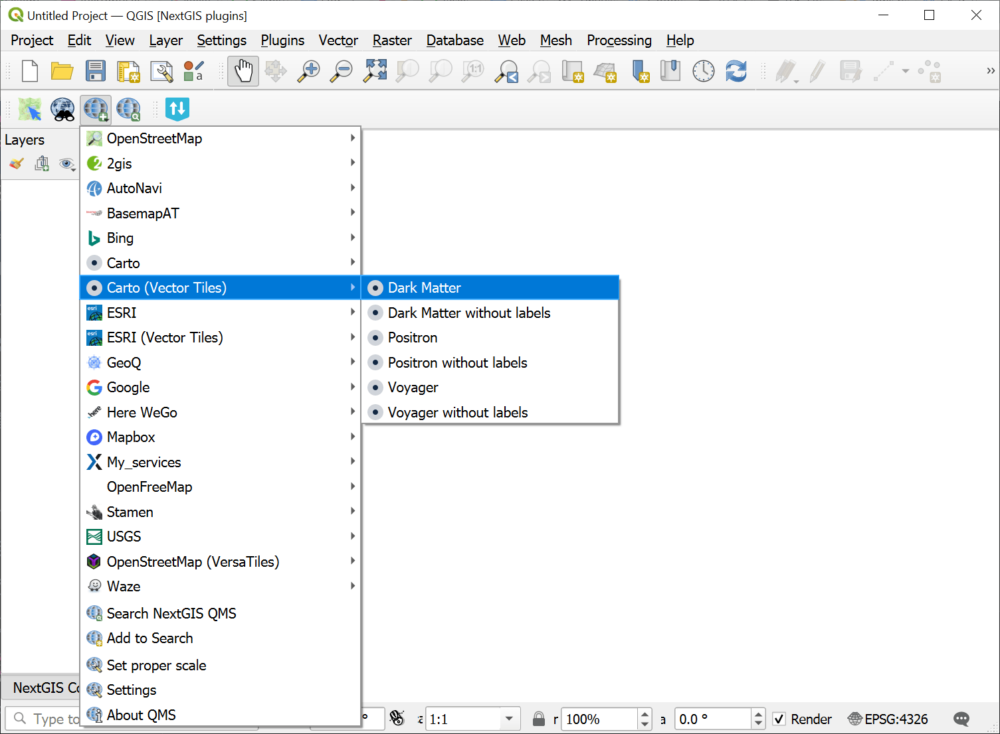
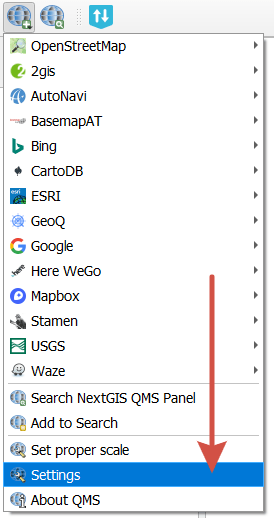
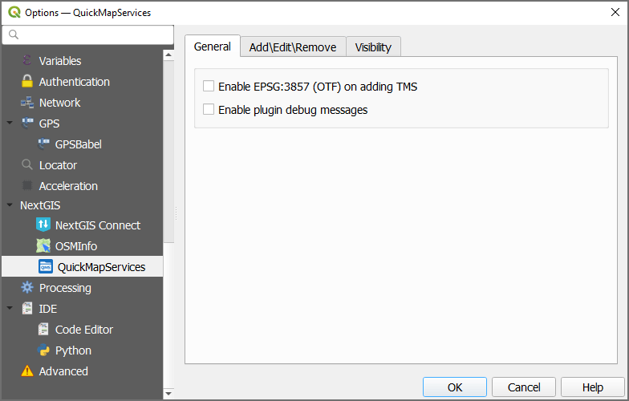
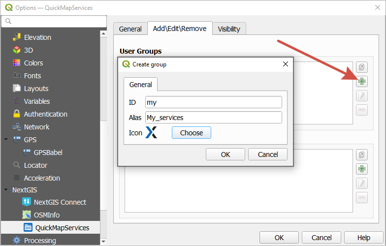
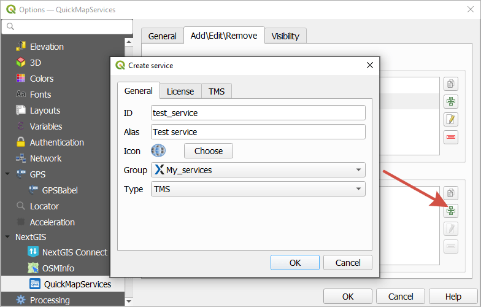
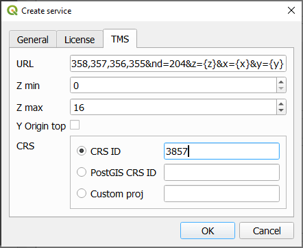
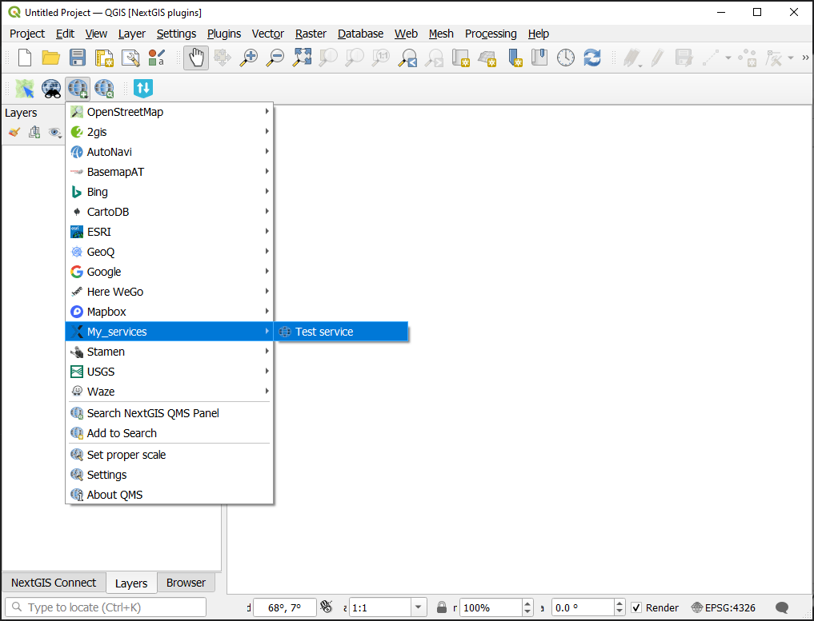
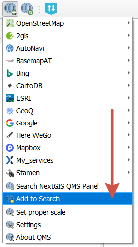
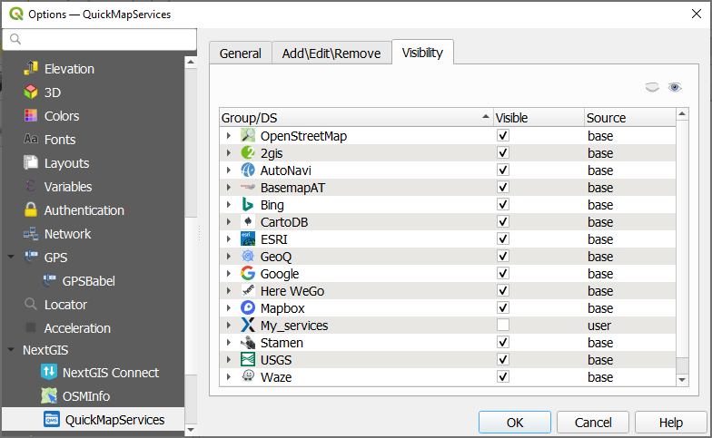

.. _QuickMapServices:

.. |modules_Qms-button| image:: _static/modules_Qms-button.png
.. |button_QMS_search| image:: _static/button_QMS_search.png

QuickMapServices: most downloaded QGIS plugin
=============================================

.. note:: Qt6 compatible

With this plugin you can quickly add a basemap to you QGIS project. Raster basemap is often the first layer to be added to a project. You can add OpenStreetMap layer, UTM zones borders etc. 

Basemap can be in the form of a Web service: TMS, WMS, WMTS, ESRI ArcGIS Service, or symply XYZ tiles.

You can search for any service added to QMS database by using the **search bar** :numref:`qms_search`. Most used basemaps are gathered in he QuickMapServices **dropdown menu**.

Full catalog of QuickMapServices is available on https://qms.nextgis.com/. You can `add your own basemaps to the catalog <https://qms.nextgis.com/faq#addingservices>`_.

.. _qms_menu:

How to add basemaps and other services to QGIS
-----------------------------------------------

After the plugin is installed its buttons appear in the Web Toolbar (you can move the buttons to another panel in the Settings).  Also QuickMapServices submenu will be added to the Web menu.

Activate the |button_QMS_search| QMS search panel. Enter the name of the service you want to find or some key words into the search bar (try "Openstreetmap", "Mapnik" or "UTM"), then double-click the service to add it to the map or click **Add**.  

.. figure:: _static/qms_search_en.png
   :name: qms_search
   :align: center
   :width: 10cm
   
   QMS search panel

Click **Filter by extent** to only display the layers that contain the area visible on the map in QGIS. Not all the layers in QMS database have specified extent, but you can add it yourself. Not all the layers in QMS database have specified extent, but you can add it yourself.

Basemap is added to project as a raster layer (see :numref:`qms_map`)

.. figure:: _static/qms_added_example_en.png
   :name: qms_map
   :align: center
   :width: 24cm
   
   Basemap and a layer of UTM zones

You can check out how the plugin works in our video:

.. raw:: html

   <iframe width="560" height="315" src="https://www.youtube.com/embed/lw_v0GlZzcE?si=K0wO5VwiDKScqdAu" title="YouTube video player" frameborder="0" allow="accelerometer; autoplay; clipboard-write; encrypted-media; gyroscope; picture-in-picture; web-share" referrerpolicy="strict-origin-when-cross-origin" allowfullscreen></iframe>

Watch on `youtube <https://youtu.be/lw_v0GlZzcE?si=CGU15UB9NHcUFzdS>`_.

Another way to add a basemap is to pick one of the services from the plugin menu. Click |modules_Qms-button| on the Web toolbar or go to Web ‣ QuickMapServices.

Click on a service to add it to the project. 

.. admoniton:: New!
   This way you can add both raster and vector tiles.

   Adding service from the plugin menu

You can modify the contents of this menu in the plugin settings.

.. _qmssettings:

Settings
------------

To open the plugin settings, go to Web ‣ QuickMapServices ‣ Settings or open Settings from the plugin menu.

.. _qmssettings_main:

General settings
~~~~~~~~~~~~~~~~

On this tab you can activate one of the options:

1. Automatically reproject to EPSG: 3857 Pseudo Mercator;
2. Enable plugin debug messages. If this option is enabled, the messages are shown in the QGIS message center. By default they are displayed in a pop-up window.

   
   General settings

Add/Edit/Remove
~~~~~~~~~~~~~~~~~~~~~~~~~~~~~~~~~~~

On the second tab you can add services to the plugin menu.

You can create a new service in one of the existing groups or add a new group.

To create a new group, click on the green plus in the top half of the tab. Set an ID and an alias that will be displayed in the menu.

   Creating a new service group

To create a new service, click on the green plus in the bottom half of the tab. 

   Creating service in the group

* Set an ID and an alias that will be displayed in the menu. 
* Pick the group in which to include the service.
* Select the service type: WMS, TMS, GDAL, WFS, GeoJSON.

On the next tab you can add lisencing information.

.. note::
    If you plan to make a derivative work based on a basemap added from the Internet, please read the terms of use for that basemap so as not to violate copyright laws. If you use OSM Mapnik, all you need to do is add «© OpenStreetMap contributors (osm.org)». Other basemaps and satellite images may have more restrictions. 

On the third tab:

* Add service URL;
* Enter the numeric code of the CRS (e.g. 3857 for EPSG:3857 (WGS 84 / Pseudo-Mercator).

   TMS service parameters

Click **OK** to complete the service creation.

   New service in the QMS menu

If you want to share the service with other users, you can add it to `the public QuickMapServices catalog <https://qms.nextgis.com/>`_.

Click |modules_Qms-button| on the Web toolbar or go to Web ‣ QuickMapServices and select **Add to Search**.

   Adding service to the public catalog
    
It opens QuickMapService page in your browser, allowing you to create a new publicly available service that other users would access via QMS search.

`More on adding a new service to QMS search <https://qms.nextgis.com/faq>`_.

.. _visibility:

Visibility
~~~~~~~~~~

On this tab you can select which groups and services to display in the plugin dropdown menu.

   Visibility of groups and services
