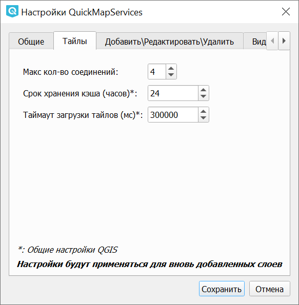

.. sectionauthor:: Дмитрий Барышников <dmitry.baryshnikov@nextgis.ru>

.. _QuickMapServices:

QuickMapServices
================

Этот инструмент может применяться для быстрого добавления базовой карты (т.н. подложки) 
в проект QGIS. Растровая картографическая подложка часто выступает в качестве первого 
слоя, добавляемого для работы в проект. Вы можете подложить слой Openstreetmap, 
публичной кадастровой карты РФ и многие другие. 

Подложка может быть представлена в виде различных интернет-сервисов: TMS, WMS, WMTS, 
ESRI ArcGIS Service или просто в виде тайлов XYZ.

После установки расширения появляется панель поиска сервисов. 

Просто введите в поле название вашего любимого сервиса, нажмите кнопку, и он добавится на карту.
Попробуйте "Openstreetmap mapnik", "Sputnik", "Openstreetmap.fr", "Boundary of Russia"

При нажатой клавише "Фильтр по охвату" будут выводится слои, попадающие в охват карты на экране. В базе QMS не все слои имеют указаный охват, но вы можете добавить в базу его сами.

После установки расширения в "Панель веб-инструментов" добавится кнопка расширения 
(кнопку можно расположить и на другой, возможно более удобной панели, см. Настройки). 
Так же появится группа QuickMapServices в выпадающем меню "Интернет".

.. figure:: _static/modules_Qms-button.png
   :align: center
   :width: 1.5cm
   
Кнопка является контейнером для базовых карт из различных источников.

   
При выборе одной из них, карта автоматически подключается в проект в качестве слоя. 

Настройки сервисов хранятся отдельно от самого модуля и при удалении/обновлении 
модуля они не удаляются.

   
   Базовая картографическая основа и слой зон UTM

.. _qmsaddbasemap:

Подключение растровой подложки
------------

1. Установите модуль QuickMapServices (раздел "Модули" в верхней панели, см. :numref:`qms_module`)

   
   Установка модуля QuickMapServices

2. Нажмите на иконку |modules_Qms-button| QMS и выберите нужный сервис подложки из предложенного списка (см. :numref:`qms_icon`) или найдите его через |button_QMS_search| панель поиска (см. :numref:`qms_search`) и нажмите "Добавить".

.. |modules_Qms-button| image:: _static/modules_Qms-button.png
.. |button_QMS_search| image:: _static/button_QMS_search.png

   
   Выпадающее меню QuickMapServices

   
   Панель поиска QMS
   
3. Подложка добавлена в проект в качестве растрового слоя (см. :numref:`qms_map`)

.. figure:: _static/qms_map_OSM_ru.png
   :name: qms_map
   :align: center
   :width: 16cm
   
   Растровый слой подложки OpenStreetMap на карте

.. _qmssettings:

Настройки
------------

.. _qmssettings_main:

Общие настройки
^^^^^^^^^^^^^^^^

Окно общих настроек можно вызвать из меню расширения. Что можно настроить:

1. Включать перепроецирование при добавлении тайлового слоя (если опция включена, 
   то в проекте автоматически включается перепроецирование в систему координат 
   EPSG: 3857 Pseudo Mercator);
2. Показывать информацию в панели сообщений. По умолчанию они показываются во 
   всплывающей панели, что не всегда удобно.

   
   Общие настройки

.. _qmssettings_tiles:

Параметры загрузки тайлов
^^^^^^^^^^^^^^^

1. Максимальное количество соединений для скачивания тайлов.
2. Срок хранения кэша тайлов.
3. Таймаут загрузки тайлов.

   
   Настройки получения тайлов

.. _qmssettings_edit:

Добавить/Редактировать/Удалить
^^^^^^^^^^^^^^^^^

Эта вкладка предназначена для управления группами и сервисами.

.. _qmssettings_visibility:

Видимость
^^^^^^^^^^^^^^

На этой вкладке можно настроить, какие сервисы будут отображаться в выпадающем меню QMS. 

   
   Настройки видимости

По умолчанию в модуль добавлены и отображаются два базовых сервиса. Для того, чтобы добавить другие, нужно воспользоваться вкладкой "Загрузить сервисы".

.. _qmssettings_additional:

Загрузить сервисы
^^^^^^^^^^^^^^^^^^^^^

На этой вкладке можно загрузить пакет дополнительных сервисов. Для этого нажмите 
**Получить дополнительные источники данных**:

   
   Загрузка дополнительных сервисов

.. note::
    Если вы планируете делать производную работу на основе подложки из интернета, ознакомьтесь с условиями использования данной подложки, чтобы не нарушить законы об авторских правах. Если вы используете подложку OSM Mapnik, то конечную работу достаточно подписать «© Участники OpenStreetMap». Другие подложки и космоснимки могут иметь более строгие ограничения на использование. 

.. note::
    Вы можете добавлять в модуль и свои подложки!
    Смотрите описание по адресу https://qms.nextgis.com/faq#addingservices 
    

