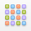
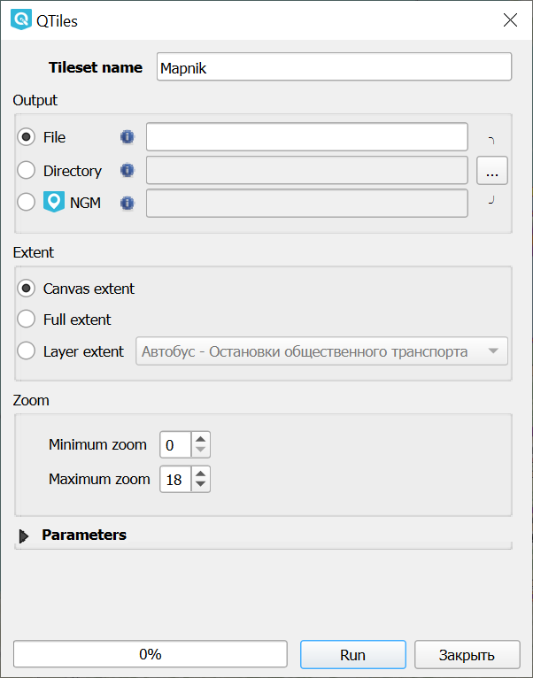

QTiles
=======

С помощью этого модуля создаются растровые тайлы на выбранную территорию и в нужном диапазоне масштабирования.

Распространённое применение такому набору тайлов – работа с `мобильной ГИС <https://docs.nextgis.ru/docs_ngmobile/source/intro.html>`_ в полевых условиях без интернета.

После установки модуль появится на панели инструментов.

Чтобы создать набор растровых тайлов, откройте в QGIS проект, на основе которого хотите создать тайлы. 

Откройте инструмент |button_qtiles|.

   Настройки тайлового набора

В диалоговом окне доступны следующие настройки (см. :numref:`qtiles_dialog_pic`):

**Tileset name** - Название набора тайлов

**Output** - путь к конечному файлу, можно выбрать один из вариантов:

* File - Сохраняет тайлы как ZIP или MBTiles;
* Directory - Сохраняет тайлы в виде структуры вложенных папок;
* NGM - Создает пакет для использования в приложении NextGIS Mobile в формате NGRC.

**Extent** - охват набора тайлов.

* Canvas extent - охват задается в соответствии с частью карты, видимой в окне приложения QGIS;
* Full extent
* Layer extent - позволяет выбрать охват по одному из слоёв проекта.

**Zoom** - задает минимальный и максимальный зум, при котором тайлы будут отображаться.

Дополнительно можно настроить **параметры тайлов**: размеры в пикселях, формат (PNG / JPG) и др. 

Вы можете увидеть модуль в действии в нашем видео:

.. raw:: html

   <iframe width="560" height="315" src="https://rutube.ru/play/embed/6e2694c293d59f6903d600b6b15924a9/" frameBorder="0" allow="clipboard-write; autoplay" webkitAllowFullScreen mozallowfullscreen allowFullScreen></iframe>

Посмотреть видео на `youtube <https://youtu.be/Lk-i4Az0SEo>`_, `rutube <https://rutube.ru/video/6e2694c293d59f6903d600b6b15924a9/>`_.
