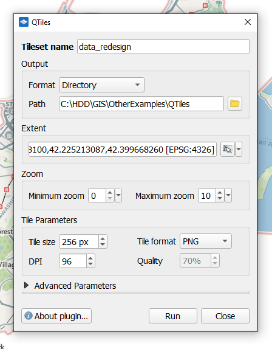
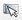

QTiles
=======

This plugin generates raster tiles from QGIS project for selected zoom levels and tile naming conventions (Slippy Map or TMS). 

Raster tilesets like this are used for example in `mobile GIS <https://docs.nextgis.com/docs_ngmobile/source/intro.html>`_ for field work without Internet connection. Packages can be used in NextGIS Mobile, GeoPaparazzi, simple Leaflet-based viewer or MBTiles.

.. todo:: _static/qtiles_ngmob_en.png
   :name: qtiles_ngmob_pic
   :align: center
   :width: 9cm

   Tiles generated by QTiles in NextGIS Mobile

After installation the plugin toolbar is added to the interface. You can turn it on and off in the toolbar list: QTiles Toolbar.

To create a tileset open the QGIS project you want to create tiles from. 

Activate the plugin |button_qtiles|. In the plugin window you can configure parameters of the tiles:

   Tileset parameters

Required parameters are:

* **Tileset name** - by default the project name is used;
* **Format** - select your output:

   * Directory - tiles are saved in subfolders;
   * ZIP-archive;
   * MBTiles;
   * PMTiles;
   * NextGIS Mobile - NGRC file, optimized for use `in NextGIS Mobile app <https://docs.nextgis.com/docs_ngmobile/source/load_geodata.html#ngmobile-import-vector>`_.
   

* **Path** to the target folder;
* **Extent** - you can enter it manually or select one of the options:

   * |button_map_extent| Use current map canvas extent;
   * Calculate from layer;
   * Calculate from layout vap;
   * Calculate from bookmark;
   * Draw on map canvas;
   * Extent of visible layers;
   * Full project extent.

* **Zoom**: minimum (by default it's 0, the entire world), maximum - enter a number or find the necessary zoom on the canvas and select **Set current zoom level** from the dropdown menu.

Click **Run**. The progress bar appears at the bottom of the plugin window.

Additional settings:

* **Tile parameters**, we advise not to change them unless necessary. You can set up tile size, image format (PNG or JPG), DPI, and quality for JPG tiles.

* Advanced parameters:

   * Enable antialiasing (enabled by default);
   * Render tiles with transparent background (enabled by default);
   * Render tiles outside layer extents
   * Enable TMS tile convention;
   * Enable MBTiles compression;
   * Write JSON metadata file;
   * Write overview image file;
   * Write MapURL file;
   * Write Leaflet viewer.

See how the plugin works in our video:

.. raw:: html

   <iframe width="560" height="315" src="https://www.youtube.com/embed/vU4bGCh5khM?si=zwC4vsPXMXKv5Hju" title="YouTube video player" frameborder="0" allow="accelerometer; autoplay; clipboard-write; encrypted-media; gyroscope; picture-in-picture; web-share" referrerpolicy="strict-origin-when-cross-origin" allowfullscreen></iframe>

Watch on `youtube <https://youtu.be/vU4bGCh5khM?si=MgEOY337b9GAIXYO>`_.
