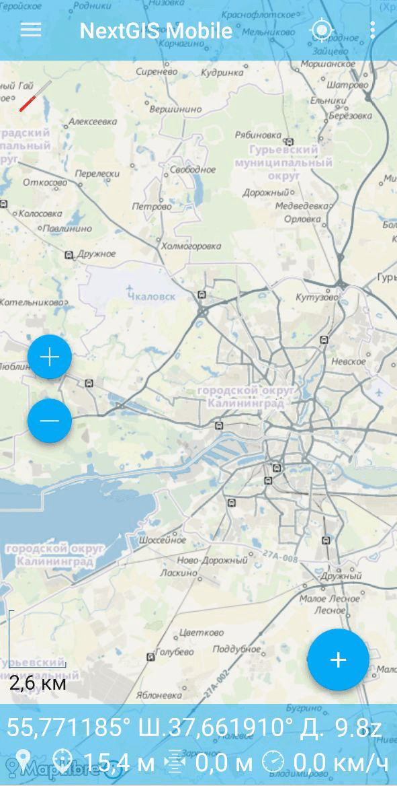
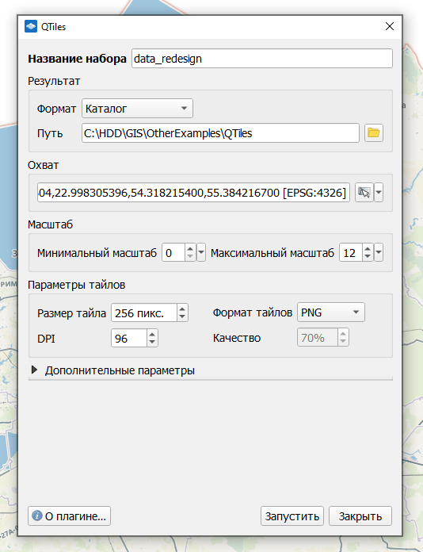

QTiles
=======

С помощью этого модуля создаются растровые тайлы на выбранную территорию и в нужном диапазоне масштабирования.

Распространённое применение такому набору тайлов – работа с `мобильной ГИС <https://docs.nextgis.ru/docs_ngmobile/source/intro.html>`_ в полевых условиях без интернета.

   Тайлы, сгенерированные QTiles, в приложении NextGIS Mobile

После установки модуль появится на панели инструментов. Включить и отключить его видимость можно в списке панелей: QTiles Toolbar.

Чтобы создать набор растровых тайлов, откройте в QGIS проект, на основе которого хотите создать тайлы. 

Откройте инструмент |button_qtiles|. В диалоговом окне доступны следующие настройки:

.. |button_qtiles| image:: _static/button_qtiles_solid.png
   :width: 6mm

   Настройки тайлового набора

Обязательно нужно выбрать следующие параметры:

* **Название набора** - по умолчанию используется название проекта;
* **Путь** - путь к конечному файлу;
* **Охват** - можно задать вручную или использовать один из вариантов:

   * |button_map_extent| Текущий охват карты;
   * Рассчитать из слоя;
   * Рассчитать по карте из макета;
   * Рассчитать по закладке;
   * Указать на карте;
   * Охват видимых слоёв;
   * Полный охват проекта.

.. |button_map_extent| image:: _static/button_map_extent.png
   :width: 6mm

* **Масштаб**: минимальный (по умолчанию 0 - весь мир), максимальный - укажите число или настройте нужное максимальное приближение в окне QGIS и в выпадающем меню поля выберите **Установить текущий уровень масштабирования**.

Нажмите **Запустить**. Прогресс записи тайлов показывается в нижней части окна.

Также доступны дополнительные настройки:

* **Формат** сохранения тайлов:

   * Каталог - Сохраняет тайлы в виде структуры вложенных папок;
   * ZIP-архив;
   * MBTiles;
   * PMTiles;
   * NextGIS Mobile - сохраняет тайлы в файл формата NGRC, оптимизированный для использования в мобильном приложении `NextGIS Mobile <https://docs.nextgis.ru/docs_ngmobile/source/load_geodata.html#ngmobile-import-vector>`_.

* **Параметры тайлов**, не рекомендуем менять их без особой необходимости. Можно изменить размер тайла, формат (PNG, JPG), DPI - разрешение в пикселях на дюйм, для формата JPG также можно задать качество при сжатии.

* Дополнительные параметры:

   * Включить сглаживание (включено по умолчанию);
   * Отрисовывать тайлы с прозрачным фоном (включено по умолчанию);
   * Отрисовывать тайлы за пределами охватов слоёв;
   * Включить соглашение TMS для тайлов;
   * Включить сжатие MBTiles (если выбран соответствующий формат);
   * Создать файл метаданных JSON;
   * Создать файл обзорного изображения карты;
   * Создать файл MapURL;
   * Создать просмотрщик Leaflet.

Вы можете увидеть модуль в действии в нашем видео:

.. raw:: html

   <iframe width="560" height="315" src="https://rutube.ru/play/embed/6e2694c293d59f6903d600b6b15924a9/" frameBorder="0" allow="clipboard-write; autoplay" webkitAllowFullScreen mozallowfullscreen allowFullScreen></iframe>

Посмотреть видео на `youtube <https://youtu.be/Lk-i4Az0SEo>`_, `rutube <https://rutube.ru/video/6e2694c293d59f6903d600b6b15924a9/>`_.
