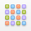
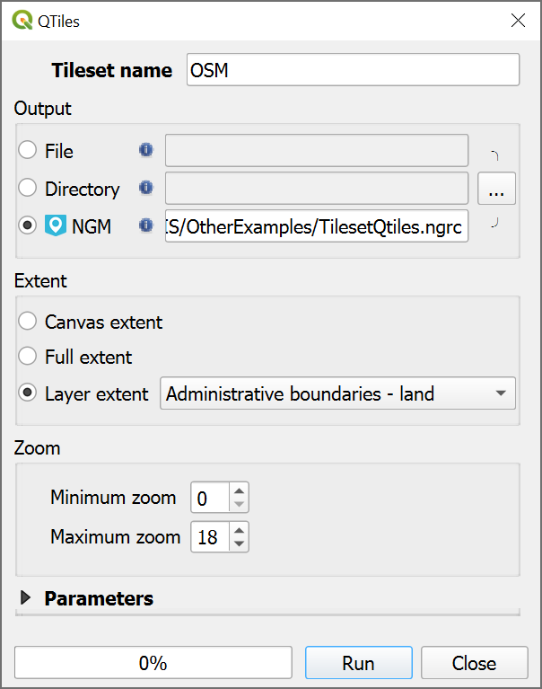

QTiles
=======

This plugin generates raster tiles from QGIS project for selected zoom levels and tile naming conventions (Slippy Map or TMS). 

Raster tilesets like this are used for example in `mobile GIS <https://docs.nextgis.com/docs_ngmobile/source/intro.html>`_ for field work without Internet connection. Packages can be used in NextGIS Mobile, GeoPaparazzi, simple Leaflet-based viewer or MBTiles.

After installation you'll find the plugin in the Plugins toolbar.

To create a tileset open the QGIS project you want to create tiles from. 

Activate the plugin |button_qtiles|.

   Tileset parameters

In the dialog window you can configure the following settings (see :numref:`qtiles_dialog_pic`):

**Tileset name**

**Output** - you can select one of the options:

* File - tiles are saved ar ZIP or MBTiles;
* Directory - tiles are saved in subfolders;
* NGM - creates a NGRC package for NextGIS Mobile.

**Extent**

* Canvas extent - the extent is set to the area of the project visible in QGIS at the moment;
* Full extent
* Layer extent - select a layer of the project to set the extent.

**Zoom** - min and max zoom to display the tiles.

Additionally you can configure **tile parameters**: size in pixels, format (PNG / JPG) etc. 

See how the plugin works in our video:

.. raw:: html

   <iframe width="560" height="315" src="https://www.youtube.com/embed/vU4bGCh5khM?si=zwC4vsPXMXKv5Hju" title="YouTube video player" frameborder="0" allow="accelerometer; autoplay; clipboard-write; encrypted-media; gyroscope; picture-in-picture; web-share" referrerpolicy="strict-origin-when-cross-origin" allowfullscreen></iframe>

Watch on `youtube <https://youtu.be/vU4bGCh5khM?si=MgEOY337b9GAIXYO>`_.
