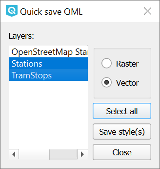

Quickly save default QML
========================

Модуль Quickly save default QML для QGIS позволяет мгновенно сохранять стиль слоя в папку с исходным слоем.

Поддерживается групповое сохранение стилей векторных и растровых слоёв.

После установки кнопки модуля появятся на панели инструментов в панели подключаемых модулей: |button_qmlsaveone| |button_qmlsavemulti|.

Чтобы сохранить стиль одного слоя, выберите его в панели слоёв и нажмите |button_qmlsaveone|. Слой будет сохранён в папку с исходным слоем под тем же именем, что и слой.

Чтобы сохранить стили нескольких слоёв, нажмите |button_qmlsavemulti|. Затем в окне модуля (:numref:`quicksaveqml_multi_pic`) выберите нужные слои и нажмите **Save style(s)**.

   Сохранение нескольких стилей через модуль Quickly save default QML

Посмотреть на работу инструмента можно в видео:

.. raw:: html

   <iframe width="560" height="315" src="https://rutube.ru/play/embed/c89dd512710ae76bbca173970494f002/" frameBorder="0" allow="clipboard-write; autoplay" webkitAllowFullScreen mozallowfullscreen allowFullScreen></iframe>

Смотреть на `youtube <https://youtu.be/STd8IvKAdfg>`_, `rutube <https://rutube.ru/video/c89dd512710ae76bbca173970494f002/>`_.
