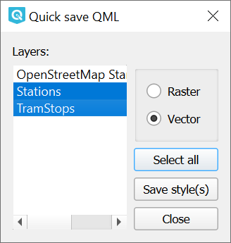

Quickly save default QML
========================

QGIS plugin "Quickly save default QML" allows to instantly save the layer's style to the folder where the layer is stored.

Supports group saving of vector and raster styles.

After installation the plugin will appear in the Plugins toolbar: |button_qmlsaveone| |button_qmlsavemulti|.

To save the style of one layer, select it in the Layers panel and press |button_qmlsaveone|. The style will be saved to the folder containing the layer under the same name as the layer.

To save styles of multiple layers at once, press |button_qmlsavemulti|. Then in the plugin dialog (:numref:`quicksaveqml_multi_pic`) select the layers and press **Save style(s)**.

   Saving multiple styles with Quickly save default QML plugin

See how the plugin works in our video:

.. raw:: html

   <iframe width="560" height="315" src="https://www.youtube.com/embed/X23t_5eWdoA?si=_PXRYQ8qIp2hr6By" title="YouTube video player" frameborder="0" allow="accelerometer; autoplay; clipboard-write; encrypted-media; gyroscope; picture-in-picture; web-share" referrerpolicy="strict-origin-when-cross-origin" allowfullscreen></iframe>

Watch on `youtube <https://youtu.be/X23t_5eWdoA?si=Vt5IsRfHmn4yHF5B>`_.
