.. sectionauthor:: Дмитрий Барышников <dmitry.baryshnikov@nextgis.ru>

.. _ngqgis_raster_op:


Работа с растровыми данными
============================

В этом разделе описывается вопросы визуализиции и определения свойств растрового слоя. 
QGIS использует библиотеку GDAL для чтения и записи растровых форматов. 
Растр поддержка GRASS поставляется нативной QGIS плагин поставщика данных. Растровые 
данные также могут быть загружены в режиме чтения из почтового индекса и GZIP архивов в QGIS.

Перечисленные операции выполняются модулем gdalTools. По умолчанию он установлен. 
Если вы не находите этих пунктов в меню, установите и включите этот модуль.
Модуль предоставляет интерфейс к консольным утилитам gdal.

Проекции
--------

Растровая операция запускается через меню Растр - пункт меню Проекция.

Перепроецирование
^^^^^^^^^^^^^^^^^^^

Операция запускается через меню Растр - пункт меню Проекция - Перепроецирование:

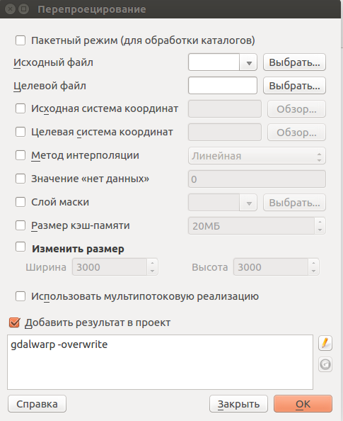
 
   Инструмент для работы с растровыми данными - Перепроецирование.

Пересохраняет растр в другую поддерживаемую проекцию. Есть возможность пакетной обработки. 
Полное описание параметров - в описании утилиты http://www.gdal.org/gdalwarp.html

Назначить проекцию
^^^^^^^^^^^^^^^^^^^^

Операция запускается через меню Растр - пункт меню Проекция - Назначить проекцию:

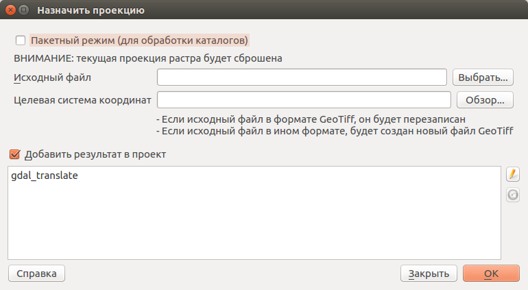
 
   Инструмент для работы с растровыми данными - Назначить проекцию.

Привязать проекцию к растру, если он уже геопривязан, но отсутствует информация о проекции. <!-- Also with its help, it is possible to alter existing projection definitions.  -->
Есть возможность пакетной обработки. 

Извлечение проекцию
^^^^^^^^^^^^^^^^^^^^

Операция запускается через меню Растр - пункт меню Проекция - Извлечь проекцию:


 
   Инструмент для работы с растровыми данными - Извлечь проекцию.

Создаёт wld-файл или prj-файл для заданного растра. Требует указания расположения 
файла на диске. Есть возможность пакетной обработки. 

Преобразование 
--------------

Операция запускается через меню Растр - пункт меню Преобразование.

Растеризация (вектор в растр)
^^^^^^^^^^^^^^^^^^^^^^^^^^^^^^^^^^^^

Операция запускается через меню Растр - пункт меню Преобразование - Растеризация (вектор в растр):

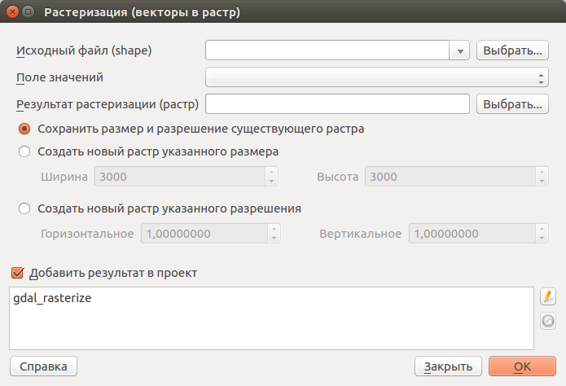
 
   Инструмент для работы с растровыми данными - Растеризация (вектор в растр).

Используется для переноса векторных данных (точки, линии, полигоны) в растровый файл. 
Векторные данные берутся из OGR-совместимого источника данных, и должны быть в той 
же системе координат, что и растр. Перепроецирование «на лету» не предусмотрено (на базе gdal_rasterize).
Значения растра берутся из заданого числового атрибута.

Для примера покажем генерацию индексированного растра с данными землепользования из Openstreetmap.

1. Заходим на http://overpass-turbo.eu
2. В Wizzard вводим запрос "landuse=*". Генерируется запрос, который выдаёт полигоны с тегом landuse
3. Выполняем запрос, сохраняем результат в GeoJSON.
4. Открываем geojson в NextGIS QGIS.
5. Генерируем в векторном слое числовое поле, значение которого запишется в растр. В калькуляторе полей выбираем создание нового поля, и вводим выражение

```
CASE 
WHEN  "landuse"='residential'  THEN 10 
WHEN  "landuse"='industrial'  THEN 20 
WHEN  "landuse"='farmland'    THEN 30 
END
```

6. Запускаем инструмент Растр - Преобразование - Растеризация (вектор в растр).
7. Этот инструмент создаёт GeoTIFF.

Векторизация (растр в вектор) 
^^^^^^^^^^^^^^^^^^^^^^^^^^^^^^^^^^^^

Операция запускается через меню Растр - пункт меню Преобразование - Векторизация (растр в векторы):

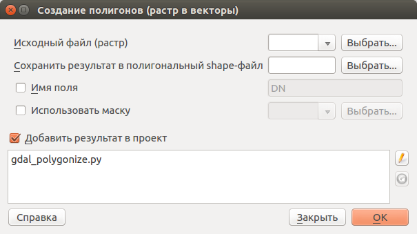
 
   Инструмент для работы с растровыми данными - Векторизация (растр в векторы).

Используется для создание векторных полигонов для всех соседних пикселей растра, имеющих 
один и тот же цвет (значение). Для каждого полигона в атрибутивную таблицу записывается 
соответствующее значение растра. Используя растровую маску, можно задать область для обработки 
(на базе gdal_polygonize).

Преобразовать формат
^^^^^^^^^^^^^^^^^^^^^^^^^

Операция запускается через меню Растр - пункт меню Преобразование - Преобразовать формат:

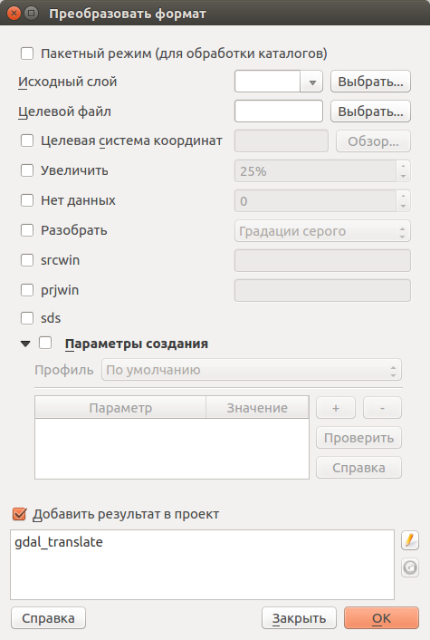
 
   Инструмент для работы с растровыми данными - Преобразовать формат.

Конвертация растровых файлов между форматами. Возможно изменение системы координат, 
сжатие, задание значения NO_DATA.

Есть возможность пакетной обработки. 

Эта операция подойдёт вам если нужно преобразовать GeoTIFF в JPEG (не в TIFF c сжатием JPEG, а в файл с расширением jpg, в диалоге экспорта растрового слоя можно сохранять только в GeoTIFF). Так же тут можно сжать GeoTIFF в JPEG.

RGB-изображение в PCT
^^^^^^^^^^^^^^^^^^^^^^^^^

Операция запускается через меню Растр - пункт меню Преобразование - Преобразовать 
RGB-изображение в индексированное:

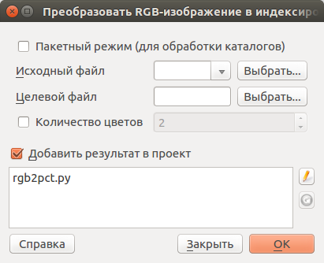
 
   Инструмент для работы с растровыми данными - Преобразовать RGB-изображение в индексированное.

Преобразование из цветового пространства RGB в индексированные цвета. Производится 
расчёт оптимального соответствия цветов, либо можно задать вручную количество вариантов 
цвета. Выполняется dithering. , работает пофайлово и в пакетном режиме.
Полное описание - на https://www.gdal.org/rgb2pct.html


PCT в RGB-изображение
^^^^^^^^^^^^^^^^^^^^^^^^^

Операция запускается через меню Растр - пункт меню Преобразование - Преобразовать 
индексированное изображение в RGB-изображение:

.. figure:: _static/ngqgis_transformation_of_a_raster_into_a_color_space.png
   :align: center
   :width: 12cm
 
   Инструмент для работы с растровыми данными - Преобразовать индексированное изображение в RGB-изображение.

Преобразование растра с индексированными цветами в цветовое пространство RGB. Работает 
пофайлово и в пакетном режиме (использует pct2rgb).
Полное описание - наhttps://www.gdal.org/pct2rgb.html

Извлечение
----------

Операция запускается через меню Растр - пункт меню Извлечение.

Создать изолинии
^^^^^^^^^^^^^^^^^^^^^^^

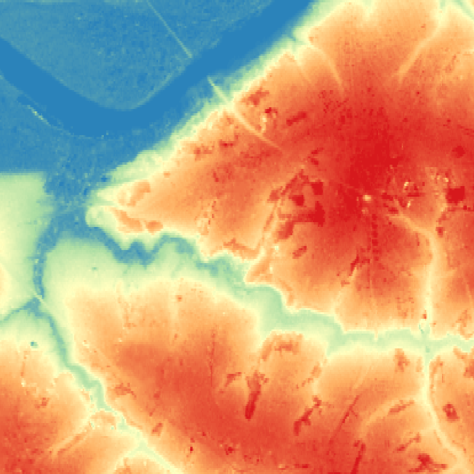
 
 
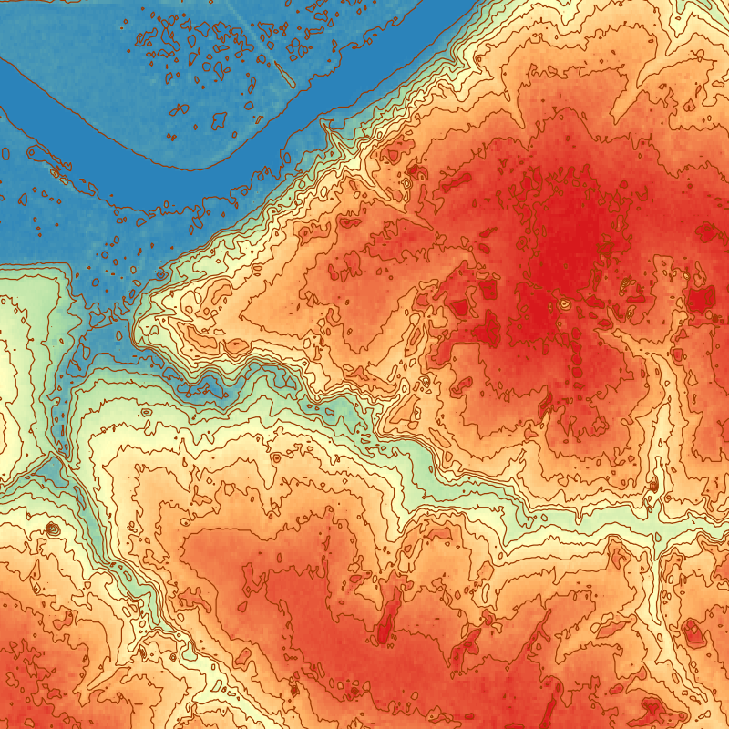
   
   Инструмент для работы с растровыми данными - Создать изолинии.

Операция запускается через меню Растр - пункт меню Извлечение - Создать изолинии:

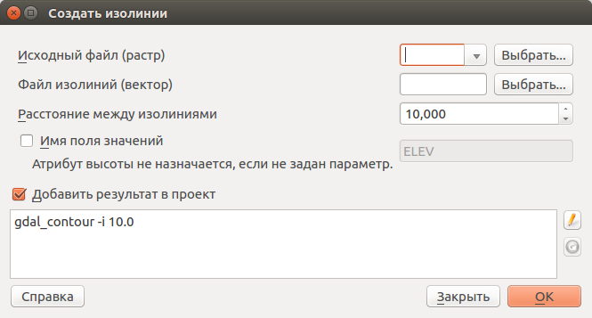
 
   Инструмент для работы с растровыми данными - Создать изолинии.

Построение изолиний. Генерация изолиний по цифровой модели рельефа (DEM) (на базе gdal_contour, см https://www.gdal.org/gdal_contour.html).

Обрезка
^^^^^^^^^^^^^^^^^^^^^^^

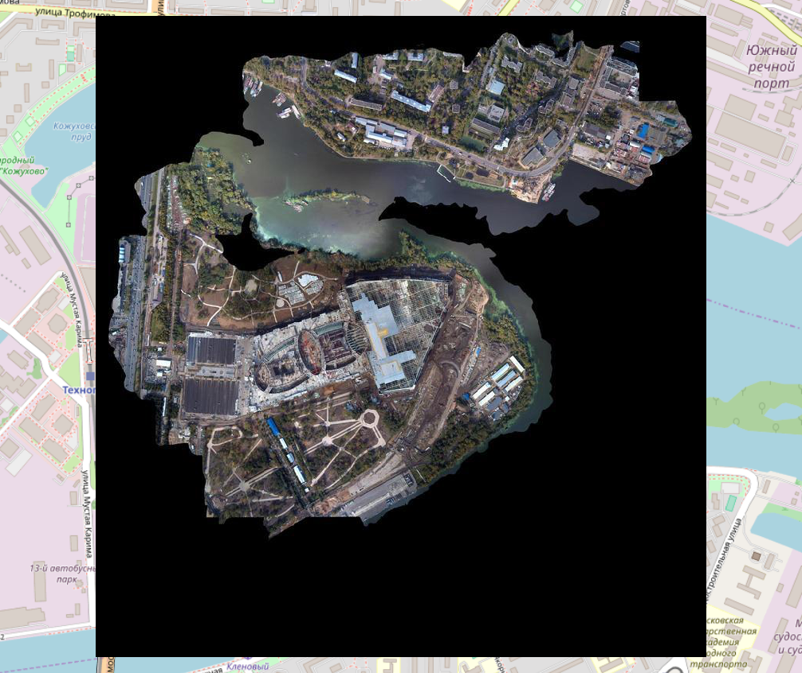
 

.. figure:: _static/ngqgis_pruning_example2.png
   :align: center
   :width: 8cm
 
 
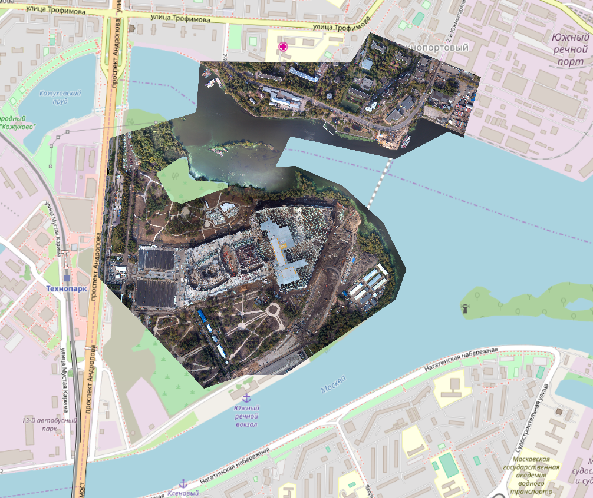
 
Операция запускается через меню Растр - пункт меню Извлечение - Обрезка:

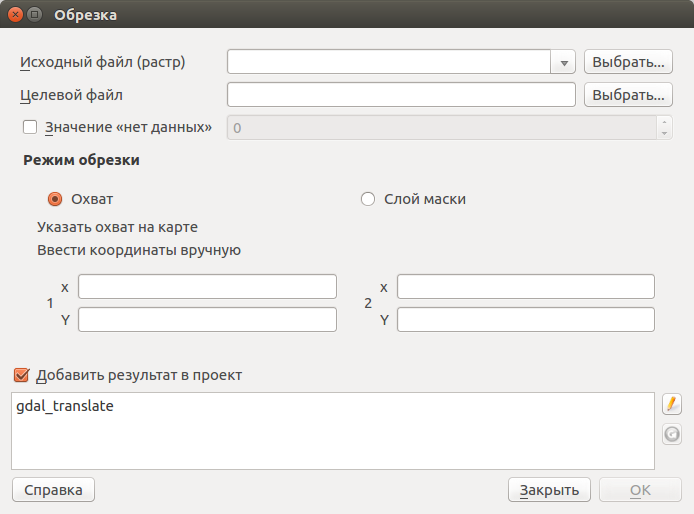
 
   Инструмент для работы с растровыми данными - Обрезка.

Обрезает растр векторным слоем (по маске) или по 4 координатам, или по выделенному на карте 
прямоугольнику.

Для выделения прямоугольника: нажмите Shift и левую клавишу мыши, проведите ей по 
карте. Выделение прямоугольником имеет смысл, только если в окне QGIS выставлена 
та же проекция, что у самого растра.

Для обрезки по маске нужен полигональный слой в той же системе координат, что и растр. В полигоне могут быть дыры и части. Из слоя маски будет использован только первый объект.
Если вы не уверены, нужно ли вам включать генерацию альфа-канала, то включите её.
Полное описание параметров - в описании утилиты http://www.gdal.org/gdal_translate.html

Если вам нужно обрезать растр, например космоснимок по сложной границе, то нужно:

1. Узнать систему координат растрового файла: Свойства слоя --> Общие, посмотреть какая система координат подхватилась из файла.
2. Нарисовать слой: Слой --> Создать временный слой. Выберите ту же систему координат что и у растра, тип геометрии - мультиполигон. Нарисуйте маску. 
3. Сохраните слой маски в формат ESRI Shapefile с той же системой координат, что и растр. (geopackage он не может использовать)
4. Запустите Растр --> Извлечение --> Обрезка, выберите растр, Слой обрезки - ваш новый слой, включите "Создать Альфа-канал" и "Охват целевого слоя по линии обрезки"

Файл после обрезки может получиться слишком большого размера на диске. В этом окне нельзя задавать опции сохранения и сжатия, поэтому в таком случае вам нужно или запустить обрезку из консоли с указанием  -co COMPRESS=JPEG -co PHOTOMETRIC=YCBCR , либо потом обработать получившийся растр операцией "Преобразовать формат".


Анализ
------

Операция запускается через меню Растр - пункт меню Анализ.

Отсеивание
^^^^^^^^^^^^^^^^

Операция запускается через меню Растр - пункт меню Анализ - Отсеивание:

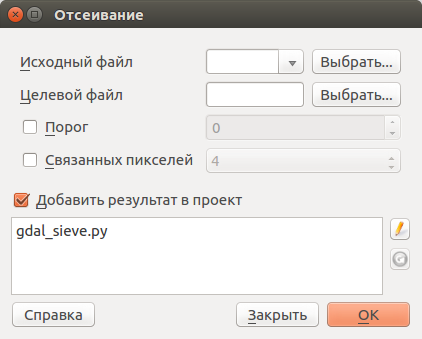
 
   Инструмент для работы с растровыми данными - Отсеивание.

Находит растровые полигоны с размером меньше заданного порога (в пикселях) и заменяет 
их на значение, соответствующее наибольшему соседнему растровому полигону. Результат 
отсеивания может быть записан как в существующий, так и в новый файл (использует gdal_sieve).

Сбросить в черный 
^^^^^^^^^^^^^^^^^^^^^^^^

Операция запускается через меню Растр - пункт меню Сбросить в черный:

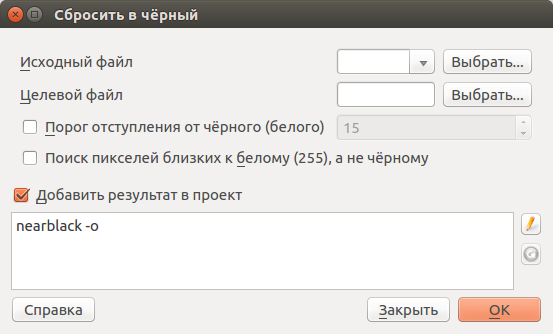
 
   Инструмент для работы с растровыми данными - Сбросить в черный.

Cканирование изображение и замена почти черных (или почти белых) пикселей возле 
рамки на пиксели с точным значением цвета. Часто используется для «коррекции» аэрофотоснимков, 
сжатых с потерями, чтобы можно было задать прозрачный цвет при создании мозаики 
(использует nearblack).

Заполнение пустот
^^^^^^^^^^^^^^^^^^^^^^

Операция запускается через меню Растр - пункт меню Заполнение пустот:

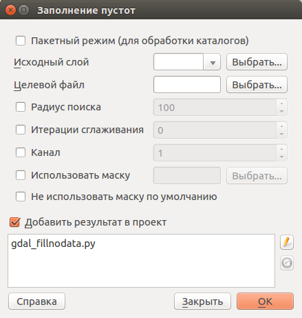
 
   Инструмент для работы с растровыми данными - Заполнение пустот.

Находит пустые растровые полигоны (обычно области NODATA) и заполняет их интерполяцией 
значений от краёв этого полигона.

Карта близости (расстояния в растре)
^^^^^^^^^^^^^^^^^^^^^^^^^^^^^^^^^^^^^^^^^^^

Операция запускается через меню Растр - пункт меню Карта близости (расстояния в растре):

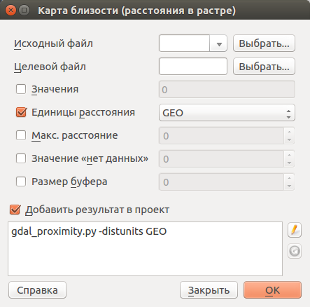
 
   Инструмент для работы с растровыми данными - Карта близости (расстояния в растре).

Строит карту близости растра, в которой указаны расстояния от центра каждого пикселя 
к центру ближайшего целевого пикселя. Целевыми пикселями будут все пиксели исходного растра, 
значения которых попадают в набор указанных величин (использует gdal_proximity).

Сетка (интерполяция)
^^^^^^^^^^^^^^^^^^^^^^^^^^^^^^^^^^^^^^^^^^^^^^

Операция запускается через меню Растр - пункт меню Сетка (интерполяция):

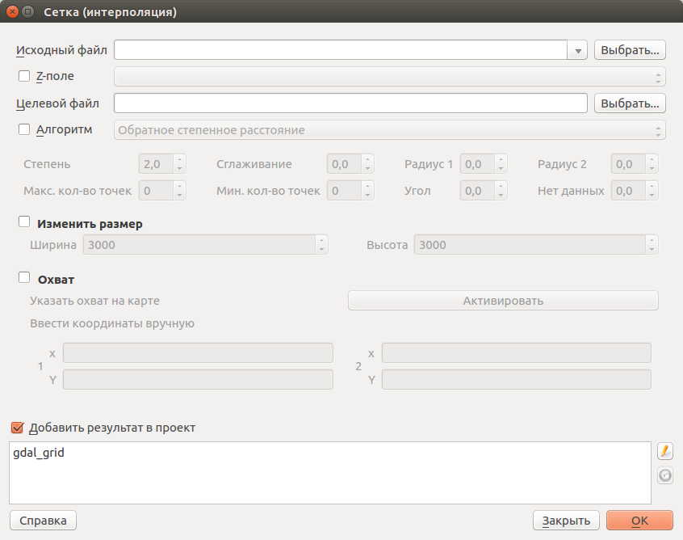
 
   Инструмент для работы с растровыми данными - Сетка (интерполяция).

Создает регулярную сетку (растр) на основе рассеяных данных, полученных из OGR-совместимого 
источника. Исходные даные будут интерполированы одним из доступных методов для получения 
значений узлов (на базе gdal_grid).

DEM (Анализ рельефа)
^^^^^^^^^^^^^^^^^^^^^^^^^^^^^^^^^^^^^^^^^^^^^^

Операция запускается через меню Растр - пункт меню Анализ рельефа:

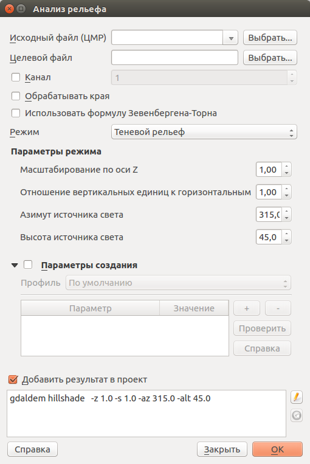
 
   Инструмент для работы с растровыми данными - Анализ рельефа.

Создаёт новый растр на основе имеющегося растра с цифровой моделью рельефа (DEM).
Может строить:

1. Теневой рельеф.
2. Угол уклонов.
3. Экспозиция.
4. Цветной рельеф. 
5. Индекс пересечённости (TRI).
6. Индекс превышения (TPI).
7. Пересечённость.

Обращайте внимание на системы координат ваших файлов с ЦМР при работе с этим инструментом. Файлы с SRTM или ASTER распространяются в EPSG:4326, с единицами измерения координат в градусах, а высота у них записана в метрах, и может быть что некоторые алгоритмы, например расчёта угла уклонов, выдадут вам неверные значения. Тогда нужно перепроецировать ЦМР во что-нибудь с метрами, например WGS 84/UTM Zone...

Прочее
------

Операция запускается через меню Растр - пункт меню Прочее.

Создать виртуальный растр (каталог)
^^^^^^^^^^^^^^^^^^^^^^^^^^^^^^^^^^^^^^^^

Операция запускается через меню Растр - пункт меню Прочее - Создать виртуальный растр (каталог):

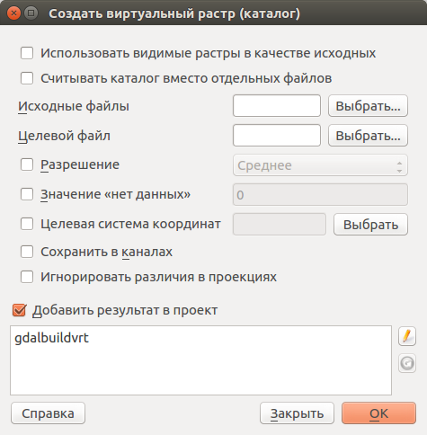
 
   Инструмент для работы с растровыми данными - Создать виртуальный растр (каталог).

Создаёт файл VRT - в нём находятся ссылки на отдельные растровые файлы, а сам файл VRT 
используется как один растровый слой.

Объединение
^^^^^^^^^^^^^^^^^^^^^^^^^^^^^^^^^^^^^^^^

Операция запускается через меню Растр - пункт меню Прочее - Объединение:

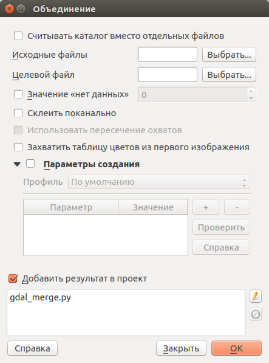
 
   Инструмент для работы с растровыми данными - Объединение.

Склеивает несколько растровых файлов в один. Требует указания файлов.
При настройке Склеить поканально, создает один растровый файл, где каждый исходный 
файл будет отдельным слоем.

Информация
^^^^^^^^^^^^^^^^^^^^^^^^^^^^^^^^^^^^^^^^

Операция запускается через меню Растр - пункт меню Прочее - Информация:

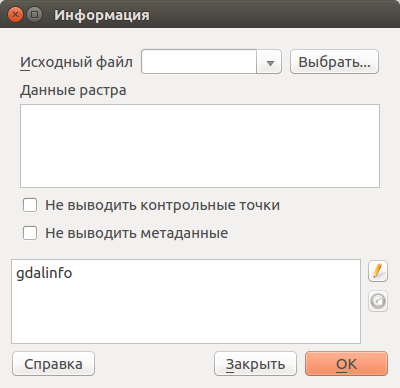
 
   Инструмент для работы с растровыми данными - Информация.

Выводит на экран вывод утилиты gdalinfo для заданного слоя. В этой информации пишется 
система координат и охват слоя.

Построить пирамиды
^^^^^^^^^^^^^^^^^^^^^^^^^^^^^^^^^^^^^^^

Операция запускается через меню Растр - пункт меню Прочее - Построить пирамиды:

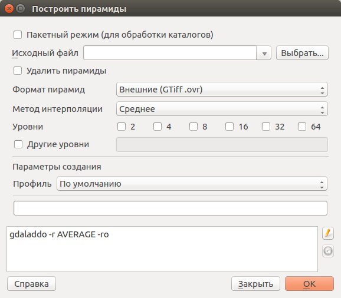
 
   Инструмент для работы с растровыми данными - Построить пирамиды.

Используется для создания или восстановления уменьшенных копий изображения (пирамид). 
Наличие пирамид несколько увеличивает скорость отрисовки растра. Может работать 
пофайлово и в пакетном режиме, использует gdaladdo.
То же самое, что построение пирамид в настройках растрового слоя, но может работать пакетно.

Индекс мозаики растров
^^^^^^^^^^^^^^^^^^^^^^^^^^^^^^^^^^^^^^^^

Операция запускается через меню Растр - пункт меню Прочее - Индекс мозаики растров:

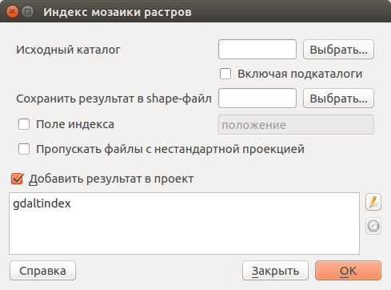
 
   Инструмент для работы с растровыми данными - Индекс мозаики растров.

Строит Shape-файл с границами растров и названиями файлов в атрибутах.
