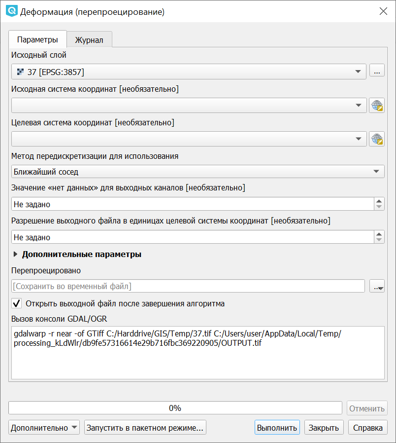
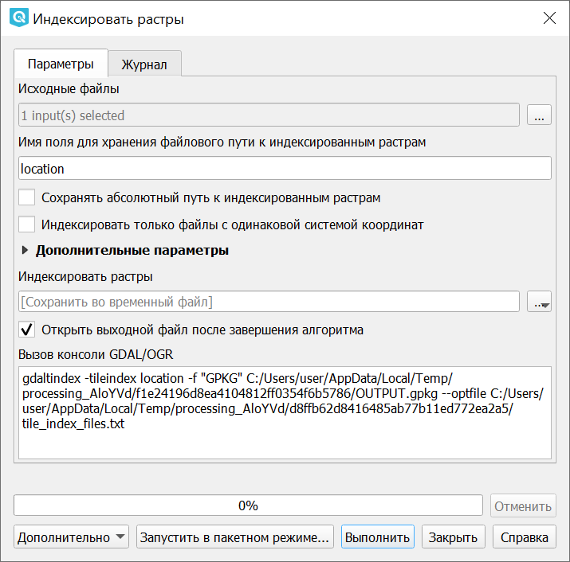

.. sectionauthor:: Дмитрий Барышников <dmitry.baryshnikov@nextgis.ru>

.. _ngqgis_raster_op:

Работа с растровыми данными
============================

В этом разделе описывается вопросы визуализиции и определения свойств растрового слоя. 
QGIS использует библиотеку GDAL для чтения и записи растровых форматов. 
Растр поддержка GRASS поставляется нативной QGIS плагин поставщика данных. Растровые 
данные также могут быть загружены в режиме чтения из почтового индекса и GZIP архивов в QGIS.

Перечисленные операции выполняются модулем gdalTools. По умолчанию он установлен. 
Если вы не находите этих пунктов в меню, установите и включите этот модуль.
Модуль предоставляет интерфейс к консольным утилитам gdal.

Калькулятор растров
---------

Командная строка с синтаксисом NumPy. Можно использовать любые поддерживаемые арифметические операторы, такие как +, -, *, и /, а также логические операторы, например >. 

   
   Окно калькулятора растров

Совместить растры
--------

Операция запускается через меню Растр ‣ Совместить растры.

   
   Окно инструмента "Совместить растры"

В открывшемся диалоговом окне нужно добавить растровые слои, которые будут объединены. При добавлении слоя выбирается метод передискретизации.

   
   Выбор параметров добавляемого растрового слоя

Из добавленных растровых слоев нужно выбрать опорный.

Привязка растров
---------

Запускается через меню Растр ‣ Привязка растров

.. figure:: _static/ngqgis_privyazka_ru.png
   :align: center
   :width: 14cm
   
   Окно инструмента "Привязка растров"

Проекции
--------

Операции работы с проекциями запускаются через меню Растр ‣ Проекции.

Перепроецирование
^^^^^^^^^^^^^^^^^^^

Операция запускается через меню Растр  ‣ Проекции ‣ Перепроецирование:

 
   Инструмент для работы с растровыми данными - Перепроецирование

Пересохраняет растр в другую поддерживаемую проекцию. Есть возможность пакетной обработки. 
Полное описание параметров - в описании утилиты http://www.gdal.org/gdalwarp.html

Назначить проекцию
^^^^^^^^^^^^^^^^^^^^

Операция запускается через меню Растр  ‣ Проекции ‣ Назначить проекцию:

 
   Инструмент для работы с растровыми данными - Назначить проекцию

Привязать проекцию к растру, если он уже геопривязан, но отсутствует информация о проекции. Также с помощью этого инструмента можно поменять текущую проекцию.
Есть возможность пакетной обработки. 

Извлечение проекции
^^^^^^^^^^^^^^^^^^^^

Операция запускается через меню Растр ‣ Проекции ‣ Извлечь проекцию:

 
   Инструмент для работы с растровыми данными - Извлечь проекцию

Создаёт wld-файл или prj-файл для заданного растра. Есть возможность пакетной обработки. 

Преобразование 
--------------

Операция запускается через меню Растр ‣ Преобразование.

Растеризация (вектор в растр)
^^^^^^^^^^^^^^^^^^^^^^^^^^^^^^^^^^^^

Операция запускается через меню Растр ‣ Преобразование ‣ Растеризация (вектор в растр):

 
   Инструмент для работы с растровыми данными - Растеризация (вектор в растр)

Используется для переноса векторных данных (точки, линии, полигоны) в растровый файл. 
Векторные данные берутся из OGR-совместимого источника данных, и должны быть в той 
же системе координат, что и растр. Перепроецирование «на лету» не предусмотрено (на базе gdal_rasterize).
Значения растра берутся из заданого числового атрибута.

Для примера покажем генерацию индексированного растра с данными землепользования из Openstreetmap.

1. Заходим на http://overpass-turbo.eu
2. В Wizzard вводим запрос "landuse=*". Генерируется запрос, который выдаёт полигоны с тегом landuse
3. Выполняем запрос, сохраняем результат в GeoJSON.
4. Открываем geojson в NextGIS QGIS.
5. Генерируем в векторном слое числовое поле, значение которого запишется в растр. В калькуляторе полей выбираем создание нового поля, и вводим выражение

``CASE 
WHEN  "landuse"='residential'  THEN 10 
WHEN  "landuse"='industrial'  THEN 20 
WHEN  "landuse"='farmland'    THEN 30 
END``

6. Запускаем инструмент Растр - Преобразование - Растеризация (вектор в растр).
7. Этот инструмент создаёт GeoTIFF.

Векторизация (растр в вектор) 
^^^^^^^^^^^^^^^^^^^^^^^^^^^^^^^^^^^^

Операция запускается через меню Растр ‣ Преобразование ‣ Векторизация (растр в векторы):

 
   Инструмент для работы с растровыми данными - Векторизация (растр в векторы)

Используется для создание векторных полигонов для всех соседних пикселей растра, имеющих 
один и тот же цвет (значение). Для каждого полигона в атрибутивную таблицу записывается 
соответствующее значение растра. Используя растровую маску, можно задать область для обработки 
(на базе gdal_polygonize).

Преобразовать формат
^^^^^^^^^^^^^^^^^^^^^^^^^

Операция запускается через меню Растр ‣ Преобразование ‣ Преобразовать формат:

 
   Инструмент для работы с растровыми данными - Преобразовать формат

Конвертация растровых файлов между форматами. Возможно изменение системы координат, 
сжатие, задание значения NO_DATA.

Есть возможность пакетной обработки. 

Эта операция подойдёт вам если нужно преобразовать GeoTIFF в JPEG (не в TIFF c сжатием JPEG, а в файл с расширением jpg, в диалоге экспорта растрового слоя можно сохранять только в GeoTIFF). Так же тут можно сжать GeoTIFF в JPEG.

RGB-изображение в PCT
^^^^^^^^^^^^^^^^^^^^^^^^^

Операция запускается через меню Растр ‣ Преобразование ‣ RGB в PCT:

 
   Инструмент для работы с растровыми данными - Преобразовать RGB-изображение в индексированное

Преобразование из цветового пространства RGB в индексированные цвета. Производится 
расчёт оптимального соответствия цветов, либо можно задать вручную количество вариантов 
цвета. Выполняется dithering. , работает пофайлово и в пакетном режиме.
Полное описание - на https://www.gdal.org/rgb2pct.html

PCT в RGB-изображение
^^^^^^^^^^^^^^^^^^^^^^^^^

Операция запускается через меню Растр ‣ Преобразование ‣ PCT в RBG:

 
   Инструмент для работы с растровыми данными - Преобразовать индексированное изображение в RGB-изображение

Преобразование растра с индексированными цветами в цветовое пространство RGB. Работает 
пофайлово и в пакетном режиме (использует pct2rgb).
Полное описание - на https://www.gdal.org/pct2rgb.html

Извлечение
----------

Запускается через меню Растр ‣ Извлечение.

Создать изолинии
^^^^^^^^^^^^^^^^^^^^^^^

Построение изолиний. Генерация изолиний по цифровой модели рельефа (DEM) (на базе gdal_contour, см https://www.gdal.org/gdal_contour.html).

.. figure:: _static/ngqgis_create_isolines_before.png
   :align: center
   :width: 12cm
   
   Исходный растр (одноканальное псевдоцветное изображение)
 
.. figure:: _static/ngqgis_create_isolines_after.png
   :align: center
   :width: 12cm
   
   Полученные изолинии

Операция запускается через меню Растр ‣ Извлечение ‣ Создать изолинии:

 
   Параметры создания изолиний из растра

Обрезать растр по охвату
^^^^^^^^^^^^^^^^^^^^^^^

Операция запускается через меню Растр ‣ Извлечение ‣ Обрезать растр по охвату.

В полне "Охват обрезки" можно вручную задать прямоугольник обрезки при помощи координат.

Рядом с полем "Охват обрезки" находится выпадающее меню, в котором можно выбрать один из способов обрезки растра:

**Текущий охват карты** Обрезает растр по границам видимой в окне NG QGIS части карты. Этот же вариант включается кнопкой справа от поля.

 
   Обрезка по охвату. Стрелочкой указана кнопка "Текущий охват карты"

**Указать на карте** Позволяет выделить на карте произвольный прямоугольник, по которому будет произведена обрезка. Выделение прямоугольником имеет смысл, только если в окне QGIS выставлена 
та же проекция, что у самого растра.

Обрезать растр по маске
^^^^^^^^^^^^^^^^^^^^^^^

Для обрезки по маске нужен полигональный слой в той же системе координат, что и растр. В полигоне могут быть дыры и части. Из слоя маски будет использован только первый объект.
Если вы не уверены, нужно ли вам включать генерацию альфа-канала, то включите её.
Полное описание параметров - в описании утилиты http://www.gdal.org/gdal_translate.html

.. figure:: _static/ngqgis_pruning_example1.png
   :align: center
   :width: 8cm
 

.. figure:: _static/ngqgis_pruning_example2.png
   :align: center
   :width: 8cm
 
 
.. figure:: _static/ngqgis_pruning_example3.png
   :align: center
   :width: 8cm
 

Если вам нужно обрезать растр, например космоснимок по сложной границе, то нужно:

1. Узнать систему координат растрового файла: Свойства слоя ‣ Общие, посмотреть какая система координат подхватилась из файла.
2. Нарисовать слой: Слой ‣ Создать временный слой. Выберите ту же систему координат что и у растра, тип геометрии - мультиполигон. Нарисуйте маску. 
3. Сохраните слой маски в формат ESRI Shapefile с той же системой координат, что и растр (geopackage он не может использовать).
4. Запустите Растр ‣ Извлечение ‣ Обрезать растр по маске, выберите растр, Слой обрезки - ваш новый слой, включите "Создать Альфа-канал" и "Охват целевого слоя по линии обрезки"

Файл после обрезки может получиться слишком большого размера на диске. В этом окне нельзя задавать опции сохранения и сжатия, поэтому в таком случае вам нужно или запустить обрезку из консоли с указанием  -co COMPRESS=JPEG -co PHOTOMETRIC=YCBCR , либо потом обработать получившийся растр операцией "Преобразовать формат".

Анализ
------

Операция запускается через меню Растр ‣ Анализ.

Заполнить значение "Нет данных"
^^^^^^^^^^^^^^^^^^^^^^

Операция запускается через меню Растр ‣ Анализ ‣ Заполнить значение "Нет данных":

 
   Инструмент для работы с растровыми данными - Заполнение пустот

Находит пустые растровые полигоны (обычно области NODATA) и заполняет их интерполяцией 
значений от краёв этого полигона.

Сбросить в черный 
^^^^^^^^^^^^^^^^^^^^^^^^

Операция запускается через меню Растр ‣ Анализ ‣ Сбросить в черный:

 
   Инструмент для работы с растровыми данными - Сбросить в черный

Cканирование изображение и замена почти черных (или почти белых) пикселей возле 
рамки на пиксели с точным значением цвета. Часто используется для «коррекции» аэрофотоснимков, 
сжатых с потерями, чтобы можно было задать прозрачный цвет при создании мозаики 
(использует nearblack).

Близость (расстояния в растре)
^^^^^^^^^^^^^^^^^^^^^^^^^^^^^^^^^^^^^^^^^^^

Операция запускается через меню Растр ‣ Анализ ‣ Карта близости (расстояния в растре):

 
   Инструмент для работы с растровыми данными - Близость (расстояния в растре)

Строит карту близости растра, в которой указаны расстояния от центра каждого пикселя 
к центру ближайшего целевого пикселя. Целевыми пикселями будут все пиксели исходного растра, 
значения которых попадают в набор указанных величин (использует gdal_proximity).

Отсеивание
^^^^^^^^^^^^^^^^

Операция запускается через меню Растр ‣ Анализ ‣ Отсеивание:

 
   Инструмент для работы с растровыми данными - Отсеивание.

Находит растровые полигоны с размером меньше заданного порога (в пикселях) и заменяет 
их на значение, соответствующее наибольшему соседнему растровому полигону. Результат 
отсеивания может быть записан как в существующий, так и в новый файл (использует gdal_sieve).

Интерполяция
^^^^^^^^^^^^^^^^^^^^^^^^^^^^^^^^^^^^^^^^^^^^^^

Создает регулярную сетку (растр) на основе рассеяных данных, полученных из OGR-совместимого 
источника. Исходные даные будут интерполированы одним из доступных методов для получения 
значений узлов (на базе gdal_grid).

В NGQGIS доступно несколько инструментов интерполяции:

#. Скользящее среднее
#. Метрика данных
#. Обратно-взвешенное расстояние
#. Ближайший сосед

Скользящее среднее
~~~~~

Операция запускается через меню Растр ‣ Анализ ‣ Интерполяция (скользящее среднее):

 
   Инструмент для работы с растровыми данными - Интерполяция (скользящее среднее)

Метрика данных
~~~~~

Операция запускается через меню Растр ‣ Анализ ‣ нтерполяция (метрика данных):

 
   Инструмент для работы с растровыми данными - Интерполяция (метрика данных)

Обратно-взвешенное расстояние
~~~~~

Операция запускается через меню Растр ‣ Анализ ‣ Интерполяция (обратно-взвешенное расстояние):

.. figure:: _static/ngqgis_interp_inverse_dist_power_ru.png
   :align: center
   :width: 14cm
 
   Инструмент для работы с растровыми данными - Интерполяция (обратно-взвешенное расстояние)

Ближайший сосед
~~~~~

Операция запускается через меню Растр ‣ Анализ ‣ Интерполяция (ближайший сосед):

 
   Инструмент для работы с растровыми данными - Интерполяция (ближайший сосед)

Инструменты анализа рельефа
^^^^^^^^^^^^^^^^^^^^^^^^^^^^^^^^^^^^^^^^^^^^^^

Создаёт новый растр на основе имеющегося растра с цифровой моделью рельефа (DEM).
В NGQGIS можно построить:

#. Теневой рельеф.
#. Экспозиция.
#. Пересечённость.
#. Крутизна.
#. Индекс пересечённости (TRI).
#. Индекс превышения (TPI).
#. Цветной рельеф. 

Обращайте внимание на системы координат ваших файлов с ЦМР. Файлы с SRTM или ASTER распространяются в EPSG:4326, с единицами измерения координат в градусах, а высота у них записана в метрах, и может быть что некоторые алгоритмы, например расчёта угла уклонов, выдадут вам неверные значения. Тогда нужно перепроецировать ЦМР во что-нибудь с метрами, например WGS 84/UTM Zone...

Теневой рельеф
~~~~~~~~~~~~~~

Операция запускается через меню Растр ‣ Анализ ‣ Теневой рельеф.

 
   Инструмент для работы с растровыми данными - Построение теневого рельефа.

Экспозиция
~~~~~~~~~~

Операция запускается через меню Растр ‣ Анализ ‣ Экспозиция.

Пересеченность
~~~~~~~~~~~~~

На выходе получается одноканальный растр, показывающий неровность поверхности. Вычисляется по наибольшей разнице между пикселями.

Операция запускается через меню Растр ‣ Анализ ‣ Пересеченность.

Крутизна
~~~~~~~~~~

Создает одноканальный растр, отображающий углы уклонов. Можно выбрать единицу измерения уклона, в градусах или процентах.

Операция запускается через меню Растр ‣ Анализ ‣ Крутизна.

Индекс топографического положения (TPI)
~~~~~~~~~~~~~~~~~~~~~~~~~~~~~

Операция запускается через меню Растр ‣ Анализ ‣ Индекс топографического положения (TPI)

Индекс пересеченности рельефа (TRI)
~~~~~~~~~~~~~~~~~~~~~~~

Операция запускается через меню Растр ‣ Анализ ‣ Индекс пересеченности рельефа (TRI)

Прочее
------

Операция запускается через меню Растр ‣ Прочее.

   
   Меню "Прочее"

Создать виртуальный растр (каталог)
^^^^^^^^^^^^^^^^^^^^^^^^^^^^^^^^^^^^^^^^

Операция запускается через меню Растр ‣ Прочее ‣ Создать виртуальный растр (каталог):

 
   Инструмент для работы с растровыми данными - Создать виртуальный растр (каталог).

Создаёт файл VRT - в нём находятся ссылки на отдельные растровые файлы, а сам файл VRT 
используется как один растровый слой.

Информация
^^^^^^^^^^^^^^^^^^^^^^^^^^^^^^^^^^^^^^^^

Операция запускается через меню Растр ‣ Прочее ‣ Информация:

 
   Инструмент для работы с растровыми данными - Информация

Выводит на экран вывод утилиты gdalinfo для заданного слоя. В этой информации пишется 
система координат и охват слоя.

   
   Панель просмотра результатов извлечения информации о растровом слое

Объединение
^^^^^^^^^^^^^^^^^^^^^^^^^^^^^^^^^^^^^^^^

Операция запускается через меню Растр ‣ Прочее ‣ Объединение:

 
   Инструмент для работы с растровыми данными - Объединение

Склеивает несколько растровых файлов в один. Требует указания файлов.
При включенной настройке "Поместить каждый исходный файл в отдельный канал", создает один растровый файл, где каждый исходный файл будет отдельным слоем.

Построить пирамиды
^^^^^^^^^^^^^^^^^^^^^^^^^^^^^^^^^^^^^^^

Операция запускается через меню Растр ‣ Прочее ‣ Построить пирамиды:

 
   Инструмент для работы с растровыми данными - Построить пирамиды

Используется для создания или восстановления уменьшенных копий изображения (пирамид). 
Наличие пирамид несколько увеличивает скорость отрисовки растра. Может работать 
пофайлово и в пакетном режиме, использует gdaladdo.
То же самое, что построение пирамид в настройках растрового слоя, но может работать пакетно.

Индексировать растры
^^^^^^^^^^^^^^^^^^^^^^^^^^^^^^^^^^^^^^^^

Операция запускается через меню Растр ‣ Прочее ‣ Индексировать растры:

 
   Инструмент для работы с растровыми данными - Индекс мозаики растров

Строит Shape-файл с границами растров и названиями файлов в атрибутах.
