.. sectionauthor:: Артём Светлов <artem.svetlov@nextgis.ru>

.. _raster_ref:
    
Привязка растров
===================

С помощью данного модуля расширения пользователь QGIS получает возможность привязывать растры к координатам.

Для начала работу нужно включить модуль "Привязка растров (GDAL)" в списке модулей. 

После установки модуля появится пункт меню Растр ‣ Привязка растров.

Этот плагин предоставляет графический интерфейс, в котором пользователь указывает общие опорные точки (традиционно называются gcp, ground control points) на растре и на карте в основном окне NextGIS QGIS. Так же координаты опорных точек можно вводить цифрами с клавиатуры, если на карте есть координатная сетка, и пользователь представляет её код EPSG. Затем при расчёте генерируется новый файл в формате GeoTIFF, с информацией о привязке внутри. 

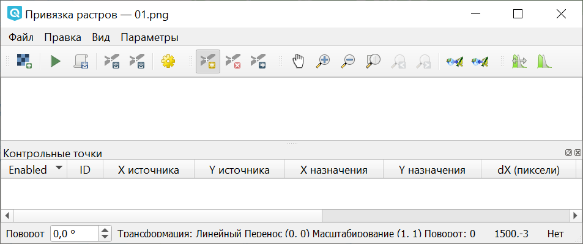
   
   Интерфейс модуля Привязка растров

Примеры операций, которые можно сделать в этом модуле
^^^^^^^^^^^^^^^^^^^^^^^^^^^^^^^^^^^^^^^^^^^^^^^^^^^^^^^^^^^

* Привязать советскую топокарту к слою openstreetmap
* Привязать топокарту с сеткой, введя её координаты с клавиатуры, это будет более точно, чем привязывать по точкам.
* Привязать 1-2 снимка поверхности с летательного аппарата по визуальным ориентирам.
* Допривязать полученный из другого софта ортофотоплан к точной карте. 
* Привязать сфотографированную распечатку карты OSM с отметками ручкой, что бы потом оцифровать эти отметки.
* Привязать древнюю карту из книги царских времён у которой нет сетки, или она в неизвестной системе координат.

Параметры трансформации
^^^^^^^^^^^^^^^^^^^^^^^^^^^^^^

Задаются в диалоговом окне, которое можно вызвать кнопкой с желтой шестеренкой |button_georef_settings| или через меню Параметры ‣ Параметры трансформации.

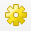

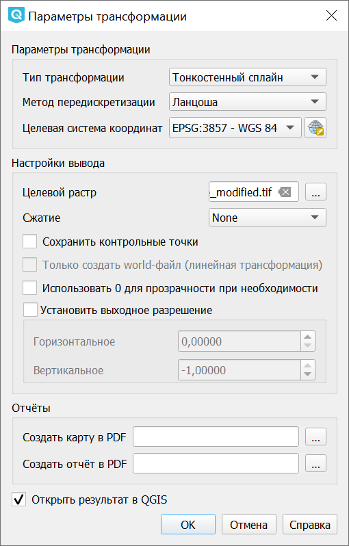
   
   Диалоговое окно Параметры трансформации

Тип трансформации
------------------

Это обозначает, каким алгоритмом будут перемещаться пикселы и растягиваться карта. Алгоритм выбирается в зависимости от комбинации проекций карт - ту в которой лежит растровая карта, и та к которой привязывается. 

Если вы не разбираетесь в проекциях, то выбирайте "Тонкостенный сплайн", этот алгоритм привяжет всё.

* Линейная - алгоритм делает только поворот, масштабирование, и skew. Этот алгоритм генерирует .world-файл, а все остальные алгоритмы генерируют новый GeoTIFF с привязкой внутри. Достаточно 3 точек. 
* Гельмерта - алгоритм делает только поворот, масштабирование, и skew. Он пригоден, если обе карты в одинаковой проекции. Например, если вы взяли карту openstreetmap, напечатали на принтере, нарисовали поверх неё ручкой новые объекты, и сфотографировали эту бумагу, то можете привязать её обратно к openstreetmap этим алгоритмом. Достаточно 3 точек.
* Полиномиальная 1-2-3 - используются для привязки бумажных карт. Чаще всего используется алгоритм Полиномиальная-2, который делает кривизну, например при привязке карт в проеции Гаусс-Крюгера к слою в Pseudo Mercator.  Полиномиальная-1 делает то, что также назвается афинным преобразованием. Для этих алгоритмов требуется большее число опорных точек.
* Тонкостенный сплайн - современный алгоритм, который позволяет делать локальные деформации, то есть разные в разных местах карты. Он самый всеядный, пригоден для привязки всего, что можно открыть как растр.
* Проективная - работает как алгоритм Гельмерта, но делает несколько больше геометрических операций. Пригоден для случая когда нужно привязать одиночное фото из летательного аппарата к карте.

Метод интерполяции
------------------

Это обозначает алгоритм масштабирования изображения, все эти алгоритмы такие же, как в графических редакторах. Разница между ними в визуальном качестве изображения, она почти всегда незаметна, только чуть-чуть изменяется размытость. 

* Ближайший сосед - быстрый алгоритм. Подойдёт для случая, когда вы долго подбираете опорные точки для тонкостенного сплайна, и хотите быстро расчитать результат и посмотреть, какая получилась невязка в этот раз.
* Линейная
* Ланцоша - обычно все используют её, потому что этот алгоритм даёт стабильные результаты независимо от вида изображения.
* Кубическая
* Кубический сплайн

Сжатие
---------

По умолчанию выбрано значение "None" - после привязки растр получается несжатый, и занимает много места на диске. 

Доступны три алгоритма сжатия без потерь:

* Deflate - сильнее всего сжимает, медленно сжимает, но распаковывается быстрее, чем LZW
* LZW - сжимает в два раза быстрее, чем Deflate, но медленнее распаковывается
* Packbits - самый быстрый, но меньше всего сжатие

После привязки вы можете запустить Растр ‣ Извлечение ‣ Обрезка, и обрезать растр по альфа-каналу, затем Растр ‣ Преобразование ‣ Преобразовать формат и сохранить его в GeoTIFF с сжатием JPEG. Это заметно уменьшит размер файлов.

Порядок действий для привязки карты
^^^^^^^^^^^^^^^^^^^^^^^^^^^^^^^^^^^^

1. Подготовьте растровый файл с картой, которую вы будете привязывать. Если она в формате .gif, то сконвертируйте её в jpeg или png используя инструмент Растр ‣ Преобразование ‣ Преобразовать формат (см http://docs.nextgis.ru/docs_ngqgis/source/raster_op.html#id9) или любой графический редактор.

Если исходный файл большой, то он долго будет рисоваться на экране. В этом случае нажмите "Параметры ‣ Свойства растра ‣ Пирамиды", выделите там в списке все строки, "тип - внешние", и нажмите "Создать пирамиды". Получится отдельный файлик с уменьшенными копиями растра, который будет использоваться автоматически для более быстрой отрисовки.

2. Откройте в QGIS карту, к которой вы будете привязывать растр. 
3. Решите, в какой системе координат нужна конечная карта. 
4. Запустите модуль привязки растров: Растр ‣ Привязка растров. Далее описываются команды модуля Привязка Растров.

5. Откройте подготовленное изображение: Файл ‣ Открыть растр.

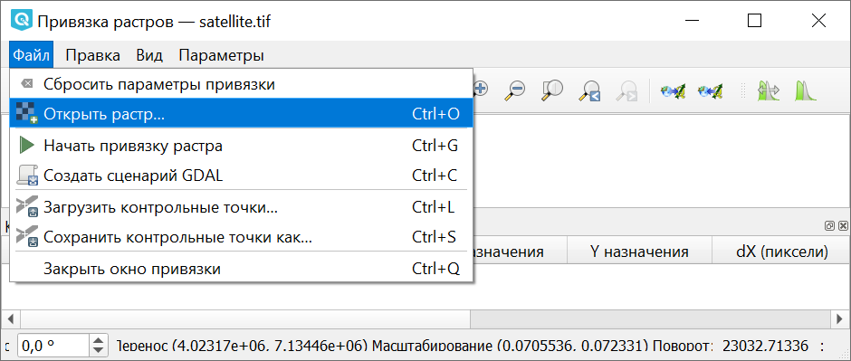
   
   Открытие растра

6. Добавьте точки. Нажмите кнопку |button_georef_add_point| на панели инструментов или выберите Правка ‣ Добавить точку. 

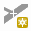

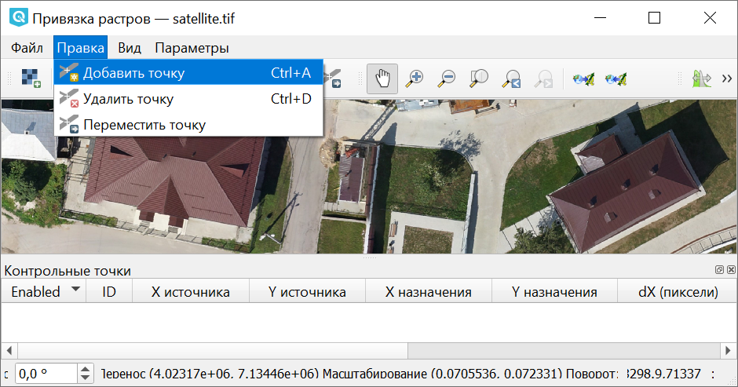
   
   Выбор команды "Добавить точку"

Поставьте точку на карту. Появится окно с полями ввода координат. В выпадающем списке систем координат выберете ту СК, которая установлена у вас в проекте.

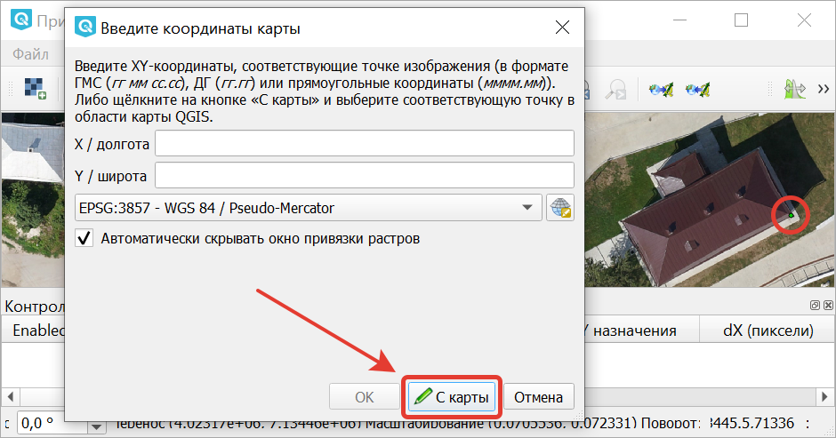
   
   Окно ввода координат при добавлении точки. Кружком отмечена добавляемая точка

Нажмите кнопку **С карты**. Откроется основное окно QGIS, поставьте точку на это же место на карту.

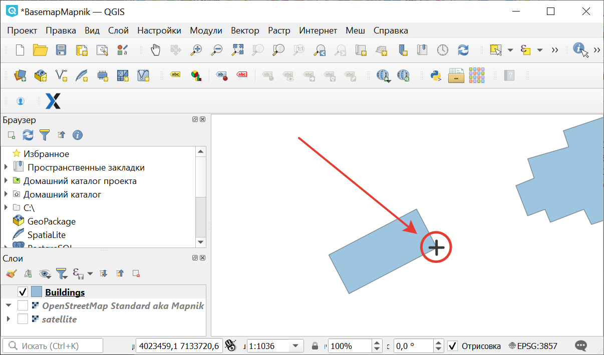
   
   Выбор соответствующей точки на карте
   
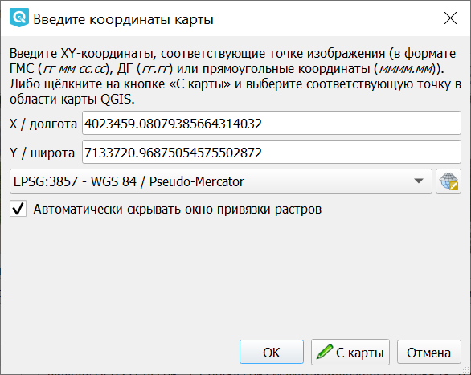
   
   Полученные с карты координаты точки

Нажмите **Ок** для завершения добавления точки.

Поставьте так для начала 3 точки. Минимально необходимое количество точек зависит от алгоритма, если их будет недостаточно, то вам выведется сообщение.

Точки можно сохранить на диск, на случай сбоев, командой "Файл ‣ Сохранить контрольные точки как". Сохраните их в путь по умолчанию, и они будут подтягиваться автоматически при следующем запуске модуля Привязки растров. 

7. Проверьте параметры трансформации, открыв "Параметры ‣ Параметры трансформации". Там можно указать путь для нового файла (по умолчанию - исходная папка), выбрать тип трансформации и метод интерполяции, целевую систему координат. 

8. Запустите привязку растра, нажав кнопку с зеленой стрелкой |button_start_georef| на панели инструментов или "Файл ‣ Начать привязку растра".

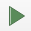

9. Добавьте трансформированный растр как новый слой. Чтобы готовый растр сразу открывался в окне QGIS, поставьте флажок **Открыть в QGIS** в параметрах трансформации.

Вы можете проанализировать невязки визуально, покрутив настройки прозрачности (например для сравнения ортофотопланов и спутниковых снимков подходит режим смешивания "Направленный свет").

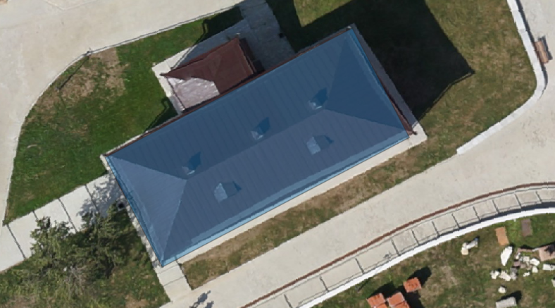
   
   Результат привязки растра

Здесь был описан процесс привязки карт по точкам. Так же можно привязвать карты по числовым координатам, см. http://docs.nextgis.ru/docs_howto/source/topo_georef.html

.. info::

   Описание утилиты gdaltransform, которая выполняет расчёты внутри этого модуля: https://www.gdal.org/gdaltransform.html
