Привязка растров
===================

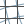

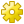

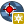

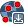

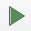

С помощью данного инструмента пользователь QGIS получает возможность привязывать растры к координатам.

Доступен в меню ``Слой ‣ Привязка растров`` |mGeorefRun|.

Этот инструмент предоставляет графический интерфейс, в котором пользователь указывает общие опорные точки (традиционно называются GCP, ground control points) на растре и на карте в основном окне NextGIS QGIS. Также координаты опорных точек можно вводить цифрами с клавиатуры, если на карте есть координатная сетка, и пользователь представляет её код EPSG. Затем при расчёте генерируется новый файл в формате GeoTIFF, с информацией о привязке внутри. 

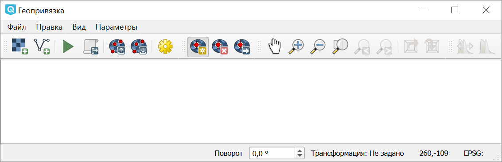
   
   Интерфейс инструмента Привязка растров

.. _raster_ref_functions:

Примеры операций
--------------------

* Привязать советскую топокарту к слою openstreetmap.
* Привязать топокарту с сеткой, `введя её координаты с клавиатуры <https://docs.nextgis.ru/docs_ngqgis/source/raster_ref.html#topo>`_, это будет более точно, чем привязывать по точкам.
* Привязать 1-2 снимка поверхности с летательного аппарата `по визуальным ориентирам <https://docs.nextgis.ru/docs_ngqgis/source/raster_ref.html#raster-ref-algorithm>`_.
* Допривязать полученный из другого софта ортофотоплан к точной карте. 
* Привязать сфотографированную распечатку карты OSM с отметками ручкой, чтобы потом оцифровать эти отметки.
* Привязать старинную карту, у которой сетка в неизвестной системе координат или отсутствует.

.. _raster_ref_param:

Параметры трансформации
------------------------------------------

Задаются в диалоговом окне, которое можно вызвать кнопкой |button_georef_settings| или через меню Параметры ‣ Параметры трансформации.

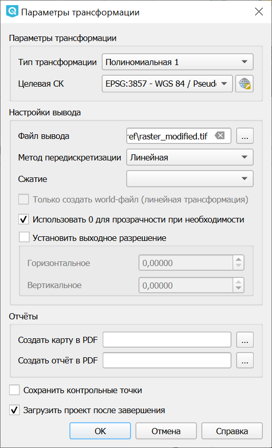
   
   Диалоговое окно Параметры трансформации

**Тип трансформации**

Указывает, каким алгоритмом будут перемещаться пиксели и растягиваться карта. Алгоритм выбирается в зависимости от того, насколько сильно отличаются проекция исходной карты и та, в которую её будут трансформировать.

Подробнее о том, чем отличаются типы трансформации и как выбрать подходящий, см. `Типы трансформации <https://docs.nextgis.ru/docs_ngqgis/source/transformations.html#transform-type>`_ 

**Метод передискретизации**

Определяет, как вычисляются значения пикселей при их распределении по новой сетке. Для индексированных растров (например, топокарт) следует использовать только алгоритм **ближайший сосед**, для цветных и многоканальных спутниковых снимков лучше всего подойдет **линейная**. Подробнее об `алгоритмах передискретизации <https://docs.nextgis.ru/docs_ngqgis/source/transformations.html#transform-resample>`_.

**Целевая система координат**

Выберите предварительно установленную СК проекта.

**Целевой растр**

Также можно указать путь для нового файла (по умолчанию - исходная папка).

**Сжатие**

По умолчанию выбрано значение "None" - после привязки растр получается несжатый, и занимает много места на диске. 

Доступны три алгоритма сжатия:

* LZW - сильное сжатие без потери информации. Быстрое сохранение в файл, но медленная распаковка. 
* Packbits - слабое сжатие без потери информации, быстрая упаковка/распаковка . Не во всем ПО работает.
* Deflate - сильное сжатие с частичной потерей исходных данных, можно использовать для картинок, но не для ЦМР. Медленно сжимает, но распаковывается быстрее, чем LZW

После привязки вы можете запустить ``Растр ‣ Извлечение ‣ Обрезка``, и обрезать растр по альфа-каналу, затем Растр ‣ Преобразование ‣ Преобразовать формат и сохранить его в GeoTIFF с сжатием JPEG. Это заметно уменьшит размер файлов.

Можно включить следующие опции:

* Сохранить контрольные точки - тогда их можно будет загрузить и попробовать другие параметры трансформации для сравнения.
* Только создать world-файл - при выборе линейной трансформации можно не изменять исходный растр, а только приложить к нему файл с информацией о том, как нужно сдвинуть изображение.
* Использовать 0 для прозрачности при необходимости
* Установить выходное разрешение

Также при трансформации можно создать **Отчет** и сохранить полученную карту в PDF.

Если отметить **Открыть результат в QGIS**, привязанный растр будет сразу добавлен в проект.

.. _georef_raster:

Подготовка растра
-------------------------------

Если карта, которую вы будете привязывать, в формате GIF, то сконвертируйте её в TIFF, JPEG или PNG, используя инструмент ``Растр ‣ Преобразование ‣ Преобразовать формат`` (`подробнее <https://docs.nextgis.ru/docs_ngqgis/source/raster_op.html#ngqgis-convert-format>`_) или любой графический редактор.

Если исходный файл большой, то он долго будет рисоваться на экране. В этом случае нажмите "Параметры ‣ Свойства растра ‣ Пирамиды", выделите в списке все строки, выберите тип "внешние", и нажмите "Создать пирамиды". Получится отдельный файлик с уменьшенными копиями растра, который будет использоваться автоматически для более быстрой отрисовки.

Привязать изображение можно двумя способами: по точкам на карте и по числовым значениям координат.

.. _raster_ref_algorithm:

Привязка растра по точкам на карте
-----------------------------------------

Этот метод используется для снимков, а также для карт, не имеющих зарамочного оформления с обозначением координат.

.. _rref_srs:

Определение системы координат
~~~~~~~~~~~~~~~~~~~~~~~~~~~~~~~

Откройте в QGIS подложку, к которой вы будете привязывать растр. Добавить подложку можно при помощи модуля `QuickMapServices <https://docs.nextgis.ru/docs_ngqgis/source/qms.html>`_.

Решите, в какой **системе координат** нужна конечная карта и `установите <https://docs.nextgis.ru/docs_ngqgis/source/srs.html#ngq-projections-setup>`_ эту систему координат для проекта. 

Распространённые подложки, такие как OpenStreetMaps, Google Maps и Yandex Maps 22, имеют проекцию Псевдомеркатор, **EPSG:3875**.

.. _rref_points:

Добавление опорных точек
~~~~~~~~~~~~~~~~~~~~~~~~

Запустите инструмент привязки растров: ``Растр ‣ Привязка растров`` |mGeorefRun|. Далее описываются команды инструмента Привязка Растров.

Откройте подготовленное изображение, нажав кнопку |mActionAddRasterLayer| или через меню ``Файл ‣ Открыть растр``.

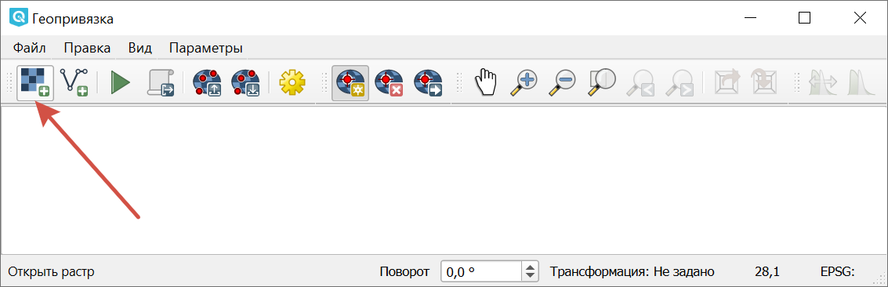
   
   Открытие растра

Добавьте точки. Нажмите кнопку |button_georef_add_point| на панели инструментов или выберите ``Правка ‣ Добавить точку``. 

При привязке ставить точки следует как можно шире, в идеале в углах карты.

В качестве опорных точек выбирайте объекты, постоянные во времени (не подойдёт береговая линия или точки впадения рек) - капитальные сооружения или асфальтовые дороги.

Поставьте точку на карту. Появится окно с полями ввода координат. 

В выпадающем списке систем координат выберете СК, которая установлена у вас в проекте.

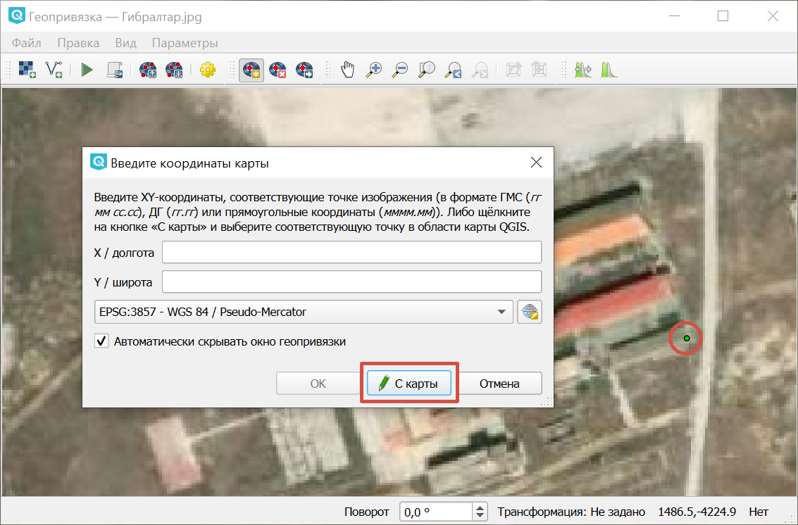
   
   Окно ввода координат при добавлении точки. Кружком отмечена добавляемая точка

Нажмите кнопку **С карты**. Откроется основное окно QGIS, поставьте точку на это же место на карте.

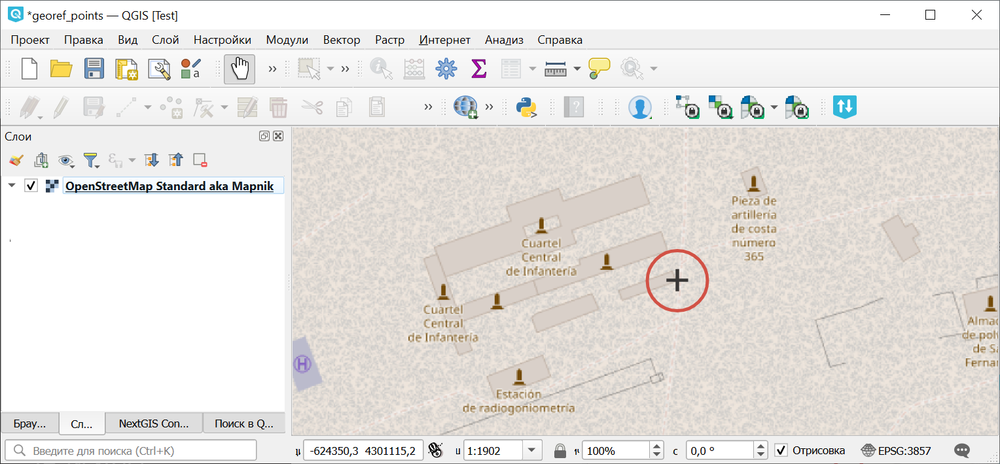
   
   Выбор соответствующей точки на карте
   
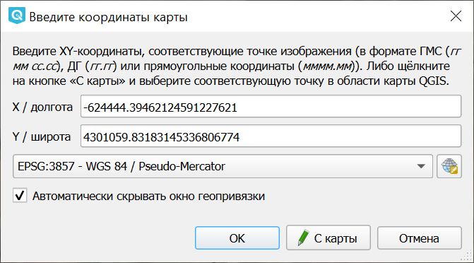
   
   Полученные с карты координаты точки

Нажмите **Ок** для завершения добавления точки.

Минимально необходимое количество точек зависит от `типа трансформации <https://docs.nextgis.ru/docs_ngqgis/source/transformations.html#transform-type>`_. Если их будет недостаточно, то появится предупреждение.

Точки можно сохранить отдельно на случай сбоев, нажав кнопку |mActionSaveGCPpointsAs| или командой "Файл ‣ Сохранить контрольные точки как". Сохраните их в путь по умолчанию, и они будут подтягиваться автоматически при следующем запуске инструмента Привязка растров. 

.. _rref_parameters:

Проверка параметров трансформации
~~~~~~~~~~~~~~~~~~~~~~~~~~~~~~~~~~~~

Проверьте параметры трансформации, нажав кнопку |button_georef_settings| или выбрав в меню ``Параметры ‣ Параметры трансформации``.

В этом окне можно указать название и путь для нового файла (по умолчанию - исходная папка). Чтобы готовый растр сразу открывался в окне QGIS, поставьте флажок **Открыть в QGIS** .

Для привязки спутниковых снимков к подложке в проекции Псевдомерактор рекомендуются следующие параметры:

* тип трансформации - Полиноминальная 1 или Проективная;
* метод интерполяции - линейная;
* система координат - EPSG:3857.

Закройте окно параметров трансформации и посмотрите на значения в колонке "Невязка (пиксели)". Допустимая невязка зависит о ряда параметров, таких как размер пикселя исходного растра, масштаб карты и др.

Можно сравнить несколько вариантов перепроецирования и посмотреть, какой даёт меньшую погрешность в точках.

Запустите привязку растра, нажав кнопку с зеленой стрелкой |button_start_georef| на панели инструментов или ``Файл ‣ Начать привязку растра``.

.. _rref_check:

Проверка результата
~~~~~~~~~~~~~~~~~~~~

Привязанный растр будет добавлен в проект (если не снят флажок `Добавить в проект после завершения <https://docs.nextgis.ru/docs_ngqgis/source/raster_ref.html#georeference-settings-pic>`_).

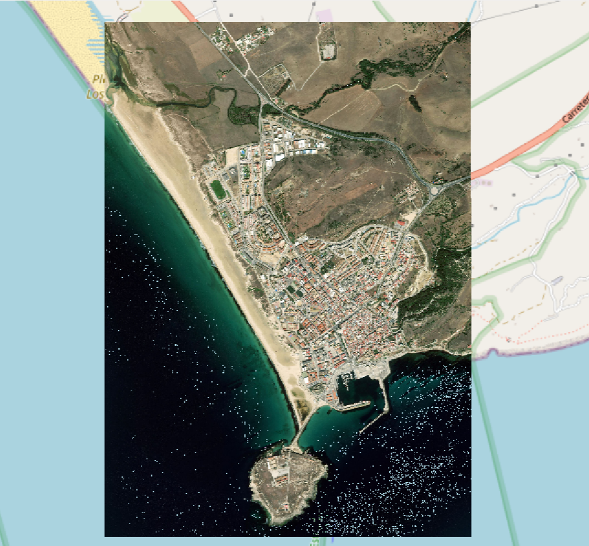
   
   Результат привязки растра

Вы можете проанализировать точность привязки визуально, изменяя настройки прозрачности и режим смешивания в свойствах слоя.

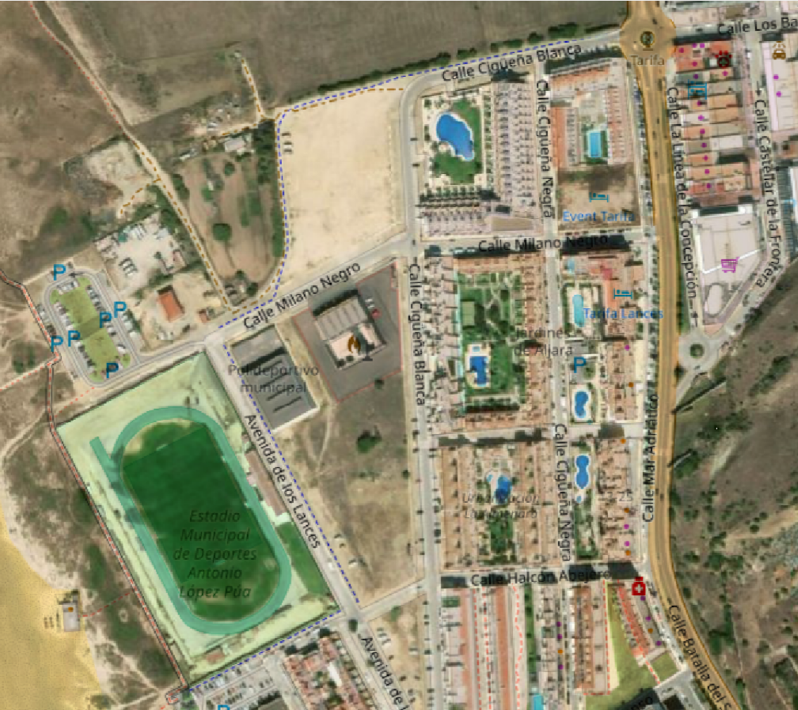

   Для спутникового снимка, наложенного на подложку OSM, выбран режим смешивания "Умножение"

Здесь был описан процесс привязки карт по точкам. Если у карты есть зарамочное оформление с отметками координат, можно привязать её по числовым координатам, см. http://docs.nextgis.ru/docs_howto/source/topo_georef.html.

.. _topo:

Привязка топокарт по координатам
----------------------------------

Привязать по координатам можно отсканированную топокарту, у которой есть зарамочное оформление.

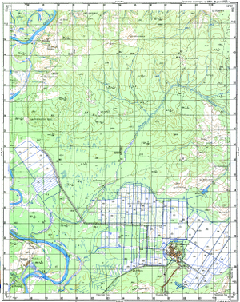

   Пример карты, подходящей для привязки по данной инструкции

.. _topo_get_coord:

Определение координат
~~~~~~~~~~~~~~~~~~~~~~~~~~~~~~~

Откройте карту в любой программе просмотра изображений.

* Координаты X (долгота) написаны за **верхней и нижней** рамками карты;
* Координаты Y (широта) - за **правой и левой**. 

Координаты могут быть записаны в градусах или в миллионах метров.

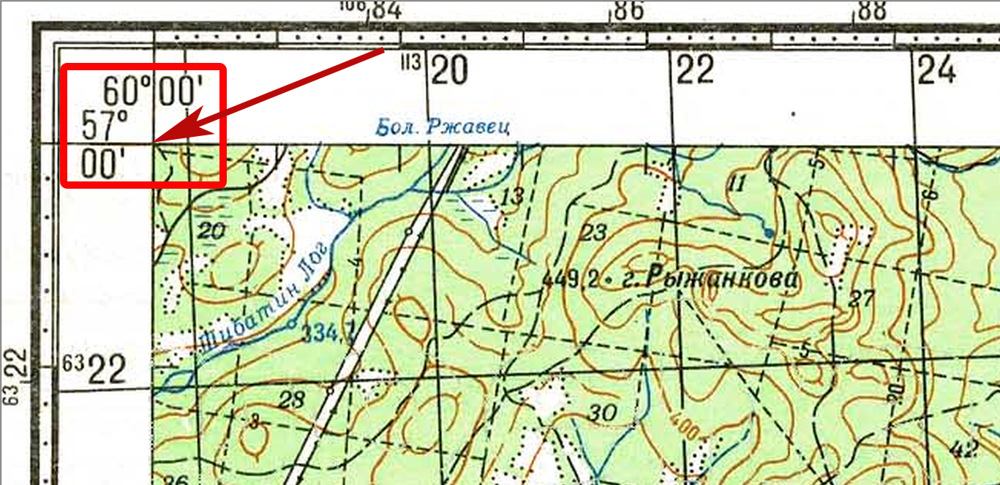

   Выделены координаты в градусах: это координаты угла карты. В данном случае долгота 60°00', широта 57°00'

Чтобы вводить координы в градусах, используйте СК Pulkovo 42 (EPSG: 4284). Также можно использовать WGS-84, но в этом случае будет некоторая погрешность из-за несовпадения эллипсоида (СК Pulkovo 42 использует эллипсоид Красовского).

Если используются миллионы метров, то вводить с клавиатуры это число нужно с тремя нулями:

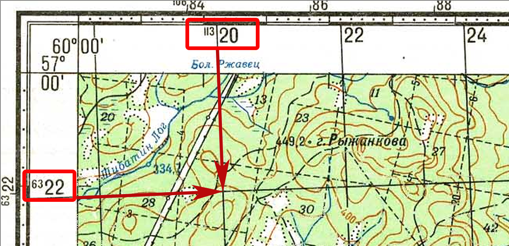

   Выделены координаты в метрах: это координаты перекрестья сетки. В данном случае X 11320000, Y 6322000

Для использования координат в метрах нужно определить `проекцию карты <https://docs.nextgis.ru/docs_ngqgis/source/raster_ref.html#topo-projection>`_.

.. _topo_projection:

Определение проекции
~~~~~~~~~~~~~~~~~~~~~~~~

Наиболее распространённые карты - позднесоветские карты Генштаба - имеют проекцию Pulkovo 1942 / Gauss-Krugger zone \* (вместо звездочки подставляется номер зоны), код EPSG:284XX, где ХХ - номер зоны. В проекции Гаусс-Крюггера земной шар разделён на зоны по мередианам через каждые 6 градусов. Чтобы узнать номер зоны, нужно приблизительно знать координаты места, изображённого на карте. 

В :program:`NextGIS QGIS` при помощи плагина `QuickMapServices <https://docs.nextgis.ru/docs_ngqgis/source/qms.html>`_ добавьте:

* схему зон Гаусс-Крюггера  ``UTM and Gauss Krueger 6 degree zones`` (также можно скачать с гис-лаба на странице http://gis-lab.info/qa/kmgrids.html, ищем ссылку "Скачать разграфку в формате: Shape");
* знакомую вам картоподложку.

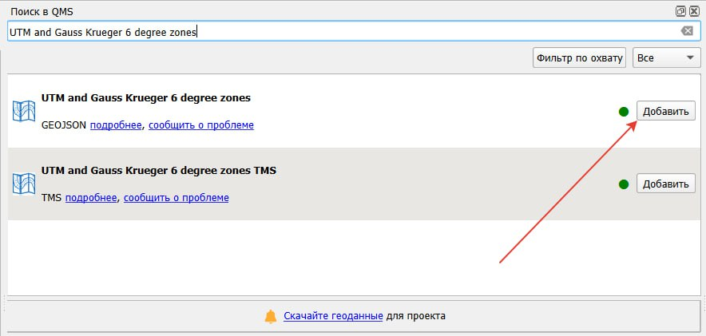

Найдите на подложке место, которое изображено на топокарте.

Номера зон UTM и Гаусс-Крюггера приведены в атрибутах файла схемы зон. Для их отображения зайдите в Cвойства слоя -> Подписи, включите отображение подписей и выберите в качестве источника подписей поле **GK**. В разделе "Стиль" сделайте заливку полупрозрачной, чтобы она не закрывала подложку.

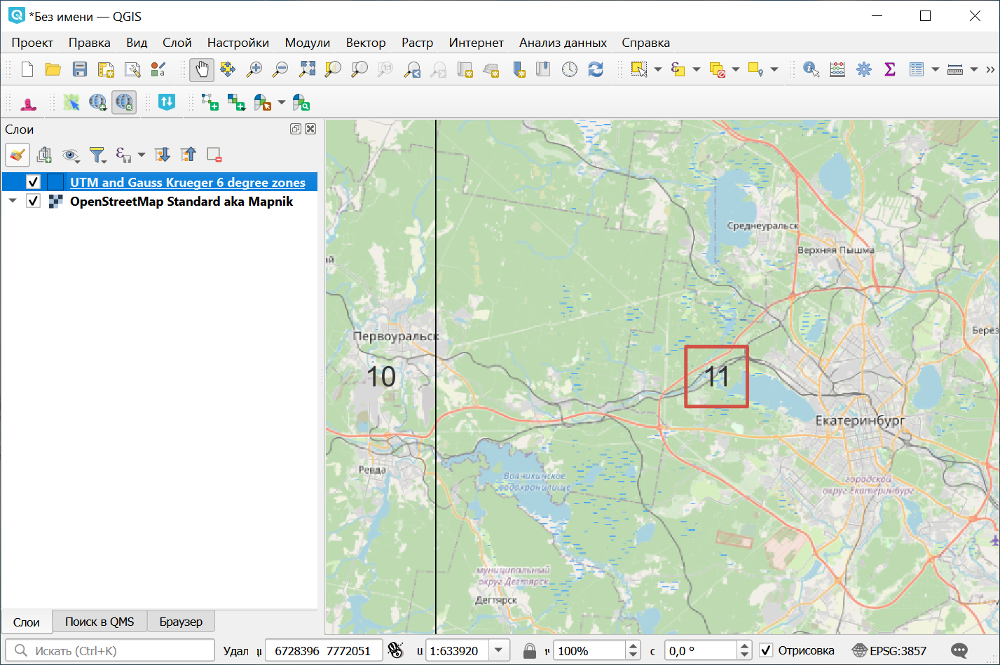

   Определение зоны в NextGIS QGIS

В примере мы взяли Свердловскую область, она попадает в зону 11, EPSG:28411.

Эту систему координат нужно будет указать в параметрах трансформации и при вводе точек.

Также может пригодиться файл **разграфки листов** для соответствующего масштаба карты.

Разграфку можно добавить через `QMS <https://docs.nextgis.ru/docs_ngqgis/source/qms.html>`_ (поиск по слову "Разграфка") или скачать на странцие http://gis-lab.info/qa/topogrids.html. 

В атрибутивной информации приведены названия листов (номенклатура). При помощи разграфки вы можете по названию листа определить, в какую зону он попадает. Также это поможет узнать, на каком листе изображено нужное вам место.

.. _topo_points:

Добавление опорных точек
~~~~~~~~~~~~~~~~~~~~~~~~~~~~~

Нажмите :menuselection:`Слой --> Привязка растров`. 

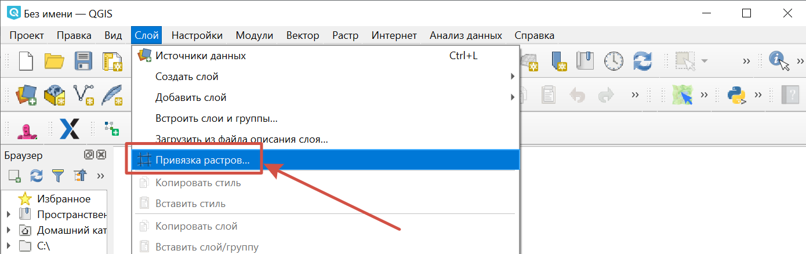

   Открытие окна привязки растров

В окне привязки растров откройте файл с отсканированной картой |mActionAddRasterLayer|. Приблизьтесь в левый верхний угол. 

Опорные точки должны быть максимально широко разнесены по краям карты, т.к. точность привязки можно гарантировать в пределах фигуры, вершинами которой они являются. Поэтому для ввода координат в метрах мы берём ближайшие к углам перекрестья.

Найдите на перекрестиях отметки метровых координат. Выберите инструмент |button_georef_add_point| **добавить точку**, нажмите на перекрестие. В открывшемся окне введите в X и Y.

.. note:: Если используются координаты в метрах, нужно добавить три нуля к числу, которое написано за рамкой.

Затем выберите координатную систему соответствующей зоны. 

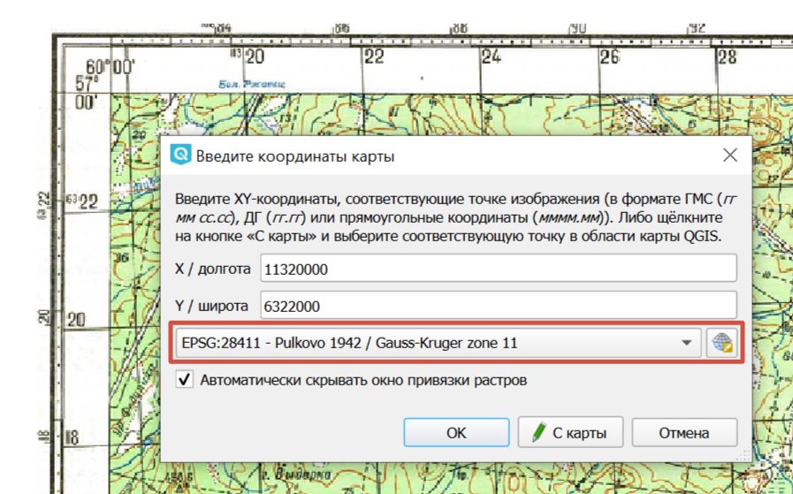
   
   Ввод координат точки

В примере мы взяли Свердловскую область, она попала в зону 11 - выставляем Pulkovo 1942 / Gauss-Kruger zone 11, EPSG:28411. В списке нужно выбрать вариант без пометки Deprecated.

Таким образом нужно ввести от 4 до 9 точек, в зависимости от `типа трансформации <https://docs.nextgis.ru/docs_ngqgis/source/transformations.html#transform-type>`_. 

* Для карт с прямоугольной проекцией рекомендуем использовать тип трансформации Полиноминальная 1, он требует 4 точки.
* Для карт с конической проекцией (у них заметно схождение меридианов) рекомендуется использовать тип трансформации Полиноминальная 2, он требует 6 точек.

.. tip:: Если СК проекта и привязываемой карты совпадают или если масштаб <50 000, можно использовать самую простую трансформацию - линейную.

.. _topo_parameters:

Проверка параметров трансформации
~~~~~~~~~~~~~~~~~~~~~~~~~~~~~~~~~~~~~~~

После того, как все опорные точки поставлены, откройте панель |button_georef_settings| Параметры трансформации.

Для топографических карт рекомендуем установить следующие параметры: 

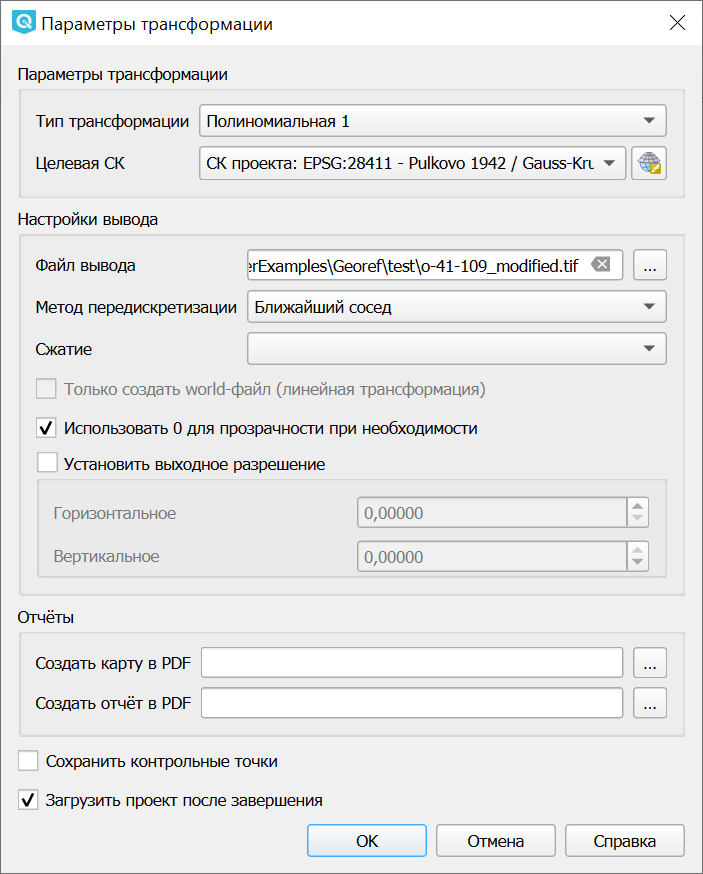

   Параметры трансформации для топокарты в прямоугольной СК

* Тип трансформации - Полиноминальная 1.
* Целевая система координат - Pulkovo 1942 / Gauss Krugger Zone - и тот номер зоны, который определили. 
* Целевой растр - имя нового GeoTIFF;
* Метод передискретизации - Ближайший сосед;
* Использовать 0 для прозрачности при необходимости;
* Сохранить контрольные точки.

.. note:: Точки также можно сохранить на диск, на случай сбоев, нажав кнопку |mActionSaveGCPpointsAs| или командой «Файл ‣ Сохранить контрольные точки как». Сохраните их в путь по умолчанию, и они будут подтягиваться автоматически при следующем запуске модуля Привязки растров.

После указания параметров трансформации нажмите ОК - на экране покажутся ошибки трансформации.

.. _topo_check:

Проверка точности
~~~~~~~~~~~~~~~~~~~~

Чтобы отобразить координаты каждый точки на превью карты, выберите в меню ``Параметры - Настройки привязки растров - включить идентификаторы``.

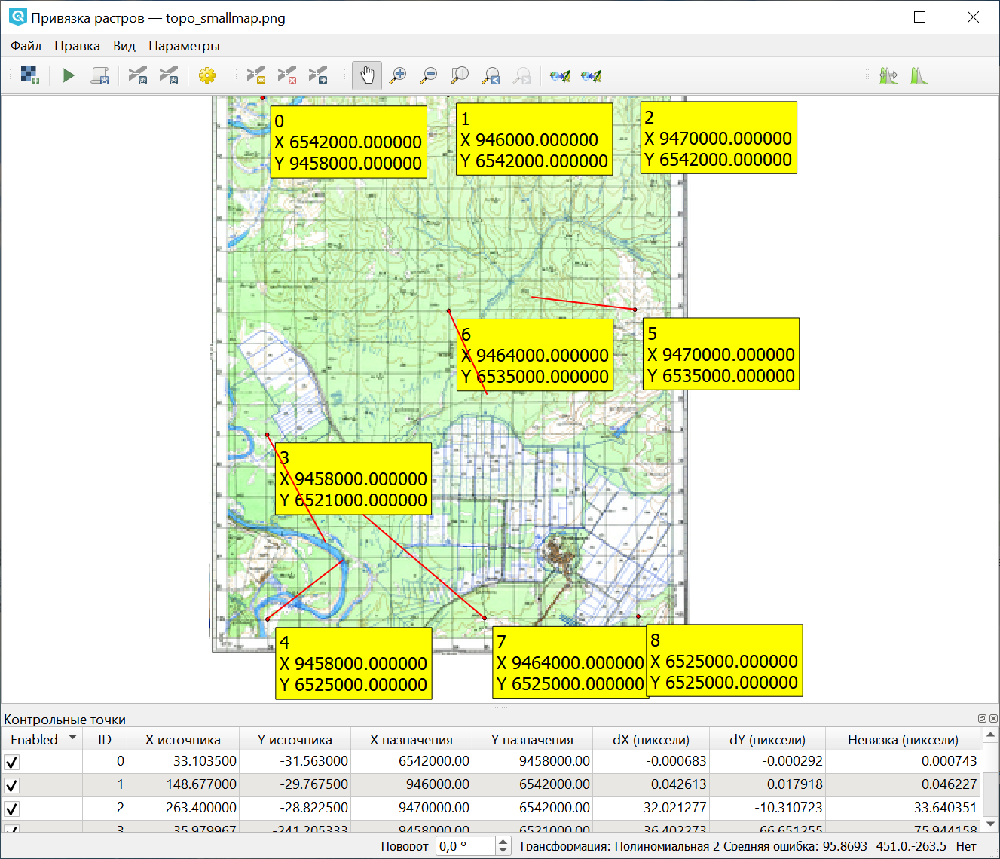

   Пример привязки с большой ошибкой

На картинке мы наблюдаем длинные красные линиии, а в строке состояния - большую среднюю ошибку. Это произошло из-за неверного ввода цифровых координат.

Внимательно проверьте введёные цифры. После исправления цифр - зайдите снова в окно Параметры трансформации и нажмите OК - средняя ошибка будет пересчитана.

Если координаты введены правильно, но невязка сильная, проверьте установленный тип трансформации.

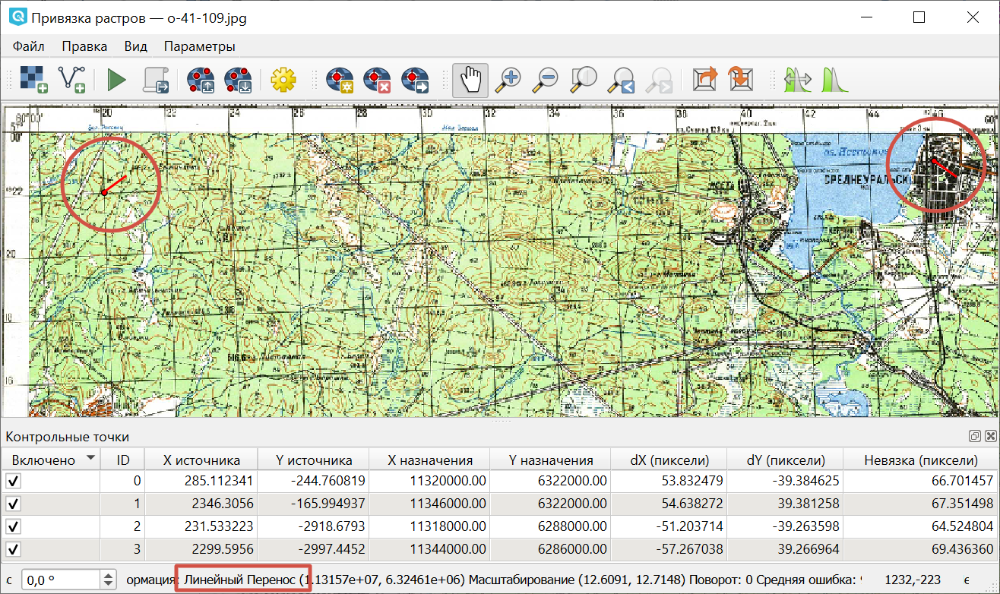

   Пример невязки из-за неверно выбранного типа трансформации

Обычно в практике привязки стараются добиться, чтобы ошибка не превышала 1 пикселя. 

Допустимая невязка зависит от разрешения растра. Поэтому для растра 10 000 х 10 000 ошибка в 10 пикселей будет нормальной, а для 1000 х 1000 - большой.

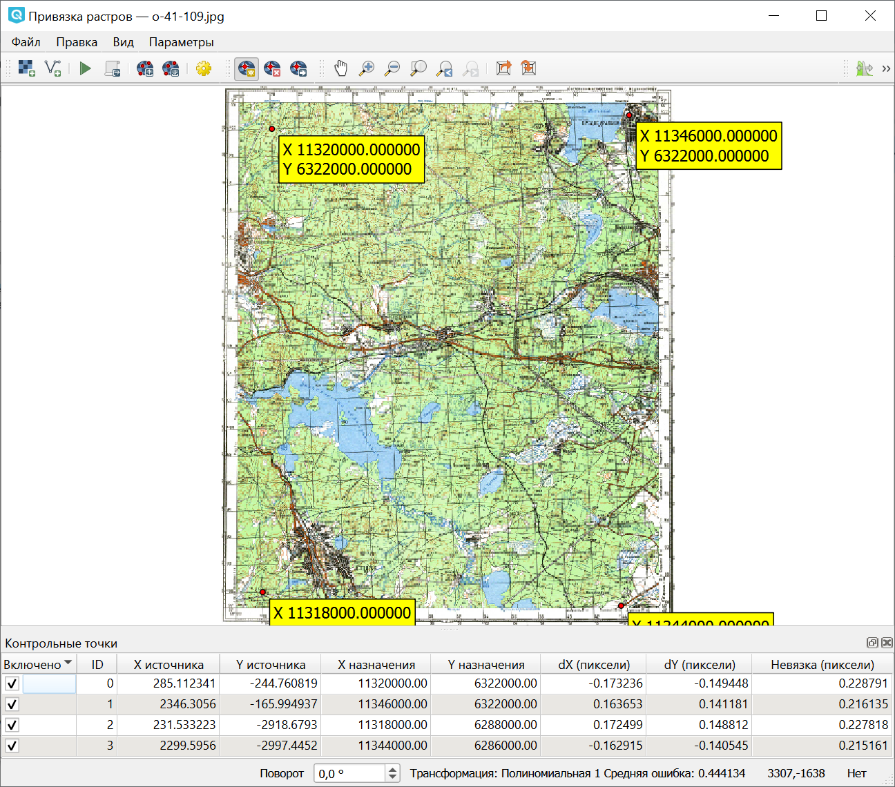

   Привязка с небольшой ошибкой

После проверки всех параметров можно запустить сам процесс привязки.

**Запустите привязку растра**, нажав кнопку с зеленой стрелкой |button_start_georef| на панели инструментов или "Файл ‣ Начать привязку растра".

Может появиться всплывающее окно выбора параметров перехода между датумами ( со старого отечественного СК-42 на стандартный WGS 84).

Если всё получилось, то в :program:`NextGIS QGIS` добавится геопривязанный растр в формате GeoTIFF. Вы можете проверить, как он ложится на слой подложки (или под полупрозрачный слой подложки).

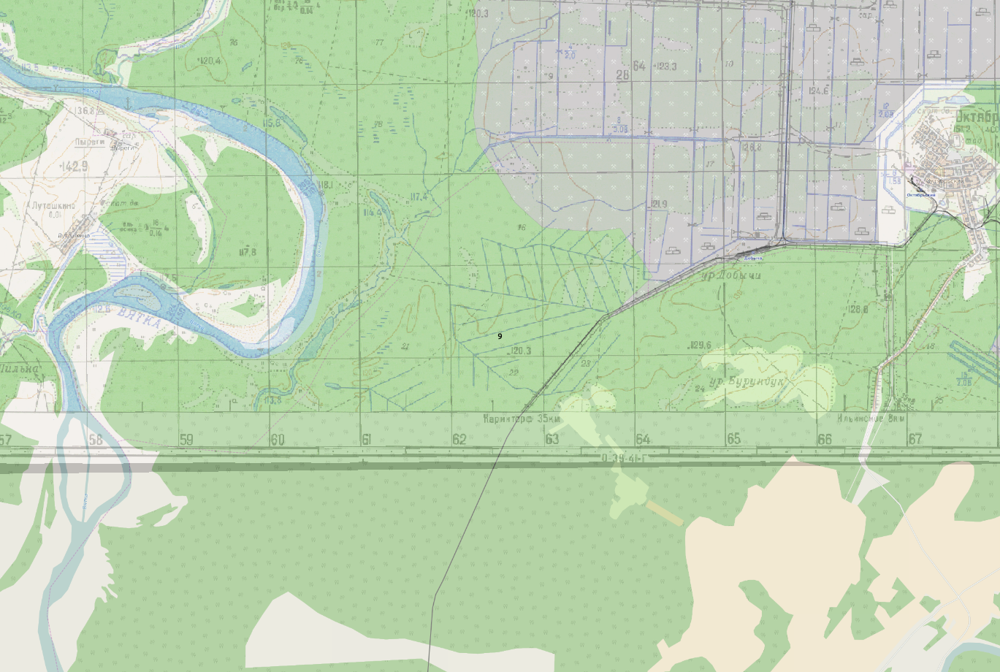

   Карта, привязанная точно

