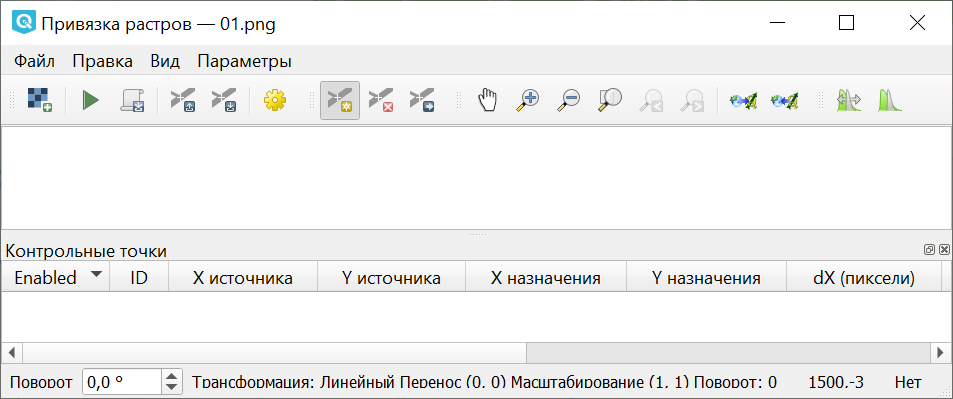
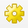
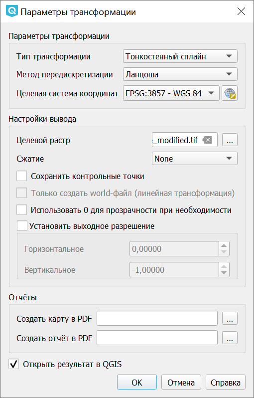
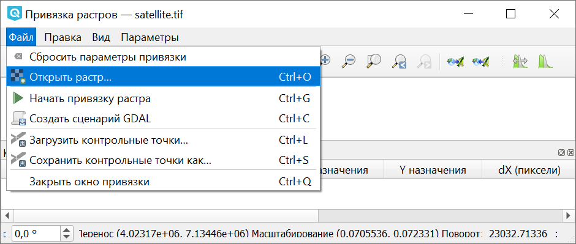
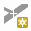
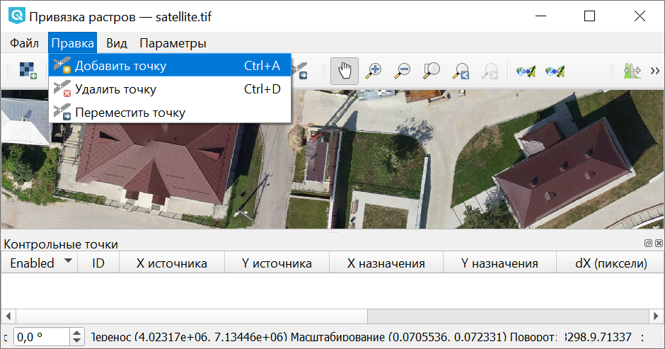
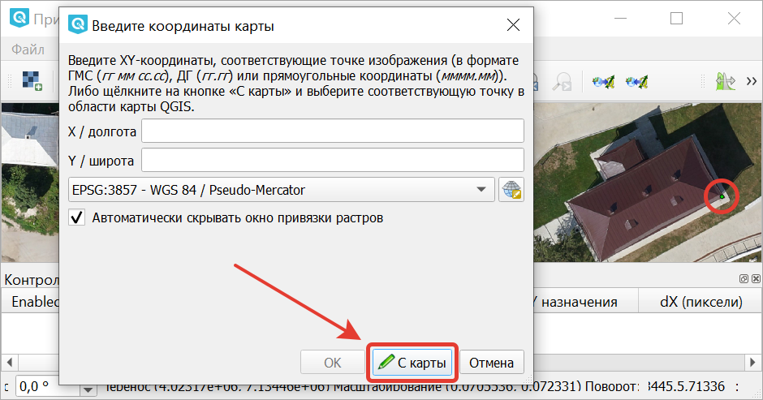
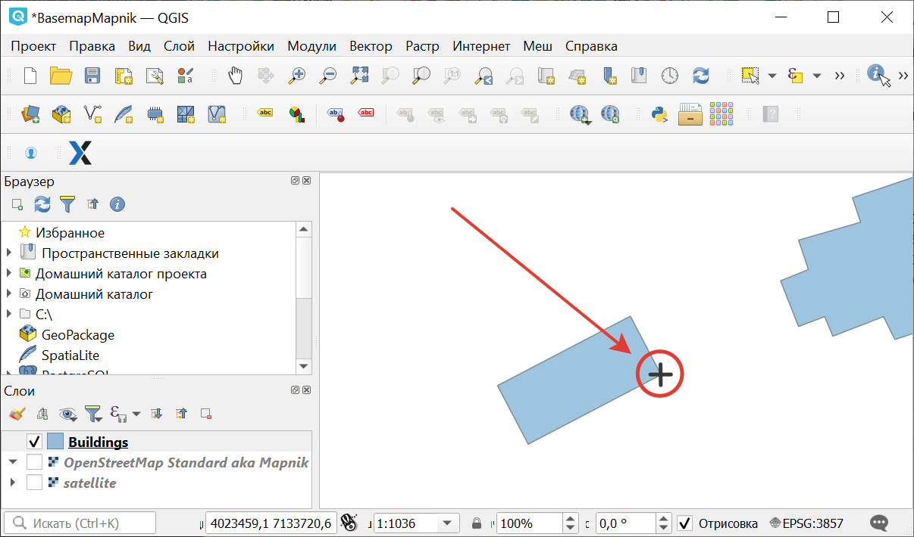
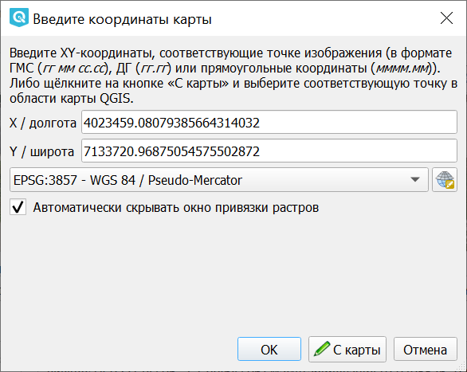
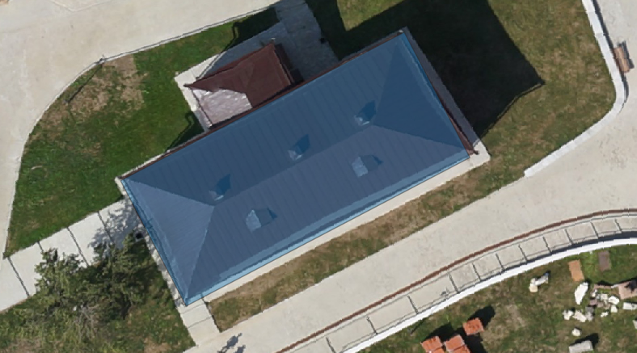

Привязка растров
===================

С помощью данного инструмента пользователь QGIS получает возможность привязывать растры к координатам.

Доступен в меню ``Слой ‣ Привязка растров``.

Этот инструмент предоставляет графический интерфейс, в котором пользователь указывает общие опорные точки (традиционно называются gcp, ground control points) на растре и на карте в основном окне NextGIS QGIS. Также координаты опорных точек можно вводить цифрами с клавиатуры, если на карте есть координатная сетка, и пользователь представляет её код EPSG. Затем при расчёте генерируется новый файл в формате GeoTIFF, с информацией о привязке внутри. 

   
   Интерфейс инструмента Привязка растров

.. _raster_ref_functions:

Примеры операций

* Привязать советскую топокарту к слою openstreetmap.
* Привязать топокарту с сеткой, введя её координаты с клавиатуры, это будет более точно, чем привязывать по точкам.
* Привязать 1-2 снимка поверхности с летательного аппарата по визуальным ориентирам.
* Допривязать полученный из другого софта ортофотоплан к точной карте. 
* Привязать сфотографированную распечатку карты OSM с отметками ручкой, чтобы потом оцифровать эти отметки.
* Привязать древнюю карту из книги царских времён у которой нет сетки, или она в неизвестной системе координат.

.. _raster_ref_param:

Параметры трансформации
------------------------------------------

Задаются в диалоговом окне, которое можно вызвать кнопкой с желтой шестеренкой |button_georef_settings| или через меню Параметры ‣ Параметры трансформации.

   
   Диалоговое окно Параметры трансформации

**Тип трансформации**

Указывает, каким алгоритмом будут перемещаться пиксели и растягиваться карта. Алгоритм выбирается в зависимости от того, насколько сильно отличаются проекция исходной карты и та, в которую её будут трансформировать.

Подробнее о том, чем отличаются типы трансформации и как выбрать подходящий, см. `Типы трансформации <https://docs.nextgis.ru/docs_ngqgis/source/transformations.html#transform-type>`_ 

**Метод передискретизации**

Определяет, как вычисляются значения пикселей при их распределении по новой сетке. Для индексированных растров (например, топокарт) следует использовать только алгоритм **ближайший сосед**, для цветных и многоканальных спутниковых снимков лучше всего подойдет **линейная**. Подробнее об `алгоритмах передискретизации <https://docs.nextgis.ru/docs_ngqgis/source/transformations.html#transform-resample>`_.

**Сжатие**

По умолчанию выбрано значение "None" - после привязки растр получается несжатый, и занимает много места на диске. 

Доступны три алгоритма сжатия:

* LZW - похож на RAR, без потери информации. Сжимает быстро, но медленнее распаковывается. 
* Packbits - без потери информации, самый быстрый, но меньше всего сжатие. Не во всем ПО работает.
* Deflate - сильное сжатие с потерями, можно использовать для картинок, но не для ЦМР. Медленно сжимает, но распаковывается быстрее, чем LZW

После привязки вы можете запустить ``Растр ‣ Извлечение ‣ Обрезка``, и обрезать растр по альфа-каналу, затем Растр ‣ Преобразование ‣ Преобразовать формат и сохранить его в GeoTIFF с сжатием JPEG. Это заметно уменьшит размер файлов.

**Путь**

Также можно указать путь для нового файла (по умолчанию - исходная папка)

.. _georef_raster:

Подготовка растра
-------------------------------

 Если карта, которую вы будете привязывать, в формате GIF, то сконвертируйте её в TIFF, JPEG или PNG, используя инструмент ``Растр ‣ Преобразование ‣ Преобразовать формат`` (`подробнее <https://docs.nextgis.ru/docs_ngqgis/source/raster_op.html#ngqgis-convert-format>`_) или любой графический редактор.

Если исходный файл большой, то он долго будет рисоваться на экране. В этом случае нажмите "Параметры ‣ Свойства растра ‣ Пирамиды", выделите в списке все строки, выберите тип "внешние", и нажмите "Создать пирамиды". Получится отдельный файлик с уменьшенными копиями растра, который будет использоваться автоматически для более быстрой отрисовки.

Привязать изображение можно двумя способами: по точкам на карте и по числовым значениям координат.

.. _raster_ref_algorithm:

Привязка растра по точкам на карте
-----------------------------------------

**Определение системы координат**

Откройте в QGIS карту, к которой вы будете привязывать растр. Решите, в какой **системе координат** нужна конечная карта и установите эту систему координат для проекта. 

**Добавление опорных точек**

Запустите модуль привязки растров: ``Растр ‣ Привязка растров``. Далее описываются команды модуля Привязка Растров.

Откройте подготовленное изображение: ``Файл ‣ Открыть растр``.

   
   Открытие растра

Добавьте точки. Нажмите кнопку |button_georef_add_point| на панели инструментов или выберите ``Правка ‣ Добавить точку``. 

При привязке ставить точки следует как можно шире, в идеале в углах карты, затем добавить контрольные точки внутри.

В качестве опорных точек выбирайте объекты, постоянные во времени (не подойдёт береговая линия или точки впадения рек) - капитальные сооружения или асфальтовые дороги.

   
   Выбор команды "Добавить точку"

Поставьте точку на карту. Появится окно с полями ввода координат. В выпадающем списке систем координат выберете ту СК, которая установлена у вас в проекте.

   
   Окно ввода координат при добавлении точки. Кружком отмечена добавляемая точка

Нажмите кнопку **С карты**. Откроется основное окно QGIS, поставьте точку на это же место на карте.

   
   Выбор соответствующей точки на карте
   

   
   Полученные с карты координаты точки

Нажмите **Ок** для завершения добавления точки.

Минимально необходимое количество точек зависит от `типа трансформации <https://docs.nextgis.ru/docs_ngqgis/source/transformations.html#transform-type>`_. Если их будет недостаточно, то появится предупреждение.

Точки можно сохранить отдельно на диск, на случай сбоев, командой "Файл ‣ Сохранить контрольные точки как". Сохраните их в путь по умолчанию, и они будут подтягиваться автоматически при следующем запуске модуля Привязка растров. 

**Проверьте параметры трансформации**, открыв ``Параметры ‣ Параметры трансформации``. Там указывается путь для нового файла (по умолчанию - исходная папка), тип трансформации и метод интерполяции, целевая систему координат. 

Чтобы готовый растр сразу открывался в окне QGIS, поставьте флажок **Открыть в QGIS** в параметрах трансформации.

Запустите привязку растра, нажав кнопку с зеленой стрелкой |button_start_georef| на панели инструментов или ``Файл ‣ Начать привязку растра``.

.. |button_start_georef| image:: _static/button_start_georef.png

**Проверка результата**

Вы можете проанализировать невязки визуально, покрутив настройки прозрачности в свойствах слоя (например для сравнения ортофотопланов и спутниковых снимков подходит режим смешивания "Направленный свет").

   
   Результат привязки растра

Можно сравнить несколько вариантов перепроецирования и посмотреть, какой даёт меньшую погрешность в точках.

Здесь был описан процесс привязки карт по точкам. Также можно привязвать карты по числовым координатам, см. http://docs.nextgis.ru/docs_howto/source/topo_georef.html

