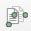
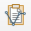
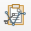
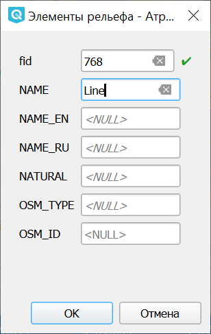

ReconstructLine
================

Модуль позволяет cоздавать линии из точек.

Точки могут быть неупорядоченными по времени и другим атрибутам, но учитывается пространственное расположение точек.

После установки кнопки модуля появятся на панели инструментов.

* Выделите слой.

* Выделите точки, из которых хотите создать линию.

* Нажмите **Скопировать точки** |button_copy_points|.

* Выберите линейный слой, в который хотите добавить линию. Переведите его в режим редактирования.

* Нажмите **Вставить линию** |button_paste_line| или **Вставить составную линию** |button_paste_fragments|.

* В следующем окне введите атрибуты объектов.

   Ввод значений атрибутов линии

|button_paste_line| **Вставить линию** добавит единую линию со всеми выделенными точками в качестве вершин.

|button_paste_fragments| **Вставить составную линию** создаст из каждого отрезка отдельный объект - линию с двумя вершинами. Работает только в слое типа MultiLineString.

Для аналогичного соединения точек по значению в таблице атрибутов используйте модуль `Points2One <https://docs.nextgis.ru/docs_ngqgis/source/points2one.html>`_.

Посмотреть на работу инструмента можно в видео:

.. raw:: html

   <iframe width="560" height="315" src="https://rutube.ru/play/embed/a9f8266a4d13084276b4d77bb85e4503/" frameBorder="0" allow="clipboard-write; autoplay" webkitAllowFullScreen mozallowfullscreen allowFullScreen></iframe>

Смотреть на `youtube <https://youtu.be/ezk8Jot6rCg>`_, `rutube <https://rutube.ru/video/a9f8266a4d13084276b4d77bb85e4503/>`_.
