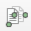
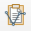
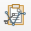
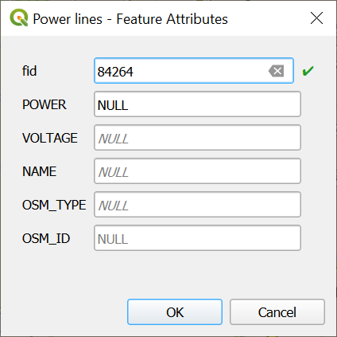

ReconstructLine
================

This plugin reconstructs linear features from points.

Points can be unordered (mixed) time-wise or by other attributes, only spatial location of points is considered.

After installation you'll find the plugin in the toolbar.

* Select layer.

* Select point you want to join into a line.

* Press **Get poins** |button_copy_points|.

* Select target line layer. Activate Edit mode for it.

* Press **Insert line** |button_paste_line| or **Insert multiple lines** |button_paste_fragments|.

* In the pop-up dialog enter the attribute for the features.

   Entering attribute values for the line

|button_paste_line| **Insert line** adds a single multiline containing all the points as vertices.

|button_paste_fragments| **Insert multiple lines** creates a sequence of simple lines, with two vertices each. Works only for MultiLineString layers.

To create lines gruping points by attribute values use `Points2One <https://docs.nextgis.com/docs_ngqgis/source/points2one.html>`_ plugin.

See how the plugin works in our video:

.. raw:: html

   <iframe width="560" height="315" src="https://www.youtube.com/embed/fw59AbimSPU?si=sHWX30g0rKn1gxQr" title="YouTube video player" frameborder="0" allow="accelerometer; autoplay; clipboard-write; encrypted-media; gyroscope; picture-in-picture; web-share" referrerpolicy="strict-origin-when-cross-origin" allowfullscreen></iframe>

Watch on `youtube <https://youtu.be/fw59AbimSPU?si=FJcL_SoaPzJ-rvUi>`_.
