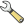
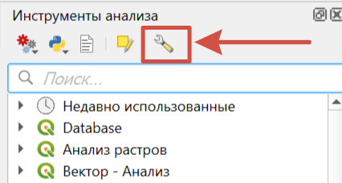
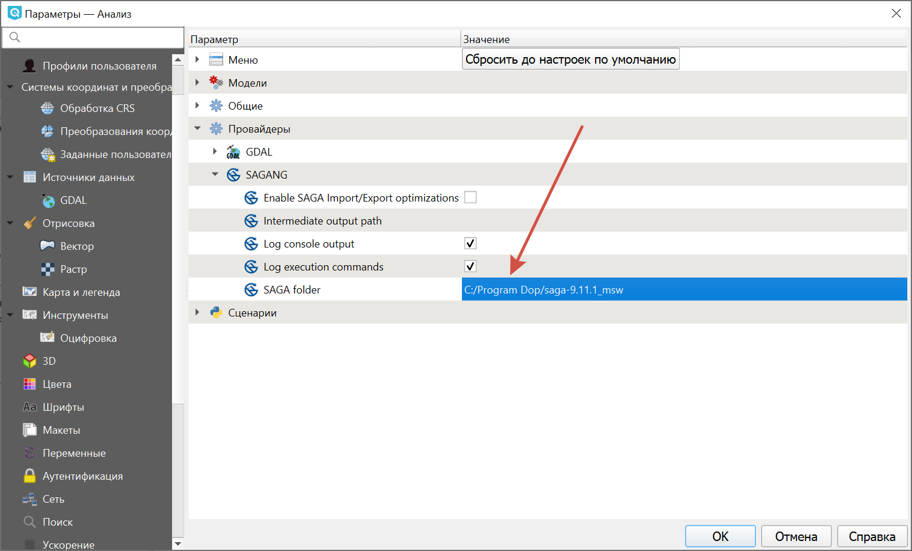

Установка SAGA в NextGIS QGIS
=============================

1. `Установите <https://docs.nextgis.ru/docs_ngqgis/source/install_plugin.html>`_ сам модуль в NextGIS QGIS (Модули > Управление модулями > Processing Saga NextGen Provider).
2. Скачайте `архив с бинарными файлами SAGA <https://sourceforge.net/projects/saga-gis/>`_ и распакуйте в любую папку.
3. В панели инструментов анализа откройте настройки |wrench|, разверните секцию "Провайдеры" и укажите в ней путь до бинарных файлов.

4. Зайдите в меню Настройки > Параметры > вкладка Система.

.. figure:: _static/_.png
   :name: 
   :align: center
   :width: 20cm
   
5. В разделе "Текущие переменные среды" найдите PATH и скопируйте значение.
6. В разделе "Переменные среды" поставьте галочку "Переопределить переменные среды".

.. figure:: _static/_.png
   :name: 
   :align: center
   :width: 20cm

7. Добавьте переменную PATH. В колонке "Применить" выберите "Перезаписать". В качестве значения необходимо добавить скопированное ранее и дополнить его ``;C:/Windows/system32;C:/Windows;C:/Windows/system32/WBem``. Важно не потерять **точку с запятой** между ними.
8. Перезагрузите NextGIS QGIS. 

После этого инструменты SAGA должны появиться в панели анализа.
