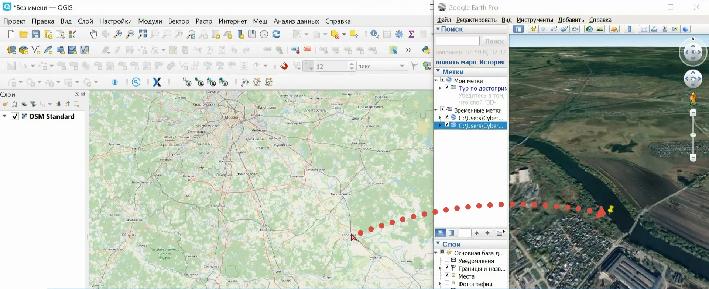

Send2GE
=======

Этот модуль позволяет открывать текущую локацию QGIS в Google Earth одним кликом. 

После установки модуль появится в панели модулей: |button_send2ge|. Активируйте модуль и кликните по нужной точке на карте.

Программа откроется сразу в точке клика.

   Параллельно открытые окна QGIS и Google Earth

При выборе новой точки в QGIS в Google Earth также отобразится новая локация. Мгновенное переключение от точки к точке позволяет работать одновременно в двух окнах – в QGIS и Google Earth.

Есть также похожий модуль `Click-Fu <https://docs.nextgis.ru/docs_ngqgis/source/clickfu.html>`_ для работы с веб-сервисами Google Maps, OSM, Flickr Maps, GeoHack Map Sources.

Посмотреть на модуль в действии можно в нашем `видео <https://youtu.be/LrJ8VAX6vbQ>`_.
