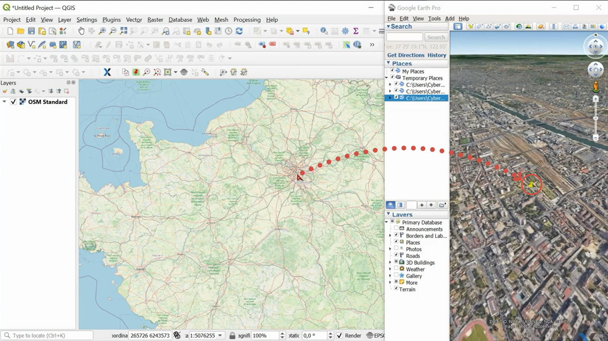

Send2GE
=======

Grab current location and send it to Google Earth in one click. 

After installation you'll find the plugin in the Plugins toolbar: |button_send2ge|. Activate the plugin and click on the map.

The Google Earth app will open on the selected point.

   QGIS and Google Earth windows both open

When you select a new point in QGIS, Google Earth also shifts to the new location. Instant transition between points allows to work simultaneously in both apps.

See a similar plugin for Google Maps, OSM, Flickr Maps, GeoHack Map Sources - `Click-Fu <https://docs.nextgis.com/docs_ngqgis/source/clickfu.html>`_.

You can check out how the plugin works in our video:

.. raw:: html

   <iframe width="560" height="315" src="https://www.youtube.com/embed/HnNm7BhXPyU?si=0fXCXRYKRpomt9VV" title="YouTube video player" frameborder="0" allow="accelerometer; autoplay; clipboard-write; encrypted-media; gyroscope; picture-in-picture; web-share" referrerpolicy="strict-origin-when-cross-origin" allowfullscreen></iframe>

Watch on `youtube <https://youtu.be/HnNm7BhXPyU?si=p8-y3WwXlIB8zFLK>`_.
