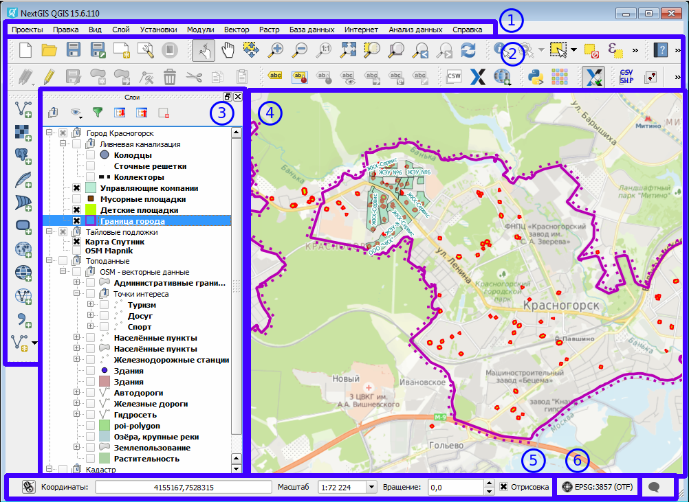

.. sectionauthor:: Дмитрий Барышников <dmitry.baryshnikov@nextgis.ru>

.. _ngqgis_settings:

Настройки
==========

Параметры NextGIS QGIS
-----------------------

Некоторые основные параметры :program:`NextGIS QGIS` могут быть определены в диалоговом окне "Параметры".
Выберите пункт меню ``Установки ‣ Параметры``. Параметры можно изменить на следующих
вкладках:

1. Общие.
   
   * Запрашивать сохранение изменений в проекте, когда это необходимо.
   * Предупреждать при попытке открытия файлов проекта старых версий QGIS.
   * Изменить цвет выделения и фона.
   * Изменить тему интерфейса.
   * Изменить тему значков (можно выбрать следующие варианты: "default", "classic" 
     или "gis").
   * Изменить размер значков (возможные варианты: 16, 24 и 32 пикселя).
   * Изменить размер шрифта в меню.
   * Определить реакцию на двойной щелчок по слою в легенде (открывать свойства слоя 
     или открывать таблицу атрибутов).
   * Выводить имя слоя с заглавной буквы.
   * Показывать в легенде атрибуты классификации.
   * Создавать миниатюры в легенде для растровых слоёв.
   * Не показывать заставку при запуске.
   * Показывать совет дня при запуске.
   * Открывать результаты определения во встраиваемом окне (требуется перезапуск).
   * Открывать параметры прилипания во встраиваемом окне (требуется перезапуск).
   * Открывать таблицу атрибутов во встраиваемом окне (требуется перезапуск).
   * Добавлять слои PostGIS двойным щелчком и включить расширенную выборку.
   * Добавлять новые слои в выбранную или текущую группу.
   * Копировать геометрию в формате WKT из таблицы атрибутов.
   * Вид таблицы атрибутов (можно выбрать следующие варианты: "Показывать все объекты" 
     (по умолчанию); "Показывать выделенные объекты"; "Показывать объекты, видимые 
     в области карты").
   * Размер кеша таблицы атрибутов (строк).
   * Задать Представление значений NULL.
   * Показывать совет дня при запуске.
   * Открывать результаты определения во встраиваемом окне (требуется перезапуск).
   * Открывать параметры прилипания во встраиваемом окне (требуется перезапуск).
   * Открывать таблицу атрибутов во встраиваемом окне (требуется перезапуск).
   * Добавлять слои PostGIS двойным щелчком и включить расширенную выборку.
   * Добавлять новые слои в выбранную или текущую группу.
   * Копировать геометрию в формате WKT из таблицы атрибутов.
   * Вид таблицы атрибутов (можно выбрать следующие варианты: "Показывать все объекты" 
     (по умолчанию); "Показывать выделенные объекты"; "Показывать объекты, видимые
     в области карты").
   * Размер кеша таблицы атрибутов (строк).
   * Задать Представление значений NULL.
   * Запрашивать загрузку дочерних слоёв растра. Некоторые форматы растровых данных 
     поддерживают дочерние слои - в GDAL их называют subdatasets. Например, файлы NetCDF - если 
     в таком файле описано несколько переменных, GDAL распознаёт их как дочерние слои. 
     Эта настройка определяет обработку таких файлов QGIS. Доступны следующие варианты:
     
     * "Всегда" всегда спрашивать (если найдены дочерние слои).
     * "Если необходимо" спрашивать, если слой не имеет каналов, но имеет дочерние слои.
     * "Никогда" никогда не спрашивать, ничего не загружается.
     * "Загружать все" никогда не спрашивать, сразу загружать все дочерние слои.
        
   * Искать источники данных в панели обозревателя. Вариант "По расширению" позволяет 
     ускорить загрузку дерева каталогов, которая может требовать некоторого времени
     при использовании варианта "По содержимому" и большом количестве файлов в каталоге
     (десятки и сотни).
   * Сканировать содержимое архивов (.zip) в панели обозревателя. Этот параметр также
     введен для ускорения загрузки дерева каталогов. Доступны следующие варианты:
   * "Быстрое сканирование" проверяет поддерживается ли расширение одним из драйверов.
   * "Полное сканирование" открывает каждый файл и проверяет его валидность.
   * "Пропускать" не используйте этот параметр, в следующих версиях QGIS он будет удален.

2. GDAL. Библиотека GDAL предназначена для работы с растровыми данными. На этой вкладке можно
   указать, какой именно драйвер GDAL необходимо использовать для открытия файлов, если 
   данный формат поддерживается более чем одним драйвером.

3. Модули. При необходимости укажите Пути поиска дополнительных модулей.

4. Отрисовка.

   * Добавляемые на карту слои видимы по умолчанию.
   * Количество объектов для отрисовки между обновлениями экрана.
   * Использовать кэш для ускорения перерисовки там, где это возможно.
   * Рисовать сглаженные линии (снижает скорость отрисовки).
   * Исправлять ошибки заливки полигонов.
   * Использовать новую реализацию отрисовки условных знаков.
   * Настройки визуализации растров: "Каналы отображения в RGB", Использовать стандартное 
     отклонение и "Улучшение контраста".
   * Добавить/удалить Пути поиска значков в формате SVG (Scalable Vector Graphics).

5. Инструменты.

   * Настройка Режим определения используется для указания того, какие слои будут
     показываться при использовании инструмента "Определить объекты". При выборе "Сверху
     вниз" или "Сверху вниз, до первого найденного" вместо "Текущий слой", при использовании
     инструмента "Определить объекты" будут показаны атрибуты всех определяемых слоев 
     (см. раздел :ref:`ngqgis_editing_identify`).
   * Открывать форму, если найден один объект.
   * Установить Радиус поиска для определения объектов и всплывающих описаний (задается 
     в процентах от ширины видимой карты).
   * Указать Эллипсоид для вычисления расстояний.
   * Установить Цвет линии для инструментов измерений.
   * Установить число Десятичных знаков.
   * Сохранять базовые единицы.
   * Установить единицы измерения по умолчанию (метры или футы).
   * Установить единицы измерения углов (градусы, радианы или грады).
   * Задать Действие при прокрутке колеса мыши ("Увеличить", "Увеличить и центрировать", 
     "Увеличить в положении курсора", "Ничего").
   * Установить Фактор увеличения для колеса мыши.

6. Совмещение. 

   * Установить Алгоритм размещения для подписей, символов и диаграмм (выберите один 
     из вариантов: "Central point" (по умолчанию), "Chain", "Popmusic tabu chain",
     "Popmusic tabu" или "Popmusic chain").

7. Оцифровка.
   
   * Установить Толщину линии и Цвет линии для "резиновой нити".
   * Установить Режим прилипания по умолчанию ("К вершинам", "К сегментам", "К
     вершинам и сегментам").
   * Установить Порог прилипания по умолчанию (в единицах карты или пикселях).
   * Установить Радиус поиска для редактирования вершин (в единицах карты или пикселях).
   * Показывать маркеры только для выбранных объектов.
   * Установить Стиль маркера ("Перекрестие" (по умолчанию), "Полупрозрачный круг"
     или "Без маркера") и Размер маркера.
   * Отключить всплывающее окно ввода атрибутов для каждого создаваемого объекта.
   * Использовать последние введённые значения.
   * Настроить Проверку геометрии. Редактирование сложных линий/полигонов с большим 
     количеством узлов может замедлить отрисовку. Это происходит из-за того, что процедура 
     проверки геометрии, используемая в QGIS по умолчанию довольно медленная. Ускорить 
     отрисовку можно либо используя для проверки геометрии библиотеку GEOS (начиная с GEOS 3.3) 
     или отключив её вообще. Проверка геометрии при помощи GEOS намного быстрее, но 
     у нее есть недостаток - обнаруживается только первая проблема с геометрией.

   .. note::
   
      Следующие три параметра относятся к инструменту "Параллельная кривая", описанному 
      в раздел "Дополнительные функции оцифровки". При помощи этих настроек можно управлять 
      видом параллельной кривой. Все эти настройки будут учитываться только при использовании 
      GEOS 3.3 или более поздней версии.

   * Стиль соединения параллельной линии.
   * Количество сегментов на квадрант параллельной кривой.
   * Предел острия параллельной кривой.

8. Система координат. Вкладка "Система координат" разделена на две группы элементов управления. Первая группа 
   позволяет задать систему координат по умолчанию для новых проектов.
   
   * Создавать новые проекты в указанной системе координат.
   * Включить преобразование координат "на лету".

   Вторая группа позволяет определить поведение QGIS при создании нового слоя или при 
   загрузке слоя с неопределенной системой координат.

   * Запрашивать систему координат.
   * Использовать систему координат проекта.
   * Использовать нижеприведённую систему координат по умолчанию.

9. Язык.

   * Переопределить системный язык и язык, используемый вместо системного.
   * Дополнительная информация о системном языке.

10. Сеть.

    Окно Параментры сети представлено на рисунке см. :numref:`ngqgis_Proxy_settings_pic`:

   .. figure:: _static/Proxy_settings.png
      :name: ngqgis_Proxy_settings_pic
      :align: center
      :height: 16cm

      Параметры сети.  
    

   * Использовать прокси-сервер для внешних соединений и настроить поля "Узел", "Порт",
     "Пользователь" и "Пароль".
   * Установить Тип прокси в соответствии с конфигурацией сети.

     * Default Proxy: прокси определяется настройками приложения.
     * Socks5Proxy: Общий прокси для любого вида связи. Поддерживаются TCP, UDP, при-
       вязка к порту (входящие соединения) и авторизация.
     * HttpProxy: реализован с использованием команды "СONNECT", поддерживает только
       исходящие TCP соединения; поддерживает авторизацию.
     * HttpCachingProxy: использует стандартные команды HTTP, имеет смысл использовать
       только с запросами HTTP.
     * FtpCachingProxy: реализован посредством FTP прокси, имеет смысл использовать 
       только с запросами FTP.

   * Задать Параметры кеширования (путь к кэшу и его размер).
   * Задать Адрес поиска WMS-серверов, по умолчанию используется http://geopole.org/wms/search?search=\%1\&type=rss .
   * Установить Таймаут для сетевых запросов (мс). Значение по умолчанию - 60000.

Если вы не хотите использовать прокси-сервер для некоторых адресов, можно добавить 
их в текстовое поле ниже (:numref:`ngqgis_Proxy_settings_pic`), нажав кнопку "Добавить". 
После двойного нажатия на созданной строке ввода :term:`URL`, 
введите адрес, для которого не хотите использовать прокси-сервер. Нажатие на кнопке 
"Удалить" удаляет выбранную строку адреса.

Таким образом можно настроить параметры в соответствии с вашими потребностями. Внесение некоторых 
изменений может потребовать перезапуска QGIS для их применения.

.. _`project_settings`:

Свойства проекта
-------------------

Диалог свойств проекта запускается нажатием кнопки проекции в главном окне, 
снизу-справа экрана (см. :numref:`project_settings_start`: п. 6)

   Интерфейс :program:`NextGIS QGIS` с загруженным проектом.

Основные настройки, которые можно там менять:

1. Общие.

   * Заголовок проекта.
   * Эллипсоид для вычислений - по нему будут вычисляться длины и площади инструментом 
     "линейка", и функциями $area, $length в калькуляторе полей.

2. Система координат.

   * Автоматическое перепроецирование - задать систему координат, в которой будет отображаться
     на экране все слои проекта.
