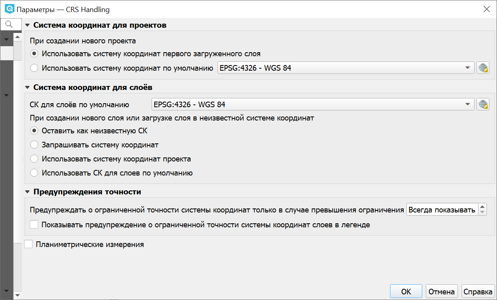
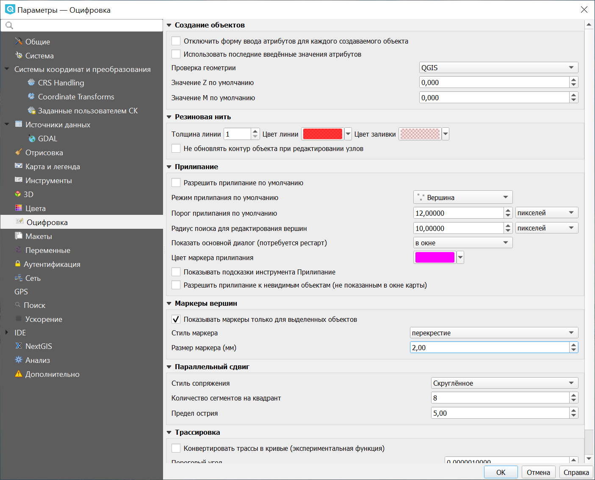
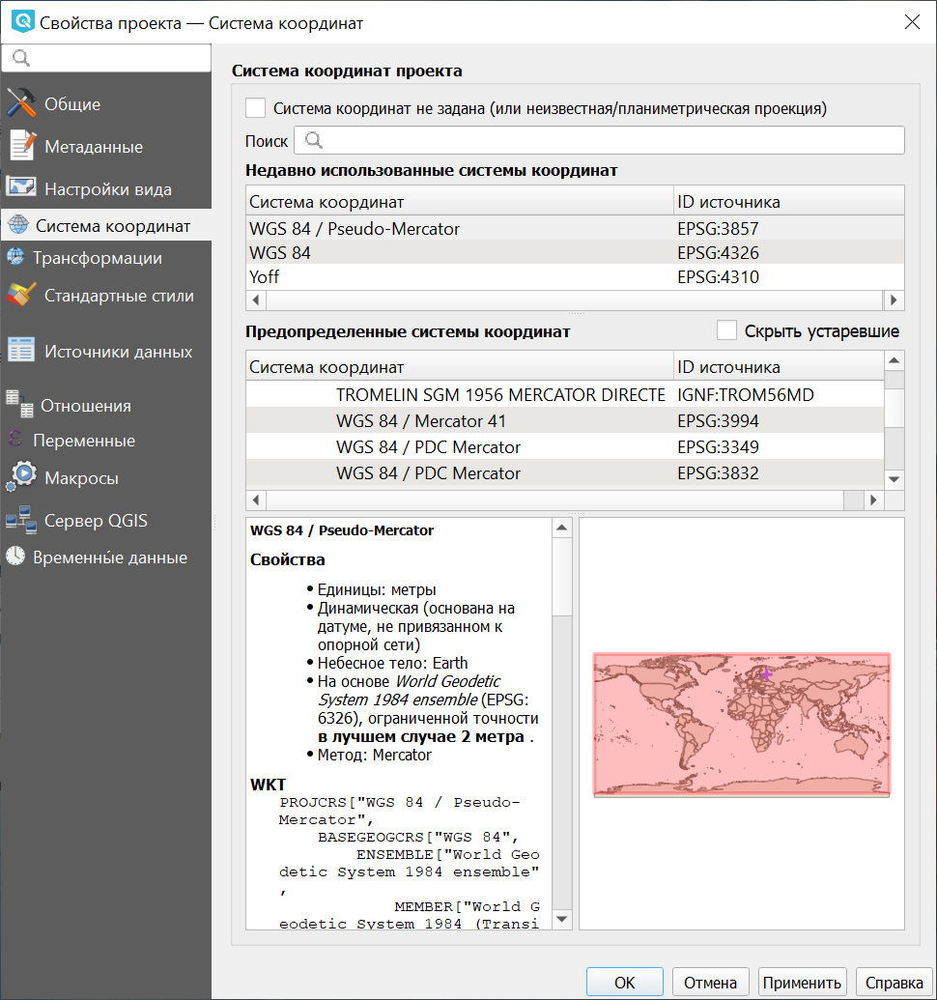

.. sectionauthor:: Дмитрий Барышников <dmitry.baryshnikov@nextgis.ru>

.. _ngqgis_settings:

Настройки
==========

Параметры NextGIS QGIS
-----------------------

Некоторые основные параметры :program:`NextGIS QGIS` могут быть определены в диалоговом окне "Параметры".
Выберите пункт меню ``Настройки ‣ Параметры``. Параметры можно изменить на следующих
вкладках:

Общие
^^^^^

Здесь можно переопределить системную локаль:

* Выбрать язык, используемый вместо системного.
* Выбрать формат локализации чисел, дат и денежных единиц.
* Получить дополнительную информация о системном языке.

Можно настроить внешний вид приложения:

* Изменить тему интерфейса.
* Изменить тему значков (можно выбрать следующие варианты: "default", "classic" или "gis").
* Изменить размер значков (возможные варианты: 16, 24 и 32 пикселя).
* Изменить размер шрифта в меню.
* Изменить время показа диалогов и сообщений.
* Не показывать заставку при запуске.

Также в этом разделе доступны настройки файлов проектов:

* Запрашивать сохранение изменений в проекте, когда это необходимо.
* Предупреждать при попытке открытия файлов проекта старых версий QGIS.

   
   Общие

Система
^^^^^^^

В этом разделе задаются пути поиска значков в формате SVG, дополнительных модулей и справочной документации, а также переменные среды.

В этом разделе в пункте "Параметры" можно сбросить пользовательский интерфейс к настройкам по умолчанию (требуется перезапуск).

   
   Система

Системы координат и преобразования
^^^^^^^^^^^^^^^^^^^^^^^^^^^^^^^^^^

Этот раздел меню состоит из трех вкладок. 

Первая вкладка позволяет определить поведение QGIS при создании нового проекта, нового слоя и при загрузке слоя с неопределенной системой координат.

Для новых проектов может использоваться:

* СК первого загруженного слоя 
* предварительно выбранная СК по умолчанию

При создании нового слоя или при загрузке слоя с неопределенной системой координат можно:

* Оставить как неизвестную СК
* Запрашивать систему координат
* Использовать СК проекта
* Использовать СК для слоев по умолчанию

   
   Первая вкладка раздела настроек координат

Во второй вкладке определяются параметры перехода между системами координат.

В третьей вкладке можно создать пользовательскую систему координат в формате WKT или Proj4.

Подробнее о настройке системы координат можно прочитать `здесь <https://docs.nextgis.ru/docs_ngqgis/source/map.html#id13>`_.

Источники данных
^^^^^^^^^^

В этом разделе досупны настройки таблицы атрибутов:

* Открывать таблицу атрибутов в закрепленном окне.
* Параметры копирования объектов из таблицы (Простой текст, геометрия WKT; Простой текст без геометрии; GeoJSON)
* Поведение таблицы атрибутов (можно выбрать отображаемые объекты: все объекты (по умолчанию); выделенные объектыв;  объекты, видимые в области карты).
* Вид таблицы атрибутов: можно установить по умолчанию режим таблицы/ формы или запоминать последний использованный вид.
* Размер кеша таблицы атрибутов (строк).
* Задать Представление значений NULL.

Также здесь настраивается работа с источниками данных:

* Искать источники данных в панели обозревателя. Вариант "По расширению" позволяет ускорить загрузку дерева каталогов, которая может требовать некоторого времени при использовании варианта "По содержимому" и большом количестве файлов в каталоге (десятки и сотни).
* Сканировать содержимое архивов (.zip) в панели обозревателя. Этот параметр также введен для ускорения загрузки дерева каталогов. Доступны следующие варианты:
     
  * "Быстрое сканирование" проверяет поддерживается ли расширение одним из драйверов.
  * "Полное сканирование" открывает каждый файл и проверяет его валидность.
  * "Пропускать" не используйте этот параметр, в следующих версиях QGIS он будет удален. 

* Запрашивать загрузку дочерних слоёв растра. Некоторые форматы растровых данных поддерживают дочерние слои - в GDAL их называют subdatasets. Например, файлы NetCDF - если в таком файле описано несколько переменных, GDAL распознаёт их как дочерние слои. Эта настройка определяет обработку таких файлов QGIS. Доступны следующие варианты:
     
  * "Всегда" всегда спрашивать (если найдены дочерние слои).
  * "Если необходимо" спрашивать, если слой не имеет каналов, но имеет дочерние слои.
  * "Никогда" никогда не спрашивать, ничего не загружается.
  * "Загружать все" никогда не спрашивать, сразу загружать все дочерние слои.

* Также можно задать локализованные пути к данным и скрытые пути на панели обозревателя.
   

   
   Источники данных

Вкладка GDAL
~~~~~~~~

На этой вкладке можно указать, какой именно драйвер GDAL необходимо использовать для открытия растровых или векторных файлов, если данный формат поддерживается более чем одним драйвером.

Отрисовка
^^^^^^^^^

В этом разделе доступны следующие настройки:

* Добавляемые на карту слои видимы по умолчанию.
* Использовать кэш для ускорения перерисовки там, где это возможно.
* Использовать параллельную отрисовку слоев.
* Количество объектов для отрисовки между обновлениями экрана.
* Интервал обновления карты.
* Включить и настроить упрощение объектов по умолчанию для добавляемых слоев (это ускоряет отрисовку, но может привести к визуальным искажениям).
* Рисовать сглаженные линии (снижает скорость отрисовки).
* Задать параметры аппроксимации кривой.
* Настройки визуализации растров: Каналы отображения в RGB, Предискретизация, Сглаживание. 
* Включить и настроить улучшение контраста.
* Отображать в журнале событий обновление карты (параметр "Отладка").

   
   Отрисовка

Карта и легенда
^^^^^^^^^^^^^^

Здесь можно настроить цвет выделения и фона, взаимодействие с легендой, размер условных знаков и скорость появления всплывающих описаний, а также включить отображение атрибутов классификации в легенде.

   
   Карта и легенда

Инструменты
^^^^^^^^^^^

В этом разделе доступны следующие настройки:

* Установить Радиус поиска для определения объектов и всплывающих описаний.

Настройки инструмента измерений:

* Цвет линии для инструментов измерений.
* Число Десятичных знаков.
* Сохранять базовые единицы.
* Установить единицы расстояния, площади и углов.

Также здесь можно настроить отображение географических координат и направлений (формат и количество десятичных знаков). Доступные форматы:

* От 0 до 180° с суффиксом В/З
* От -180° до +180°
* От 0 до 360°

В этом же разделе можно установить:

* Фактор увеличения для колеса мыши.
* Масштабный ряд

   
   Инструменты

3D
^^^^

В этом разделе можно задать настройки камеры по умолчанию: тип проекции, поле зрения, режим просмотра, скорость движения, а также определить параметры инвертирования вертикальной оси.

   
   Параметры 3D

Цвета
^^^^^^

В этом разделе можно выбрать и настроить применяемую цветовую схему.

   
   Цвета

Оцифровка
^^^^^^^^^

В этом разделе доступны следующие настройки создания объектов:

* Отключить форму ввода атрибутов для каждого создаваемого объекта.
* Использовать последние введённые значения.
* Настроить Проверку геометрии. 

Редактирование сложных линий/полигонов с большим количеством узлов может замедлить отрисовку. Это происходит из-за того, что процедура проверки геометрии, используемая в QGIS по умолчанию довольно медленная. Ускорить отрисовку можно либо используя для проверки геометрии библиотеку GEOS (начиная с GEOS 3.3) или отключив её вообще. Проверка геометрии при помощи GEOS намного быстрее, но у нее есть недостаток - обнаруживается только первая проблема с геометрией.

* Установить Толщину линии и Цвет линии для "резиновой нити", а также цвет заливки.
* Настроить Прилипание: режим по умолчанию ("К вершинам", "К сегментам", "К вершинам и сегментам"), порог и радиус поиска для редактирования вершин (в единицах карты или пикселях), показ основного диалога в окне или панели, цвет маркера прилипания, отображение подсказок и включение прилипания к невидимым объектам.
* Установить Стиль маркера ("Перекрестие" (по умолчанию), "Полупрозрачный круг" или "Без маркера") и Размер маркера.
* Показывать маркеры только для выбранных объектов.
* Настроить параллельный сдвиг (стиль сопряжения параллельной линии, количество сегментов на квадрант и предел острия).

.. note::
   
   Параллельный сдвиг относится к `Дополнительным функциям оцифровки  <https://docs.nextgis.ru/docs_ngcourses/source/qgis/intro.html#id19>`_. При помощи этих настроек можно управлять видом параллельной кривой. Все эти настройки будут учитываться только при использовании GEOS 3.3 или более поздней версии.

Также доступна экспериментальная функция "Трассировка". 

   
   Оцифровка

Макеты
^^^^^^^

В этом разделе можно настроить параметры сетки и шрифт макета.

   
   Макеты

Переменные
^^^^^^^

В этом разделе отображаются переменные, которые могут быть использованы в различных выражениях. Например, при печати может выводиться пометка об используемой версии программы. Помимо предустановленных переменных, которые доступны только для чтения, пользователь может добавить дополнительные, например project_author.

   
   Переменные

Аутентификация
^^^^^^^^^^^^^^^

В этом разделе кнопкой "Инструменты" можно вызвать меню для работы с мастер-паролем, конфигурациями проверки подлинности и базой данных аутентификации. Подробнее см. `соответствующий раздел. <https://docs.nextgis.ru/docs_ngqgis/source/masterpass.html>`_

   
   Аутентификация

Сеть
^^^^^^

В этом разделе доступны следующие настройки:

* Таймаут для сетевых запросов (мс). Значение по умолчанию - 300000.
* Время актуальности данных WMS и WMS-C/WMST по умолчанию.
* Минимальное число повторов в случае ошибок запросов.
* Параметры кеширования (путь к кэшу и его размер).
* Тип прокси в соответствии с конфигурацией сети.

  * Default Proxy: прокси определяется настройками приложения.
  * Socks5Proxy: Общий прокси для любого вида связи. Поддерживаются TCP, UDP, привязка к порту (входящие соединения) и авторизация.
  * HttpProxy: реализован с использованием команды "СONNECT", поддерживает только исходящие TCP соединения; поддерживает авторизацию.
  * HttpCachingProxy: использует стандартные команды HTTP, имеет смысл использовать только с запросами HTTP.
  * FtpCachingProxy: реализован посредством FTP прокси, имеет смысл использовать только с запросами FTP.
       
* При необходимости для прокси можно настроить: сервер, порт и данные пользователя.

Если вы не хотите использовать прокси-сервер для некоторых адресов, можно добавить 
их в текстовое поле ниже (:numref:`ngqgis_Proxy_settings_pic`), нажав кнопку "Добавить" (иконка со знаком плюса). 
После двойного нажатия на созданной строке ввода :term:`URL`, 
введите адрес, для которого не хотите использовать прокси-сервер. Нажатие на кнопке 
"Удалить" (иконка со знаком минуса) удаляет выбранную строку адреса.

   Параметры сети

Поиск
^^^^^^

В этом разделе можно настроить фильтры поиска, вызываемого панелью в левом нижнем углу экрана (см. :numref:`project_settings_start`:)

   
   Параметры  поиска

IDE
^^^^
Содержит две вкладки:

* Редактор кода
* Консоль Python, где можно настроить:

  * Автодополнение кода
  * Автоматическое добавление парных скобок
  * Автоматически добавлять import после строки from xxx
  * Включить инспектор объектов
  * Автоматически сохранять файлы перед запуском
  * Пользовательские файлы API
  * Ключ доступа GitHub

NextGIS ID
^^^^^^^^^

Доступны три типа авторизации: с использованием NextGIS ID, Keycloak и детальных пользовательских настроек.

   
   NextGIS ID

Анализ
^^^^^^

Меню настроек плагина "Анализ", это встроенный плагин, но требующий активации.

Дополнительно
^^^^^^^^^^^^^^

Редактор расширенных настроек. Изменения на этой странице потенциально опасны и могут привести к неработоспособности QGIS.

Таким образом можно настроить параметры в соответствии с вашими потребностями. Внесение некоторых 
изменений может потребовать перезапуска QGIS для их применения.

.. _`project_settings`:

Свойства проекта
-------------------

Диалог свойств проекта запускается нажатием кнопки проекции в главном окне, 
снизу-справа экрана (см. :numref:`project_settings_start`: п. 9)

   Интерфейс :program:`NextGIS QGIS` с загруженным проектом

Основные настройки, которые можно там менять:

Общие
^^^^^

* Заголовок проекта.
* Эллипсоид для вычислений - по нему будут вычисляться длины и площади инструментом "линейка", и функциями $area, $length в калькуляторе полей.
* Отображение координат.

   
   Настройки проекта, вкладка "Общие"

Метаданные
^^^^^

Этот раздел содержит несколько вкладок. 

* На вкладке "Идентификация" описаны основные определения проекта.

   
   Метаданные: Идентификация

* На следующей вкладке можно выбрать категории, которые будут добавлены как ключевые слова проекта (отображаются в следующей вкладке).

   
   Метаданные: Категории

* Ключевые слова можно также добавлять вручную на соответствующей вкладке.
* Также на отдельных вкладках можно добавить контакты, ссылки и сведения об истории проекта и посмотреть результаты проверки.

Настройки вида
^^^^^

В этом разделе можно настроить:

* Масштабный ряд проекта.
* Полный охват проекта.

   
   Настройки вида

Система координат
^^^^^

* Автоматическое перепроецирование - задать систему координат, в которой будет отображаться на экране все слои проекта.

   
   Настройки проекта, вкладка "Система координат"

Подробнее о работе с проекциями и системами координат см. в `этом разделе <https://docs.nextgis.ru/docs_ngqgis/source/map.html#id13>`_.

Трансформации
^^^^^

Здесь настраиваются параметры перехода между системами координат.

   
   Трансформации

Стандартные стили
^^^^^

В этом разделе можно настроить стили различных элементов карты: маркеров, линий, заливки.

   
   Стандартные стили: пример выбранного оформления

Источники данных
^^^^^

Здесь доступны следующие настройки (по умолчанию отключены):

* Автоматически создавать группы транзакций.
* Производить вычисления на стороне провайдера.
* Доверять источникам данных без метаданных.

Также представлены характеристики слоев проекта: определяемый, нередактируемый, доступный для поиска, обязательный, личный.

   
   Настройки проекта, вкладка "Источники данных"

Отношения
^^^^^

На этой вкладке можно прописывать отношения между слоями проекта.

Переменные
^^^^^

В этом разделе можно задать переменные, которые будут использоваться в выражениях, применительно к данному проекту.

   
   Переменные проекта

Макросы
^^^^^

На этой вкладке можно редактировать макросы Python. На данный момент доступны три: ``openProject()``, ``saveProject()`` и ``closeProject()``.

   
   Макросы Python

Сервер QGIS
^^^^^

В этом разделе задаются параметры, необходимые для публикации проекта он-лайн. 
Эти параметры используются для генерации документа GetCapabilities.

Временные данные
^^^^^

Здесь можно указать дату и время начала и окончания проекта.

   
   Временные данные проекта

