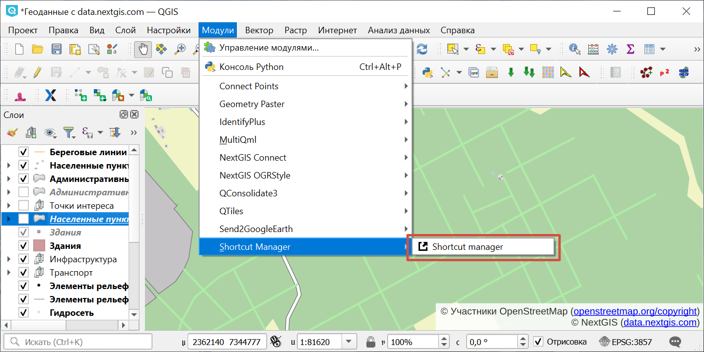
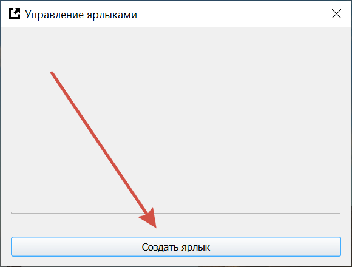
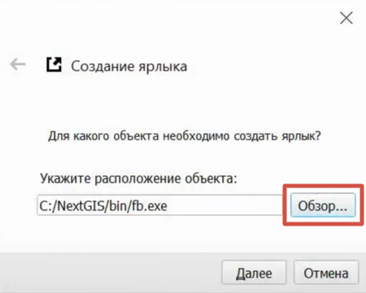
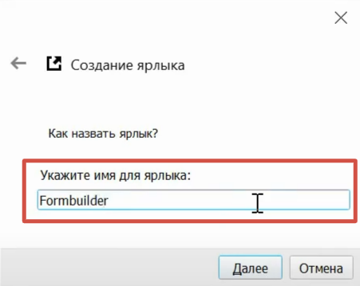
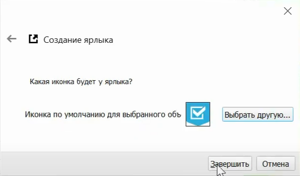
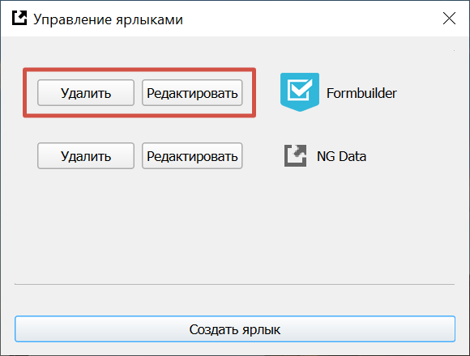

Shortcut Manager
==================

С модулем Shortcut Manager вы можете добавлять на панель инструментов в QGIS ярлыки внешних программ и веб-ссылок и запускать их прямо из QGIS.

После установки Shortcut Manager появится в меню "Модули".

   Shortcut Manager в меню "Модули"

* Запустите модуль и нажмите **Создать ярлык**.

   Интерфейс модуля
   

* Выберите программу с рабочего стола, укажите другой путь на устройстве или вставьте ссылку на веб-страницу.

* Задайте имя для ярлыка.

* Выберите иконку, которая будет использоваться.

* Нажмите **Завершить**.

Ярлык появится в панели инструментов в разделе модулей.

Ранее созданные ярлыки можно редактировать и удалять.

   Список добавленных ярлыков

Посмотрите примеры работы модуля в нашем видео:

.. raw:: html

   <iframe width="560" height="315" src="https://rutube.ru/play/embed/de06ca928f1b86556e7f9afeae871ede/" frameBorder="0" allow="clipboard-write; autoplay" webkitAllowFullScreen mozallowfullscreen allowFullScreen></iframe>

Смотреть на `youtube <https://youtu.be/VV0uLWJpaUY>`_, `rutube <https://rutube.ru/video/de06ca928f1b86556e7f9afeae871ede/>`_.
