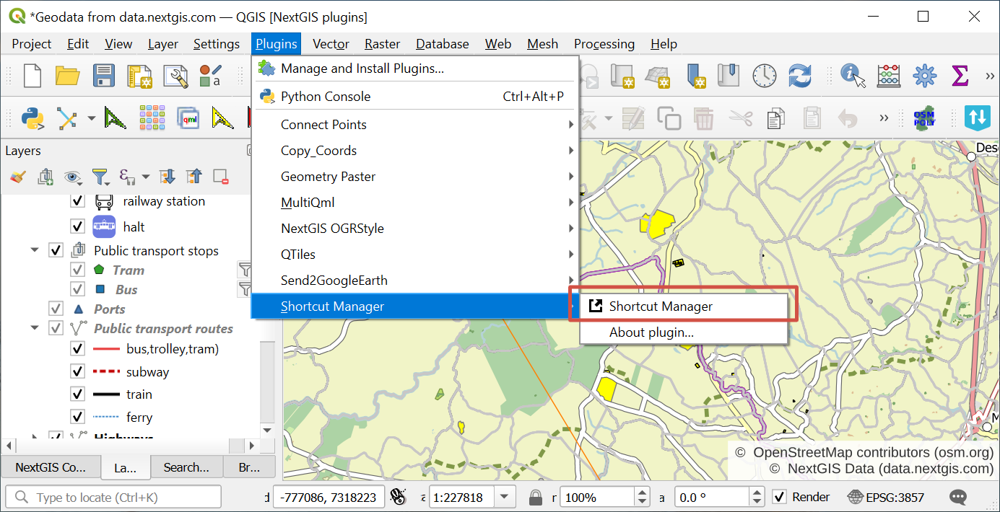
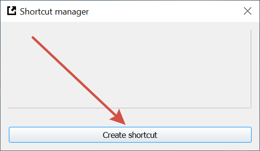
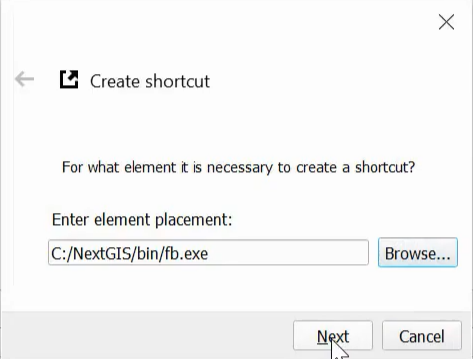
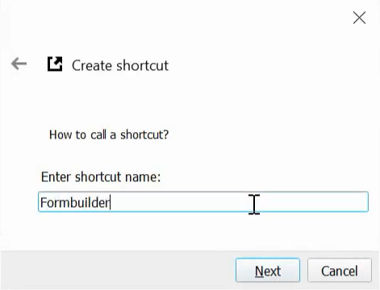
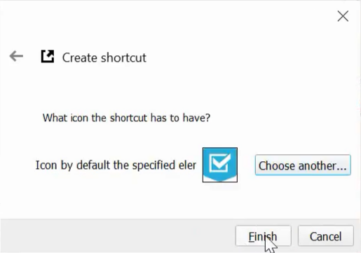
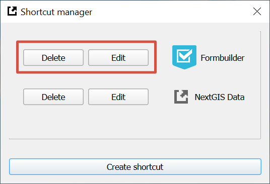

Shortcut Manager
==================

Create a shortcuts toolbar to run external programs and open web pages directly from QGIS .

After installation Shortcut Manager will appear in the Plugins menu.

   Shortcut Manager in the Plugins menu

* Activate the plugin and press **Create shortcut**.

   Plugin UI
   

* Select an app from your desktop, enter a path to a file on your device or a URL.

* Enter a name for the shorcut button.

* Select the icon.

* Press **Finish**.

The shortcut button will appear on the Plugins toolbar.

You can edit and delete the shortcuts.

   List of shortcuts

See how the plugin works in our video:

.. raw:: html

   <iframe width="560" height="315" src="https://www.youtube.com/embed/cVYAEHkRkG0?si=uxth8ukGbwpMRl1d" title="YouTube video player" frameborder="0" allow="accelerometer; autoplay; clipboard-write; encrypted-media; gyroscope; picture-in-picture; web-share" referrerpolicy="strict-origin-when-cross-origin" allowfullscreen></iframe>

Watch on `youtube <https://youtu.be/cVYAEHkRkG0?si=Pi8ikqmOAQ69lJBK>`_.
