.. _ngq_projections:

Проекции и системы координат
============================

В :program:`NextGIS QGIS` реализована возможность работы с проекциями. Проекция 
может быть установлена как глобально, т.е. её параметры будут применены к любому 
векторному слою, не содержащему информации о проекции, так и отдельно для проекта. 
Кроме того, существует возможность создания собственных проекций, а также реализована 
поддержка перепроецирования "на лету" для векторных и растровых слоёв. Все эти функции 
позволяют корректно отображать одновременно несколько слоёв, находящихся в различных 
проекциях.

Все проекции в :program:`NextGIS QGIS` основаны на базе идентификаторов European Petroleum Group (:term:`EPSG`) и Institut Geographique National of France (IGNF). EPSG-коды хранятся в базе данных 
и могут быть использованы для определения проекции.

Для корректной работы перепроецирования "на лету" слой должен содержать информацию о 
проекции, в которой хранятся данные, либо она должна быть определена самостоятельно 
на уровне слоя или проекта. Для слоёв PostGIS :program:`NextGIS QGIS` использует 
идентификатор проекции, определяемый в момент создания слоя. Для данных, хранящихся 
в форматах, поддерживаемых GDAL, информация о проекции должна быть представлена в 
соответствующем файле, структура которого определяется форматом. В случае ESRI Shapefile - 
это файл, содержащий описание проекции в формате :abbr:`WKT (Well Known Text)` и имеющий 
то же имя, что и ESRI Shapefile, но с расширением .prj. Например, для файла ``alaska.shp`` 
файлом описания проекции будет ``alaska.prj``.

Всякий раз, когда происходит выбор новой проекции, используемые единицы слоя автоматически
изменяются.

Почти всегда в NextGIS QGIS используется функция "преобразования 
координат на лету": слои хранятся в разных системах координат, а в составе карты они выводятся в одной. 

Систем координат очень много, однако для работы одновременно используется всего несколько. Наиболее популярные следующие системы координат:  

* WGS 84 (EPSG:4326) - в ней обычно хранятся векторные данные. Единица измерения
  - градусы. Новые векторные файлы сохраняйте в ней. Если отобразить геоданные в этой системе координат  
  без перепроецирования, то картинка будет сплющенной.
  
.. figure:: _static/projections_4326.png
   :name: projections_4326
   :align: center
   :width: 8cm

   Данные выведены на экран в EPSG:4326. 
   
* Pseudo Mercator (EPSG:3857) - используется для отображения. Включайте "перепроецирование
  на лету" в 3857, и карта будет отображаться более правильно.
    
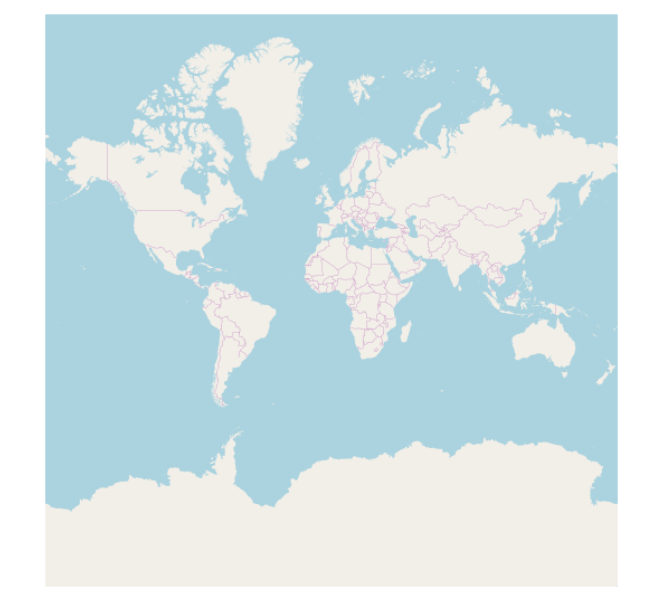

   Данные выведены на экран в EPSG:3857. 
   
* WGS 84 / UTM Zone X (EPSG:32610..32709) - используется для измерения расстояний. 
  Данные хранятся в метрах. Некоторые инструменты требуют её для корректной работы. 
  Так же в ней могут храниться космоснимки. Земной шар разделён на 60 зон, для 
  каждой определена своя проекция - свой код EPSG. 
      
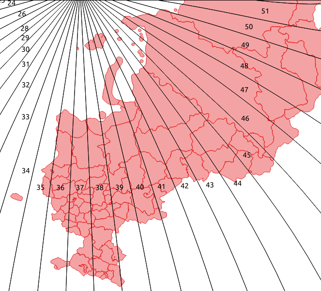

   Данные выведены на экран в EPSG:32637. Все зоны кроме 37-й искажены. 
  
* Pulkovo 1942 / Gauss-Kruger zone X (EPSG:28401..28432 и соседние) - устроена 
  так же как UTM, в ней хранятся привязанные листы советских топокарт (изданных 
  в последние годы). Также разделена на зоны. 
  
* Asia_North_Equidistant_Conic (EPSG:102026) - для вывода на экран карты России  
* North_Pole_Azimuthal_Equidistant (EPSG:102016) - для вывода на экран карты северного полюса    

.. _ngq_projections_operations:

Основные операции с проекциями
==============================

.. _ngq_projections_findout:

Как узнать систему координат слоя
~~~~~~~~~~
 
``Слой ‣ Свойства слоя ‣ Вкладка Информация ‣ Система координат``. 

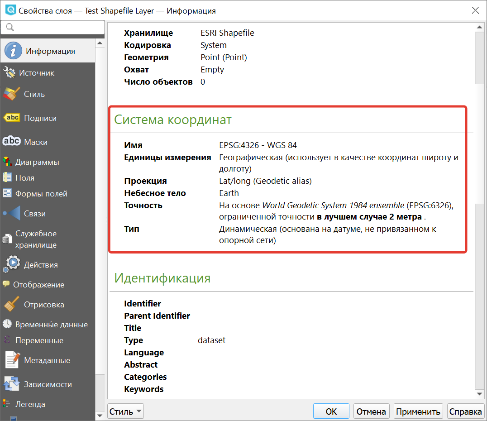
   
   Информация о системе координат слоя

Это значение можно менять. Систему координат, сохранёную в слое, можно узнать  
``Слой ‣ Свойства слоя ‣ Вкладка Метаданные ‣ Вкладка Охват ‣ раздел Система координат``. Можно выбрать один из двух вариантов: 

* Использовать систему координат слоя
* Использовать систему координат источника

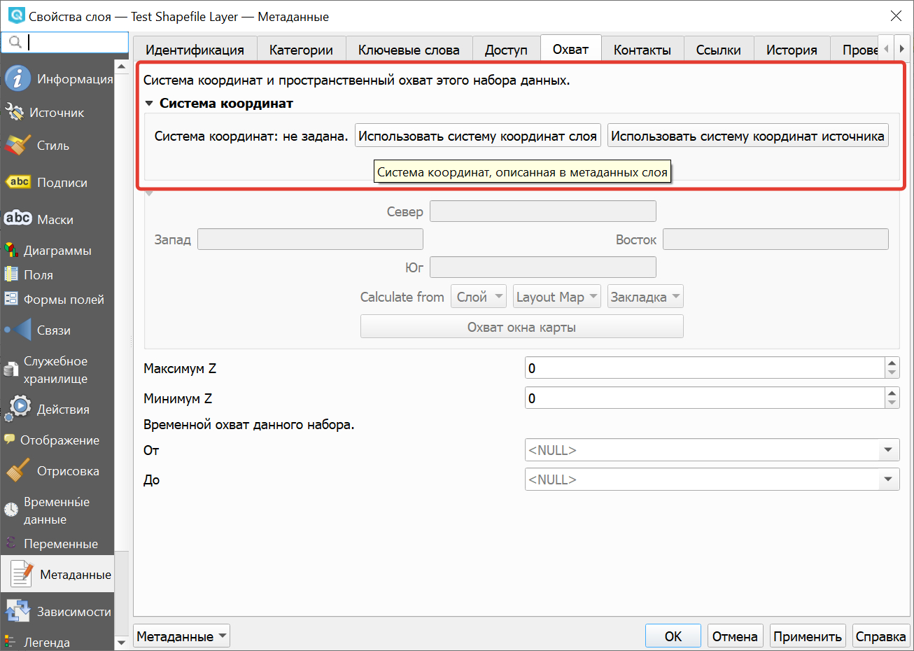
   
   Изменение системы координат слоя

.. _ngq_projections_menu:

Открытие окна преобразования координат
~~~~~~~~

В правом нижнем углу нажмите вторую справа кнопку. 

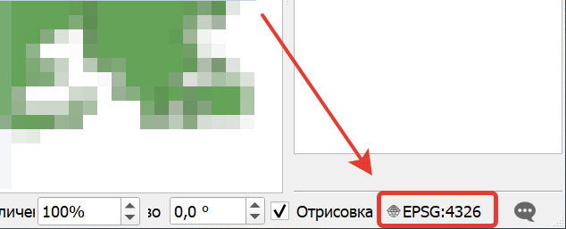
   
   Кнопка вызова окна преобразования координат

Если картинка на карте сплющена по вертикали
~~~~~~~~

Если вы добавили геоданные на карту, и картинка сплющенная, то выберите систему координат EPSG:3857. Это значит, что ваши геоданные были в градусах.

Пересохранение слоёв в другую систему координат
~~~~~~~~

Для некоторых операций требуется пересохранить слои в другую систему 
координат. В этом случае выберите ``Слой ‣ Сохранить как``, и выберите 
систему координат в диалоге сохранения. 

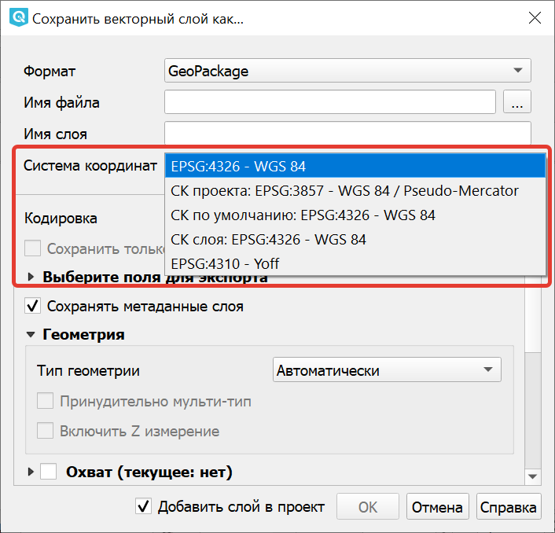
   
   Выбор системы координат при сохранении слоя

.. _ngq_projections_utm:

Как узнать номер зоны UTM или Gauss-Kruger
~~~~~~~~

В окне поиска QMS ввести запрос "utm". В результатах будет слой "UTM and Gauss Krueger 6 degree zones" - это разграфка на весь мир в формате GeoJSON.

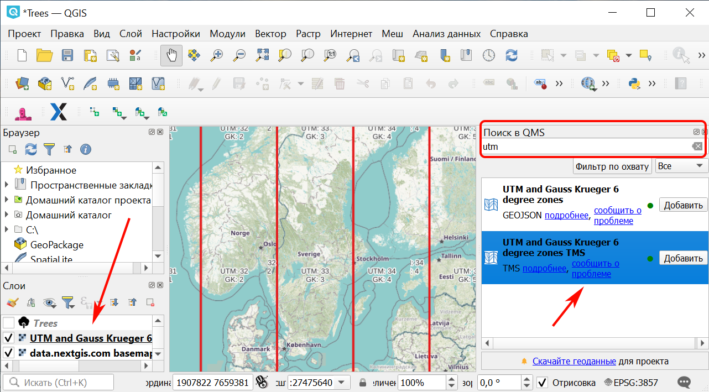
   
   Добавление сетки зон UTM

.. _ngq_projections_setup:

Установка проекции
==================

:program:`NextGIS QGIS` создаёт новые проекты с использованием системы координат 
по умолчанию. Изначально используется система координат EPSG:4326 - WGS 84. Это 
значение можно изменить, ``Настройки ‣ Параметры ‣ Вкладка Система координат ‣ Подвкладка CRS Handling `` (см. рисунок :numref:`ngmobile_coordinate_systemc_configuration_handl_pic`). 
Указанное значение будет использоваться по всех последующих сеансах работы.

Первая вкладка настроек систем координат окна Параментры представлена на рисунке см. :numref:`ngmobile_coordinate_systemc_configuration_handl_pic`:

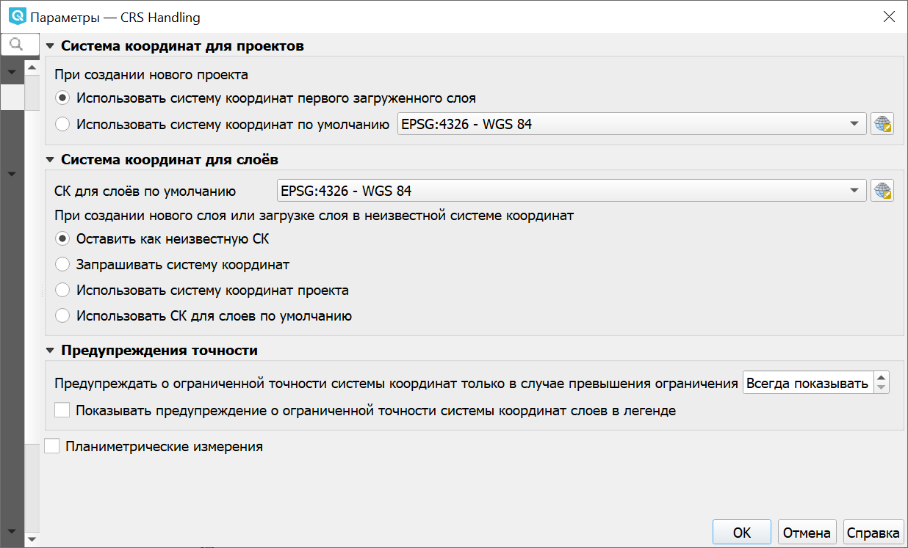
   
   Настройки системы координат, вкладка CRS Handling

При загрузке в проект слоёв, не содержащих информации о проекции, необходимо иметь 
возможность контролировать и определять проекции таких слоёв. Проекции могут быть 
установлены глобально или на уровне проекта. Для выполнения этой операции перейдите 
во вкладку "Система координат" в диалоге "Параметры".

На рисунке :numref:`ngmobile_coordinate_systemc_configuration_handl_pic` показаны 
возможные варианты:

1. Оставить как неизвестную систему координат.
2. Запрашивать систему координат.
3. Использовать систему координат проекта.
4. Использовать систему координат для слоёв по умолчанию.

Если необходимо задать проекцию для слоя, в котором информация о ней отсутствует, 
то это можно сделать во вкладке "Общие" окна свойств растрового или 
векторного слоя.
 
Контекстное меню слоя содержит два элемента для работы с системой координат. 

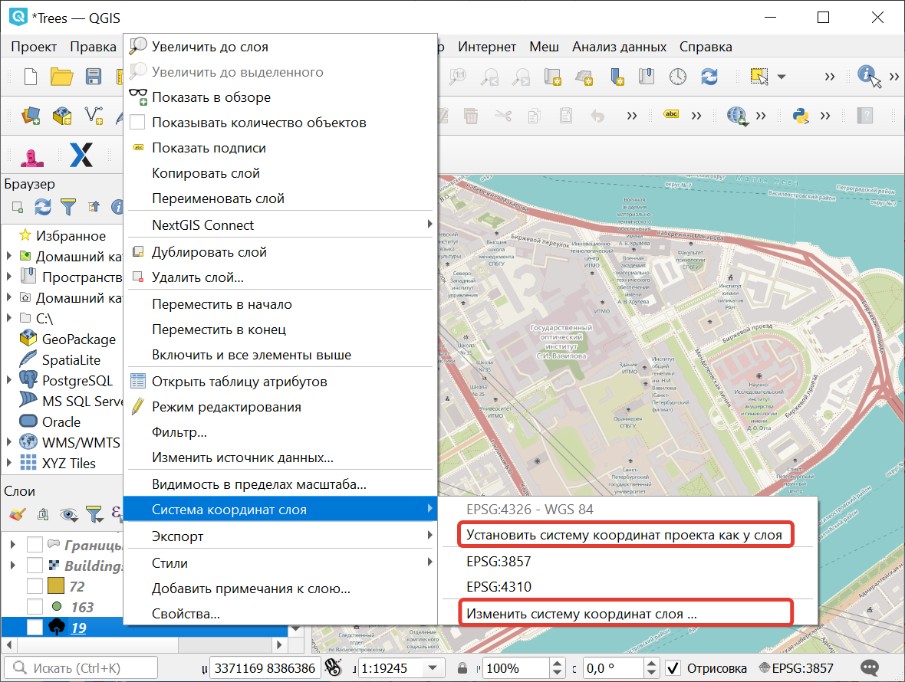
   
   Элементы работы с системой координат в контекстном меню слоя

Пункт меню "Изменить систему координат" вызывает диалог "Выбор системы координат". 

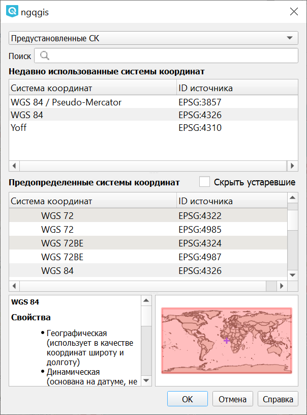
   
   Окно выбора системы координат слоя

А пункт "Выбрать систему координат слоя для проекта" устанавливает систему координат 
проекта, равной системе координат слоя.

NextGIS QGIS поддерживает перепроецирование растровых и векторных слоёв "на лету". Загружаемые слои будут автоматически перепроецироваться в выбранную проекцию.

Вкладка "Система координат" диалогового окна "Свойства проекта" содержит несколько важных 
компонентов, показанных на рисунке и описанных ниже.

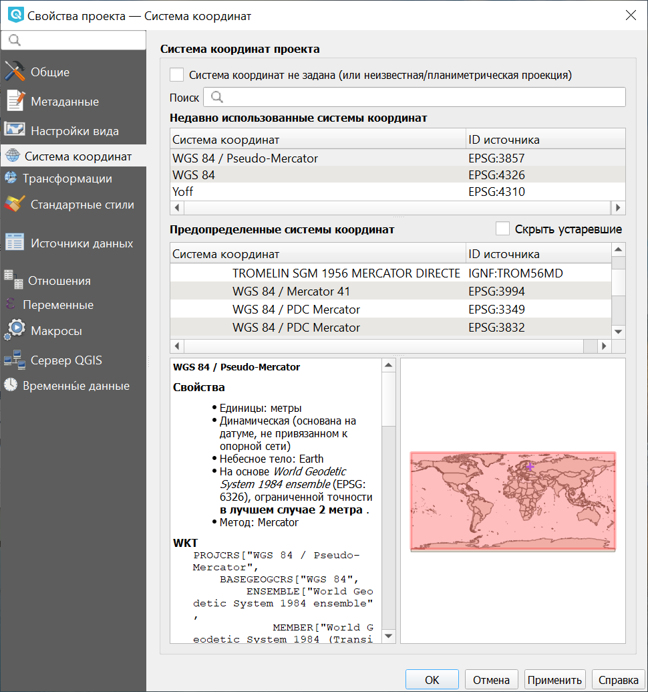
   
   Вкладка "Система координат" в диалоговом окне "Свойства проекта"

1. Переключатель "Система координат не задана".
2. Поиск - если вам известен код EPSG, идентификатор или имя проекции, то можно 
   воспользоваться поиском. Введите идентификатор и нажмите кнопку "Найти". Отметьте
   "Скрыть устаревшие системы координат", чтобы показывать только используемые в настоящее 
   время проекции.
3. Недавно использованные системы координат - если имеются определённые наиболее 
   часто используемые в проектах проекции, то они будут доступны в таблице, расположенной 
   в верхней части диалога Выбор системы координат. Нажмите на одну из строк, чтобы 
   выбрать эту систему координат.
4. Предопределенные системы координат - список проекций, поддерживаемых NextGIS QGIS, включая географические,
   прямоугольные и пользовательские. Для выбора проекции выделите её имя в списке, 
   предварительно развернув нужный узел. Текущая проекция выделена цветом.
5. Окно свойств СК. Содержит также текстовое представление системы координат в форматах WKT и Proj4 и данные об охвате. Данный текст доступен только для чтения и используется в качестве справочной информации.
6. Визуализация охвата системы координат

Если открыть "Свойства проекта" из меню "Проекты", то для доступа к настройкам проекций нужно перейти 
во вкладку "Система координат". Если же воспользоваться кнопкой "Преобразование координат", то вкладка 
"Система координат" откроется автоматически.

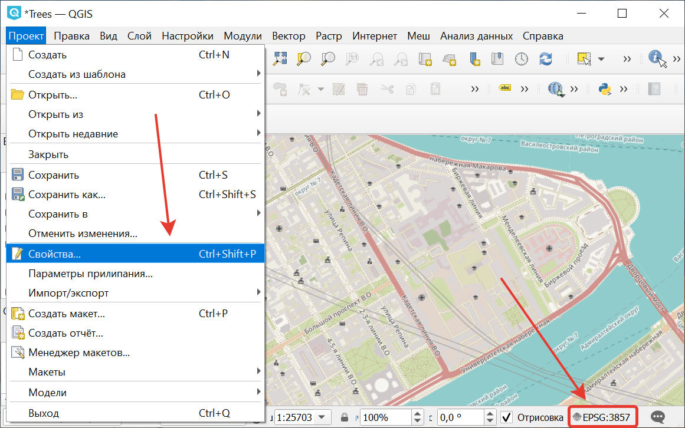
   
   Два пути вызова окна "Свойства проекта"

.. _ngq_custom_projections:

Добавление пользовательской СК (или местной системы координат)
==============================================================

Если вы не нашли в списке проекций нужной проекции, то вы можете задать собственную. Это может понадобиться, например, если вы работаете в РФ с местными системами координат (МСК). В таком случае, у вас вероятно есть геоданные с координатами, которые при открытии в NextGIS QGIS не ложатся на другие слои, или же NextGIS QGIS спрашивает систему координат при открытии.

Для добавления пользовательской системы координат вам сначала нужно получить описание в формате WKT или PROJ.4. После того как это сделано, перейдите в ``Настройки ‣ Параметры ‣ Системы координат и преобразования`` ``‣ вкладка Заданные пользователем СК``.

Заполните следующие поля:

1. Имя.
2. Формат (рекомендуется WKT, можно также использовать PROJ.4).
3. Картографические параметры в выбранном формате.

Затем нажмите кнопку **"Проверить"**, чтобы убедиться, что все параметры введены верно. После успешной проверки нажмите **ОК**.
Также можно проверить создаваемую СК при помощи значений широты и долготы WGS-84. Введите их в соответствующие поля, нажмите кнопку "Рассчитать" и сравните результат с известными значениями вашей проекции :numref:`user_coordinate_system_pic`).

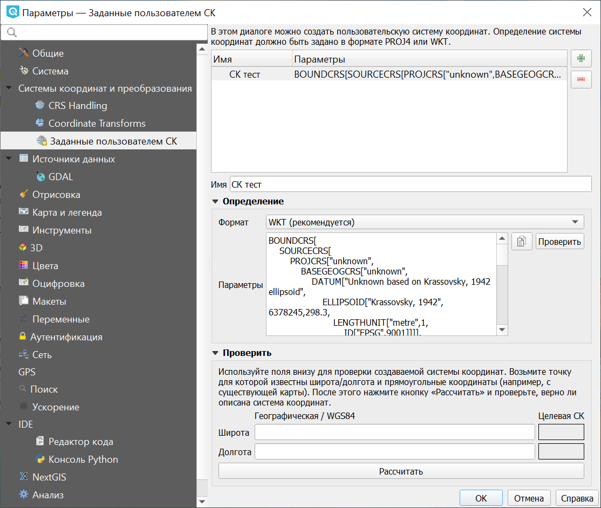

   Пользовательская система координат

