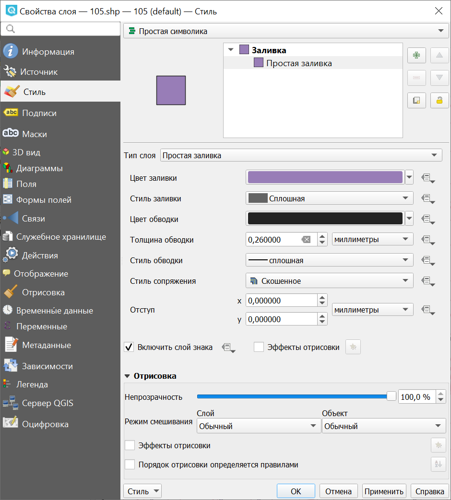
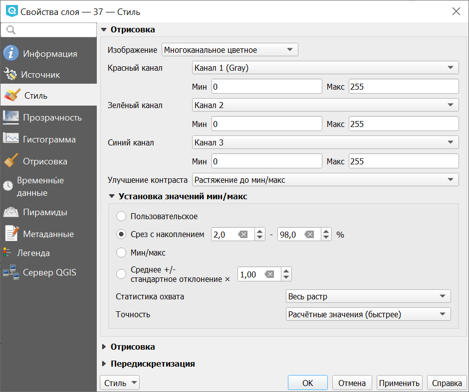

.. sectionauthor:: Дмитрий Барышников <dmitry.baryshnikov@nextgis.ru>
.. sectionauthor:: Артём Светлов <artem.svetlov@nextgis.ru>

.. _ngqgis_styling:

Настройка векторных стилей
-----------------------------

Картостиль - это описание цветов, текстур, значков, толщины линий, подписей и прочих 
особенностей отображения слоёв на экране. Эти настройки хранятся отдельно от географических 
данных, их можно сохранять в отдельные файлы и копировать между слоями. Настройка 
осуществляется через ``Слой ‣ Свойства слоя ‣ Оформление`` 
или ``Слой ‣ Свойства слоя ‣ Подписи``. Для каждого слоя задаётся отдельное оформление.

.. _ngq_vector_styles:

Настройка оформления векторных слоёв
^^^^^^^^^^^^^^^^^^^^^^^^^^^^^^^^^^^^^^^^^^^^^^^^^^^^^^^^^^^^^

В описании об оформлении векторного слоя используется 3 типа символов: 

1. Тип символов.
2. Тип символьного слоя.
3. Тип классификации. 

* **Тип символа** - символы различаются по типу: для точечных, линейных и полигональных 
слоёв символы различаются. Это не изменяется. Сами символы могут состоять из одного или 
нескольких символьных слоёв. 

.. figure:: _static/styles_type1.png
   :height: 5cm
   :align: center

   Примеры символов для точечных, линейных и полигональных слоёв.

* **Тип символьного слоя** - задаёт способ заливки: цветом, штриховкой, SVG, маркерами, 
  или способ рисования линии: пунктирная линия, линия из маркеров.

.. figure:: _static/styles_layer_type_point_ru.png
   :width: 14cm
   :align: center
   

   
.. figure:: _static/styles_layer_type_polygon_ru.png
   :width: 14cm
   :align: center

   Варианты типов символьного слоя доступные для точечных, линейных и полигональных слоёв.

* **Тип классификации** - задаёт способ, как рисовать разные символы для разных объектов 
  в одном слое: все одинаково или по-разному. 

   Варианты типов классификации
    

Для настройки стиля выделите нужный стиль в списке слоёв, и откройте окно настройки стиля: 
``Слой ‣ Свойства слоя ‣ Стиль``.

   Окно настройки стиля в режиме классификации Обычный знак, которое открывается по умолчанию.

   Цифрами обозначено: 1. Список типов классификации. 2. Изображение знака. 3. Список символьных слоёв в текущем символе. 4. Кнопки добавления-удаления символьных слоёв. 5. Параметры знака. 6. Библиотека знаков.

Если в списке символьных слоёв выбрать один слой, то появится окно настроек символа.
Его вид будет разным в зависимости от выбранного типа символьного слоя.

   Окно настроек символа

.. tip:: См. так же http://www.qgistutorials.com/ru/docs/basic_vector_styling.html.

Доступные типы символьных слоёв
^^^^^^^^^^^^^^^^^^^^^^^^^^^^^^^^^^^^^^^^^^^^^^^^^^^^^^^

* Для точечных слоёв:

  * **Эллипс**: отрисовка с использованием геометрических примитивов (эллипс, прямоугольник, треугольник, перекрестие).
  * **Маркер с заливкой**: маркер представляет собой фигуру, имеющую контур и заливку (цвет, градиент, штриховка и т.п.).
  * **Шрифтовой маркер**: отрисовка с использованием определенного символа заданного шрифта.
  * **Генератор геометрии**: при помощи синтаксических выражений позволяет генерировать геометрию в процессе отрисовки.
  * **Маска**: используется для улучшения читаемости маркеров нескольких слоев, близких по цвету.
  * **Растровый маркер**: позволяет использовать в качестве маркера растровое изображение.
  * **Простой маркер**: (по умолчанию) отрисовка с использованием одного из предустановленных маркеров.
  * **SVG маркер**: отрисовка с использованием SVG изображения.
  * **Маркер векторного поля**: отрисовка векторным полем с использованием значений атрибутивной таблицы.

* Для линейных слоёв:

  * **Стрелка**: добавляет элементы оформления, например, стрелку для указания направления линии.
  * **Генератор геометрии**: при помощи синтаксических выражений позволяет генерировать геометрию в процессе отрисовки.
  * **Штрихи вдоль линии**: линия отрисовывается повторяющимися короткими отрезками, перпендикулярными ее направлению.
  * **Интерполированная линия**: от одного конца линии к другому меняются ее толщина (или размер составляющих ее маркеров) и цвет.
  * **Линия с градиентной заливкой**: переход цвета перпендикулярно направлению линии.
  * **Маркерная линия**: отрисовка линии повторением маркерного символа.
  * **Линия из растров**: отрисовка линии повторением растрового изображения.
  * **Простая линия**: обычная отрисовка линии (с указанными шириной, цветом и стилем).

* Для полигональных слоёв:

  * **Отрисовка центроидов**: отрисовка центроида полигона при помощи одного из предустановленных маркеров.
  * **Генератор геометрии**: при помощи синтаксических выражений позволяет генерировать геометрию в процессе отрисовки.
  * **Градиентная заливка**
  * **Заливка штриховкой**: заливка полигона линейной штриховкой.
  * **Заливка точками**: заливка полигона регулярно расположенными точками заданного вида.
  * **Заливка маркерами со случайным размещением**: заливка полигона заданными маркерами, разбросанными случайным образом.
  * **Заливка растром**: использование растрового изображения для заливки.
  * **Заливка SVG узором**: Заливка полигона SVG изображением.
  * **Заливка градиентом из центра**
  * **Простая заливка**: обычная отрисовка полигона (с определенным цветом заливки, шаблоном заливки и контуром).

  * **Обводка: Стрелка**: добавляет элементы оформления (например, кружки) к контуру полигона.
  * **Обводка: Штрихи вдоль линии**: контур отрисовывается повторяющимися короткими отрезками, перпендикулярными ее направлению.
  * **Обводка: Интерполированная линия**: от одного конца линии к другому меняются ее толщина (или размер составляющих ее маркеров) и цвет.
  * **Обводка: Линия с градиентной заливкой**: переход цвета перпендикулярно направлению контура.
  * **Обводка: Маркерная линия**: контур отрисовывается путем повторения маркерного символа.
  * **Обводка: Линия из растров**: отрисовка контура повторением растрового изображения.
  * **Обводка: простая линия**: обычная отрисовка контура (с указанными шириной, цветом и стилем).

Доступные типы классификации слоев
^^^^^^^^^^^^^^^^^^^^^^^^^^^^^^^^^^^^^^^^^^^^^^^^^^^^^^^

Возможные типы классификации слоев зависят от типа геометрии слоя.

Для слоев с **любой геометрией** доступны следующие типы: 

  * Без отрисовки
  * Простая символика (по умолчанию)
  * Символизация по уникальным значениям
  * Символизация по диапазонам значений
  * Символизация на основе правил
  * Встроенные символы (для слоев, содержащих встроенные стили)

Только для слоев с **точками** доступны помимо того:

  * Смещение накладывающихся точек
  * Кластеризация точек
  * Тепловая карта

Для слоев с **линиями** доступна также:

  * Символизация с автоматическим объединением объектов

Для слоев с **полигонами** доступны также:

  * Символизация с автоматическим объединением объектов
  * Инвертированные полигоны
  * 2.5 D

Простая символика
~~~~~~~

Используется для отрисовки всех элементов слоя с использованием одного, определенного пользователем, символа. Свойства, которые можно задать во вкладке "Стиль", частично зависят от типа слоя.

   Диалог отрисовки обычным знаком

Символизация по уникальным значениям
~~~~~~~

Объекты с разным значением какого-нибудь атрибута рисуются разными цветами.

Отрисовка уникальными значениями используется для отрисовки всех элементов слоя 
единым, определенным пользователем, символом, цвет которого отражает значение выбранного 
атрибута элемента. Вкладка "Стиль" позволяет выбрать:

1. Поле (в списке полей).
2. Знак (в диалоге Выбор условного знака).
3. Градиент (в списке цветовых шкал).

Кнопка Дополнительно в нижнем левом углу окна позволяет указать поля с 
информацией о вращении и масштабе. Для удобства список в нижней части вкладки 
показывает значения всех заданных на данный момент атрибутов, включая символы, к 
которым в будущем будет применена отрисовка.
Рисунок :numref:`ngmobile_dialogue_rendering_unique_values_pic` иллюстрирует 
диалог отрисовки уникальными значениями из демонстрационного набора данных NextGIS QGIS:

   Диалог отрисовки уникальными значениями

Можно создавать свои градиенты, выбрав "Новый градиент" из выпадающего списка "Градиент".
В появившемся окне можно выбрать тип градиента: "Градиент", "Случайный" или
"ColorBrewer", для каждого из которых можно задать желаемое количество цветов. 

Символизация по диапазонам значений
~~~~~~~~~~~~~~~~~~~~~~~~~~~~~~~~~~~~~~~

Цвет будет плавно изменяться в зависимости от числового значения какого-либо атрибута, но только числового типа. 
Если у вас в слое числа записаны в поле строкового типа, то в калькуяторе полей их можно сконвертировать в новое поле числового типа.
 
.. figure:: _static/graduated_mark_ru.png
   :name: ngqgis_graduated_mark_pic
   :align: center
   :width: 16cm

   Фрагмент диалога свойств слоя - Градуированный знак

Символизация на основе правил
~~~~~~~~~~~~~~~~~~~~~~~~~~~~~~~~~~

Используется для отрисовки всех элементов слоя с помощью символов, базирующихся на 
определенных правилах. Задаётся несколько выражений/правил. Каждое выражение выдаёт 
несколько записей и оформляется по-своему. Может быть разным не только цвет, но и 
другие параметры.

   
   Фрагмент диалога свойств слоя - Символизация на основе правил

Смещение накладывающихся точек
~~~~~~~~~~~~~~~~~~~~~

Только для точечных слоёв. В данном стиле при задании значения расстояния 
между точками точки группируются с учетом значения расстояния между точками. Далее при отображении на карте внутри группы точек 
выбирается точка, вокруг которой выстраиваются остальные точки: по кругу, концентрическими кругами или в узлах сетки.

.. figure:: _static/styles_point_offset.png
   :name: ngqgis_styles_point_offset_pic
   :align: center
   :height: 12cm

   Фрагмент карты после применения стиля "Смещение накладывающихся точек"

Кластеризация точек
~~~~~~~~~~~~~~~~~~

Только для точечных слоёв. Точки группируются с учетом заданного расстояния между ними. При отображении на карты на месте группы точек отображается один маркер с числом, показывающим количество точек в группе. При изменении масштаба точки перегруппируются.

   Фрагмент карты после применения стиля "Кластеризация точек"

Тепловая карта
~~~~~~~~~~~~~~~~~

Вся карта заливается фоновым цветом (можно сделать прозрачным). Вокруг каждой точки 
рисуется размытый круг, если рядом много точек, то круг более насыщенный.

.. figure:: _static/styles_heatmap_00.png

   Исходные точки

.. figure:: _static/styles_heatmap_01.png

   Теплокарта с настройками по умолчанию

Параметры теплокарты можно настроить в свойствах слоя.

.. figure:: _static/styles_heatmap_dialog_ru.png
   :name: styles_heatmap_dialog_pic
   :align: center
   :width: 16cm
   
   Настройки теплокарты

В настройках градиента можно выбрать свои цвета, в том числе прозрачный. 

.. figure:: _static/styles_heatmap_02_owngradient.png

   Свой градиент

.. figure:: _static/styles_heatmap_03_gradienttransparent.png

   Градиент, начинающийся с прозрачного цвета

Градиент может быть как непрерывным, так и дискретным. Для того, чтобы настроить этот параметр, нажмите на изображение градиента.

.. figure:: _static/heatmap_discrete_ru.png
   :name: heatmap_discrete_pic
   :align: center
   :width: 16cm
   
   Дискретный градиент

Качество отрисовки обозначает размер пикселей.

.. figure:: _static/styles_heatmap_04_quick.png

   Самый быстрый

.. figure:: _static/styles_heatmap_05_quality.png

   Самый качественный

.. figure:: _static/styles_heatmap_06_discret-quality.png

   Дискретный градиент - качественный

.. figure:: _static/styles_heatmap_07_discret-quick.png

   Дискретный градиент - быстрый

.. figure:: _static/styles_heatmap_08_bigradius.png

   Средний радиус

.. figure:: _static/styles_heatmap_09_smallradius.png

   Радиус увеличен

.. figure:: _static/styles_heatmap_10_radiusverybig.png

   Радиус уменьшен

.. figure:: _static/styles_heatmap_11_maxvalueauto.png

   Максимальное значение - авто

.. figure:: _static/styles_heatmap_11_maxvaluelow.png

   Максимальное значение занижено

.. figure:: _static/styles_heatmap_13_complexgradient.png

   Сложный градиент с промежуточными цветами.

Теплокарта может отражать не только плотность концентрации точек, но и другие параметры, для этого нужно выбрать соответствующий атрибут в поле "Взвешивание точек".

.. figure:: _static/styles_heatmap_14_weightauto.png

   Взвешивание - автоматическое. Интенсивность обозначает концентрацию точек.

.. figure:: _static/styles_heatmap_15_weightattr.png

   Взвешивение - по атрибуту (количество мест). Интенсивность обозначает 
   суммарное количество мест в заведениях.

Символизация с автоматическим объединением объектов
~~~~~~~~~~~~~~~~~~~~~~~~~~~~~~~~

Доступна для полигональных и линейных слоев. Соприкасающиеся объекты объединяются и отрисовываются как один.

.. figure:: _static/styles_all_outlies_ru.png
   :name: styles_all_outlies_pic
   :align: center
   :width: 16cm
   
   Обычный стиль: показаны границы районов
   

   
   Автоматическое объединение объектов: показана только общая внешняя граница города

Инвертированные полигоны
~~~~~~~~~~~~~~~~~~~~~~~~~

Только для полигональных слоёв. При использовании данного стиля (вкладка "Свойства слоя ‣ Стиль") 
происходит заливка цветом областей за пределами полигона (снаружи полигона), сам 
полигон остается прозрачным. 

.. figure:: _static/styles_inverted_polygons.png
   :name: ngqgis_styles_inverted_polygons_pic
   :align: center
   :width: 12cm

   Фрагмент карты До и После применения стиля "Инвертированные полигоны".

2.5 D
~~~~~~~~~~

Доступно только для полигональных слоев. Представляет полигоны как имеющие определенную толщину, с видимой сбоку "стенкой". Можно задать цвет и прозрачность "крыши" и "стенки" объемного полигона.

   
   Районы города отрисованы в режиме 2.5D

Рисование своих условных обозначений в SVG
^^^^^^^^^^^^^^^^^^^^^^^^^^^^^^^^^^^^^^^^^^^^^^^^^^^^^^^^^^^^^

Если вам нужны специальные значки, то вы можете нарисовать их сами в формате svg, поместить файл в интернете, и поставить его URL в качестве пути к значку SVG. 

SVG - открытый формат для векторных картинок, внутри него XML, описывающий линии и фигуры. Картинки в этом формате рисуются в Inkscape, CorelDRAW. Так же в принципе эти файлы можно писать вручную: http://svgpocketguide.com/book/
Большая коллекция значков в SVG есть на Wikimedia Commons - https://commons.wikimedia.org/wiki/Category:SVG_icons, туда можно добавлять и свои. Если вам например нужен логотип известной организации, то возможно он там есть.

Для добавления своего значка в стиль QGIS или в стиль для слоя nextgis.com нужно:

1. Поискать его на https://commons.wikimedia.org, и взять URL файла SVG.
2. Если значка под подходящей лицензией нет, то нарисовать его самому в Inkscape, 
3. Поместить файл на какой-нибудь сервер видимый из Интернета. Если ваш значок не нарушает авторских прав, то логичнее всего поместить его на https://commons.wikimedia.org, что бы его могли использовать другие люди. Так же можно положить в свой репозиторий на github или gitlab.
4. Вставить URL файла SVG в окно настройки стиля --> путь к файлу SVG. Этот же стиль можно использовать и в nextgis.com

Если вы работаете только в QGIS, без nextgis.com, то можно использовать путь к файлу на жёстком диске, но это менее надёжно, потому что вы можете о нём забыть, перенести файл значка, и стиль перестанет рисоваться.

.. figure:: _static/webmap_svg_ru.png
   :name: webmap_svg_pic
   :align: center
   :width: 16cm
   
   Пример использования кастомизированного значка

Эффекты отрисовки
^^^^^^^^^^^^^^^^^^^^^^^^^^^^^^^^^^^^^^^^^^^^^^^^^^^^^^^^^^^^^

Для всех режимов отображения можно задать эффекты отрисовки слоя - как например 
тень, свечение, внешнюю или внутреннюю линию.

.. figure:: _static/styles_effects.png
   :align: center
   :width: 12cm

   Фрагмент карты с различными отрисовками

.. _ngq_save_style:

Сохранение стиля
^^^^^^^^^^^^^^^^^^^^^^^^^^^^^^^^^^^^^^^^^^^^^^^^^^^^^^^^^^^^^

Стиль можно сохранить в файл. В нём сохранится настройки оформления и настройки подписей. 

   Диалог сохранения стиля

В окне свойства стиля нажмите на кнопку "Стиль" (см. :numref:`ngqgis_styles_save`). 

По нажатию на кнопку "Сохранить настройки по умолчанию" стиль сохранится в 
формате qml в каталоге, где лежит слой, с тем же названием. Теперь, если вы будете 
добавлять этот слой как новый, то NextGIS QGIS подхватит этот стиль.

Пункт " Сохранить стиль" - позволяет сохранить его в другой файл, а так же в формат sld.

.. _ngq_raster_styles:

Оформление растровых слоёв
---------------------------------

Для растровых слоёв существует 6 разных способа визуализации.

* Многоканальное цветное
* Палитра - уникальные значения
* Одноканальное серое
* Одноканальное псевдоцветное
* Теневой рельеф
* Изолинии

При всех способах визуализации можно задавать прозрачность, яркость, контрастность 
и тонирование в цвет. 

.. note::
   Настройки оформления различаются для разных форматов. Большее количество 
   настроек оформления существует для формата GeoTIFF, а для слоёв WMS и TMS 
   настроек оформления меньше.

**Многоканальное цветное**

Используйте этот способ оформления, если у вас многоканальный растр, например - 
цветной космоснимок или скан карты в RGB. 

   
   Настройки многоканального оформления растрового слоя

**Палитра - уникальные значения**

Картинка рисуется по данным из одного выбранного канала растра. Каждое значение 
растра рисуется отдельно заданным цветом. Этот формат встречается редко. Если вы откроете растр в формате gif, то по умолчанию выставится этот режим.

**Одноканальное серое**

Картинка рисуется по данным из одного выбранного канала растра, чёрно-белой.

Рассмотрим настройки растрового стиля на самом простом примере - цифровой модели рельефа. 
Это - GeoTIFF, пикселы которого имеют только одно значение (одноканальный) - высоты в метрах. 
Если бы это была фотография - то пикселы имели бы 3 значения - количества красного, зелёного и 
синего цвета (трёхканальный).

Высота меняется в диапазоне до нескольких тысяч метров. Для хранения значения из такого диапазона 
нужно 16 бит. Если значения изменяются в диапазоне от 0 до 255 - то они укладываются в 8 бит
и формат такого растра называется RGB.

После открытия растрового слоя, в окне настроек растрового стиля, в полях ``Мин`` и ``Макс``
выводятся крайние значения, которые встречаются в пикселах этого растра. Градиент заливки 
распределяется между ними. Если их поменять вручную, то градиент заливки изменится. 
Если нажать "Охват Текущий" и кнопку "Загрузить", то рассчитаются значения ``Мин`` и ``Макс``
для текущего охвата карты. 
   
**Одноканальное псевдоцветное**

Картинка рисуется по данным из одного выбранного канала растра, по цветному градиенту. 
Используйте этот способ оформления, если у вас одноканальный растр, например - цифровая 
модель рельефа (:abbr:`DEM (Digital elevation model)`).

В полях ``Мин`` и ``Макс`` выводятся крайние значения, которые встречаются в пикселах этого растра. 
Градиент заливки распределяется между ними. Если их поменять вручную, то градиент заливки изменится. 
Если нажать "Охват Текущий" и кнопку "Загрузить", то рассчитаются значения ``Мин`` и ``Макс`` 
для текущего охвата карты. 

.. figure:: _static/bandrander_pseudocolor_settings_ru.png
   :name: bandrander_pseudocolor_settings_pic
   :align: center
   :width: 20cm
   
   Настройки псевдоцветного отображения растрового слоя
   
**Теневой рельеф**

**Изолинии**

Картинка рисуется по данным из одного выбранного канала растра, например, содержащего данные о высоте рельефа. Точки, имеющие одинаковое значение, объединяются в линию. Можно выбрать стиль изолиний и шаг между ними. 

.. figure:: _static/bandrander_contours_settings_ru.png
   :name: bandrander_contours_settings_pic
   :align: center
   :width: 20cm
   
   Настройки изолиний для растрового слоя
   
   

.. _ngq_labeling:

Настройка подписей
---------------------------------

Подписи можно выводить у объектов векторных слоёв. Текст подписи можно брать либо из атрибута, 
либо рассчитывать выражением из значений нескольких атрибутов. Остальные свойства 
подписи - цвет, размер, положение, поворот - тоже можно получать из атрибутов.

Для настройки стиля выделите нужный стиль в списке слоёв и откройте окно настройки 
стиля: ``Слой ‣ Свойства слоя ‣ вкладка Подписи``.

В открывшемся окне в списке режима подписей выберите "Показывать подписи" для этого 
слоя. Затем в списке "Подписывать значениями" выберите поле, из которого будет получаться надпись.

Настройки подписей можно сохранить в файл стиля NextGIS QGIS (формат qml), вместе с оформлением.

Вкладка "Текст"
^^^^^^^^^^^^^^^^^^^^^^^^^^^^^^^

На вкладке "Текст" вы можете выбрать гарнитуру шрифта, размер букв, использовать изменение регистра символов.

.. figure:: _static/labels_settings_text.png
   :name: labels_settings_text
   :align: center
   :width: 16cm

   Окно свойств подписей, вкладка "Текст".

Вкладка "Форматирование"
^^^^^^^^^^^^^^^^^^^^^^^^^^^^^^^

На вкладке "Форматирование" можно настроить количество знаков после запятой, выводимых из полей типа ``Real``, 
и выравнивание многострочных подписей.

.. figure:: _static/labels_settings_formating.png
   :name: labels_settings_formating
   :align: center
   :width: 16cm

   Окно свойств подписей, вкладка "Форматирование". 

.. tip::
   Для переноса длинных подписей, рекомендуется в поле "Подписывать значениями" ввести формулу 
   wordwrap("NAME",15) - подпись будет получаться из атрибута NAME, и делиться на части не менее 15 
   символов разделённые пробелами. Это более гибкий способ.

.. figure:: _static/labels_settings_worldwrap.png
   :name: labels_settings_worldwrap
   :align: center
   :width: 16cm

   Окно свойств подписей, настройка переноса текста.

.. figure:: _static/labels_map_worldwrap.png
   :name: labels_map_worldwrap
   :align: center
   :width: 16cm

   Пример переноса текста.

Вкладка "Буфер"
^^^^^^^^^^^^^^^^^^^^^^^^^^^^^^^

На вкладке "Буфер" можно настроить рисование закрашеной области вокруг букв. 
В этом режиме они будут видны на любом фоне. 

.. figure:: _static/labels_settings_buffer.png
   :name: labels_settings_buffer
   :align: center
   :width: 16cm

   Окно свойств подписей, вкладка "Буфер".

.. figure:: _static/labels_demo_buffer.png
   :name: labels_demo_buffer
   :align: center
   :width: 16cm

   Пример подписи без буфера и с буфером.

Вкладка "Фон"
^^^^^^^^^^^^^^^^^^^^^^^^^^^^^^^

На вкладке "Фон" можно настроить рисование прямоугольного фона под надписями. 
В этом режиме карта начинает выглядеть более угловато и старомодно.

.. figure:: _static/labels_settings_background.png
   :name: labels_settings_background
   :align: center
   :width: 16cm

   Окно свойств подписей, вкладка "Фон".

.. figure:: _static/labels_demo_background.png
   :name: labels_demo_background
   :align: center
   :width: 16cm

   Пример подписи без фона и с фоном.

Вкладка "Тень"
^^^^^^^^^^^^^^^^^^^^^^^^^^^^^^^

На вкладке "Тень" можно настроить рисование тени под надписями. 
В этом режиме карта начинает выглядеть более сложно.

.. figure:: _static/labels_settings_shadows.png
   :name: labels_settings_shadows
   :align: center
   :width: 16cm

   Окно свойств подписей, вкладка "Тень".

.. figure:: _static/labels_demo_shadows.png
   :name: labels_demo_shadows
   :align: center
   :width: 16cm

   Пример подписи без тени и с тенью.

Вкладка "Размещение"
^^^^^^^^^^^^^^^^^^^^^^^^^^^^^^^

На вкладке "Размещение" можно настроить алгоритм, по которому подписи раздвигаются, 
что бы не накладываться друг на друга. 

Так же имеется возможность передвигать вручную и поворачивать отдельные подписи. 

.. figure:: _static/labels_settings_positioning.png
   :name: labels_settings_positioning
   :align: center
   :width: 16cm

   Окно свойств подписей, вкладка "Размещение".

При создании карт значительное время занимает подбор расположения подписей на карте. 
Это влияет на читаемость карты, и необходимый размер или масштаб. NextGIS QGIS обладает 
большими возможностями по автоматическому раздвиганию подписей. В зависимости от настроек 
зритель может быстрее и точнее считывать карту. 

**Для точечных слоёв**

.. figure:: _static/labels_demo-1-cartografic.png
   :name: labels_demo-1-cartografic
   :align: center
   :width: 16cm

   Пример размещения точечных подписей в режиме Сartografic. Для точечных подписей 
   это рекомендуемый алгоритм. Он делает как написано в учебниках: пытается сначала 
   поставить подпись в правую-верхнюю сторону от точки.   

.. figure:: _static/labels_demo-2-vokrug.png
   :name: labels_demo-2-vokrug
   :align: center
   :width: 16cm

   Пример размещения точечных подписей в режиме "Вокруг точки". Это старый алгоритм, 
   который был до Cartografic.

.. figure:: _static/labels_demo-3-center.png
   :name: labels_demo-3-center
   :align: center   
   :width: 16cm

   Пример размещения точечных подписей в режиме "На расстоянии от точки" без смещения. 
   Подписи закрывают точки. Видно, что шоссе проходят прямо через Бутурлино.

.. figure:: _static/labels_demo-4-right.png
   :name: labels_demo-4-right
   :align: center
   :width: 16cm

   Пример размещения точечных подписей в режиме "На расстоянии от точки" со смещением. 
   Все точки подписаны справа.

**Для линейных слоёв**

.. figure:: _static/labels_demo-11-poverh.png
   :name: labels_demo-11-poverh
   :align: center
   :width: 16cm

   Пример размещения линейных подписей в режиме "Поверх линий".

.. figure:: _static/labels_demo-12-upper.png
   :name: labels_demo-12-upper
   :align: center
   :width: 16cm

   Пример размещения линейных подписей в режиме "Над линиями". 
   Обратите внимание, что такие надписи не загораживают трамвайные линии на улицах.

.. figure:: _static/labels_demo-13-upper-lower.png
   :name: labels_demo-13-upper-lower
   :align: center
   :width: 16cm

   Пример размещения линейных подписей в режиме "Над линиями" и "Под линиями". 
   Так нарисовалось больше надписей. 

**Для полигональных слоёв**

.. figure:: _static/labels_demo-21-s.png
   :name: labels_demo-21-s
   :align: center
   :width: 16cm

   Пример размещения линейных подписей в режиме "На расстоянии от центроида".

.. figure:: _static/labels_demo-22-c.png
   :name: labels_demo-22-c
   :align: center
   :width: 16cm

   Пример размещения линейных подписей в режиме "Вокруг центроида".

.. figure:: _static/labels_demo-23-per.png
   :name: labels_demo-23-per
   :align: center
   :width: 16cm

   Пример размещения линейных подписей в режиме "По периметру".

.. figure:: _static/labels_demo-24-hor.png
   :name: labels_demo-24-hor
   :align: center
   :width: 16cm

   Пример размещения линейных подписей в режиме "Горизонтальное".
   

.. figure:: _static/labels_demo-25-free.png
   :name: labels_demo-25-free
   :align: center
   :width: 16cm

   Пример размещения линейных подписей в режиме "Свободное".

Вкладка "Отрисовка"
^^^^^^^^^^^^^^^^^^^^^^^^^^^^^^^

На вкладке "Отрисовка" можно настроить алгоритм, по которому некоторые подписи скрываются, 
что бы не накладываться друг на друга.

.. figure:: _static/labels_settings_drawing.png
   :name: labels_settings_drawing
   :align: center
   :height: 12cm

   Окно свойств подписей, вкладка "Отрисовка".

Перемещение подписей
^^^^^^^^^^^^^^^^^^^^^^^^^^^^^^^^^^^^^^^^^^^^^^^^^^^^^^^^^^^^^

Если вам нужно управлять размещением подписей, то в NextGIS QGIS это можно делать 3 способами:

1. Простой способ: подобрать настройки в окне ``Свойства стиля ‣ Подписи ‣ Размещение``. 
   Имеется несколько разных алгоритмов, которые раздвигают подписи так, что бы они не загораживали друг друга.
2. Старый способ: сделать отдельный точечный или линейный слой. Указать ему прозрачные 
   цвета заливки и обводки, и выводить подписи из него. 
3. Рекомендуемый способ: Добавить в слой через "Калькулятор полей" 2 поля с названием lx, ly, 
   тип - дробный, размер 10, точность 8. В настройках подписей найти свойства X, Y, 
   связать их с этими атрибутами, в основном окне NextGIS QGIS включить "Панель подписей", 
   включить режим редактирования слоя, двигать отдельные подписи кнопкой "Переместить подпись".

