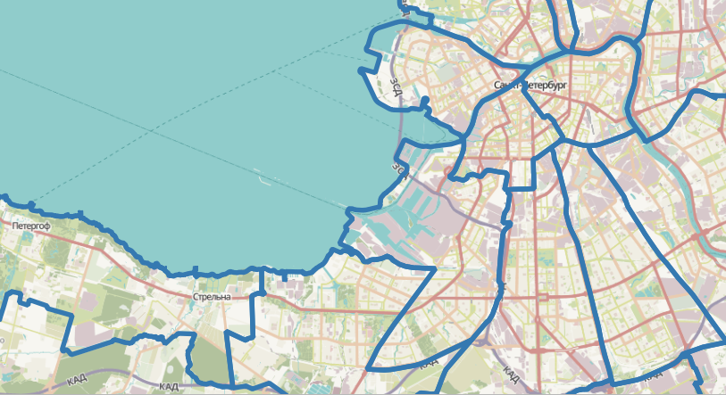

.. sectionauthor:: Дмитрий Барышников <dmitry.baryshnikov@nextgis.ru>
.. sectionauthor:: Артём Светлов <artem.svetlov@nextgis.ru>

.. _ngqgis_styling:

Настройка векторных стилей
-----------------------------

Картостиль - это описание цветов, текстур, значков, толщины линий, подписей и прочих 
особенностей отображения слоёв на экране. Эти настройки хранятся отдельно от географических 
данных, их можно сохранять в отдельные файлы и копировать между слоями. Настройка 
осуществляется через ``Слой ‣ Свойства слоя ‣ Стиль`` 
или ``Слой ‣ Свойства слоя ‣ Подписи``. Для каждого слоя задаётся отдельное стилевое оформление.

.. _ngq_vector_styles:

Настройка стиля векторных слоёв
^^^^^^^^^^^^^^^^^^^^^^^^^^^^^^^^^^^^^^^^^^^^^^^^^^^^^^^^^^^^^

В описании стиля векторного слоя используется 3 типа символов: 

1. Тип символов.
2. Тип символьного слоя.
3. Тип классификации. 

* **Тип символа** - символы различаются по типу: для точечных, линейных и полигональных 
слоёв символы различаются. Это не изменяется. Сами символы могут состоять из одного или 
нескольких символьных слоёв. 

.. figure:: _static/styles_type1.png
   :height: 5cm
   :align: center

   Примеры символов для точечных, линейных и полигональных слоёв.

* **Тип символьного слоя** - задаёт способ заливки: цветом, штриховкой, SVG, маркерами, 
  или способ рисования линии: пунктирная линия, линия из маркеров.

   
.. figure:: _static/styles_layer_type_line_ru.png
   :width: 14cm
   :align: center
   

   Варианты типов символьного слоя доступные для точечных, линейных и полигональных слоёв.

* **Тип классификации** - задаёт способ, как рисовать разные символы для разных объектов 
  в одном слое: все одинаково или по-разному. 

.. figure:: _static/styles_type3_ru.png
   :width: 16cm
   :align: center 

   Варианты типов классификации
    

Для настройки стиля выделите нужный стиль в списке слоёв, и откройте окно настройки стиля: 
``Слой ‣ Свойства слоя ‣ Стиль``.

.. figure:: _static/styles_stylewindow_simple_ru.png
   :name: ngqgis_styles_stylewindow_default
   :width: 20cm
   :align: center 

   Окно настройки стиля в режиме классификации Обычный знак, которое открывается по умолчанию.

   Цифрами обозначено: 1. Список типов классификации. 2. Изображение знака. 3. Список символьных слоёв в текущем символе. 4. Кнопки добавления-удаления символьных слоёв. 5. Параметры знака. 6. Библиотека знаков.

Если в списке символьных слоёв выбрать один слой, то появится окно настроек символа.
Его вид будет разным в зависимости от выбранного типа символьного слоя.

.. figure:: _static/styles_stylewindow_fill_simple_ru.png
   :width: 20cm
   :align: center

   Окно настроек символа

.. tip:: См. так же http://www.qgistutorials.com/ru/docs/basic_vector_styling.html.

.. _ngqgis_styling_symbol_layer_types:

Доступные типы символьных слоёв
^^^^^^^^^^^^^^^^^^^^^^^^^^^^^^^^^^^^^^^^^^^^^^^^^^^^^^^

* Для точечных слоёв:

  * **Эллипс**: отрисовка с использованием геометрических примитивов (эллипс, прямоугольник, треугольник, перекрестие).
  * **Маркер с заливкой**: маркер представляет собой фигуру, имеющую контур и заливку (цвет, градиент, штриховка и т.п.).
  * **Шрифтовой маркер**: отрисовка с использованием определенного символа заданного шрифта.
  * **Генератор геометрии**: при помощи синтаксических выражений позволяет генерировать геометрию в процессе отрисовки.
  * **Маска**: используется для улучшения читаемости маркеров нескольких слоев, близких по цвету.
  * **Растровый маркер**: позволяет использовать в качестве маркера растровое изображение.
  * **Простой маркер**: (по умолчанию) отрисовка с использованием одного из предустановленных маркеров.
  * **SVG маркер**: отрисовка с использованием SVG изображения.
  * **Маркер векторного поля**: отрисовка векторным полем с использованием значений атрибутивной таблицы.

* Для линейных слоёв:

  * **Стрелка**: добавляет элементы оформления, например, стрелку для указания направления линии.
  * **Генератор геометрии**: при помощи синтаксических выражений позволяет генерировать геометрию в процессе отрисовки.
  * **Штрихи вдоль линии**: линия отрисовывается повторяющимися короткими отрезками, перпендикулярными ее направлению.
  * **Интерполированная линия**: от одного конца линии к другому меняются ее толщина (или размер составляющих ее маркеров) и цвет.
  * **Линия с градиентной заливкой**: переход цвета перпендикулярно направлению линии.
  * **Маркерная линия**: отрисовка линии повторением маркерного символа.
  * **Линия из растров**: отрисовка линии повторением растрового изображения.
  * **Простая линия**: обычная отрисовка линии (с указанными шириной, цветом и стилем).

* Для полигональных слоёв:

  * **Отрисовка центроидов**: отрисовка центроида полигона при помощи одного из предустановленных маркеров.
  * **Генератор геометрии**: при помощи синтаксических выражений позволяет генерировать геометрию в процессе отрисовки.
  * **Градиентная заливка**
  * **Заливка штриховкой**: заливка полигона линейной штриховкой.
  * **Заливка точками**: заливка полигона регулярно расположенными точками заданного вида.
  * **Заливка маркерами со случайным размещением**: заливка полигона заданными маркерами, разбросанными случайным образом.
  * **Заливка растром**: использование растрового изображения для заливки.
  * **Заливка SVG узором**: Заливка полигона SVG изображением.
  * **Заливка градиентом из центра**
  * **Простая заливка**: обычная отрисовка полигона (с определенным цветом заливки, шаблоном заливки и контуром).

  * **Обводка: Стрелка**: добавляет элементы оформления (например, кружки) к контуру полигона.
  * **Обводка: Штрихи вдоль линии**: контур отрисовывается повторяющимися короткими отрезками, перпендикулярными ее направлению.
  * **Обводка: Интерполированная линия**: от одного конца линии к другому меняются ее толщина (или размер составляющих ее маркеров) и цвет.
  * **Обводка: Линия с градиентной заливкой**: переход цвета перпендикулярно направлению контура.
  * **Обводка: Маркерная линия**: контур отрисовывается путем повторения маркерного символа.
  * **Обводка: Линия из растров**: отрисовка контура повторением растрового изображения.
  * **Обводка: простая линия**: обычная отрисовка контура (с указанными шириной, цветом и стилем).

.. _ngqgis_styling_layer_classif:

Доступные типы классификации слоев
^^^^^^^^^^^^^^^^^^^^^^^^^^^^^^^^^^^^^^^^^^^^^^^^^^^^^^^

Возможные типы классификации слоев зависят от типа геометрии слоя.

Для слоев с **любой геометрией** доступны следующие типы: 

  * Без отрисовки
  * Простая символика (по умолчанию)
  * Символизация по уникальным значениям
  * Символизация по диапазонам значений
  * Символизация на основе правил
  * Встроенные символы (для слоев, содержащих встроенные стили)

Только для слоев с **точками** доступны помимо того:

  * Смещение накладывающихся точек
  * Кластеризация точек
  * Тепловая карта

Для слоев с **линиями** доступна также:

  * Символизация с автоматическим объединением объектов

Для слоев с **полигонами** доступны также:

  * Символизация с автоматическим объединением объектов
  * Инвертированные полигоны
  * 2.5 D

.. _ngqgis_styling_single:

Простая символика
~~~~~~~~~~~~~~~~~~

Используется для отрисовки всех элементов слоя с использованием одного, определенного пользователем, символа. Свойства, которые можно задать во вкладке "Стиль", частично зависят от типа слоя.

.. figure:: _static/dialogue_rendering_simple_values_ru.png
   :name: ngqgis_simple_mark_pic
   :align: center
   :width: 16cm

   Диалог отрисовки обычным знаком

Используемый знак или тип заливки может быть многоуровневым и состоять из комбинации разных элементов.

**Пример комбинированной заливки**

*Задача*: создать заливку полигона полосами двух цветов.

1. Нажмите на зеленый знак плюса справа и добавьте к простой заливке заливку штриховкой.
2. Задайте желаемый цвет и толщину линии штриховки.

   
   Параметры линии, используемой в штриховке

3. Перейдите к параметрам штриховки и задайте отступ между линиями. Для равномерных полос этот отступ должен быть в два раза больше толщины линии, заданной в шаге 2. Также здесь можно задать наклон линий.

   
   Параметры штриховки
   

   
   Получившаяся заливка с полосами двух цветов

.. _ngqgis_styling_categorized:

Символизация по уникальным значениям
~~~~~~~~~~~~~~~~~~~~~~~~~~~~~~~~~~~~

Объекты с разным значением какого-нибудь атрибута рисуются разными цветами.

Отрисовка уникальными значениями используется для отрисовки всех элементов слоя 
единым, определенным пользователем, символом, цвет которого отражает значение выбранного 
атрибута элемента. Вкладка "Стиль" позволяет выбрать:

1. Поле (в списке полей).
2. Знак (в диалоге Выбор условного знака).
3. Градиент (в списке цветовых шкал).

Кнопка Дополнительно в нижнем левом углу окна позволяет указать поля с 
информацией о вращении и масштабе. Для удобства список в нижней части вкладки 
показывает значения всех заданных на данный момент атрибутов, включая символы, к 
которым в будущем будет применена отрисовка.
Рисунок :numref:`ngmobile_dialogue_rendering_unique_values_pic` иллюстрирует 
диалог отрисовки уникальными значениями из демонстрационного набора данных NextGIS QGIS:

.. figure:: _static/dialogue_rendering_unique_values_ru.png
   :name: ngmobile_dialogue_rendering_unique_values_pic
   :align: center
   :width: 16cm

   Диалог отрисовки уникальными значениями

Можно создавать свои градиенты, выбрав "Новый градиент" из выпадающего списка "Градиент".
В появившемся окне можно выбрать тип градиента: "Градиент", "Случайный" или
"ColorBrewer", для каждого из которых можно задать желаемое количество цветов. 

.. _ngqgis_styling_graduated:

Символизация по диапазонам значений
~~~~~~~~~~~~~~~~~~~~~~~~~~~~~~~~~~~~~~~

Цвет будет плавно изменяться в зависимости от числового значения какого-либо атрибута, но только числового типа. 
Если у вас в слое числа записаны в поле строкового типа, то в калькуяторе полей их можно сконвертировать в новое поле числового типа.
 

   Фрагмент диалога свойств слоя - Градуированный знак

.. _ngqgis_styling_rule:

Символизация на основе правил
~~~~~~~~~~~~~~~~~~~~~~~~~~~~~~~~~~

Используется для отрисовки всех элементов слоя с помощью символов, базирующихся на 
определенных правилах. Задаётся несколько выражений/правил. Каждое выражение выдаёт 
несколько записей и оформляется по-своему. Может быть разным не только цвет, но и 
другие параметры.

.. figure:: _static/style_rule_line_ru.png
   :align: center
   :width: 20cm
   
   Фрагмент диалога свойств слоя - Символизация на основе правил

.. _ngqgis_styling_displacement:

Смещение накладывающихся точек
~~~~~~~~~~~~~~~~~~~~~~~~~~~~~~~

Только для точечных слоёв. В данном стиле при задании значения расстояния 
между точками точки группируются с учетом значения расстояния между точками. Далее при отображении на карте внутри группы точек 
выбирается точка, вокруг которой выстраиваются остальные точки: по кругу, концентрическими кругами или в узлах сетки.

.. figure:: _static/styles_point_offset.png
   :name: ngqgis_styles_point_offset_pic
   :align: center
   :height: 12cm

   Фрагмент карты после применения стиля "Смещение накладывающихся точек"

.. _ngqgis_styling_cluster:

Кластеризация точек
~~~~~~~~~~~~~~~~~~~

Только для точечных слоёв. Точки группируются с учетом заданного расстояния между ними. При отображении на карты на месте группы точек отображается один маркер с числом, показывающим количество точек в группе. При изменении масштаба точки перегруппируются.

.. figure:: _static/styles_point_cluster_ru.png
   :name: ngqgis_styles_point_offset_pic
   :align: center
   :width: 16cm

   Фрагмент карты после применения стиля "Кластеризация точек"

.. _ngqgis_styling_heatmap:

Тепловая карта
~~~~~~~~~~~~~~~~~

Вся карта заливается фоновым цветом (можно сделать прозрачным). Вокруг каждой точки 
рисуется размытый круг, если рядом много точек, то круг более насыщенный.

.. figure:: _static/styles_heatmap_00.png

   Исходные точки

.. figure:: _static/styles_heatmap_01.png

   Теплокарта с настройками по умолчанию

Параметры теплокарты можно настроить в свойствах слоя.

.. figure:: _static/styles_heatmap_dialog_ru.png
   :name: styles_heatmap_dialog_pic
   :align: center
   :width: 16cm
   
   Настройки теплокарты

В настройках градиента можно выбрать свои цвета, в том числе прозрачный. 

.. figure:: _static/styles_heatmap_02_owngradient.png

   Свой градиент

.. figure:: _static/styles_heatmap_03_gradienttransparent.png

   Градиент, начинающийся с прозрачного цвета

Градиент может быть как непрерывным, так и дискретным. Для того, чтобы настроить этот параметр, нажмите на изображение градиента.

   
   Дискретный градиент

Качество отрисовки обозначает размер пикселей.

.. figure:: _static/styles_heatmap_04_quick.png

   Самый быстрый

.. figure:: _static/styles_heatmap_05_quality.png

   Самый качественный

.. figure:: _static/styles_heatmap_06_discret-quality.png

   Дискретный градиент - качественный

.. figure:: _static/styles_heatmap_07_discret-quick.png

   Дискретный градиент - быстрый

.. figure:: _static/styles_heatmap_08_bigradius.png

   Средний радиус

.. figure:: _static/styles_heatmap_09_smallradius.png

   Радиус увеличен

.. figure:: _static/styles_heatmap_10_radiusverybig.png

   Радиус уменьшен

.. figure:: _static/styles_heatmap_11_maxvalueauto.png

   Максимальное значение - авто

.. figure:: _static/styles_heatmap_11_maxvaluelow.png

   Максимальное значение занижено

.. figure:: _static/styles_heatmap_13_complexgradient.png

   Сложный градиент с промежуточными цветами.

Теплокарта может отражать не только плотность концентрации точек, но и другие параметры, для этого нужно выбрать соответствующий атрибут в поле "Взвешивание точек".

.. figure:: _static/styles_heatmap_14_weightauto.png

   Взвешивание - автоматическое. Интенсивность обозначает концентрацию точек.

.. figure:: _static/styles_heatmap_15_weightattr.png

   Взвешивение - по атрибуту (количество мест). Интенсивность обозначает 
   суммарное количество мест в заведениях.

.. _ngqgis_styling_merged:

Символизация с автоматическим объединением объектов
~~~~~~~~~~~~~~~~~~~~~~~~~~~~~~~~~~~~~~~~~~~~~~~~~~~

Доступна для полигональных и линейных слоев. Соприкасающиеся объекты объединяются и отрисовываются как один.

   
   Обычный стиль: показаны границы районов
   
.. figure:: _static/styles_merged_ru.png
   :name: styles_merged_pic
   :align: center
   :width: 16cm
   
   Автоматическое объединение объектов: показана только общая внешняя граница города

.. _ngqgis_styling_inverted:

Инвертированные полигоны
~~~~~~~~~~~~~~~~~~~~~~~~~

Только для полигональных слоёв. При использовании данного стиля (вкладка "Свойства слоя ‣ Стиль") 
происходит заливка цветом областей за пределами полигона (снаружи полигона), сам 
полигон остается прозрачным. 

.. figure:: _static/styles_inverted_polygons.png
   :name: ngqgis_styles_inverted_polygons_pic
   :align: center
   :width: 12cm

   Фрагмент карты До и После применения стиля "Инвертированные полигоны".

.. _ngqgis_styling_25d:

2.5 D
~~~~~~~~~~

Доступно только для полигональных слоев. Представляет полигоны как имеющие определенную толщину, с видимой сбоку "стенкой". Можно задать цвет и прозрачность "крыши" и "стенки" объемного полигона.

.. figure:: _static/style_2point5D_ru.png
   :name: style_2point5D_pic
   :align: center
   :width: 12cm
   
   Районы города отрисованы в режиме 2.5D

.. _ngqgis_styling_svg:

Рисование своих условных обозначений в SVG
^^^^^^^^^^^^^^^^^^^^^^^^^^^^^^^^^^^^^^^^^^^^^^^^^^^^^^^^^^^^^

SVG - открытый формат для векторных картинок, внутри него XML, описывающий линии и фигуры. 

Большая коллекция значков в SVG есть на Wikimedia Commons - https://commons.wikimedia.org/wiki/Category:SVG_icons, туда можно добавлять и свои. Если вам, например, нужен логотип известной организации, то возможно он там есть.

Чтобы использовать такой маркер, в QGIS в настройках SVG-маркера в выпадающем меню выберите "Из URL" и вставьте ссылку на файл. Этот же стиль можно использовать и в NextGIS Web.

   Добавление SVG-маркера по ссылке

Если вам нужны специальные значки, то вы можете нарисовать их сами. Картинки в формате SVG рисуются в Inkscape, CorelDRAW. Также эти файлы можно писать вручную: http://svgpocketguide.com/book/

Для добавления своего значка в стиль QGIS или в стиль для слоя NextGIS Web есть следующие варианты:

1. Встроить файл в стиль.

В QGIS в настройках SVG-маркера в выпадающем меню выберите "Встроить файл". Затем сохраните стиль. Значок будет встроен в него в виде стандартной строки base64.

   Встраивание значка в стиль

Если вы работаете только в QGIS, без nextgis.com, то можно использовать путь к файлу на жёстком диске, но это менее надёжно, потому что вы можете о нём забыть, перенести файл значка, и стиль перестанет рисоваться.

В ранее созданные стили, где указан путь к файлам на жёстком диске, значки SVG можно встроить пакетно с помощью `инструмента NextGIS Toolbox <docs.nextgis.ru/docs_toolbox/source/embedsvg.html>`_.

2. Добавить маркер через `библиотеку маркеров SVG <https://docs.nextgis.ru/docs_ngcom/source/svgmarkers.html>`_ в своей Веб ГИС.

3. Разместить файл в интернете и поставить его URL в качестве пути к значку SVG (:numref:`style_SVG_URL_pic`).

Если ваш значок не нарушает авторских прав, можно поместить его на https://commons.wikimedia.org, чтобы его могли использовать другие люди. Также можно положить файл в свой репозиторий на github или gitlab.

.. figure:: _static/webmap_svg_ru.png
   :name: webmap_svg_pic
   :align: center
   :width: 16cm
   
   Пример использования кастомизированного значка

.. _ngqgis_styling_effects:

Эффекты отрисовки
^^^^^^^^^^^^^^^^^^^^^

Для всех режимов отображения можно задать эффекты отрисовки слоя - как например 
тень, свечение, внешнюю или внутреннюю линию.

.. figure:: _static/styles_effects.png
   :align: center
   :width: 12cm

   Фрагмент карты с различными отрисовками

.. _ngq_save_style:

Сохранение стиля
^^^^^^^^^^^^^^^^^^^^^^^^^^

Стиль можно сохранить в файл. В нём сохранится настройки оформления и настройки подписей. 

.. figure:: _static/styles_save_ru.png
   :name: ngqgis_styles_save
   :align: center
   :width: 16cm

   Диалог сохранения стиля

В окне свойства стиля нажмите на кнопку "Стиль" (см. :numref:`ngqgis_styles_save`). 

По нажатию на кнопку "Сохранить настройки по умолчанию" стиль сохранится в 
формате qml в каталоге, где лежит слой, с тем же названием. Теперь, если вы будете 
добавлять этот слой как новый, то NextGIS QGIS подхватит этот стиль.

Пункт " Сохранить стиль" - позволяет сохранить его в другой файл, а так же в формат sld.

