.. sectionauthor:: Роман Гайнуллов <roman.gainullov@nextgis.ru>

.. _Territory Plan Styler:

Territory Plan Styler
===================

Плагин Territory Plan Styler предназначен для быстрого создания интерактивных веб-карт на базе NextGIS Web,
автоматически оформляемых в соответствии с приказом Минэкономразвития России № 10 от 09.01.2018 г. (далее - приказ). 
В состав плагина включен полный набор стилей, составленных в соответствии с требованиями приказа, 
а также механизм контроля структуры пользовательских данных на корректность.

.. note::
   Данный инструмент доступен только для пользователей плана `Premium <https://nextgis.ru/nextgis-com/plans>`_  и присутствует только в ПО `NextGIS QGIS <https://nextgis.ru/nextgis-qgis/>`_.
   
.. note::
   Ознакомиться с дополнительной информацией о том как применяется данный модуль можно в `официальном релизе <https://nextgis.ru/blog/terplan/>`_.

Установка
---------

Для установки или обновления модуля необходимо выбрать в меню Модули ‣ Управление модулями.
Введите часть или все его название в панель Поиск (см. :numref:`list_modules`).

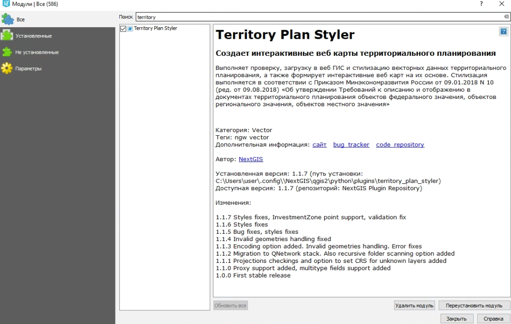
   
   Список установленных и доступных к загрузке модулей

Выберите в списке нужный модуль и выберите Установить модуль.

После установки расширения появляется иконка на панели инструментов (иконка заблокирована для неавторизованных пользователей) |territory_tool_icon|. 

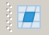

Для того, чтобы функциональные возможности плагина стали доступны, необходимо быть авторизованным в NextGIS Account Toolbar. 
Панель NextGIS Account Toolbar для неавторизованных пользователей выглядит так: |not_auth|.

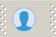

При нажатии на иконку вам будет предложено авторизоваться в системе через браузер. 
В случае успешной авторизации пользователя с планом Premium иконка на панели NextGIS Account Toolbar сменится на другую: |auth_icon| или аватар пользователя, если он задан.

.. |auth_icon| image:: _static/Territory_Plan_Styler/auth_icon_pink.png

Запуск модуля
-----------------------------

При запуске Territory Plan Styler открывается мастер экспорта данных (см. :numref:`export_master`), 
который шаг за шагом проводит пользователя от этапа выбора данных до готовой веб-карты.

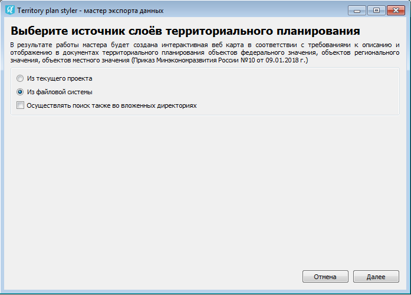
   
   Первый экран мастер экспорта данных
   
   
Выбор слоев из текущего проекта
-------------------------------
   
По нажатию кнопки "Далее" при выборе "Из текущего проекта" пользователю будет предложен список обнаруженных в проекте слоёв (см. :numref:`export_select_layer`). Для слоёв с одинаковыми названиями определяется тип геометрии и добавляется в скобках после названия.

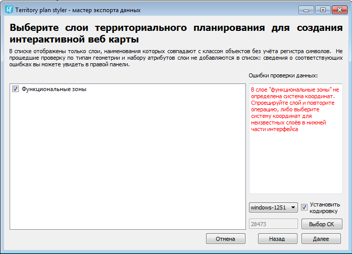
   
   Выбор слоёв для экспорта
   
   
Выбор слоев из файловой системы
-------------------------------

В случае выбора на первом экране мастера опции "Из файловой системы" пользователю предлагается файловое дерево его локального компьютера (см. :numref:`file_system`).

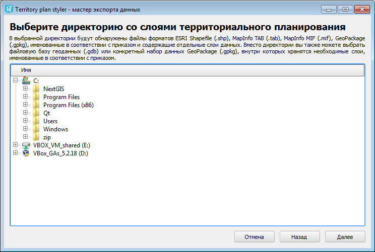
   
   Обзор файловой системы для выбора источника данных

Для выбора доступно три вида объектов:

1. Директория, содержащая наборы геоданных в отдельных файлах поддерживаемых форматов 
2. Файл базы геоданных (.gbd)
3. Файл ESRI Shapefile (.shp), MapInfo TAB (.tab), MapInfo MIF (.mif), GeoPackage (.gpkg)

В случае выбора директории программа сканирует её на наличие файлов форматов ESRI Shapefile (.shp), MapInfo TAB (.tab), MapInfo MIF (.mif), GeoPackage (.gpkg), в каждом файле ожидая обнаружить только один набор геоданных. Определение файлов происходит по соответствию их имён латинским названиям файлов, описанных в приказе.
Для файлов форматов TAB, MIF и GPKG допускается совместное хранение объектов с разными типами геометрий, в таком случае программа автоматически разделит их на разные слои и добавит к имени пояснение.

В случае выбора файла базы геоданных или конкретного файла GeoPackage программа ожидает наличие неограниченного количества внутренних наборов данных, именованных с соответствии с латинскими названиями файлов, описанных в приказе.

По нажатию кнопки "Далее" пользователю будет предложен список обнаруженных в файловой системе подходящих по именам слоёв (см. :numref:`export_select_layer_2`), для удобства представленный в виде русскоязычных названий, а не имён исходных файлов (аналогично выбору данных для экспорта из проекта).

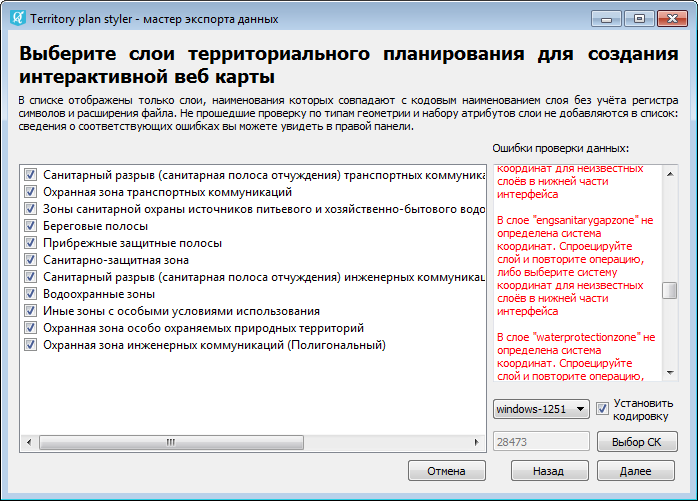
   
   Выбор слоёв для экспорта
   
   
Выбор слоев из проекта и из файловой системы. Валидация
-------------------------------------------------------
   
При выборе обеих опций (экспорт из проекта / из файловой системы) на экране выбора нужных слоёв в правой части окна выводятся все обнаруженные системой ошибки, связанные с:

* некорректной структурой атрибутов
* неправильным типом геометрии
* отсутствием системы координат.

Ошибки, связанные со структурой атрибутов и типами геометрий, выводятся для тех наборов данных, которые были интерпретированы как подходящие (по имени файла или имени слоя в проекте QGIS), но не до конца корректные с точки зрения приказа. Их выбор в основном списке на данном экране мастера недоступен - пользователю предлагается сначала устранить ошибки, а затем запустить мастер снова. 

Ошибки, связанные с системами координат, не приводят к исключению слоя из списка, но требуют специально указать систему координат в нижней части интерфейса (кнопка “Выбор СК”). Для всех слоёв с неопределенной системой координат выбирается единая система. Также вы можете определить кодировку для обрабатываемых слоёв, активировав соответствующий флаг в нижней части интефейса и выбрав кодировку из списка.

Выбор целевой Веб ГИС
---------------------

После того, как выбраны необходимые для экспорта слои (при любом режиме, из проекта или файловой системы), по нажатию кнопки "Далее" мастер переходит к окну выбора целевой Веб ГИС, куда будет произведен экспорт данных и создана интерактивная веб-карта. Здесь вы можете настроить подключение к нужной Веб ГИС, создавать, редактировать и удалять подключения (см. :numref:`connect_to_webgis`).

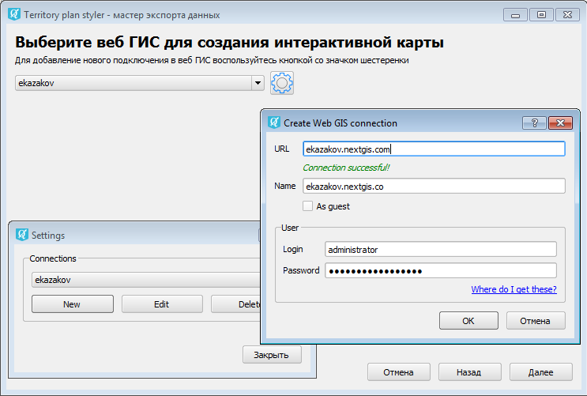
   
   Подключение к Веб ГИС

Выбор группы ресурсов для создания веб-карты
--------------------------------------------

После выбора Веб ГИС и нажатия кнопки "Далее" откроется экран мастера, предлагающий выбрать группу ресурсов, в которой будет создана интерактивная веб-карта, а также задать имя для результирующей веб-карты (см. :numref:`select_resourcegroup`).
В нижней части доступны кнопки обновления дерева групп ресурсов, а также создания новой группы ресурсов (она будет создана как дочерняя для выделенной в дереве).

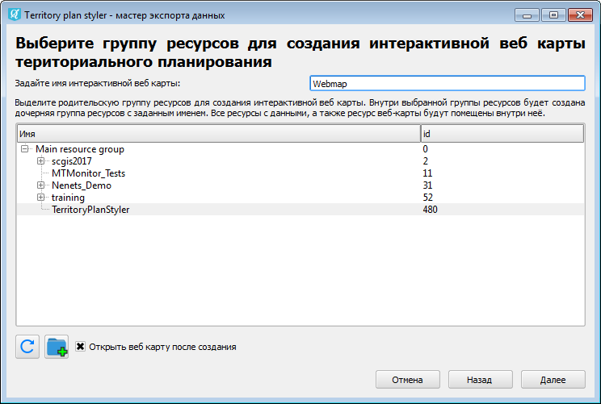
   
   Выбор целевой группы ресурсов

Публикация данных на веб-карте
------------------------------

После нажатия кнопки "Далее" программа приступит к экспорту данных и созданию карты. При этом в корне выбранной пользователем группы ресурсов будет создана группа ресурсов с именем, совпадающим с заданным именем веб-карты, внутри неё размещены веб-карта и все наборы данных, выбранных для экспорта, а для каждого набора данных добавлен стиль, соответствующий приказу.
При активированном флаге "Открыть веб-карту после создания", по завершению экспорта интерактивная карта будет открыта в веб-браузере автоматически.

За ходом экспорта пользователь может наблюдать на последнем экране мастера (см. :numref:`export_process`). Здесь в интерактивном режиме отображается прогресс в подготовке и загрузке объектов в Веб ГИС.

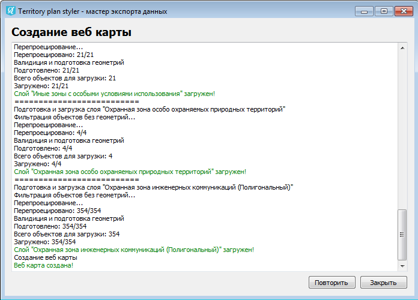
   
   Ход экспорта данных в Веб ГИС
   
В случае возникновения ошибок их причины будут обозначены красным цветом. После завершения процесса экспорта предлагается либо начать новый процесс, запустив мастер сначала, либо закончить работу. Пример экспортированной веб-карты приведён на :numref:`export_on_web_map`

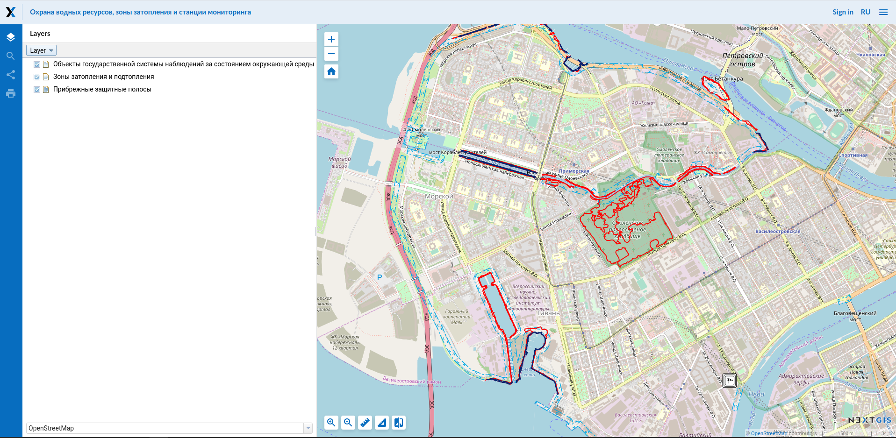
   
   Экспортированная веб-карта
