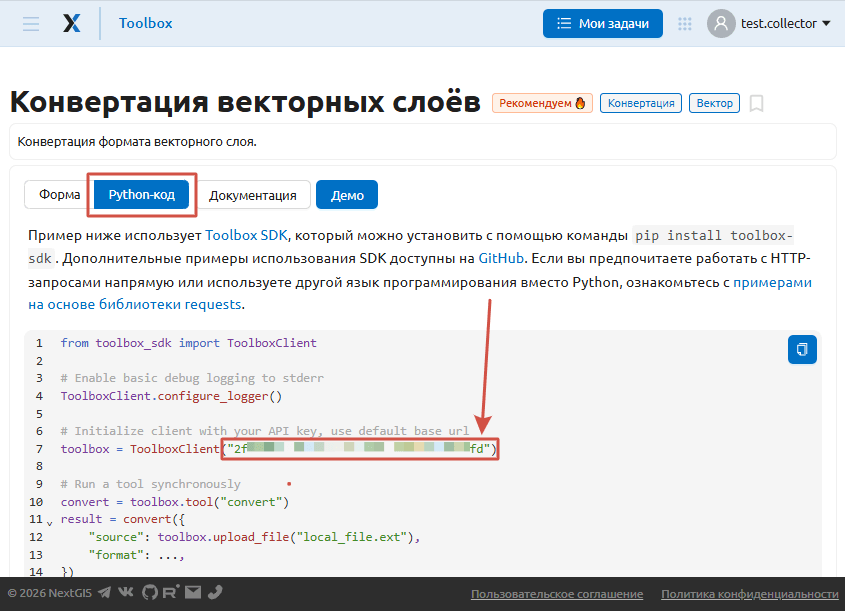
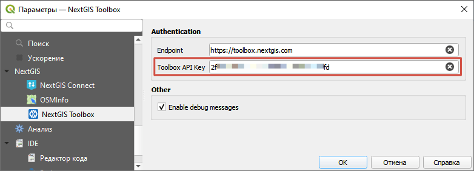

NextGIS Toolbox
================

С помощью этого модуля можно использовать инструменты из онлайн-коллекции `NextGIS Toolbox <https://toolbox.nextgis.com>`_ непосредственно из QGIS.

Установите модуль через меню Модули -> Управление модулями. Введите в строке поиска "NextGIS Toolbox", выберите модуль и нажмите **Установить**. После установки нужно будет перезапустить QGIS.

Инструменты из коллекции NextGIS Toolbox доступны в панели анализа и в меню Анализ.

Чтобы запускать инструменты, вам понадобится API-ключ

API-ключ
--------

Перейдите на https://toolbox.nextgis.com и авторзуйтесь или, если вы ещё не зарегистрированы, `создайте NextGIS ID <https://docs.nextgis.ru/docs_ngcom/source/create.html#how-to-create-account-nextgis-id>`_.

Откройте любой из инструментов на главной странице сайта `Toolbox <https://toolbox.nextgis.com>`_.

Перейдите на вкладку **Python-код**. 

Ваш ключ API указан в следующей строке::

 # Initialize client with your API key, use default base url
 toolbox = ToolboxClient("{API_key}")

   API key in the Python tab

Copy the key from the code and insert it in the plugin settings in QGIS: Processing -> NextGIS Toolbox -> Settings.

   API key added to the plugin settings