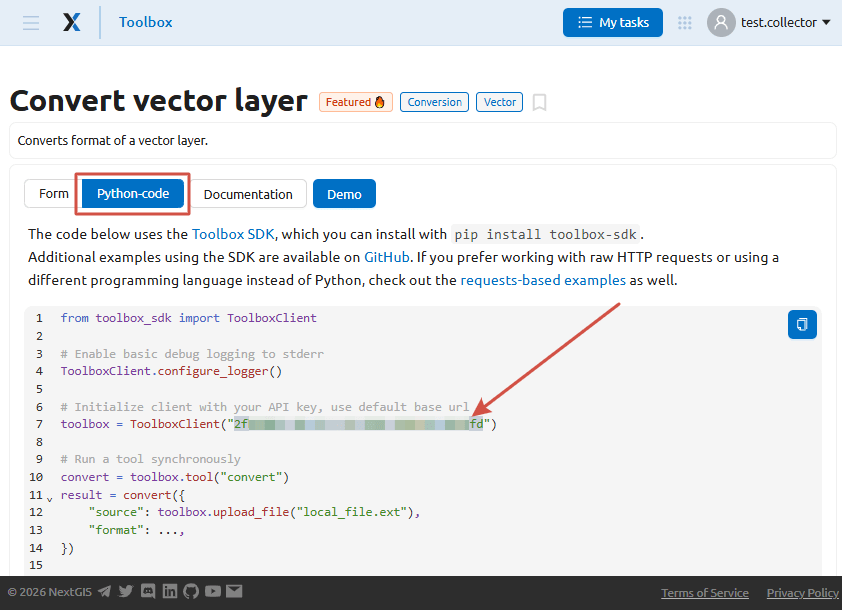
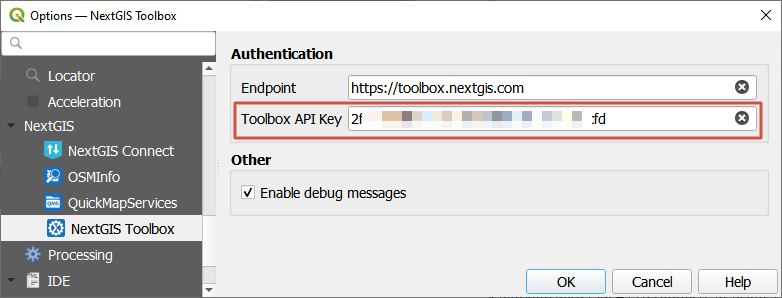

NextGIS Toolbox
================

This plugin allows to access the NextGIS tools collection, also available `online <https://toolbox.nextgis.com>`_, directly from QGIS.

To install the plugin, go to Plugins -> Manage and install plugins. Type "NextGIS Toolbox" and click **Install**. After installation you'll need to restart QGIS.

NextGIS Toolbox is available in the Processing panel as well as the Processing menu.

To use the tools you need to add your API key in the plugin settings.

API key
--------

Go to https://toolbox.nextgis.com and log in or `create NextGIS ID account <https://docs.nextgis.com/docs_ngcom/source/create.html#how-to-create-account-nextgis-id>`_.

Open any tool on the front page of the `Toolbox <https://toolbox.nextgis.com>`_ web site.

Go to the **Python-code** tab. 

Your API key is indicated in the following section::

 # Initialize client with your API key, use default base url
 toolbox = ToolboxClient("{API_key}")

   API key in the Python tab

Copy the key from the code and insert it in the plugin settings in QGIS: Processing -> NextGIS Toolbox -> Settings.

   API key added to the plugin settings