Настройки трансформации растров
================================

Поскольку растровые данные представляют собой набор значений, размещённых в ячейках регулярной сетки, эта сетка может пересчитываться при отрисовке растра в разных масштабах, изменении системы координат и других операций с растровым слоем. 

Два основных параметра трансформации это `Тип трансформации <https://docs.nextgis.ru/docs_ngqgis/source/transformations.html#transform-type>`_ и `Метод передискретизации <https://docs.nextgis.ru/docs_ngqgis/source/transformations.html#transform-resample>`_.

.. _transform_type:

Тип трансформации
----------------------------------
Он отвечает за выбор метода перепроецирования растрового изображения. Важно четко понимать, насколько сильно отличаются проекции привязываемой карты и системы координат, к которой вы карту привязываете. Например, большинство мелкомасштабных карт Евразии печатается в конических проекциях, а стандартной СК в ГИС является WGS 84 (EPSG:4326) в прямоугольной проекции. В таком случае без существенных преобразований проекции (из конической в прямоугольную) не обойтись, поэтому надо использовать те варианты трансформаций, которые могут сильно деформировать исходное изображение (полиномиальные или сплайновые алгоритмы).

 В QGIS можно использовать следующие типы трансформации:

**Без деформации** (2 точки)

* Линейная - подходит для привязки карт в их исходную проекцию
* Гельмерта - для привязки планов и картосхем в равнопромежуточной проекции, повернутых относительно севера

**С линейной деформацией** (4 точки)

* Полиноминальная трансформация 1 степени - привязка крупномасштабных карт и планов на карту Google или Яндекс 
* Проективная трансформация - для перехода между проекциями (коническая ‣  цилиндрическая), например, подходит для привязки отфотографированных карт

**С нелинейной деформацией**

* Полиноминальная трансформация 2 степени (6 точек + контрольная) - наиболее универсальный вариант для привязок карт в разных проекциях
* Полиноминальная трансформация 3 степени (9 точек + контрольная) - подходит для привязки мелкомасштабных карт в поликонических проекциях на карту в прямоугольной проекции
* Тонкостенный сплайн - на крайний случай, для привязки мелкомасштабных карт в сложных проекциях, сильно деформированных карт, снимков

Подробнее об этих трансформациях:

**Линейная** - самый простой вариант трансформации, при котором исходное изображение просто смещается на нужное место. Помимо этого оно может быть увеличено или уменьшено. **Углы и пропорции при этом сохраняются**, линии сохраняют своё направление. 

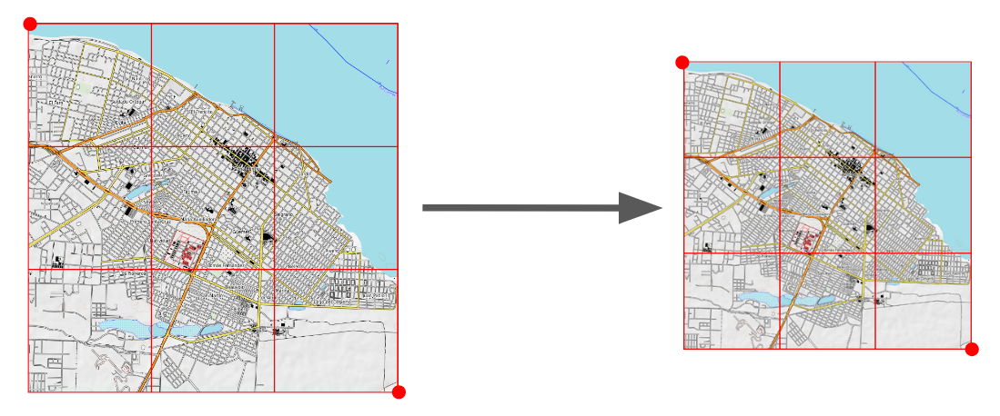

**Гельмерта** - алгоритм аналогичный линейному, однако помимо смещения и масштабирования он может поворачивать карту на определенный угол. 

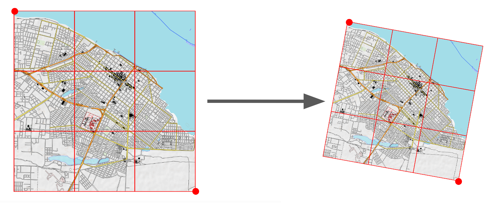

**Полиномиальная трансформация 1 степени** - масштабирует, подворачивает растр, а также может неравномерно сдвигать изображение по одной из осей, при этом **искажаются углы**, но **сохраняется параллельность линий**.  Наиболее оптимальна для привязки крупномасштабных карт и планов на карту Google или Яндекс через опорные точки.

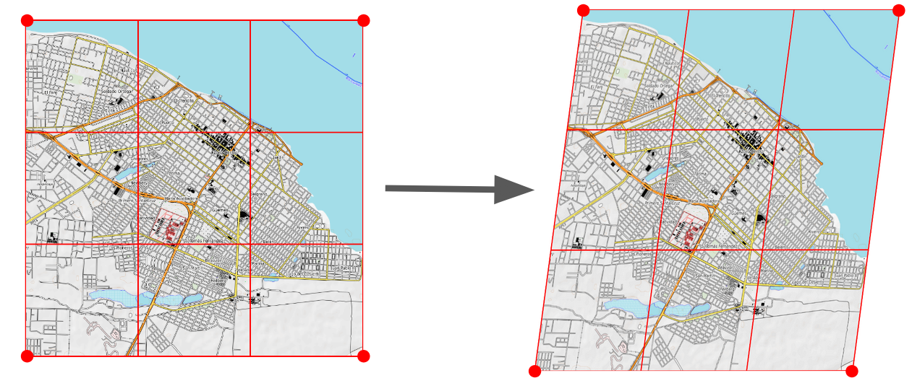

**Проективная трансформация** - похожа на полиномиальную (1 степени), однако **параллельность линий не сохраняется**. Подходит для перехода из одной простой проекции в другую, например, из простой конической в простую цилиндрическую. Применяется для привязки отфотографированных (не сканированных!) карт, или снимков ДЗ, полученных при перспективной съемке (например снимки программы CORONA).

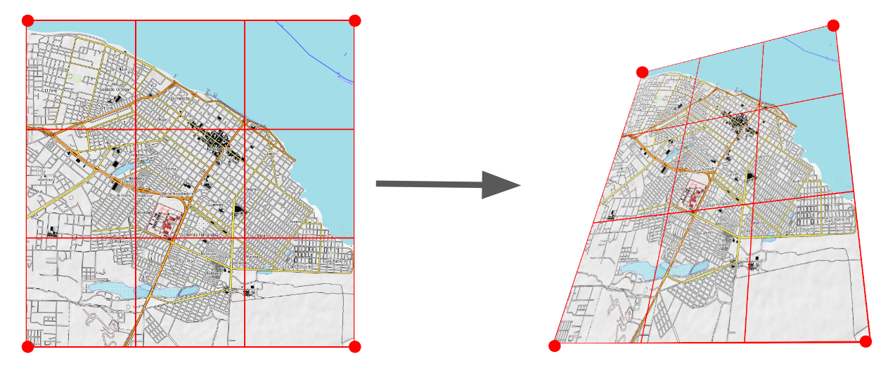

**Полиномиальная трансформация 2 степени** - нелинейно деформирует  исходное изображение по одной из осей. Является самым оптимальным вариантом трансформации любых карт с т.з. **минимизации искажений** при максимальной точности привязки. 

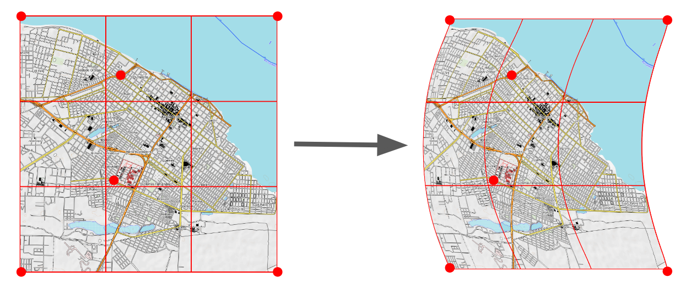

**Полиномиальная трансформация 3 степени** - нелинейные деформации применяются к обеим осям карты. Рекомендуется использовать в том случае, когда полином 2 степени не дает требуемой точности (например при привязке  трехверстовых топографических карт Российской Империи). 

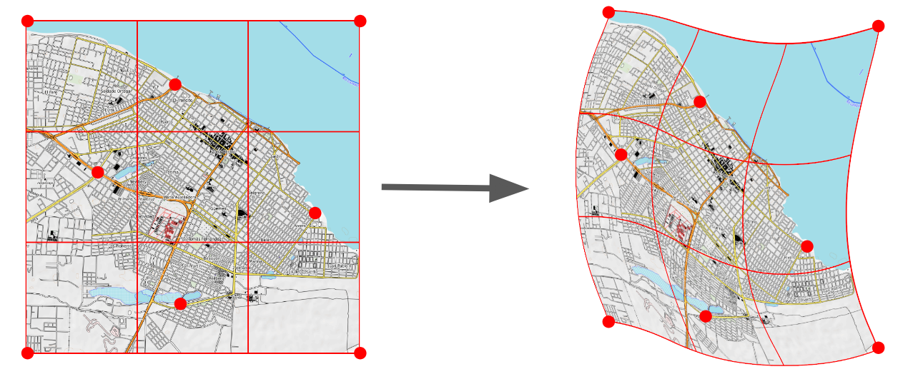

**Тонкостенный сплайн** - метод, основанный на локальном смещении пространства карты вокруг точки привязки. Обладает следующими особенностями: 

#. **степень искажений нелинейно увеличивается** при удалении от точки привязки, 
#. характер искажений сильно зависит от плотности и распределения точек привязки, 
#. математическая оценка точности для этого алгоритма не проводится. 

Данный тип трансформации рекомендуется использовать **только в том случае**, если другие методы не дают приемлемого результата из-за сильных искажений (мятая карта), или источник изначально не имеет географической привязки (снимок на фотокамеру с самолета).

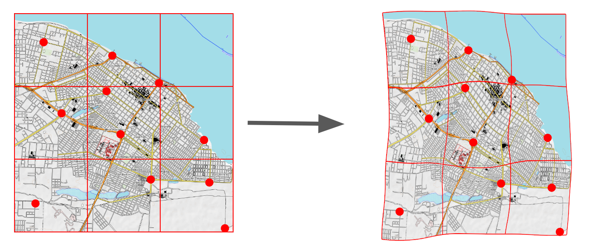

.. _transform_resample:

Алгоритмы передискретизации
----------------------------------------------------------------

Масштабирование и трансформация растра требуют уплотнения или разряжения пикселей. 

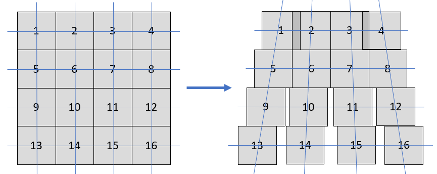

При этом создаётся новая матрица пикселей (растр), в которую записываются значения исходной матрицы по одному из следующих алгоритмов:

**Ближайший сосед** - самый быстрый алгоритм. Значение берется из ближайшего пикселя с известным значением. 

* Использует только те значения, которые встречаются в исходном растре. 
* Изображение не сглаживается, возможно появление артефактов в виде ступенек или ореолов.

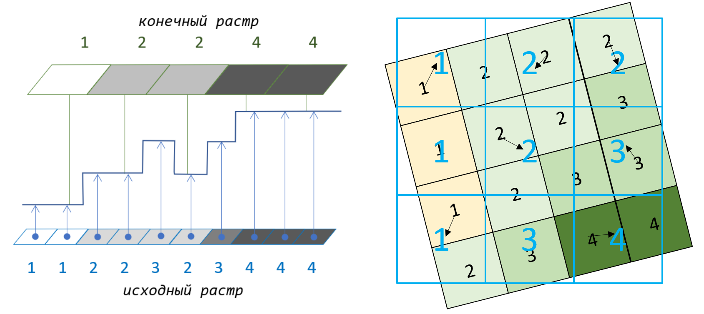
     
**Линейная передискретизация** - использует 4 (2х2) ближайших пикселя исходного растра и рассчитывает значение итоговой ячейки с помощью линейной функции интерполяции. 

* Итоговые значения могут отличаться от исходного набора. 
* Изображение слегка сглаживается.

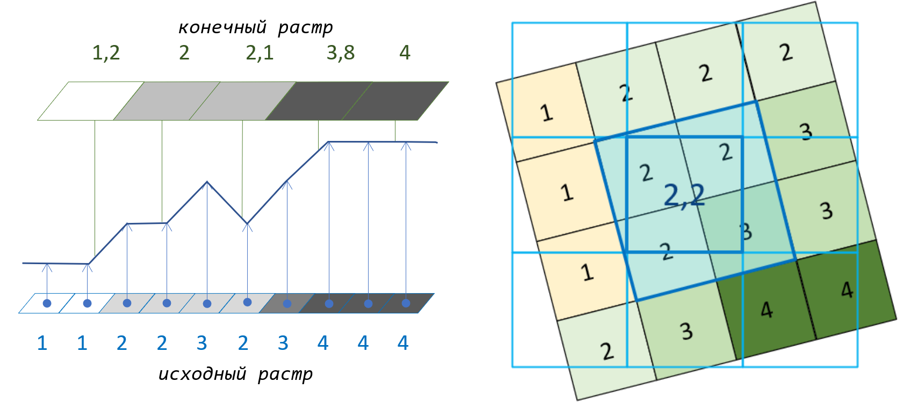
 
**Кубическая** и **кубическая с b-сплайном** - использует 16 (4х4) ближайших пикселей исходного растра и рассчитывает значение итоговой ячейки с помощью кубической/сплайновой функции. 

* Итоговые значения могут отличаться от исходного набора. 
* Изображение сильно сглаживается.

.. figure:: _static/resampling_cubic_ru.png
   :name: resampling_cubic_pic
   :align: center
   :width: 16cm
    
**Ланцоша** - использует 36 (6х6) ближайших пикселей исходного растра и рассчитывает значение итоговой ячейки с помощью фильтра Ланцоша.

* Итоговые значения могут отличаться от исходного набора. 
* Изображение слегка сглаживается при сохранении четкости на контрастных участках, возможно появление артефактов в виде ступенек или ореолов.

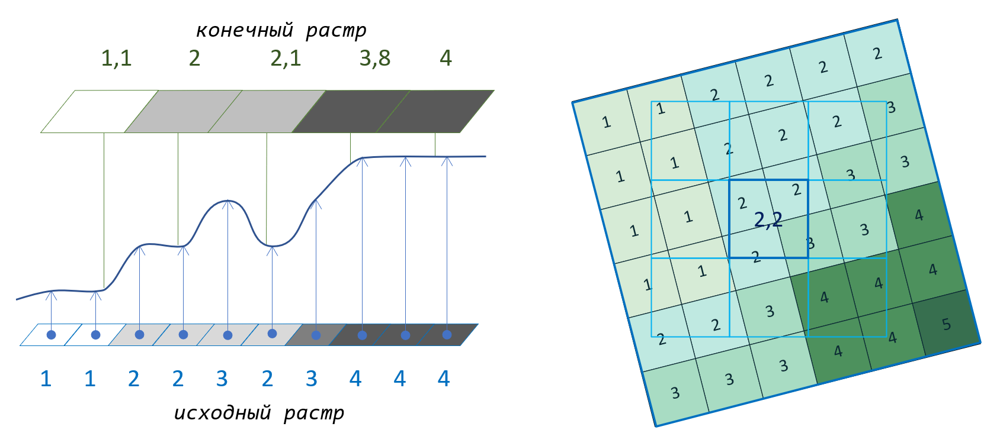

.. _transform_resample_choose:

Как выбрать алогритм передискретизации?
~~~~~~~~~~~~~~~~~~~~~~~~~~~~~~~~~~~~~~~~~~~~

Метод передискретизации имеет смысл выбирать в зависимости от типа растра:

* ``Индексированный растр`` - подойдёт только **ближайший сосед**, иначе при трансформации получатся значения, не совпадающие ни с одним из индексов.
* ``Цветная карта/снимок`` (в каждом пикселе - значение цвета, например, в RGB) - можно использовать все алгоритмы, но лучше всего подходит **линейный**
* ``Одноканальный растр`` (например, цифровая модель рельефа) - можно использовать любой алгоритм *кроме ближайшего соседа*, если нужно сохранить плавность переходов. Ближайший сосед можно выбрать, если критично важно сохранить исходные значения, и появляющаяся ступенчатость не принципиальна.
* ``Многоканальный растр`` (пиксели содержат числовые значения определённого спектра, например, инфракрасного) - лучше всего подходит **линейная передескритизация**, но можно использовать и другие способы.

.. _residual:

Критерии качества привязки растра
----------------------------------

.. |fdop| replace:: :strong:`F` :sub:`доп`

.. |fpriv| replace:: :strong:`F` :sub:`прив`

После расстановки определенного количества контрольных точек на карте (число зависит от типа трансформации), QGIS может рассчитать (см. :numref:`points_residual_pic`):

* точность привязки каждой точки: 

   * dX (пиксели) - смещение контрольной точки по оси X (1)
   * dY (пиксели) - смещение контрольной точки по оси Y (2)
   * Невязка - средняя величина смещения точки в пространстве (3)

* среднюю ошибку при перепроецировании всех контрольных точек (4)

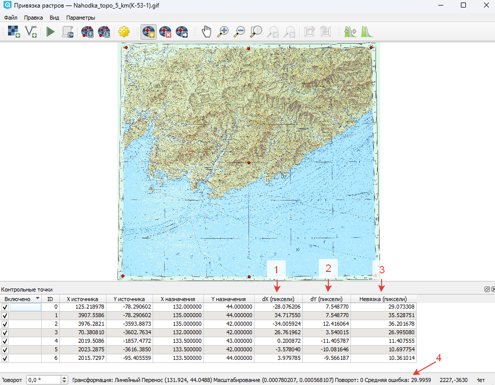

   Контрольные точки, для которых рассчитано смещение, невязка и средняя ошибка

Не существует жестко заданных критериев качества привязки растра. Допустимая точность (|fdop|) в первую очередь зависит от задач, для которых проводилась привязка. Но некоторые рекомендации можно всё же озвучить:

#. В идеале погрешность (средняя ошибка) должна быть менее 1 пикселя, но такие значения малодостижимы, особенно со сложными проекциями.
#. Если растр привязывается к существующему набору векторных данных, то точность определяется качеством самих данных.
#. Если растр привязывается для оцифровки объектов с карты, то точность можно определить исходя из требований к качеству самой карты. Для топографических карт оно определяется стандартом **ГОСТ Р 51605-2000**:

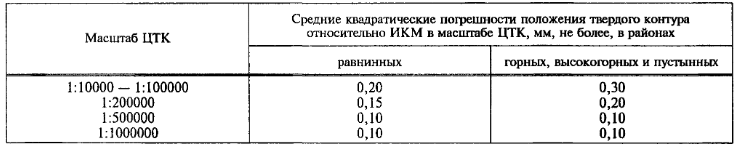

   Пример требований к допустимым погрешностям положения твердого контура

Таким образом, если мы привязываем по координатам (или опорным точкам на углах зданий) топографическую карту на равнинную территорию масштабом **1: 100 000**, то максимально допустимая погрешность должна высчитываться по формуле: 

   |fdop| = М * σ / 1000 = 100 000 * 0,2 (мм) / 1000 = 20 (м)

где М - масштаб карты, σ - средняя квадратическая погрешность.

Соответственно, если средняя ошибка привязанной карты превышает (|fpriv|) допустимую (|fdop|), то растр привязан некачественно.

Значения погрешности привязки (|fpriv|) в окне привязки выражаются в пикселях, поэтому для пересчета в линейный размер (например метры) необходимо умножить величину средней ошибки на размер пикселя, который после привязки можно узнать

* в свойствах слоя растра;

 .. figure:: _static/properties_pixel_ru.png
   :name: properties_pixel_pic
   :align: center
   :width: 20cm

   Размер пикселя в свойствах растрового слоя

.. important:: Учтите, что в данном примере система координат растра - географическая, поэтому линейные размеры даны в градусах!

* с помощью линейки.

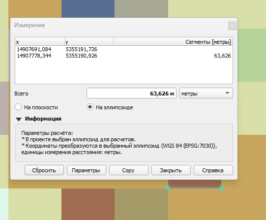

   Измерение размера пикселя с помощью линейки

Т.е. если размер пикселя **63,6 м**, а средняя ошибка около **30 пикс**, то реальная ошибка привязки будет составлять:

 |fpriv| =  63,6 * 30 = 1 908 м.

