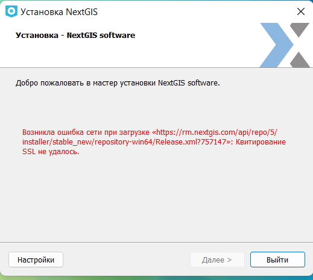

.. _ngqgis_faq:

Решение проблем (вопросы и ответы)
================================

В данном разделе вы сможете найти ответы на самые часто задаваемые вопросы по использованию NextGIS QGIS и решению проблем.

.. _ngqgis_ssl:

При установке появляется ошибка "Квитирование SSL не удалось"
~~~~~~~~~~~~~~~~~~~~~~~~~~~~~~~~~~~~~~~~~~~~~~~~~~~~~~~~~~~~~

   Отсутствие Сертификата ISRG. Ошибка квитирования

Ошибка связана с отсутствием Сертификата ISRG.
Проверить его наличие на компьютере:

Пуск->Выполнить->certmgr.msc действие->поиск сертификaтов->ISRG Root->Нaйти

Скачать сертификат по ссылке:
https://letsencrypt.org/certs/isrgrootx1.der
