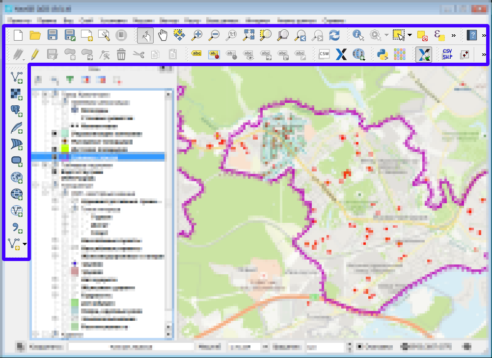
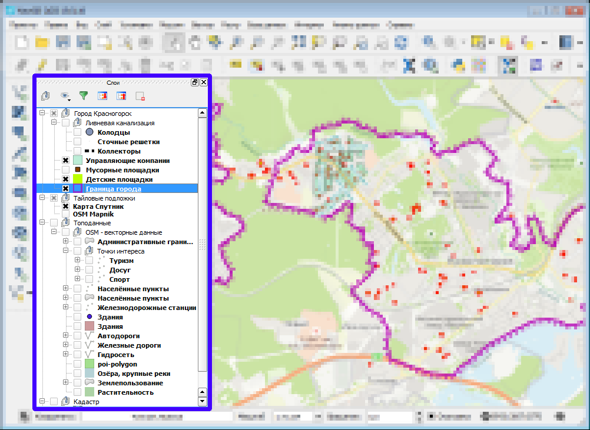
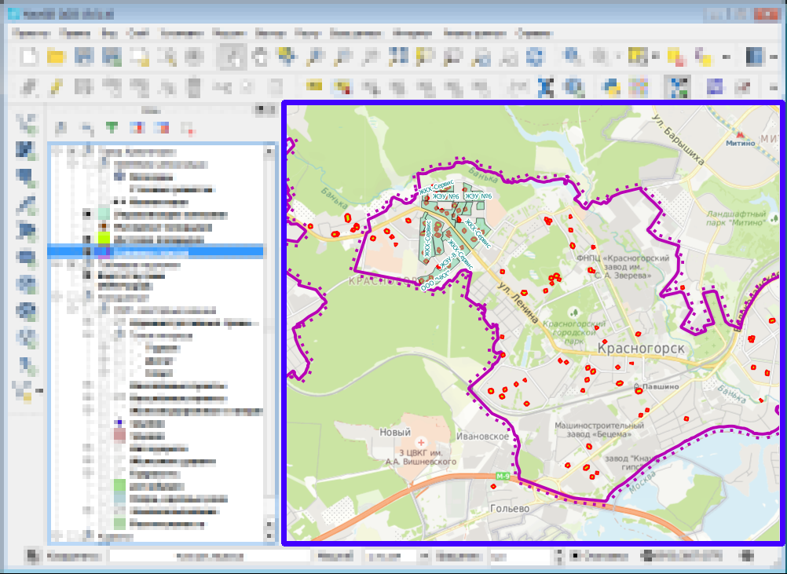
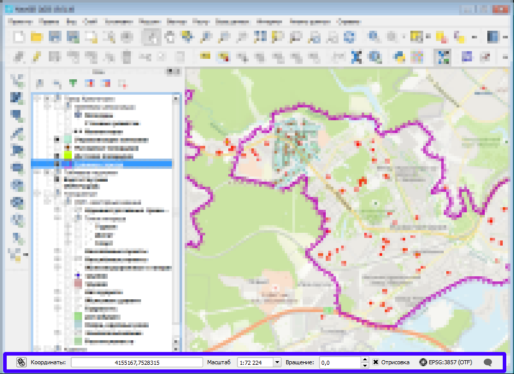

.. sectionauthor:: Дмитрий Барышников <dmitry.baryshnikov@nextgis.ru>

.. _ngqgis_ui:

Описание интерфейса NextGIS QGIS
=================================

При первом запуске :program:`NextGIS QGIS` пользователь видит следующее окно (см. :numref:`ngq_UIMainWindow`).

.. _ngq_fig_startup:

.. figure:: _static/UIMainWindow.png
   :name: ngq_UIMainWindow 
   :align: center
   :width: 16cm

   Интерфейс :program:`NextGIS QGIS` с загруженным проектом.

.. note::
   Внешний вид элементов интерфейса (заголовки окон и т.п.) может отличаться, в 
   зависимости от операционной системы и менеджера окон.

Интерфейс :program:`NextGIS QGIS` разделяется на пять областей (см. :numref:`ngq_UIMainWindow`):

1. Главное меню.
2. Панель инструментов.
3. Дерево слоёв.
4. Область карты.
5. Строка состояния.
6. Кнопка проекции.

.. _ngq_label_menubar:

Главное меню
------------------------------------

.. figure:: _static/UIMainWindowMenu.png
   :name: ngq_UIMainWindowMenu
   :align: center
   :width: 16cm

   Главное меню NextGIS QGIS. 

Главное меню предоставляет доступ ко всем возможностям :program:`NextGIS QGIS` в 
виде стандартного иерархического меню. Ниже показаны меню верхнего уровня и краткое 
описание их содержимого, а также значки соответствующих им инструментов по мере 
их появления на панели инструментов и комбинации клавиш клавиатуры. Комбинации клавиш, 
описанные в этом разделе, заданы по умолчанию, но их можно изменить, вызвав диалог 
настройки из меню: ``Установки --> Комбинации клавиш...``.

Несмотря на то, что большинству пунктов меню соответствует свой инструмент, меню 
и панели инструментов организованы по-разному. Панель инструментов, в которой находится 
инструмент, показана после каждого пункта меню в виде флажка. Дополнительную информацию 
об инструментах и панелях инструментов можно найти в разделе :ref:`ngq_label_toolbars`.

.. note::
   Дополнительные модули появляются в различных меню, поэтому на разных компьютерах 
   набор этих меню отличается.

.. _ngq_label_toolbars:

Панель инструментов
-------------------------------

   Панель инструментов.

Из панели инструментов можно запустить множество тех же самых функций, что и из меню, 
и ещё дополнительные инструменты для взаимодействия с картой. У каждой кнопки панели 
инструментов есть всплывающая подсказка: наведите мышку на соотвествующую кнопку, 
и на экране появится короткое описание ее функции.

Каждую панель инструментов можно передвигать по окну для ваших нужд. Панели можно 
скрыть и вызвать при помощи контекстного меню, которое вызывается при нажатии 
правой клавиши мыши на соответствующей панели.

.. tip::

   В документации будут встречаться команды "Найдите кнопку на такой-то панели инструментов". 
   Для того чтобы найти конкретную панель инструментов, нажмите правой кнопкой мыши 
   на пустом участке панели инструментов. В контекстном меню выключите и включите 
   заданную панель, тогда вы увидите как она скрывается и показывается на экране.

.. _ngq_label_legend:

Дерево слоёв
----------------------------------

Понятие Слой будет часто встречаться в инструкции. Слой - это геоданные с определенным
составом и оформлением. Карта состоит из одного или нескольких слоев. Слои можно скрывать
и показывать. Можно изменять порядок расположения слоев и объединять их в группы.

   Дерево слоев.

В дереве слоёв перечислены все слои открытого проекта. У каждого элемента есть флажок, 
который скрывает или показывает слой. Сверху дерева слоёв находится своя панель инструментов 
с командами: "Добавить группу слоёв", "Управление видимости слоя", "Фильтровать 
легенду по содержимому карты", "Развернуть все", "Свернуть все", "Удалить слой или группу".

.. figure:: _static/user_manual/introduction/layer_toobar.png
   :align: center
   :width: 10cm

   Панель инструментов в дереве слоёв. 
   
   Слева - направо представлены следующие кнопки: 1 - добавить группу. 2 - управление видимостью слоев. 
   3 - фильтровать элементы легенды по текущему охвату карты. 4 - раскрыть все свернутые группы. 
   5 - свернуть все раскрытые группы. 6 - удалить слой или группу.   

Кнопка (2) позволяет добавить предустановку (preset), какие слои выключены, 
какие - включены. Это значит, что вы можете выбрать, какие слои на карте будут включены, 
и сохранить несколько таких настроек.  

Все эти предустановки так же видны из компоновщика карты. Вы можете составлять карты 
для печати на основе заданных вами комбинаций слоёв (см. :ref:`ngq_composer`).

Слой можно выделить мышью и перетащить выше или ниже других слоев для изменения 
порядка слоёв. Слой, находящийся сверху в списке, будет рисоваться на карте поверх других.

.. note::

   Это поведение может быть переопределено в панели ‘Порядок слоёв’.

Cлои в панели слоёв могут быть объединены в группы. Для этого есть два способа:

1. Нажать кнопку добавления новой группы (1). Ввести имя новой группы 
   и нажать``1Enter``. Нажать на существующий слой и перетащить его в группу.
2. Выделить несколько слоёв, нажать правой кнопкой в окне слоёв и выбрать 
   ``Сгруппировать выделенное``. Выделенные слои автоматически поместятся 
   в новую группу. 

Чтобы исключить слои из группы, перетащите их по дереву слоёв выше или ниже этой группы 
или нажмите правой кнопкой на них и выберите ``Сделать элементом первого уровня``.

Группы могут быть вложены в другие группы.

Флажок возле имени группы даёт возможность переключать видимость всех слоев в группе 
одним действием.

Содержимое контекстного меню слоя, вызываемого правой кнопкой мыши, зависит от того, 
растровый это слой или векторный.

Вы можете выделять по несколько слоёв сразу, зажав клавишу ``Ctrl`` и нажимая на них 
левой клавишей мыши. Можно выделить несколько слоёв и сразу объединить их в новую 
группу. Можно выделить несколько слоёв и сразу удалить их из проекта, нажав ``Ctrl+D``. 
При этом, файлы с жёсткого диска не удаляются.

Область карты
------------------

Это основное окно :program:`NextGIS QGIS` - тут отображается карта. Вид отображаемой
карты зависит от того, какие слои включены в панели слоёв, и какие им заданы стили. 

   Основное окно NextGIS QGIS с отображенной картой.

.. tip::
   **Масштабирование карты с помощью колеса мыши**

   Для изменения масштаба карты используйте колесо мыши. Поместите курсор на область карты
и вращайте колесо. При этом карта отцентрируется на позиции курсора. Вы можете настроить 
поведение колеса мыши в меню ``Установки --> Параметры --> Инструменты --> Прокрутка и масштабирование``.

.. tip::
   **Перемещение карты, используя клавиши со стрелками и клавишу пробела**

   Вы можете поместить курсор мыши на карту и двигать карту клавишами со стрелками 
   на клавиатуре. Так же можно зажать клавишу пробел или колесо мыши и двигать карту мышью.

.. _ngq_label_statusbar:

Строка состояния
-------------------

   Строка состояния. 

В строке состояния показывается позиция курсора на карте в текущих координатах 
(то есть метрах или градусах). Слева от окна координат есть кнопка, которая переключает 
показ между текущими координатами и охватом (bbox, extent).

Рядом с полем отображение координат находится список масштабов. В нём можно выбрать 
предустановленные масштабы от 1:500 to 1:1000000 или ввести точное значение с клавиатуры.

Правее списка масштабов находится окно, в котором вы можете задать поворот карты 
в градусах по часовой стрелке.

Флажок ``Отрисовка`` при отключении остановит отрисовку карты. Если на экране 
открыто много тяжёлых слоёв, и отрисовка начинает тормозить, то можно временно выключить 
отрисовку, отключить лишние слои. 

Справа находится кнопка выбора проекции. На ней написан код :term:`EPSG` текущей системы координат. 
Если её нажать, то откроется окно свойств текущей проекции.
