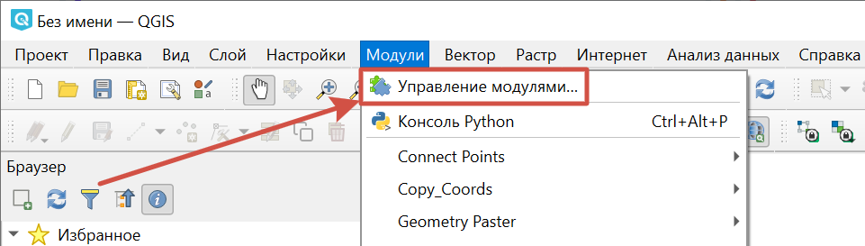
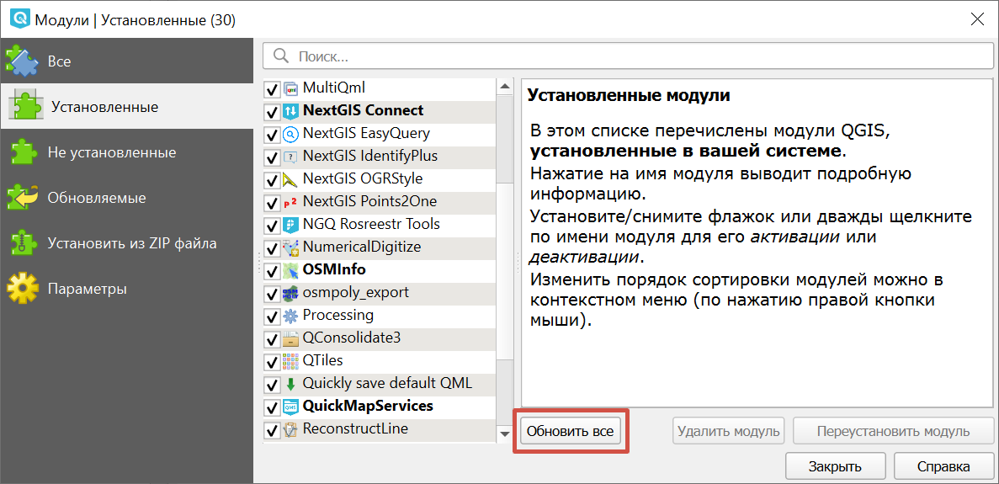
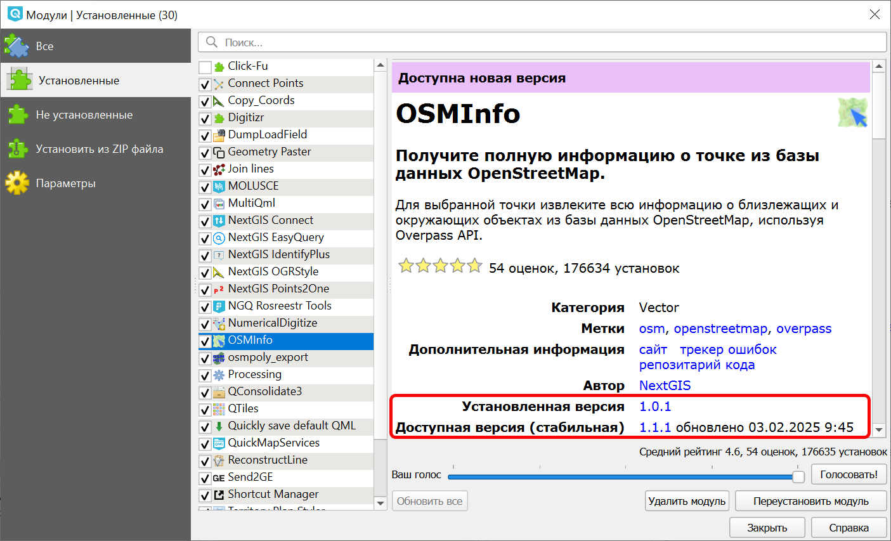

Обновление модулей (плагинов)
=======================================

Запустите NextGIS QGIS и перейдите в ``Модули - Управление модулями``.

   Переход к управлению модулями

Перейдите во вкладку *Установленные*.
Требующие обновления модули будут выделены **жирным шрифтом**.

   Управление модулями расширения

Для массового обновления модулей нажмите **Обновить все**.

После обновления проверьте, что галочки на обновленных модулях остались включенными.
Затем нажмите **Закрыть**.

.. _ngq_plugins_check_ver:

Как узнать текущую версию модуля
------------------------------------

Запустите NextGIS QGIS и перейдите в ``Модули - Управление модулями``.

Перейдите во вкладку *Установленные*. Выберите нужный модуль расширения или начните писать его название в строке поиска и затем выберите из списка найденного.

Справа вы увидите информацию о плагине.

   Информация о модуле

В ней зафиксирована установленная версия, доступная стабильная версия и время, когда вышло последнее обновление. Также, если есть возможность обновить плагин, в верхней части этой панели будет уведомление "Доступна новая версия".
